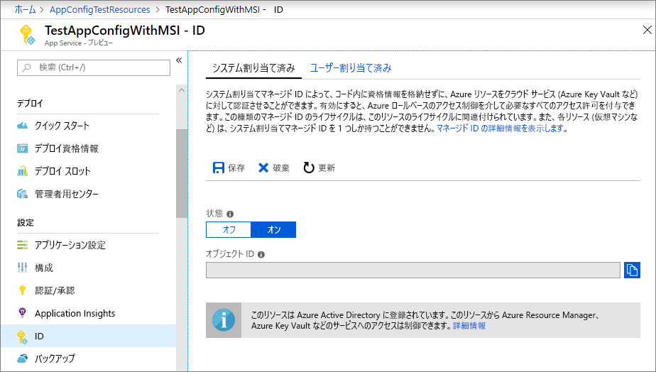
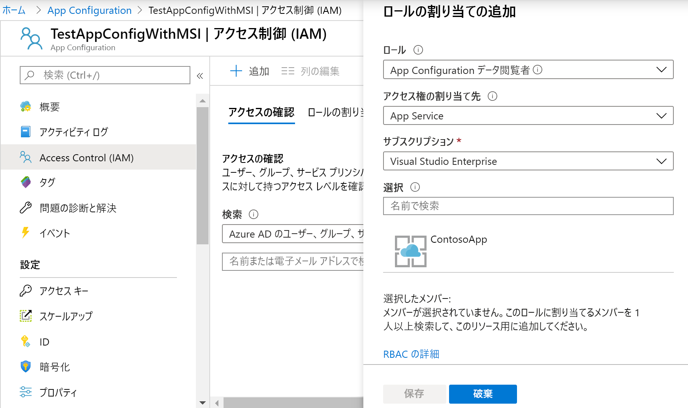

# <a name="integrate-with-azure-managed-identities"></a>Azure マネージド ID との統合

Azure Active Directory [マネージド ID](https://docs.microsoft.com/azure/active-directory/managed-identities-azure-resources/overview) は、クラウド アプリケーションのシークレット管理を単純化するのに役立ちます。 マネージド ID を使用すると、あなたのコードで、実行されている Azure サービス向けに作成されたサービス プリンシパルを使用できます。 Azure Key Vault またはローカル接続文字列に格納された別の資格情報の代わりに、マネージド ID を使用します。 

Azure App Configuration とその .NET Core、.NET Framework、および Java Spring のクライアント ライブラリには、マネージド ID サポートが組み込まれています。 これの使用は必須ではありませんが、マネージド ID によって、シークレットが含まれるアクセス トークンが不要になります。 コードはサービス エンドポイントのみを使用して App Configuration ストアにアクセスできます。 シークレットの流出を心配することなく、この URL をコードに直接埋め込むことができます。

このチュートリアルでは、マネージド ID を活用して App Configuration にアクセスする方法について説明します。 これは、クイック スタートで紹介されている Web アプリに基づいています。 先に進む前に、[App Configuration を使用した ASP.NET Core アプリの作成](./quickstart-aspnet-core-app.md)を完了しておいてください。

またこのチュートリアルでは、App Configuration の Key Vault 参照と共に マネージド ID を使用する方法についても説明します。 1つのマネージド ID を使用して、Key Vault のシークレットと App Configuration の構成値の両方にシームレスにアクセスできます。 この機能を確認する場合は、[ASP.NET Core の Key Vault 参照の使用](./use-key-vault-references-dotnet-core.md)に関するページの手順を最初に完了します。

このチュートリアルの手順は、任意のコード エディターを使用して実行できます。 推奨のエディターは [Visual Studio Code](https://code.visualstudio.com/) です (Windows、macOS、および Linux プラットフォームで使用できます)。

このチュートリアルでは、以下の内容を学習します。

> [!div class="checklist"]
> * App Configuration へのマネージド ID アクセスを許可する。
> * App Configuration に接続する際にマネージド ID を使用するようにアプリを構成する。
> * 必要に応じて、App Configuration Key Vault 参照を使用して Key Vault に接続するときに、マネージド ID を使用するようにアプリを構成します。

## <a name="prerequisites"></a>前提条件

このチュートリアルを完了するには、以下が必要です。

* [.NET Core SDK](https://www.microsoft.com/net/download/windows)。
* [構成済みの Azure Cloud Shell](https://docs.microsoft.com/azure/cloud-shell/quickstart)。

[!INCLUDE [quickstarts-free-trial-note](../../includes/quickstarts-free-trial-note.md)]

## <a name="add-a-managed-identity"></a>マネージド ID の追加

ポータルでマネージド ID を設定するには、最初にアプリケーションを作成した後、フィーチャーを有効にします。

1. 通常どおりに、[Azure portal](https://portal.azure.com) で App Services インスタンスを作成します。 ポータルでそのアプリに移動します。

1. 左側のウィンドウで **[設定]** グループまで下へスクロールして、 **[ID]** を選択します。

1. **[システム割り当て済み]** タブで、 **[状態]** を **[オン]** に切り替えて、 **[保存]** を選択します。

1. システムで割り当てられたマネージド ID を有効にするように求められたら、 **[はい]** を指定します。

    

## <a name="grant-access-to-app-configuration"></a>App Configuration へのアクセスの許可

1. [Azure portal](https://portal.azure.com) で **[すべてのリソース]** を選択し、クイック スタートで作成した App Configuration を選択します。

1. **[アクセス制御 (IAM)]** を選択します。

1. **[アクセスの確認]** タブで、 **[ロールの割り当てを追加する]** カード UI の **[追加]** を選択します。

1. **[ロール]** の中から、**App Configuration データ リーダー**を選択します。 **[アクセスの割り当て先]** で、 **[システム割り当てマネージド ID]** の **[App Service]** を選択します。

1. **[サブスクリプション]** で自分の Azure サブスクリプションを選択します。 アプリの App Service リソースを選択します。

1. **[保存]** を選択します。

    

1. 省略可能:Key Vault へのアクセスも許可する場合は、[マネージド ID で Key Vault の認証を提供する](https://docs.microsoft.com/azure/key-vault/managed-identity)の指示に従ってください。

## <a name="use-a-managed-identity"></a>マネージド ID の使用

1. *Azure.Identity* パッケージの参照を追加します。

    ```cli
    dotnet add package Azure.Identity --version 1.1.0
    ```

1. App Configuration ストアのエンドポイントを検索します。 この URL は、Azure portal 内のストアの **[アクセスキー]** タブにリストされます。

1. *appsettings.json* を開き、以下のスクリプトを追加します。 *\<service_endpoint>* を、角かっこも含めて、ご利用の App Configuration ストアへの URL に置き換えます。 

    ```json
    "AppConfig": {
        "Endpoint": "<service_endpoint>"
    }
    ```

1. *Program.cs* を開き、`Azure.Identity` および `Microsoft.Azure.Services.AppAuthentication` の名前空間への参照を追加します。

    ```csharp-interactive
    using Azure.Identity;
    using Microsoft.Azure.Services.AppAuthentication;
    ```

1. App Configuration に直接格納されている値にのみアクセスしたい場合は、`config.AddAzureAppConfiguration()` メソッドを置換して `CreateWebHostBuilder` メソッドを更新します。

    > [!IMPORTANT]
    > `CreateHostBuilder` により、.NET Core 3.0 の `CreateWebHostBuilder` が置き換えられます。  お使いの環境に応じて適切な構文を選択します。

    ### <a name="net-core-2xtabcore2x"></a>[.NET Core 2.x](#tab/core2x)

    ```csharp
        public static IWebHostBuilder CreateWebHostBuilder(string[] args) =>
            WebHost.CreateDefaultBuilder(args)
                .ConfigureAppConfiguration((hostingContext, config) =>
                {
                    var settings = config.Build();
                    config.AddAzureAppConfiguration(options =>
                        options.Connect(new Uri(settings["AppConfig:Endpoint"]), new ManagedIdentityCredential()));
                })
                .UseStartup<Startup>();
    ```

    ### <a name="net-core-3xtabcore3x"></a>[.NET Core 3.x](#tab/core3x)

    ```csharp
        public static IHostBuilder CreateHostBuilder(string[] args) =>
            Host.CreateDefaultBuilder(args)
            .ConfigureWebHostDefaults(webBuilder =>
            webBuilder.ConfigureAppConfiguration((hostingContext, config) =>
            {
                var settings = config.Build();
                    config.AddAzureAppConfiguration(options =>
                        options.Connect(new Uri(settings["AppConfig:Endpoint"]), new ManagedIdentityCredential()));
                })
                .UseStartup<Startup>());
    ```
    ---

1. App Configuration と Key Vault 参照の両方を使用するには、以下に示すように、*Program.cs* を更新します。 このコードにより、`AzureServiceTokenProvider` を使用して新しい `KeyVaultClient` が作成され、この参照が `UseAzureKeyVault` メソッドの呼び出しに渡されます。

    ### <a name="net-core-2xtabcore2x"></a>[.NET Core 2.x](#tab/core2x)

    ```csharp
            public static IWebHostBuilder CreateWebHostBuilder(string[] args) =>
                WebHost.CreateDefaultBuilder(args)
                    .ConfigureAppConfiguration((hostingContext, config) =>
                    {
                        var settings = config.Build();
                        AzureServiceTokenProvider azureServiceTokenProvider = new AzureServiceTokenProvider();
                        KeyVaultClient kvClient = new KeyVaultClient(new KeyVaultClient.AuthenticationCallback(azureServiceTokenProvider.KeyVaultTokenCallback));
                        
                        config.AddAzureAppConfiguration(options => options.Connect(new Uri(settings["AppConfig:Endpoint"]), new ManagedIdentityCredential()).UseAzureKeyVault(kvClient));
                    })
                    .UseStartup<Startup>();
    ```

    ### <a name="net-core-3xtabcore3x"></a>[.NET Core 3.x](#tab/core3x)

    ```csharp
        public static IHostBuilder CreateHostBuilder(string[] args) =>
            Host.CreateDefaultBuilder(args)
            .ConfigureWebHostDefaults(webBuilder =>
            webBuilder.ConfigureAppConfiguration((hostingContext, config) =>
            {
                var settings = config.Build();
                        AzureServiceTokenProvider azureServiceTokenProvider = new AzureServiceTokenProvider();
                        KeyVaultClient kvClient = new KeyVaultClient(new KeyVaultClient.AuthenticationCallback(azureServiceTokenProvider.KeyVaultTokenCallback));
                        
                        config.AddAzureAppConfiguration(options => options.Connect(new Uri(settings["AppConfig:Endpoint"]), new ManagedIdentityCredential()).UseAzureKeyVault(kvClient));
                    })
                    .UseStartup<Startup>());
    ```
    ---

    他の App Configuration キーと同様に Key Vault 参照にアクセスできるようになりました。 構成プロバイダーは、Key Vault に対して認証して値を取得するように構成した `KeyVaultClient` を使用します。

[!INCLUDE [Prepare repository](../../includes/app-service-deploy-prepare-repo.md)]

## <a name="deploy-from-local-git"></a>ローカル Git からのデプロイ

Kudu ビルド サーバーを使用したアプリへのローカル Git のデプロイを有効にする最も簡単な方法は、[Azure Cloud Shell](https://shell.azure.com) を使用することです。

### <a name="configure-a-deployment-user"></a>デプロイ ユーザーを構成する

[!INCLUDE [Configure a deployment user](../../includes/configure-deployment-user-no-h.md)]

### <a name="enable-local-git-with-kudu"></a>Kudu を使用するローカル Git を有効にする
アプリのローカル Git リポジトリがない場合は、初期化する必要があります。 ローカル Git リポジトリを初期化するには、アプリのプロジェクト　ディレクトリから次のコマンドを実行します。

```cmd
git init
git add .
git commit -m "Initial version"
```

Kudu ビルド サーバーを使用したアプリへのローカル Git のデプロイを有効にするには、Cloud Shell で [`az webapp deployment source config-local-git`](/cli/azure/webapp/deployment/source?view=azure-cli-latest#az-webapp-deployment-source-config-local-git) を実行します。

```azurecli-interactive
az webapp deployment source config-local-git --name <app_name> --resource-group <group_name>
```

このコマンドを実行すると、次のような出力が表示されます。

```json
{
  "url": "https://<username>@<app_name>.scm.azurewebsites.net/<app_name>.git"
}
```

### <a name="deploy-your-project"></a>プロジェクトのデプロイ

_ローカル ターミナル ウィンドウ_で、ローカル Git リポジトリに Azure リモートを追加します。 _\<url >_ を、「[Kudu でローカル Git を有効にする](#enable-local-git-with-kudu)」で取得した Git リモートの URL に置換します。

```bash
git remote add azure <url>
```

アプリをデプロイするために、次のコマンドで Azure リモートにプッシュします。 パスワードの入力を求められたら、「[デプロイ ユーザーを構成する](#configure-a-deployment-user)」で作成したパスワードを入力します。 Azure portal へのサインインに使用しているパスワードは使用しないでください。

```bash
git push azure master
```

出力には、MSBuild (ASP.NET 向け)、`npm install` (Node.js 向け)、`pip install` (Python 向け) など、ランタイム固有のオートメーションが表示される場合があります。

### <a name="browse-to-the-azure-web-app"></a>Azure Web アプリの参照

ブラウザーを使用して自分の Web アプリに移動し、コンテンツがデプロイされていることを確認します。

```bash
http://<app_name>.azurewebsites.net
```


## <a name="use-managed-identity-in-other-languages"></a>他の言語におけるマネージド ID の使用

.NET Framework 用および Java Spring 用の App Configuration プロバイダーにも、マネージド ID に対する組み込みサポートがあります。 これらのプロバイダーのいずれかを構成するとき、完全な接続文字列の代わりに、ご自分のストアの URL エンドポイントを使用できます。 

たとえば、クイックスタートで作成された .NET Framework コンソールアプリを更新して、*App.config* ファイルで次の設定を指定できます。

```xml
    <configSections>
        <section name="configBuilders" type="System.Configuration.ConfigurationBuildersSection, System.Configuration, Version=4.0.0.0, Culture=neutral, PublicKeyToken=b03f5f7f11d50a3a" restartOnExternalChanges="false" requirePermission="false" />
    </configSections>

    <configBuilders>
        <builders>
            <add name="MyConfigStore" mode="Greedy" endpoint="${Endpoint}" type="Microsoft.Configuration.ConfigurationBuilders.AzureAppConfigurationBuilder, Microsoft.Configuration.ConfigurationBuilders.AzureAppConfiguration" />
            <add name="Environment" mode="Greedy" type="Microsoft.Configuration.ConfigurationBuilders.EnvironmentConfigBuilder, Microsoft.Configuration.ConfigurationBuilders.Environment" />
        </builders>
    </configBuilders>

    <appSettings configBuilders="Environment,MyConfigStore">
        <add key="AppName" value="Console App Demo" />
        <add key="Endpoint" value ="Set via an environment variable - for example, dev, test, staging, or production endpoint." />
    </appSettings>
```

## <a name="clean-up-resources"></a>リソースをクリーンアップする

[!INCLUDE [azure-app-configuration-cleanup](../../includes/azure-app-configuration-cleanup.md)]

## <a name="next-steps"></a>次のステップ
このチュートリアルでは、Azure マネージド ID を追加して、App Configuration へのアクセスを効率化し、アプリの資格情報管理を改善しました。 App Configuration の使用方法の詳細については、Azure CLI のサンプルに進んでください。

> [!div class="nextstepaction"]
> [CLI のサンプル](./cli-samples.md)