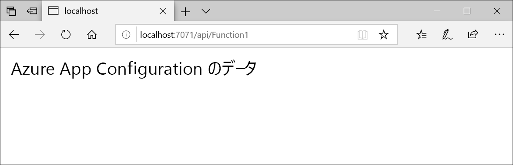

# <a name="quickstart-create-an-azure-function-with-azure-app-configuration"></a>クイック スタート:Azure App Configuration で Azure Function を作成する

このクイック スタートでは、コードとは別にすべてのアプリケーション設定のストレージと管理を一元化するために、Azure App Configuration サービスを Azure Function に組み込みます。

## <a name="prerequisites"></a>前提条件

- Azure サブスクリプション - [無料アカウントを作成する](https://azure.microsoft.com/free/)
- [Visual Studio 2019](https://visualstudio.microsoft.com/vs) と **Azure 開発**ワークロード。
- [Azure Functions ツール](../azure-functions/functions-develop-vs.md#check-your-tools-version)

## <a name="create-an-app-configuration-store"></a>アプリ構成ストアを作成する

[!INCLUDE [azure-app-configuration-create](../../includes/azure-app-configuration-create.md)]

6. **[Configuration Explorer]\(構成エクスプローラー)**  >  **[+ 作成]** の順に選択して、次のキーと値のペアを追加します。

    | キー | 値 |
    |---|---|
    | TestApp:Settings:Message | Azure App Configuration からのデータ |

    **[ラベル]** と **[コンテンツの種類]** は、現時点では空にしておきます。

## <a name="create-a-function-app"></a>Function App を作成する

[!INCLUDE [Create a project using the Azure Functions template](../../includes/functions-vstools-create.md)]

## <a name="connect-to-an-app-configuration-store"></a>アプリ構成ストアに接続する

1. プロジェクトを右クリックし、 **[NuGet パッケージの管理]** を選択します。 **[参照]** タブで以下の NuGet パッケージを検索し、プロジェクトに追加します。 見つからない場合は、 **[プレリリースを含める]** チェック ボックスをオンにします。

    ```
    Microsoft.Extensions.Configuration.AzureAppConfiguration 2.0.0-preview-009200001-1437 or later
    ```

2. *Function1.cs* を開き、.NET Core App Configuration プロバイダーへの参照を追加します。

    ```csharp
    using Microsoft.Extensions.Configuration.AzureAppConfiguration;
    ```

3. `builder.AddAzureAppConfiguration()` を呼び出して App Configuration を使用するように、`Run` メソッドを更新します。

    ```csharp
    public static async Task<IActionResult> Run(
        [HttpTrigger(AuthorizationLevel.Anonymous, "get", "post", Route = null)] HttpRequest req, ILogger log)
    {
        log.LogInformation("C# HTTP trigger function processed a request.");

        var builder = new ConfigurationBuilder();
        builder.AddAzureAppConfiguration(Environment.GetEnvironmentVariable("ConnectionString"));
        var config = builder.Build();
        string message = config["TestApp:Settings:Message"];
        message = message ?? req.Query["message"];

        string requestBody = await new StreamReader(req.Body).ReadToEndAsync();
        dynamic data = JsonConvert.DeserializeObject(requestBody);
        message = message ?? data?.message;

        return message != null
            ? (ActionResult) new OkObjectResult(message)
            : new BadRequestObjectResult("Please pass a message from a configuration store, on the query string or in the request body");
    }
    ```

## <a name="test-the-function-locally"></a>関数をローカルでテストする

1. **ConnectionString** という名前の環境変数に、アプリ構成ストアへのアクセス キーを設定します。 Windows コマンド プロンプトを使用する場合は、次のコマンドを実行してコマンド プロンプトを再起動し、変更が反映されるようにします。

        setx ConnectionString "connection-string-of-your-app-configuration-store"

    Windows PowerShell を使用する場合は、次のコマンドを実行します。

        $Env:ConnectionString = "connection-string-of-your-app-configuration-store"

    macOS または Linux を使用する場合は、次のコマンドを実行します。

        export ConnectionString='connection-string-of-your-app-configuration-store'

2. 関数をテストするには、F5 キーを押します。 メッセージが表示されたら、Visual Studio からの要求に同意し、**Azure Functions Core (CLI)** ツールをダウンロードしてインストールします。 また、ツールで HTTP 要求を処理できるように、ファイアウォールの例外を有効にすることが必要になる場合もあります。

3. Azure Functions のランタイムの出力から、関数の URL をコピーします。

    

4. HTTP 要求の URL をブラウザーのアドレス バーに貼り付けます。 関数によって返されたローカルの GET 要求に対するブラウザーでの応答を次の図に示します。

    

## <a name="clean-up-resources"></a>リソースのクリーンアップ

[!INCLUDE [azure-app-configuration-cleanup](../../includes/azure-app-configuration-cleanup.md)]

## <a name="next-steps"></a>次の手順

このクイック スタートでは、新しいアプリ構成ストアを作成して、Azure 関数で使用しました。 App Configuration の使用方法についてさらに学習するには、認証について示した次のチュートリアルに進んでください。

> [!div class="nextstepaction"]
> [マネージド ID の統合](./howto-integrate-azure-managed-service-identity.md)
