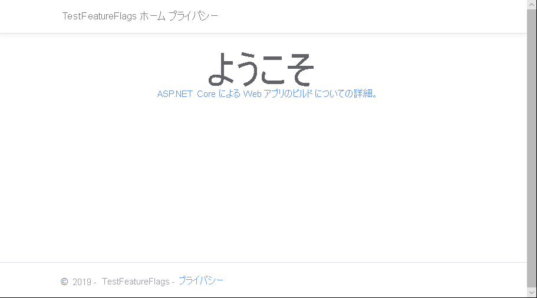
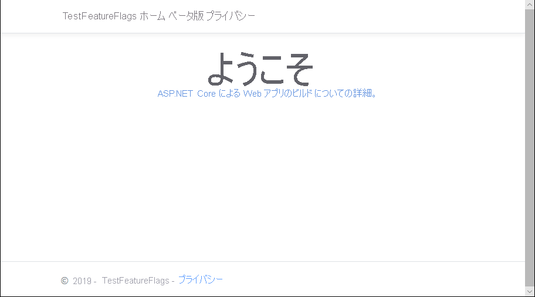

# <a name="quickstart-add-feature-flags-to-an-aspnet-core-app"></a>クイック スタート:ASP.NET Core アプリに機能フラグを追加する

アプリケーションを Azure App Configuration に接続することで、ASP.NET Core の機能管理を有効にできます。 この管理されたサービスを使用して、すべての機能フラグを格納し、その状態を一元的に制御できます。 このクイック スタートでは、App Configuration を ASP.NET Core Web アプリに組み込み、機能管理のエンド ツー エンド実装を作成します。

.NET Core 機能管理ライブラリは、包括的な機能フラグのサポートにより、フレームワークを拡張します。 これらのライブラリは、.NET Core 構成システム上に構築されます。 また、.NET Core 構成プロバイダーを介して、App Configuration とシームレスに統合されます。

このクイック スタートの手順は、任意のコード エディターを使用して実行できます。 推奨のエディターは [Visual Studio Code](https://code.visualstudio.com/) です (Windows、macOS、および Linux プラットフォームで使用できます)。

## <a name="prerequisites"></a>前提条件

このクイック スタートを実行するには、[.NET Core SDK](https://dotnet.microsoft.com/download) をインストールします。

[!INCLUDE [quickstarts-free-trial-note](../../includes/quickstarts-free-trial-note.md)]

## <a name="create-an-app-configuration-store"></a>App Configuration ストアを作成する

[!INCLUDE [azure-app-configuration-create](../../includes/azure-app-configuration-create.md)]

6. **[Feature Manager]\(機能マネージャー\)**  >  **[+Create]\(+ 作成\)** の順に選択し、次の機能フラグを追加します。

    | キー | 状態 |
    |---|---|
    | Beta | オフ |

## <a name="create-an-aspnet-core-web-app"></a>ASP.NET Core Web アプリケーションの作成

[.NET Core コマンド ライン インターフェイス (CLI)](https://docs.microsoft.com/dotnet/core/tools/) を使用して、新しい ASP.NET Core MVC Web アプリ プロジェクトを作成します。 Visual Studio ではなく .NET Core CLI を使用する利点は、.NET Core CLI は Windows、macOS、および Linux プラットフォームで使用できるという点です。

1. プロジェクト用の新規フォルダーを作成します。 このクイック スタートでは、*TestFeatureFlags* という名前を付けます。

1. 新しいフォルダーで次のコマンドを実行して、新しい ASP.NET Core MVC Web アプリ プロジェクトを作成します。

   ```    
   dotnet new mvc
   ```

## <a name="add-secret-manager"></a>シークレット マネージャーを追加する

プロジェクトに[シークレット マネージャー ツール](https://docs.microsoft.com/aspnet/core/security/app-secrets)を追加します。 シークレット マネージャー ツールは、開発作業のための機密データをプロジェクト ツリーの外部に格納します。 これにより、ソース コード内のアプリ シークレットが偶発的に共有されるのを防止できます。

1. *.csproj* ファイルを開きます。
1. 次の例に示すように、`UserSecretsId` 要素を追加し、その値を独自の値 (通常は GUID) に置き換えます。

    ```xml
    <Project Sdk="Microsoft.NET.Sdk.Web">

    <PropertyGroup>
        <TargetFramework>netcoreapp2.1</TargetFramework>
        <UserSecretsId>79a3edd0-2092-40a2-a04d-dcb46d5ca9ed</UserSecretsId>
    </PropertyGroup>

    <ItemGroup>
        <PackageReference Include="Microsoft.AspNetCore.App" />
        <PackageReference Include="Microsoft.AspNetCore.Razor.Design" Version="2.1.2" PrivateAssets="All" />
    </ItemGroup>

    </Project>
    ```

1. ファイルを保存します。

## <a name="connect-to-an-app-configuration-store"></a>App Configuration ストアに接続する

1. 次のコマンドを実行して、`Microsoft.Azure.AppConfiguration.AspNetCore` NuGet パッケージへの参照を追加します。

    ```
    dotnet add package Microsoft.Azure.AppConfiguration.AspNetCore --version 2.0.0-preview-009200001-7
    ```

1. 次のコマンドを実行して、プロジェクトのパッケージを復元します。

    ```
    dotnet restore
    ```

1. シークレット マネージャーに、**ConnectionStrings:AppConfig** という名前のシークレットを追加します。

    このシークレットには、App Configuration ストアにアクセスするための接続文字列が格納されます。 次のコマンドの `<your_connection_string>` の値を、自分の App Configuration ストアの接続文字列に置き換えます。

    このコマンドは、 *.csproj* ファイルと同じディレクトリで実行する必要があります。

    ```
    dotnet user-secrets set ConnectionStrings:AppConfig <your_connection_string>
    ```

    シークレット マネージャーは、Web アプリをローカルにテストするためだけに使用されます。 たとえば [Azure App Service](https://azure.microsoft.com/services/app-service) にアプリをデプロイするときは、シークレット マネージャーを使用して接続文字列を格納する代わりに、App Service で **[接続文字列]** という名前のアプリケーション設定を使用します。

    このシークレットには、App Configuration API を使用してアクセスできます。 構成名の中のコロン (:) は、サポートされているすべてのプラットフォーム上の App Configuration API で機能します。 [環境別の構成](https://docs.microsoft.com/aspnet/core/fundamentals/configuration)に関するページを参照してください。

1. *Program.cs* を開き、.NET Core App Configuration プロバイダーへの参照を追加します。

    ```csharp
    using Microsoft.Extensions.Configuration.AzureAppConfiguration;
    ```

1. `config.AddAzureAppConfiguration()` メソッドを呼び出して App Configuration を使用するように、`CreateWebHostBuilder` メソッドを更新します。

    ```csharp
    public static IWebHostBuilder CreateWebHostBuilder(string[] args) =>
        WebHost.CreateDefaultBuilder(args)
            .ConfigureAppConfiguration((hostingContext, config) =>
            {
                var settings = config.Build();
                config.AddAzureAppConfiguration(options => {
                    options.Connect(settings["ConnectionStrings:AppConfig"])
                           .UseFeatureFlags();
                });
            })
            .UseStartup<Startup>();
    ```

1. *Startup.cs* を開き、.NET Core 機能マネージャーへの参照を追加します。

    ```csharp
    using Microsoft.FeatureManagement.AspNetCore;
    ```

1. `services.AddFeatureManagement()` メソッドを呼び出して機能フラグ サポートを追加するように、`ConfigureServices` メソッドを更新します。 必要に応じて、`services.AddFeatureFilter<FilterType>()` を呼び出すことで、機能フラグで使用される任意のフィルターを含めることができます。

    ```csharp
    public void ConfigureServices(IServiceCollection services)
    {
        services.AddFeatureManagement();
    }
    ```

1. `Configure` メソッドを更新してミドルウェアを追加し、ASP.NET Core Web アプリで要求の受信が続けられている間、定期的に機能フラグの値を更新できるようにします。

    ```csharp
    public void Configure(IApplicationBuilder app, IHostingEnvironment env)
    {
        app.UseAzureAppConfiguration();
        app.UseMvc();
    }
    ```

1. *MyFeatureFlags.cs* ファイルを追加します。

    ```csharp
    namespace TestFeatureFlags
    {
        public enum MyFeatureFlags
        {
            Beta
        }
    }
    ```

1. *Controllers* ディレクトリに *BetaController.cs* を追加します。

    ```csharp
    using Microsoft.AspNetCore.Mvc;
    using Microsoft.FeatureManagement;
    using Microsoft.FeatureManagement.Mvc;

    namespace TestFeatureFlags.Controllers
    {
        public class BetaController: Controller
        {
            private readonly IFeatureManager _featureManager;

            public BetaController(IFeatureManagerSnapshot featureManager)
            {
                _featureManager = featureManager;
            }

            [FeatureGate(MyFeatureFlags.Beta)]
            public IActionResult Index()
            {
                return View();
            }
        }
    }
    ```

1. *Views* ディレクトリの *_ViewImports.cshtml* を開き、機能マネージャーのタグ ヘルパーを追加します。

    ```html
    @addTagHelper *, Microsoft.FeatureManagement.AspNetCore
    ```

1. *Views*\\*Shared* ディレクトリにある *_Layout.cshtml* を開いて、`<body>` > `<header>` の下の `<nav>` バー コードを次のコードに置き換えます。

    ```html
    <nav class="navbar navbar-expand-sm navbar-toggleable-sm navbar-light bg-white border-bottom box-shadow mb-3">
        <div class="container">
            <a class="navbar-brand" asp-area="" asp-controller="Home" asp-action="Index">TestFeatureFlags</a>
            <button class="navbar-toggler" type="button" data-toggle="collapse" data-target=".navbar-collapse" aria-controls="navbarSupportedContent"
            aria-expanded="false" aria-label="Toggle navigation">
            <span class="navbar-toggler-icon"></span>
            </button>
            <div class="navbar-collapse collapse d-sm-inline-flex flex-sm-row-reverse">
                <ul class="navbar-nav flex-grow-1">
                    <li class="nav-item">
                        <a class="nav-link text-dark" asp-area="" asp-controller="Home" asp-action="Index">Home</a>
                    </li>
                    <feature name="Beta">
                    <li class="nav-item">
                        <a class="nav-link text-dark" asp-area="" asp-controller="Beta" asp-action="Index">Beta</a>
                    </li>
                    </feature>
                    <li class="nav-item">
                        <a class="nav-link text-dark" asp-area="" asp-controller="Home" asp-action="Privacy">Privacy</a>
                    </li>
                </ul>
            </div>
        </div>
    </nav>
    ```

1. *Views* の下に *Beta* ディレクトリを作成し、そこに *Index.cshtml* を追加します。

    ```html
    @{
        ViewData["Title"] = "Beta Home Page";
    }

    <h1>
        This is the beta website.
    </h1>
    ```

## <a name="build-and-run-the-app-locally"></a>アプリをビルドしてローカルで実行する

1. .NET Core CLI を使用してアプリケーションをビルドするには、コマンド シェルで次のコマンドを実行します。

    ```
    dotnet build
    ```

1. ビルドが正常に完了したら、次のコマンドを実行して、Web アプリをローカルで実行します。

    ```
    dotnet run
    ```

1. ブラウザー ウィンドウを開いて、`https://localhost:5001` (ローカルでホストされた Web アプリの既定の URL) に移動します。

    

1. [Azure Portal](https://portal.azure.com) にサインインします。 **[すべてのリソース]** を選択し、クイック スタートで作成した App Configuration ストア インスタンスを選択します。

1. **[Feature Manager]\(機能マネージャー\)** を選択し、 **[Beta]\(ベータ\)** キーの状態を **[On]\(オン\)** に変更します。

    | キー | 状態 |
    |---|---|
    | Beta | On |

1. ブラウザー ページを最新の情報に更新して新しい構成設定を確認します。

    

## <a name="clean-up-resources"></a>リソースのクリーンアップ

[!INCLUDE [azure-app-configuration-cleanup](../../includes/azure-app-configuration-cleanup.md)]

## <a name="next-steps"></a>次の手順

このクイック スタートでは、新しい App Configuration ストアを作成し、この構成ストアを使用して、[機能管理ライブラリ](https://go.microsoft.com/fwlink/?linkid=2074664)を介して ASP.NET Core Web アプリの機能を管理しました。

- [機能管理](./concept-feature-management.md)の詳細を確認します。
- [機能フラグを管理](./manage-feature-flags.md)します。
- [ASP.NET Core アプリ内で機能フラグを使用](./use-feature-flags-dotnet-core.md)します。
