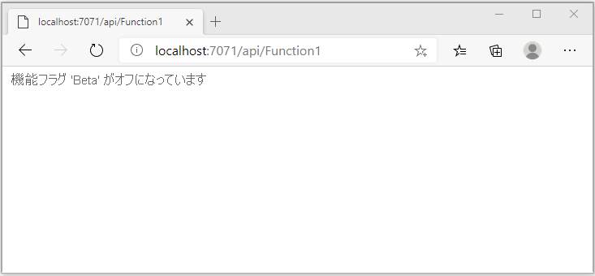
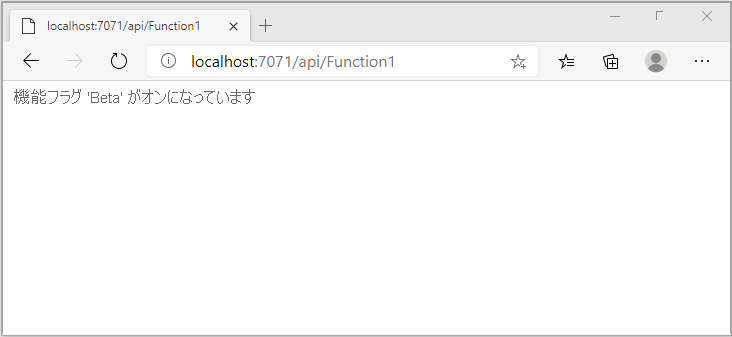

# <a name="quickstart-add-feature-flags-to-an-azure-functions-app"></a>クイック スタート:Azure Functions アプリに機能フラグを追加する

このクイックスタートでは、Azure Functions アプリを作成し、その中で機能フラグを使用します。 Azure App Configuration の機能管理を使用して、すべての機能フラグを 1 か所に保存し、それらの状態を制御します。

.NET 機能管理ライブラリは、機能フラグのサポートにより、フレームワークを拡張します。 これらのライブラリは、.NET 構成システム上に構築されます。 .NET 構成プロバイダーを介して、App Configuration と統合されます。

## <a name="prerequisites"></a>前提条件

- Azure サブスクリプション - [無料アカウントを作成する](https://azure.microsoft.com/free/)
- [Visual Studio 2019](https://visualstudio.microsoft.com/vs) と **Azure 開発** ワークロード。
- [Azure Functions ツール](../azure-functions/functions-develop-vs.md#check-your-tools-version)

## <a name="create-an-app-configuration-store"></a>App Configuration ストアを作成する

[!INCLUDE [azure-app-configuration-create](../../includes/azure-app-configuration-create.md)]

7. **[機能マネージャー]**  >  **[+追加]** を選択して、`Beta` という機能フラグを追加します。

    > [!div class="mx-imgBorder"]
    > 

    現時点では `label` と `Description` を空欄にしておいてください。

8. **[適用]** を選択して新しい機能フラグを保存します。

## <a name="create-a-functions-app"></a>関数アプリを作成する

[!INCLUDE [Create a project using the Azure Functions template](../../includes/functions-vstools-create.md)]

## <a name="connect-to-an-app-configuration-store"></a>App Configuration ストアに接続する

このプロジェクトでは [.NET Azure Functions で依存関係の挿入](../azure-functions/functions-dotnet-dependency-injection.md)を使用します。 機能フラグが保存される追加の構成ソースとして Azure App Configuration が追加されます。

1. プロジェクトを右クリックし、 **[NuGet パッケージの管理]** を選択します。 **[参照]** タブで以下の NuGet パッケージを検索し、自分のプロジェクトに追加します。
   - [Microsoft.Extensions.Configuration.AzureAppConfiguration](https://www.nuget.org/packages/Microsoft.Extensions.Configuration.AzureAppConfiguration/) バージョン 4.1.0 以降
   - [Microsoft FeatureManagement](https://www.nuget.org/packages/Microsoft.FeatureManagement/) バージョン 2.2.0 以降
   - [Microsoft.Azure.Functions.Extensions](https://www.nuget.org/packages/Microsoft.Azure.Functions.Extensions/) バージョン 1.1.0 以降 

2. 次のコードを使用して、新しいファイル *Startup.cs* を追加します。 これにより、`FunctionsStartup` 抽象クラスを実装する `Startup` という名前のクラスが定義されます。 アセンブリ属性は、Azure Functions の起動時に使われる型名を指定するために使用されます。

    ```csharp
    using System;
    using Microsoft.Azure.Functions.Extensions.DependencyInjection;
    using Microsoft.Extensions.Configuration;
    using Microsoft.FeatureManagement;

    [assembly: FunctionsStartup(typeof(FunctionApp.Startup))]

    namespace FunctionApp
    {
        class Startup : FunctionsStartup
        {
            public override void ConfigureAppConfiguration(IFunctionsConfigurationBuilder builder)
            {
            }

            public override void Configure(IFunctionsHostBuilder builder)
            {
            }
        }
    }
    ```


3. `AddAzureAppConfiguration()` を呼び出すことで、`ConfigureAppConfiguration` メソッドを更新し、Azure App Configuration プロバイダーを新しい構成ソースとして追加します。 

   `UseFeatureFlags()` メソッドでは、機能フラグを読み込むようにプロバイダーに指示します。 すべての機能フラグには、変更を再確認するまでに 30 秒という既定のキャッシュ有効期限が設定されています。 有効期限の間隔は、`UseFeatureFlags` メソッドに渡される `FeatureFlagsOptions.CacheExpirationInterval` プロパティを設定することによって更新できます。 

    ```csharp
    public override void ConfigureAppConfiguration(IFunctionsConfigurationBuilder builder)
    {
        builder.ConfigurationBuilder.AddAzureAppConfiguration(options =>
        {
            options.Connect(Environment.GetEnvironmentVariable("ConnectionString"))
                   .Select("_")
                   .UseFeatureFlags();
        });
    }
    ```
   > [!TIP]
   > 機能フラグ以外の構成をアプリケーションに読み込む必要がない場合は、`Select("_")` を呼び出して、存在しないダミー キー "_" のみを読み込むことができます。 既定では、`Select` メソッドを呼び出さない場合、App Configuration ストア内のすべての構成キー値が読み込まれます。

4. 依存関係の挿入を通じて Azure App Configuration サービスと機能マネージャーを利用できるように、`Configure` メソッドを更新します。

    ```csharp
    public override void Configure(IFunctionsHostBuilder builder)
    {
        builder.Services.AddAzureAppConfiguration();
        builder.Services.AddFeatureManagement();
    }
    ```

5. *Function1.cs* を開いて、次の名前空間を追加します。

    ```csharp
    using System.Linq;
    using Microsoft.FeatureManagement;
    using Microsoft.Extensions.Configuration.AzureAppConfiguration;
    ```

   依存関係の挿入によって、`_featureManagerSnapshot` および `IConfigurationRefresherProvider` のインスタンスを取得するために使用されるコンストラクターを追加します。 `IConfigurationRefresherProvider` からは、`IConfigurationRefresher` のインスタンスを取得できます。

    ```csharp
    private readonly IFeatureManagerSnapshot _featureManagerSnapshot;
    private readonly IConfigurationRefresher _configurationRefresher;

    public Function1(IFeatureManagerSnapshot featureManagerSnapshot, IConfigurationRefresherProvider refresherProvider)
    {
        _featureManagerSnapshot = featureManagerSnapshot;
        _configurationRefresher = refresherProvider.Refreshers.First();
    }
    ```

6. 表示されるメッセージの値が機能フラグの状態に応じて変化するように、`Run` メソッドを更新します。

   `TryRefreshAsync` メソッドは、機能フラグを更新する Functions 呼び出しの先頭で呼び出されます。 キャッシュの有効期限に達していなければ、何も実行されません。 現在の Functions 呼び出しをブロックせずに機能フラグを更新する場合は、`await` 演算子を削除してください。 その場合は、後続の Functions 呼び出しで、更新された値を取得します。

    ```csharp
    [FunctionName("Function1")]
    public async Task<IActionResult> Run(
        [HttpTrigger(AuthorizationLevel.Anonymous, "get", "post", Route = null)] HttpRequest req,
        ILogger log)
    {
        log.LogInformation("C# HTTP trigger function processed a request.");

        await _configurationRefresher.TryRefreshAsync();

        string message = await _featureManagerSnapshot.IsEnabledAsync("Beta")
                ? "The Feature Flag 'Beta' is turned ON"
                : "The Feature Flag 'Beta' is turned OFF";

        return (ActionResult)new OkObjectResult(message);
    }
    ```

## <a name="test-the-function-locally"></a>関数をローカルでテストする

1. **ConnectionString** という名前の環境変数を設定します。先ほど App Configuration ストアの **[アクセス キー]** で取得した接続文字列がその値となります。 Windows コマンド プロンプトを使用する場合は、次のコマンドを実行してコマンド プロンプトを再起動し、変更が反映されるようにします。

    ```cmd
        setx ConnectionString "connection-string-of-your-app-configuration-store"
    ```

    Windows PowerShell を使用する場合は、次のコマンドを実行します。

    ```azurepowershell
        $Env:ConnectionString = "connection-string-of-your-app-configuration-store"
    ```

    macOS または Linux を使用する場合は、次のコマンドを実行します。

    ```bash
        export ConnectionString='connection-string-of-your-app-configuration-store'
    ```

1. F5 キーを押して関数をテストします。 メッセージが表示されたら、Visual Studio からの要求に同意し、**Azure Functions Core (CLI)** ツールをダウンロードしてインストールします。 また、ツールで HTTP 要求を処理できるように、ファイアウォールの例外を有効にすることが必要になる場合もあります。

1. Azure Functions のランタイムの出力から、関数の URL をコピーします。

    

1. HTTP 要求の URL をブラウザーのアドレス バーに貼り付けます。 次の画像のように、機能フラグ `Beta` が無効であることを示す応答が表示されます。 

    

1. [Azure portal](https://portal.azure.com) にサインインします。 **[すべてのリソース]** を選択し、自分が作成した App Configuration ストアを選択します。

1. **[機能マネージャー]** を選択し、**Beta** キーの状態を **[オン]** に変更します。

1. ブラウザーを数回更新します。 キャッシュされた機能フラグが 30 秒後に期限切れになると、次の図に示すようにページが変更され、機能フラグ `Beta` がオンになります。
 
    

> [!NOTE]
> このチュートリアルで使用したコード例は、[Azure App Configuration の GitHub リポジトリ](https://github.com/Azure/AppConfiguration/tree/master/examples/DotNetCore/AzureFunction)からダウンロードできます。

## <a name="clean-up-resources"></a>リソースをクリーンアップする

[!INCLUDE [azure-app-configuration-cleanup](../../includes/azure-app-configuration-cleanup.md)]

## <a name="next-steps"></a>次のステップ

このクイックスタートでは、機能フラグを作成し、[Microsoft.FeatureManagement](/dotnet/api/microsoft.featuremanagement) ライブラリを介して Azure Functions アプリで使用しました。

- [機能管理](./concept-feature-management.md) の詳細を確認する
- [機能フラグを管理する](./manage-feature-flags.md)
- [件付き機能フラグを使用する](./howto-feature-filters-aspnet-core.md)
- [対象ユーザーに対して機能の段階的なロールアウトを有効にする](./howto-targetingfilter-aspnet-core.md)
- [Azure Functions アプリで動的な構成を使用する](./enable-dynamic-configuration-azure-functions-csharp.md)