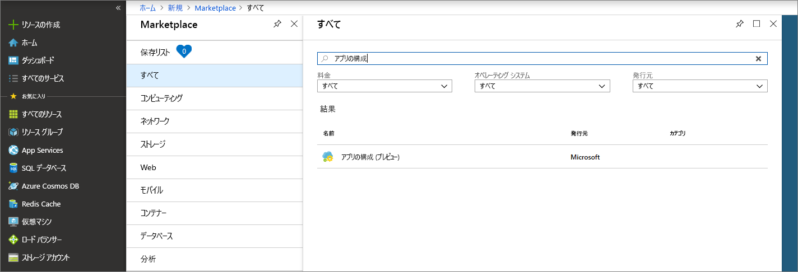
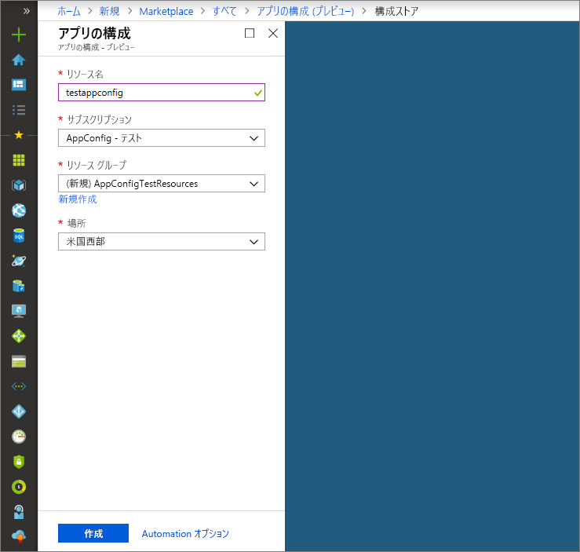

# <a name="quickstart-create-a-java-spring-app-with-app-configuration"></a>クイック スタート:App Configuration を使用して Java Spring アプリを作成する

Azure App Configuration は、Azure 内にあるマネージド構成サービスです。 これを使用すると、すべてのアプリケーション設定を、コードとは別の 1 つの場所に簡単に保存して管理することができます。 このクイック スタートでは、Java Spring アプリにサービスを組み込む方法を示します。

このクイック スタートの手順は、任意のコード エディターを使用して実行できます。 推奨のエディターは [Visual Studio Code](https://code.visualstudio.com/) です (Windows、macOS、および Linux プラットフォームで使用できます)。

## <a name="prerequisites"></a>前提条件

このクイック スタートを実行するには、サポートされている [Java Development Kit (JDK)](https://aka.ms/azure-jdks) のバージョン 8 と [Apache Maven](https://maven.apache.org/) のバージョン 3.0 以降をインストールします。

[!INCLUDE [quickstarts-free-trial-note](../../includes/quickstarts-free-trial-note.md)]

## <a name="create-an-app-configuration-store"></a>アプリ構成ストアを作成する

1. 新しいアプリ構成ストアを作成するには、[Azure portal](https://aka.ms/azconfig/portal) にサインインします。 ページの左上にある **[+ リソースの作成]** を選択します。 **[Marketplace を検索]** ボックスに「**App Configuration**」と入力し、Enter キーを押します。

    

2. 検索結果の **[アプリ構成]** を選択し、**[作成]** を選択します。

3. **[アプリの構成]** > **[作成]** ページで、次の設定を入力します。

    | Setting | 推奨値 | 説明 |
    |---|---|---|
    | **リソース名** | グローバルに一意の名前 | アプリ構成ストア リソースに使用する一意のリソース名を入力します。 名前は 1 から 63 文字の文字列で、数字、英字、`-` 文字のみを使用する必要があります。 名前の先頭と末尾には `-` 文字を使用できません。また、連続する `-` 文字は無効です。  |
    | **サブスクリプション** | 該当するサブスクリプション | App Configuration のテストに使用する Azure サブスクリプションを選択します。 アカウントにサブスクリプションが 1 つしかない場合は自動的に選択されるため、**[サブスクリプション]** ドロップダウンは表示されません。 |
    | **リソース グループ** | *AppConfigTestResources* | アプリ構成ストア リソースのリソース グループを選択または作成します。 このグループで複数のリソースをまとめておくと、そのリソース グループを削除することで複数のリソースを同時に削除できるため、便利です。 詳細については、[リソース グループを使用した Azure リソースの管理](https://docs.microsoft.com/azure/azure-resource-manager/resource-group-overview)に関するページを参照してください。 |
    | **Location** | *米国中央部* | **[場所]** を使用して、SignalR リソースがホストされている地理的位置を指定します。 最高のパフォーマンスを得るには、アプリケーションの他のコンポーネントと同じリージョンにリソースを作成します。 |

    

4. **作成** を選択します。 デプロイが完了するまでに数分かかることがあります。

5. デプロイが完了したら、**[設定]** > **[アクセス キー]** の順に選択します。 プライマリ読み取り専用キー接続文字列またはプライマリ読み取り/書き込みキー接続文字列を書き留めます。 この接続文字列は、後で、作成したアプリ構成ストアと通信するようにアプリケーションを構成する際に使用します。

6. **[キー/値のエクスプローラー]** > **[+ 作成]** の順に選択して、次のキーと値のペアを追加します。

    | キー | 値 |
    |---|---|
    | /application/config.message | こんにちは |

    **[ラベル]** と **[コンテンツの種類]** は、現時点では空にしておきます。

## <a name="create-a-spring-boot-app"></a>Spring Boot アプリを作成する

[Spring Initializr](https://start.spring.io/) を使用して、新しい Spring Boot プロジェクトを作成します。

1. <https://start.spring.io/> を参照します。

2. 次のオプションを指定します。

   * **Java** で **Maven** プロジェクトを生成します。
   * **Spring Boot** のバージョンとして、2.0 以降を指定します。
   * アプリケーションの**グループ (Group)** と**成果物 (Artifact)** の名前を指定します。
   * **Web** 依存関係を追加します。

3. 前の各オプションを指定してから、**[プロジェクトの生成]** を選択します。 メッセージが表示されたら、ローカル コンピューター上のパスにプロジェクトをダウンロードします。

## <a name="connect-to-an-app-configuration-store"></a>アプリ構成ストアに接続する

1. ファイルをローカル システム上に展開したら、シンプルな Spring Boot アプリケーションの編集を開始できます。 アプリのルート ディレクトリで *pom.xml* ファイルを探します。

2. テキスト エディターで *pom.xml* ファイルを開き、Spring Cloud Azure Config スターターを `<dependencies>` のリストに追加します。

    ```xml
    <dependency>
        <groupId>com.microsoft.azure</groupId>
        <artifactId>spring-cloud-starter-azure-appconfiguration-config</artifactId>
        <version>1.1.0.M3</version>
    </dependency>
    ```

3. アプリのパッケージ ディレクトリに、*MessageProperties.java* という名前の新しい Java ファイルを作成します。 次の行を追加します。

    ```java
    @ConfigurationProperties(prefix = "config")
    public class MessageProperties {
        private String message;

        public String getMessage() {
            return message;
        }

        public void setMessage(String message) {
            this.message = message;
        }
    }
    ```

4. アプリのパッケージ ディレクトリに、*HelloController.java* という名前の新しい Java ファイルを作成します。 次の行を追加します。

    ```java
    @RestController
    public class HelloController {
        private final MessageProperties properties;

        public HelloController(MessageProperties properties) {
            this.properties = properties;
        }

        @GetMapping
        public String getMessage() {
            return "Message: " + properties.getMessage();
        }
    }
    ```

5. メイン アプリケーションの Java ファイルを開き、`@EnableConfigurationProperties` を追加してこの機能を有効にします。

    ```java
    @SpringBootApplication
    @EnableConfigurationProperties(MessageProperties.class)
    public class AzureConfigApplication {
        public static void main(String[] args) {
            SpringApplication.run(AzureConfigApplication.class, args);
        }
    }
    ```

6. アプリの resources ディレクトリに、`bootstrap.properties` という名前の新しいファイルを作成し、そのファイルに以下の行を追加します。 サンプルの値を、アプリ構成ストアの適切なプロパティに置き換えます。

    ```properties
    spring.cloud.azure.appconfiguration.stores[0].connection-string=[your-connection-string]
    ```

## <a name="build-and-run-the-app-locally"></a>アプリをビルドしてローカルで実行する

1. Spring Boot アプリケーションを Maven でビルドし、実行します。次に例を示します。

    ```shell
    mvn clean package
    mvn spring-boot:run
    ```
2. アプリケーションが実行されたら、*curl* を使用してアプリケーションをテストできます。次に例を示します。

      ```shell
      curl -X GET http://localhost:8080/
      ```
    アプリ構成ストアに入力したメッセージが表示されます。

## <a name="clean-up-resources"></a>リソースのクリーンアップ

[!INCLUDE [azure-app-configuration-cleanup](../../includes/azure-app-configuration-cleanup.md)]

## <a name="next-steps"></a>次の手順

このクイック スタートでは、新しいアプリ構成ストアを作成して、Java Spring アプリで使用しました。 詳細については、「[Azure の Spring](https://docs.microsoft.com/java/azure/spring-framework/)」を参照してください。

App Configuration の使用方法についてさらに学習するには、認証について示した次のチュートリアルに進んでください。

> [!div class="nextstepaction"]
> [Azure リソースのマネージド ID の統合](./integrate-azure-managed-service-identity.md)
