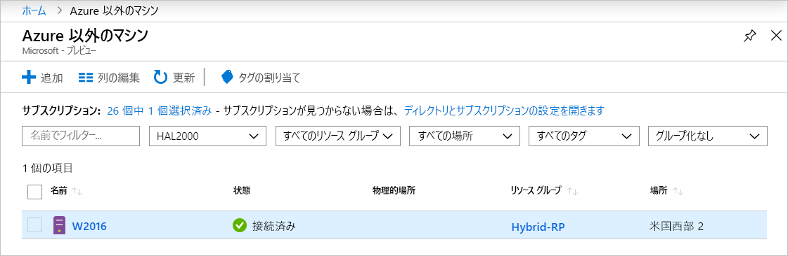

# <a name="connect-hybrid-machines-to-azure-from-the-azure-portal"></a>Azure portal からハイブリッド マシンを Azure に接続する

手動で一連の手順を実行することで、ご自分の環境内の 1 つまたは少数の Windows マシンまたは Linux マシン用に Azure Arc for servers (プレビュー) を有効にすることができます。 または、提供されているテンプレート スクリプトを実行することで、自動化された方法を使用することもできます。 このスクリプトは、両方のエージェントのダウンロードとインストールを自動化するものです。

この方法では、エージェントをインストールおよび構成するために、マシンに対する管理者権限が必要です。 Linux ではルート アカウントを使用し、Windows ではローカルの Administrators グループのメンバーである必要があります。

開始する前に、必ず[前提条件](overview.md#prerequisites)を確認し、ご利用のサブスクリプションおよびリソースが要件を満たしていることを確認してください。

Azure サブスクリプションをお持ちでない場合は、開始する前に [無料アカウント](https://azure.microsoft.com/free/?WT.mc_id=A261C142F) を作成してください。

## <a name="generate-the-installation-script-from-the-azure-portal"></a>Azure portal からインストール スクリプトを生成する

ダウンロードとインストールを自動化し、Azure Arc との接続を確立するスクリプトは、Azure portal から入手できます。 そのプロセスを完了するには、次の手順を実行します。

1. お使いのブラウザーで [Azure portal](https://aka.ms/hybridmachineportal) に移動します。

1. **[マシン - Azure Arc]** ページで、左上にある **[追加]** か、中央のペインの下部にある **[Create machine - Azure Arc]\(マシンの作成 - Azure Arc\)** オプションを選択します。 

1. **[メソッドの選択]** ページで、 **[Add machines using interactive script]\(対話型スクリプト タイルを使用してマシンを追加\)** タイルを選択し、 **[スクリプトの生成]** を選択します。

1. **[スクリプトの生成]** ページで、Azure 内でマシンを管理するサブスクリプションとリソース グループを選択します。 マシンのメタデータが格納される Azure の場所を選択します。

    >[!NOTE]
    >Azure Arc for servers (プレビュー) では、次のリージョンのみがサポートされます。
    >- WestUS2
    >- 西ヨーロッパ
    >- WestAsia
    >

1. **[スクリプトの生成]** ページの **[オペレーティング システム]** ボックスの一覧で、スクリプトを実行するオペレーティング システムを選択します。

1. マシンがインターネットに接続するためにプロキシ サーバー経由で通信している場合は、 **[Next: Proxy Server]\(次へ: プロキシ サーバー\)** を選択します。 
1. **[プロキシ サーバー]** タブで、プロキシ サーバーの IP アドレスか、マシンがプロキシ サーバーとの通信に使用する名前およびポート番号を指定します。 `http://<proxyURL>:<proxyport>` の形式で値を入力します。 
1. **[確認と生成]** を選択します。

1. **[確認と生成]** タブで概要情報を確認し、 **[ダウンロード]** を選択します。 引き続き変更が必要な場合は、 **[前へ]** を選択します。

## <a name="install-and-validate-the-agent-on-windows"></a>Windows でエージェントをインストールして検証する

### <a name="install-manually"></a>手動でインストールする
Windows インストーラー パッケージ *AzureConnectedMachineAgent.msi* を実行することで、Connected Machine エージェントを手動でインストールできます。 

> [!NOTE]
> * エージェントをインストールまたはアンインストールするには、"*管理者*" アクセス許可が必要です。
> * まず、インストーラー パッケージをダウンロードし、ターゲット サーバー上のフォルダーにコピーするか、共有ネットワーク フォルダーからコピーする必要があります。 オプションを指定せずにこのインストーラー パッケージを実行すると、セットアップ ウィザードが起動します。ここで、指示に従って対話形式でエージェントをインストールできます。

マシンがプロキシ サーバーを介してサービスと通信する必要がある場合は、エージェントをインストールした後、この記事で後ほど説明するコマンドを実行する必要があります。 これにより、プロキシ サーバーのシステム環境変数 `https_proxy` が設定されます。

次の表に、コマンド ラインからのエージェントのセットアップでサポートされているパラメーターを示します。

| パラメーター | 説明 |
|:--|:--|
| /? | コマンド ライン オプションの一覧を返します。 |
| /S | ユーザーの操作を必要とせずに、サイレント インストールを実行します。 |

たとえば、`/?` パラメーターを使用してインストール プログラムを実行するには、「`msiexec.exe /i AzureConnectedMachineAgent.msi /?`」と入力します。

Connected Machine エージェントのファイルは、既定では *C:\Program Files\AzureConnectedMachineAgent* にインストールされます。 セットアップの完了後にエージェントが起動しない場合は、詳細なエラー情報のログを確認します。 ログ ディレクトリは *%Programfiles%\AzureConnectedMachineAgentAgent\logs* です。

### <a name="install-with-the-scripted-method"></a>スクリプト化された手法を使用してインストールする

1. サーバーにログインします。

1. 管理者特権の PowerShell コマンド プロンプトを開きます。

1. スクリプトをコピーしたフォルダーまたは共有に移動し、`./OnboardingScript.ps1` スクリプトを実行することでそのスクリプトをサーバー上で実行します。

### <a name="configure-the-agent-proxy-setting"></a>エージェント プロキシ設定を構成する

プロキシ サーバーの環境変数を設定するには、次のコマンドを実行します。

```powershell
# If a proxy server is needed, execute these commands with the proxy URL and port.
[Environment]::SetEnvironmentVariable("https_proxy", "http://{proxy-url}:{proxy-port}", "Machine")
$env:https_proxy = [System.Environment]::GetEnvironmentVariable("https_proxy","Machine")
# For the changes to take effect, the agent service needs to be restarted after the proxy environment variable is set.
Restart-Service -Name himds
```

>[!NOTE]
>このプレビューでは、エージェントでプロキシ認証の設定はサポートされていません。
>

### <a name="configure-agent-communication"></a>エージェントの通信を構成する

エージェントをインストールした後は、次のコマンドを実行して、Azure Arc サービスと通信するようにエージェントを構成する必要があります。

`%ProgramFiles%\AzureConnectedMachineAgent\azcmagent.exe" connect --resource-group "<resourceGroupName>" --tenant-id "<tenantID>" --location "<regionName>" --subscription-id "<subscriptionID>"`

## <a name="install-and-validate-the-agent-on-linux"></a>Linux でエージェントをインストールして検証する

Linux 用の Connected Machine エージェントは、Microsoft [パッケージ リポジトリ](https://packages.microsoft.com/)でホストされたディストリビューション (.RPM または .DEB) に適したパッケージ形式で提供されます。 この[シェル スクリプト バンドル `Install_linux_azcmagent.sh`](https://aka.ms/azcmagent) により、次のアクションが実行されます。

- packages.microsoft.com からエージェント パッケージをダウンロードするようにホスト マシンを構成します。
- ハイブリッド リソース プロバイダー パッケージをインストールします。

必要に応じて、`--proxy "{proxy-url}:{proxy-port}"` パラメーターを含めることで、プロキシ情報を使用してエージェントを構成できます。

このスクリプトには、サポートされているディストリビューションとサポートされていないディストリビューションを識別するロジックも含まれており、インストールの実行に必要なアクセス許可が検証されます。 

次の例では、エージェントをダウンロードしてインストールします。

```bash
# Download the installation package.
wget https://aka.ms/azcmagent -O ~/Install_linux_azcmagent.sh

# Install the connected machine agent. 
bash ~/Install_linux_azcmagent.sh
```

プロキシ サーバー経由で通信するようにエージェントを構成するための `--proxy` パラメーターを含めてエージェントをダウンロードし、インストールするには、次のコマンドを実行します。

```bash
# Download the installation package.
wget https://aka.ms/azcmagent -O ~/Install_linux_azcmagent.sh

# Install the connected machine agent. 
bash ~/Install_linux_azcmagent.sh --proxy "{proxy-url}:{proxy-port}"
```

### <a name="configure-the-agent-communication"></a>エージェントの通信を構成する

エージェントをインストールした後は、次のコマンドを実行して、Azure Arc サービスと通信するように構成する必要があります。

`/opt/azcmagent/bin/azcmagent.exe" connect --resource-group "<resourceGroupName>" --tenant-id "<tenantID>" --location "<regionName>" --subscription-id "<subscriptionID>"`

## <a name="verify-the-connection-with-azure-arc"></a>Azure Arc との接続を検証する

エージェントをインストールし、Azure Arc for servers (プレビュー) に接続するように構成したら、Azure portal に移動して、サーバーが正常に接続されていることを確認します。 自分のマシンは [Azure portal](https://aka.ms/hybridmachineportal) に表示されます。



## <a name="clean-up"></a>クリーンアップ

Azure Arc for servers (プレビュー) からマシンの接続を切断するには、次の手順を実行します。

1. [Azure portal](https://aka.ms/hybridmachineportal) に移動して、Azure Arc for servers (プレビュー) を開きます。

1. 一覧でマシンを選択し、省略記号 ( **...** ) を選択してから、 **[削除]** を選択します。

1. マシンから Windows エージェントをアンインストールするには、次の手順を実行します。

    a. 管理者のアクセス許可を持つアカウントを使用してコンピューターにサインインします。  
    b. **コントロール パネル**で、 **[プログラムと機能]** を選択します。  
    c. **[プログラムと機能]** で、 **[Azure Connected Machine Agent]** を選択し、 **[アンインストール]** を選択してから、 **[はい]** を選択します。  

    >[!NOTE]
    > **AzureConnectedMachineAgent.msi** インストーラー パッケージをダブルクリックして、エージェントのセットアップ ウィザードを実行することもできます。

    アンインストールのスクリプトを作成する場合は、次の例を使用できます。この例では、Msiexec.exe コマンド ラインである `msiexec /x {Product Code}` を使用して、製品コードを取得し、エージェントをアンインストールします。 そのためには次を行います。  
    
    a. レジストリ エディターを開きます。  
    b. レジストリ キー `HKEY_LOCAL_MACHINE\Software\Microsoft\Windows\CurrentVersion\Uninstall` で、製品コード GUID を探してコピーします。  
    c. その後、Msiexec を使用してエージェントをアンインストールできます。

    次の例は、このエージェントをアンインストールする方法を示しています。

    ```powershell
    Get-ChildItem -Path HKLM:\Software\Microsoft\Windows\CurrentVersion\Uninstall | `
    Get-ItemProperty | `
    Where-Object {$_.DisplayName -eq "Azure Connected Machine Agent"} | `
    ForEach-Object {MsiExec.exe /x "$($_.PsChildName)" /qn}
    ```

1. Linux エージェントをアンインストールするには、次のコマンドを実行します。

      ```bash
      sudo apt purge hybridagent
      ```

## <a name="next-steps"></a>次のステップ

> [!div class="nextstepaction"]
> [接続されているマシンにポリシーを割り当てる](../../governance/policy/assign-policy-portal.md)
