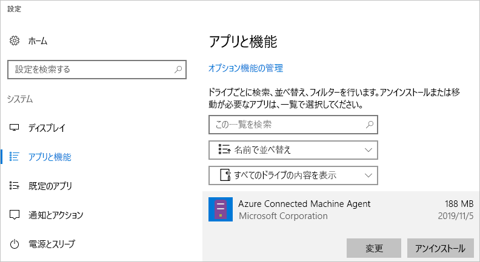

# <a name="quickstart-connect-machines-to-azure-using-azure-arc-for-servers---powershell"></a>クイック スタート:サーバー向け Azure Arc を使用してマシンを Azure に接続する - PowerShell

Azure サブスクリプションをお持ちでない場合は、開始する前に [無料アカウント](https://azure.microsoft.com/free/?WT.mc_id=A261C142F) を作成してください。

## <a name="prerequisites"></a>前提条件

[サーバー向け Azure Arc の概要](overview.md)に関するページで、サポートされているクライアントと必要なネットワーク構成を確認します。

## <a name="create-a-service-principal-for-onboarding-at-scale"></a>大規模なオンボーディング用にサービス プリンシパルを作成する

サービス プリンシパルは、マシンを Azure に接続するために必要な最小限のアクセス許可のみが付与される特殊な制限付きのマネージド ID です。 これは、テナント管理者などのより強力なアカウントを使用するよりも安全です。 サービス プリンシパルは、オンボーディング時にのみ使用されます。 目的のサーバーに接続した後は、サービス プリンシパルを削除しても問題ありません。

> [!NOTE]
> この手順をお勧めしますが、必須ではありません。

### <a name="steps-to-create-the-service-principal"></a>サービス プリンシパルを作成する手順

この例では、[Azure PowerShell](/powershell/azure/install-az-ps) を使用してサービス プリンシパル名 (SPN) を作成します。 または、このタスクについては、[Azure portal を使用したサービス プリンシパルの作成](../../active-directory/develop/howto-create-service-principal-portal.md)に関するページに記載されている手順に従う方法もあります。

`Azure Connected Machine Onboarding` ロールには、オンボーディングに必要なアクセス許可のみが含まれています。 そのスコープがリソース グループまたはサブスクリプションに対応できるように、SPN のアクセス許可を定義することができます。

[`New-AzADServicePrincipal`](/powershell/module/az.resources/new-azadserviceprincipal) コマンドレットの出力を保存しておく必要があります。そうしないと、後の手順で使用するパスワードを取得できなくなります。

```azurepowershell-interactive
$sp = New-AzADServicePrincipal -DisplayName "Arc-for-servers" -Role "Azure Connected Machine Onboarding"
$sp
```

```output
Secret                : System.Security.SecureString
ServicePrincipalNames : {ad9bcd79-be9c-45ab-abd8-80ca1654a7d1, https://Arc-for-servers}
ApplicationId         : ad9bcd79-be9c-45ab-abd8-80ca1654a7d1
ObjectType            : ServicePrincipal
DisplayName           : Hybrid-RP
Id                    : 5be92c87-01c4-42f5-bade-c1c10af87758
Type                  :
```

> [!NOTE] 
> SPN のアクセス許可が適切に設定されるまでには、しばらく時間がかかります。 次のロールの割り当てを実行した方が、はるかに早くアクセス許可を設定できます。
> ``` PowerShell
> New-AzRoleAssignment -RoleDefinitionName "Azure Connected Machine Onboarding" -ServicePrincipalName $sp.ApplicationId
> ```

次に、PowerShell を使用してパスワードを取得します。

```azurepowershell-interactive
$credential = New-Object pscredential -ArgumentList "temp", $sp.Secret
$credential.GetNetworkCredential().password
```

出力から、(前の手順の) **password** と **ApplicationId** をコピーし、後の手順のためにサーバー構成ツールのシークレット ストアなどの安全な場所に保存します。 SPN パスワードを忘れた場合または紛失した場合は、[`New-AzADSpCredential`](/powershell/module/azurerm.resources/new-azurermadspcredential) コマンドレットを使用してリセットできます。

インストール エージェントのオンボーディング スクリプトの内容:

* **ApplicationId** プロパティは、エージェントを接続するための `--service-principal-id` パラメーターに使用されます。
* **password** プロパティは、エージェントを接続するための `--service-principal-secret` パラメーターに使用されます。

> [!NOTE]
> 必ずサービス プリンシパルの **ApplicationId** プロパティを使用してください。**Id** プロパティではありません。 **Id** では正しく機能しません。

## <a name="manually-install-the-agent-and-connect-to-azure"></a>手動でエージェントをインストールして Azure に接続する

次のガイドを参照し、マシンにログインして手順を行うことで、マシンを Azure に接続できます。 [ポータルから](quickstart-onboard-portal.md)マシンを Azure に接続することもできます。

### <a name="download-and-install-the-agent"></a>エージェントのダウンロードとインストール

エージェント パッケージのインストールには、ターゲット サーバーでのルートまたはローカル管理者のアクセス権が必要ですが、Azure へのアクセスは必要ありません。

#### <a name="linux"></a>Linux

**Linux** サーバーの場合、配布に適したパッケージ形式 (.RPM または .DEB) を使用し、[Microsoft のパッケージ リポジトリ](https://packages.microsoft.com)を介してエージェントが配布されます。

> [!NOTE]
> パブリック プレビュー中は、Ubuntu 16.04 または 18.04 に適した 1 つのパッケージのみがリリースされました。

最も簡単な方法は、パッケージ リポジトリを登録し、ディストリビューションのパッケージ マネージャーを使用してパッケージをインストールすることです。
[https://aka.ms/azcmagent](https://aka.ms/azcmagent) にある bash スクリプトでは、次のアクションが実行されます。

1. `packages.microsoft.com` からダウンロードするようにホスト マシンを構成します。
2. ハイブリッド リソース プロバイダー パッケージをインストールします。
3. 必要に応じて、`--proxy` を指定した場合、プロキシ操作用にエージェントを構成します。

このスクリプトには、サポートされているディストリビューションとサポートされていないディストリビューションのチェックだけでなく、インストールに必要なアクセス許可の検出も含まれています。

次の例では、条件チェックなしでエージェントをダウンロードしてインストールします。

```bash
# Download the installation package
wget https://aka.ms/azcmagent -O ~/Install_linux_azcmagent.sh

# Install the connected machine agent. Omit the '--proxy "{proxy-url}"' parameters if proxy is not needed
bash ~/Install_linux_azcmagent.sh--proxy "{proxy-url}"
```

> [!NOTE]
> Microsoft のパッケージ リポジトリを参照しない場合は、そこからパッケージ ファイルを内部リポジトリにコピーすることができます。

#### <a name="windows"></a>Windows

**Windows** の場合、エージェントは Windows インストーラー (`.MSI`) ファイルにパッケージ化され、[https://download.microsoft.com](https://download.microsoft.com) 上でホストされている [https://aka.ms/AzureConnectedMachineAgent](https://aka.ms/AzureConnectedMachineAgent) からダウンロードできます。

```powershell
# Download the package
Invoke-WebRequest -Uri https://aka.ms/AzureConnectedMachineAgent -OutFile AzureConnectedMachineAgent.msi

# Install the package
msiexec /i AzureConnectedMachineAgent.msi /l*v installationlog.txt /qn | Out-String
```

> [!NOTE]
> Linux では、インストール スクリプトを再実行すると、自動的に最新バージョンにアップグレードされます。 Windows では、インストーラーを再実行してアップグレードする前に、"Azure Connected Machine Agent" をアンインストールする必要があります。

### <a name="connecting-to-azure"></a>Azure への接続

インストールが完了したら、`azcmagent.exe` というコマンドライン ツールを使用してエージェントを管理および構成できます。 エージェントは、Linux 上では `/opt/azcmagent/bin`、Windows 上では `$env:programfiles\AzureConnectedMachineAgent` にあります。

Windows で、ターゲット ノードの管理者として PowerShell を開き、以下を実行します。

```powershell
& "$env:ProgramFiles\AzureConnectedMachineAgent\azcmagent.exe" connect `
  --service-principal-id "{your-spn-appid}" `
  --service-principal-secret "{your-spn-password}" `
  --resource-group "{your-resource-group-name}" `
  --tenant-id "{your-tenant-id}" `
  --location "{location-of-your-resource-group}" `
  --subscription-id "{your-subscription-id}"
```

Linux では、シェルを開き、以下を実行します

<!-- Same command for linux?-->
```bash
azcmagent connect \
  --service-principal-id "{your-spn-appid}" \
  --service-principal-secret "{your-spn-password}" \
  --resource-group "{your-resource-group-name}" \
  --tenant-id "{your-tenant-id}" \
  --location "{location-of-your-resource-group}" \
  --subscription-id "{your-subscription-id}"
```

パラメーター:

* `tenant-id`:テナントの GUID。 Azure portal で確認するには、 **[Azure Active Directory]**  ->  **[プロパティ]**  ->  **[ディレクトリ ID]** を選択します。
* `subscription-id`:コンピューターの接続先となる Azure 内のサブスクリプションの GUID。
* `resource-group`:マシンを接続するリソース グループ。
* `location`:[Azure リージョンと場所](https://azure.microsoft.com/global-infrastructure/regions/)のページを参照してください。 この場所は、リソース グループの場所と同じ場合と異なる場合があります。 パブリック プレビューの場合、このサービスは**米国西部 2** と**西ヨーロッパ**でサポートされています。
* `resource-name`:(*省略可能*) オンプレミス マシンの Azure リソースの表記に使用されます。 この値を指定しない場合は、マシンのホスト名が使用されます。

詳細については、[Azcmagent リファレンス](azcmagent-reference.md)に関する記事の 'azcmagent' ツールを参照してください。
<!-- Isn't this still needed to view machines? -->

正常に完了すると、マシンが Azure に接続されます。 Azure portal でマシンを表示するには、[https://aka.ms/hybridmachineportal](https://aka.ms/hybridmachineportal) にアクセスします。


### <a name="proxy-server-configuration"></a>プロキシ サーバーの構成

#### <a name="linux"></a>Linux

<!-- New proxy name? -->

**Linux** の場合、サーバーにプロキシ サーバーが必要な場合は、次のいずれかの方法で行うことができます。

* `--proxy` を使用して、前述の[エージェントのインストール](#download-and-install-the-agent)に関するセクションから `install_linux_hybrid_agent.sh` スクリプトを実行します。
* 既にエージェントをインストールしている場合は、コマンド `/opt/azcmagent/bin/hybridrp_proxy add http://{proxy-url}:{proxy-port}` を実行します。これにより、プロキシが構成され、エージェントが再起動されます。

#### <a name="windows"></a>Windows

**Windows** の場合、サーバーがインターネット リソースへのアクセスにプロキシ サーバーを必要とする場合、以下のコマンドを実行してプロキシ サーバーの環境変数を設定する必要があります。 これにより、エージェントはインターネット アクセスにプロキシ サーバーを使用できるようになります。

```powershell
# If a proxy server is needed, execute these commands with actual proxy URL
[Environment]::SetEnvironmentVariable("https_proxy", "http://{proxy-url}:{proxy-port}", "Machine")
$env:https_proxy = [System.Environment]::GetEnvironmentVariable("https_proxy","Machine")
# The agent service needs to be restarted after the proxy environment variable is set in order for the changes to take effect.
Restart-Service -Name himds
```

> [!NOTE]
> 認証されたプロキシは、パブリック プレビューではサポートされていません。

## <a name="clean-up"></a>クリーンアップ

サーバー向け Azure Arc からマシンを切断するには、次の 2 つの手順を行う必要があります。

1. [ポータル](https://aka.ms/hybridmachineportal)でマシンを選択し、省略記号 (`...`) をクリックして、 **[削除]** を選択します。
1. マシンからエージェントをアンインストールします。

   Windows では、[アプリと機能] コントロール パネルを使用してエージェントをアンインストールすることができます。
  
  

   アンインストールのスクリプトを作成したい場合は、以下の例を使用できます。**PackageId** を取得し、`msiexec /X` を使用してエージェントをアンインストールするものです。

   レジストリ キー `HKEY_LOCAL_MACHINE\Software\Microsoft\Windows\CurrentVersion\Uninstall` から **PackageId** を見つけます。 その後、`msiexec` を使用してエージェントをアンインストールできます。

   実際にエージェントをアンインストールする例を次に示します。

   ```powershell
   Get-ChildItem -Path HKLM:\Software\Microsoft\Windows\CurrentVersion\Uninstall | `
   Get-ItemProperty | `
   Where-Object {$_.DisplayName -eq "Azure Connected Machine Agent"} | `
   ForEach-Object {MsiExec.exe /Quiet /X "$($_.PsChildName)"}
   ```

   Linux では、次のコマンドを実行してエージェントをアンインストールします。

   ```bash
   sudo apt purge hybridagent
   ```

## <a name="next-steps"></a>次の手順

> [!div class="nextstepaction"]
> [接続されているマシンにポリシーを割り当てる](../../governance/policy/assign-policy-portal.md)
