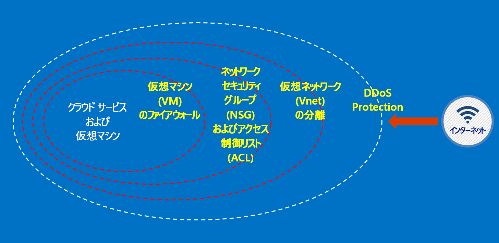

# Azure Australia とは

2014 年に、Azure がオーストラリアで利用可能になりました。リージョンは、オーストラリア東部 (シドニー) とオーストラリア南東部 (メルボルン) の 2 つです。 2018 年 4 月に、キャンベラに設置されたオーストラリア中部とオーストラリア中部 2 という 2 つの新しい Azure リージョンが利用可能になりました。 オーストラリア中部およびオーストラリア中部 2 リージョンは、政府と国の基幹インフラストラクチャのニーズを満たすことを目的に設計されており、それに特化した接続性と柔軟性を提供します。これにより、Secret 分類のネットワークにのみ求められるレベルのセキュリティと復元性を確保したうえで、クラウドの近くにお客様のシステムを配置できます。 Azure オーストラリアは、政府と国の基幹インフラストラクチャのデジタル変革を目的としたプラットフォームであり、これらのニーズに特化して設計された、オーストラリアで利用できる唯一のミッションクリティカルなクラウドです。

[Microsoft Azure オーストラリア](https://azure.microsoft.com/global-infrastructure/australia/)に接続して利用、運用するにあたり、オーストラリア政府にはオーストラリア政府のデータおよびシステムに関して固有の要件があります。 このページのリソースでは、セキュリティで保護された構成と運用に特に関心のあるすべてのお客様に適用される一般的なガイダンスを提供します。

Azure オーストラリアの Information Security Registered Assessor (IRAP) 評価、Certified Cloud Services List (CCSL) の認定資格および記載に関する最新情報については、[Microsoft Service Trust Portal](https://aka.ms/au-irap) のオーストラリアに関するページを参照してください。 オーストラリアに関するページには、政府と基幹インフラストラクチャに固有の、Microsoft からのその他のアドバイスも記載されています。

## Azure オーストラリアでお客様のデータを保護するための原則

Azure オーストラリアには、規制対象データに関する固有の要件を満たすクラウド ソリューションを構築するために使用できる一連の機能とサービスが用意されています。 データのセキュリティに関する慣例をしっかりと守れば、特別な設定をしなくても Azure オーストラリアの機能を効果的に実装するだけで、規制に準拠している独自のソリューションを構築することができます。

Azure オーストラリアでソリューションをホストした場合、こうした要件の多くは、クラウド インフラストラクチャ レベルで Microsoft が対応します。

次の図は、Azure の多層防御モデルを示しています。 たとえば、お客様側の機能 (お客様固有のアプリケーションのニーズに対応するセキュリティ アプライアンスやプレミアム DDoS サービスなど) と併せて、Microsoft では、クラウド インフラストラクチャによる基本的な DDoS を提供します。

これらの記事では、ご利用のサービスとアプリケーションを保護するための基本原則について説明するほか、これらの原則を適用する方法に関するガイダンスとベスト プラクティスを紹介します。 つまり、お客様が Azure オーストラリアを賢く利用しながら、政府の機密情報を取り扱うソリューションに必要な義務と責任を満たす方法です。

Azure に移行するオーストラリア政府機関向けに、2 つのカテゴリのドキュメントが用意されています。

## Azure Australia におけるセキュリティ

ID、Azure ロールベースのアクセス制御、暗号化と権限管理を使用したデータ保護、および効果的な監視と構成の制御は、実装する必要がある重要な要素です。 このセクションには、Azure の組み込み機能と、それらが ISM および ASD Essential 8 とどのように関係しているかについて説明している一連の記事があります。

これらの記事には、メニューの *[概念] -> [Azure Australia におけるセキュリティ]* からアクセスできます。

## Azure Australia におけるゲートウェイ

政府機関にとって重要なもう 1 つの手順は、境界セキュリティ機能の確立です。 これらの機能は、セキュア インターネット ゲートウェイ (SIG) と呼ばれます。Azure を使用する場合は、これらの保護が適用されていることをお客様が確認する必要があります。 Microsoft では SIG を運用していません。ただし、すべてのお客様を保護する当社のエッジ ネットワーク サービスと、ご利用の Azure 環境内にデプロイされた特定のサービスを組み合わせることで、同等の機能を運用することができます。

これらの記事には、メニューの *[概念] -> [Azure Australia におけるゲートウェイ]* からアクセスできます。

## 次のステップ

* Azure 内でお客様のデータをセキュリティで保護することが重要とお考えの場合は、[データ セキュリティ](secure-your-data.md)から開始してください。
* Azure 内でゲートウェイを構築することが重要とお考えの場合は、[ゲートウェイの監査、ログ記録、可視性](gateway-log-audit-visibility.md)から開始してください。
