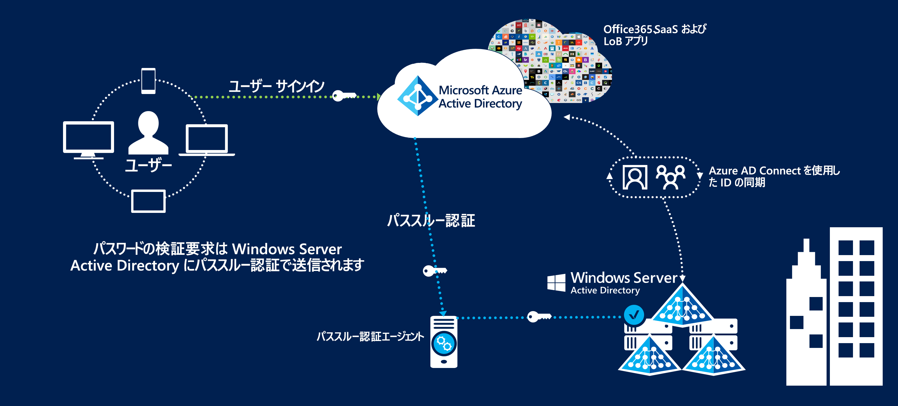
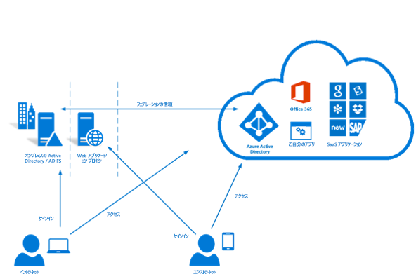

# Azure オーストラリアにおける ID フェデレーション

パブリック クラウド オファリングによる ID 管理とフェデレーションは、クラウドを使用するうえで最も重要な最初の手順の 1 つです。 Microsoft の Azure Active Directory サービスは、他の Azure サービスを利用するための前提条件であり、クラウド サービスにアクセスできるようにするためにユーザー情報を格納します。

この記事では、Azure Active Directory の実装、Active Directory Domain Services ドメインからのユーザーの同期、セキュリティで保護された認証の実装の主要な設計ポイントについて説明します。 特に、Australian Cyber Security Center の Information Security Manual (ISM) と Azure 認定資格レポートの推奨事項に焦点を当てます。

Azure Active Directory 内に格納されている情報の分類は、その設計方法を決定する際の参考になります。 次は、[ACSC 認定資格レポート – Microsoft Azure](https://aka.ms/au-irap) から抜粋したものです。

>**ACSC 認定資格レポート – Microsoft Azure** 連邦政府機関が Active Directory の使用とデータ コンテンツを PROTECTED に分類した場合、Active Directory フェデレーション サービス (AD FS) を使用して、Azure Active Directory (Azure AD) を構成する必要があります。 UNCLASSIFIED Dissemination Limiting Markings (UDLM) 分類の Active Directory データについてはフェデレーションは不要ですが、オーストラリア以外から提供されるサービスに関連するリスクを軽減するために、連邦政府機関はフェデレーションを実装できます。

そのため、ここで説明する重要な考慮事項は、同期する情報とユーザー認証メカニズムの 2 つです。

## 設計上の主な考慮事項

### ユーザーの同期

Azure AD Connect をデプロイする場合は、同期するデータに関していくつかの決定を行う必要があります。 Azure AD Connect は Microsoft Identity Manager を基盤としており、ディレクトリ間でデータを[変換](https://docs.microsoft.com/azure/active-directory/hybrid/how-to-connect-sync-best-practices-changing-default-configuration)するための堅牢な機能セットを提供します。

Microsoft コンサルティング サービスは、お客様の既存の Windows Server Active Directory の ADRAP 評価を実施できます。 ADRAP は、Azure Active Directory と同期する前に修正する必要のある問題を特定するのに役立ちます。 通常、Microsoft Premier サポート契約には、このサービスが含まれます。

[IDFix ツール](https://docs.microsoft.com/office365/enterprise/install-and-run-idfix)は、Azure AD と同期する前に、お客様のオンプレミス Active Directory ドメインに問題がないかをスキャンします。 IDFix は Azure AD Connect を実装する前の重要な最初の手順です。 IDFix スキャンでは多数の問題を特定できますが、そうした問題の多くは、スクリプトを使用してすばやく解決するか、Azure AD Connect のデータ変換を使用して回避することができます。

Azure AD には、認証を有効にするために、外部にルーティングできるトップレベル ドメインが関連付けられているユーザーが必要です。 外部にルーティングできない UPN サフィックスがお客様のドメインにある場合は、AD Connect の[代替サインイン ID](https://docs.microsoft.com/azure/active-directory/hybrid/plan-connect-userprincipalname) をユーザーのメール属性に設定する必要があります。 その後、ユーザーは、ドメイン サインインではなく、自分のメール アドレスを使用して Azure サービスにサインインします。

ユーザー アカウントの UPN サフィックスは、PowerShell などのツールを使用して変更することもできます。ただし、接続されている他のシステムに予期しない結果が生じる可能性があり、ベスト プラクティスとは見なされなくなっています。

Azure Active Directory に同期する属性を決定する際は、すべての属性が必要であると想定するのが最も安全です。 ディレクトリに実際の PROTECTED データが含まれていることはめったにありませんが、監査を実施することをお勧めします。 PROTECTED データがディレクトリ内に見つかった場合は、属性を省略または変換した場合の影響を評価してください。 役に立つガイドとして、Microsoft クラウド サービスに[必要](https://docs.microsoft.com/azure/active-directory/hybrid/reference-connect-sync-attributes-synchronized)な属性の一覧があります。

### Authentication

使用可能なオプションと、それらを使用してエンドユーザーをセキュリティで保護し続ける方法について理解しておくことが重要です。
Microsoft は、Azure Active Directory に対してユーザーを認証するための [3 つのネイティブ ソリューション](https://docs.microsoft.com/azure/active-directory/hybrid/plan-connect-user-signin)を提供しています。

* パスワード ハッシュ同期 - Azure Active Directory Domain Services からハッシュ化されたパスワードが Azure AD Connect によって Azure Active Directory に同期されます。
* [パススルー認証](https://docs.microsoft.com/azure/active-directory/hybrid/how-to-connect-pta) - パスワードは Active Directory Domain Services 内にとどまります。 ユーザーは、エージェントを介して Active Directory Domain Services に対して認証されます。 パスワードは Azure AD 内に格納されません。
* [フェデレーション SSO](https://docs.microsoft.com/azure/active-directory/hybrid/how-to-connect-fed-whatis) - Azure Active Directory は Active Directory フェデレーション サービス (AD FS) とフェデレーションされ、サインイン時に、Azure はユーザーを認証のために Active Directory フェデレーション サービス (AD FS) に転送します。 パスワードは Azure AD 内に格納されません。

パスワード ハッシュ同期は、OFFICIAL:Sensitive 以下のデータがディレクトリ内に格納されるシナリオで使用できます。 PROTECTED データが格納されるシナリオでは、残りの 2 つのオプションのいずれかが必要です。

これら 3 つのオプションはすべて、[パスワード ライトバック](https://docs.microsoft.com/azure/active-directory/authentication/concept-sspr-writeback)をサポートしています。『[ACSC コンシューマー ガイド](https://aka.ms/au-irap)』では、これを無効にすることをお勧めしています。 ただし、組織は、パスワード リセットのセルフサービスを使用する場合の生産性の向上およびサポート作業量の軽減と照らして、パスワード ライトバックを無効にするリスクを評価する必要があります。

#### パススルー認証 (PTA)

パススルー認証は、IRAP 評価が完了した後にリリースされました。そのため、個別に評価して、ソリューションがお客様の組織のリスク プロファイルにどのようにフィットするかを判断する必要があります。 セキュリティ体制が強化されたため、Microsoft によるフェデレーションよりもパススルー認証が推奨されます。

パススルー認証には、検討が必要な設計要素がいくつかあります。

* パススルー認証エージェントは、Microsoft クラウド サービスへの発信接続を確立できる必要があります。
* 複数のエージェントをインストールして、サービスの高可用性を確保します。 ベスト プラクティスは、少なくとも 3 個のエージェント、最大で 12 個のエージェントをデプロイすることです。
* ベスト プラクティスは、Active Directory ドメイン コントローラーに直接エージェントをインストールしないようにすることです。 既定では、パススルー認証を使用する Azure AD Connect をデプロイすると、Azure AD Connect サーバーにエージェントがインストールされます。
* パススルー認証は、Active Directory フェデレーション サービス (AD FS) よりもメンテナンス性に優れたオプションです。これは、専用のサーバー インフラストラクチャ、証明書管理、インバウンド ファイアウォール規則が必要ないからです。

#### Active Directory フェデレーション サービス (AD FS)

Active Directory フェデレーション サービス (AD FS) は、IRAP 評価に含まれていました。PROTECTED 環境での使用が承認されています。

Active Directory フェデレーション サービス (AD FS) には、検討が必要な設計要素がいくつかあります。

* フェデレーション サービスでは、インターネットまたは少なくとも Microsoft のサービス エンドポイントからの HTTPS トラフィックのネットワーク イングレスが必要です。
* フェデレーション サービスでは、PKI と証明書を使用します。これには継続的な管理と更新が必要です。
* フェデレーション サービスは専用のサーバー上にデプロイする必要があります。また、外部から安全にアクセスできるようにするために、関連するネットワーク インフラストラクチャが必要です。

### Multi-Factor Authentication (MFA)

Multi-Factor Authentication の ISM セクションでは、お客様のリスク プロファイルに基づいて次のシナリオで実装することをお勧めします。

* 標準ユーザーの認証
* 特権アカウントの認証
* ユーザー リモート アクセスの認証
* 特権アクションを実行するユーザー

Azure Active Directory が提供する Multi-Factor Authentication は、すべてのユーザーまたはユーザーのサブセット (たとえば、特権アカウントのみ) に対して有効にできます。 Microsoft では、条件付きアクセスと呼ばれるソリューションも提供しています。これにより、Multi-Factor Authentication の適用方法をより細かく制御できます (ユーザーがリモート IP アドレス範囲からサインインする場合のみなど)。

Azure Multi-Factor Authentication では、次の ISM 対応形式の検証をサポートしています。

* 音声通話
* SMS メッセージ
* Microsoft Authenticator アプリケーション
* サポートされるハードウェア トークン

Azure Active Directory のコンポーネントである Privileged Identity Management を使用すると、ユーザーが 4 番目の推奨事項を満たすために自分のアクセス許可を昇格した場合に、Multi-Factor Authentication の使用を強制できます。

## 次の手順

[ロールベースのアクセス制御と Privileged Identity Management](role-privileged.md) に関する記事を確認してください。
