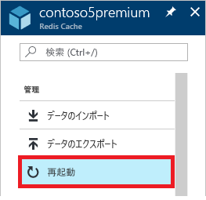
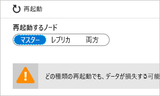
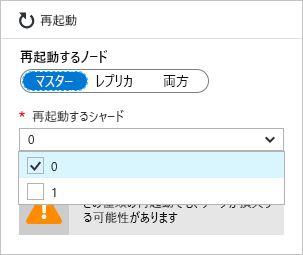

# Azure Cache for Redis を管理する方法
このトピックでは、Azure Cache for Redis インスタンスについて、[再起動](#reboot)、[更新スケジュール](#schedule-updates)などの管理タスクを実行する方法について説明します。

## 再起動
**[再起動]** ブレードでは、キャッシュの 1 つ以上のノードを再起動できます。 この再起動機能により、アプリケーションにキャッシュ ノードの障害が発生した場合の復元性をテストすることができます。

再起動するノードを選び、**[再起動]** をクリックします。

クラスタリングが有効になっている Premium キャッシュがある場合は、再起動するキャッシュのシャードを選択できます。

キャッシュのノードを再起動するには、目的のノードを選択し、 **[再起動]** をクリックします。 クラスタリングが有効になっている Premium キャッシュがある場合は、再起動したいシャードを選択し、**[再起動]** をクリックします。 数分後、選択したノードが再起動され、さらに数分後にオンラインに戻ります。

クライアント アプリケーションへの影響は、再起動するノードによって異なります。

* **マスター** - マスター ノードが再起動されると、Azure Cache for Redis からレプリカ ノードへのフェールオーバーが行われ、そのノードがマスターに昇格します。 このフェールオーバー中、キャッシュに接続できない短いインターバルが発生する可能性があります。
* **スレーブ** - スレーブ ノードの再起動は、通常、キャッシュ クライアントに何の影響も及ぼしません。
* **マスターとスレーブの両方** - 両方のキャッシュ ノードが再起動されると、キャッシュのデータすべてが失われ、プライマリ ノードがオンラインに戻るまでキャッシュに接続できません。 [データの永続化](cache-how-to-premium-persistence.md)を構成した場合、キャッシュがオンラインに戻ったときに最新のバックアップが復元されますが、最新のバックアップ後に発生したキャッシュへの書き込みは失われます。
* **クラスタリングが有効になっている Premium キャッシュのノード** - クラスタリングが有効になっている Premium キャッシュのノードを 1 つ以上再起動したとき、選んだノードの動作は、非クラスター化キャッシュの対応するノードを再起動する場合と同じです。

> [!IMPORTANT]
> 再起動はすべての価格レベルで使用可能になりました。
> 
> 

## 再起動に関する FAQ
* [アプリケーションのテストでは、どのノードを再起動する必要がありますか。](#which-node-should-i-reboot-to-test-my-application)
* [キャッシュを再起動することでクライアント接続を消去できますか。](#can-i-reboot-the-cache-to-clear-client-connections)
* [再起動すると、キャッシュのデータは失われますか。](#will-i-lose-data-from-my-cache-if-i-do-a-reboot)
* [PowerShell、CLI、またはその他の管理ツールを使用して、キャッシュを再起動できますか。](#can-i-reboot-my-cache-using-powershell-cli-or-other-management-tools)
* [どの価格レベルで再起動機能を使用できますか。](#what-pricing-tiers-can-use-the-reboot-functionality)

### アプリケーションのテストでは、どのノードを再起動する必要がありますか。
キャッシュのプライマリ ノードの障害に対するアプリケーションの回復性をテストするには、 **マスター** ノードを再起動します。 セカンダリ ノードの障害に対するアプリケーションの回復性をテストするには、 **スレーブ** ノードを再起動します。 キャッシュの全体的な障害に対するアプリケーションの回復性をテストするには、 **両方** のノードを再起動します。

### キャッシュを再起動することでクライアント接続を消去できますか。
はい、できます。キャッシュを再起動すると、すべてのクライアント接続がクリアされます。 再起動は、ロジック エラーやクライアント アプリケーションのバグによって、すべてのクライアント接続が使い果たされているときに便利です。 価格レベルごとに、さまざまなサイズに対するさまざまな[クライアント接続の制限](cache-configure.md#default-redis-server-configuration)があり、こうした制限に達すると、それ以上のクライアント接続は受け入れられなくなります。 キャッシュを再起動することで、すべてのクライアント接続がクリアされます。

> [!IMPORTANT]
> キャッシュを再起動してクライアント接続をクリアすると、Redis ノードがオンラインに戻ったときに、StackExchange.Redis が自動的に再接続されます。 根本的な問題が解決されない限り、クライアント接続はその後も消耗される可能性があります。
> 
> 

### 再起動すると、キャッシュのデータは失われますか。
**マスター** ノードと**スレーブ** ノードの両方を再起動すると、キャッシュ (または、クラスタリングが有効になっている Premium キャッシュを使用している場合はそのシャード) のすべてのデータが失われます。 [データの永続化](cache-how-to-premium-persistence.md)を構成した場合、キャッシュがオンラインに戻ったときに最新のバックアップが復元されますが、バックアップ作成後に発生したキャッシュへの書き込みは失われます。

ノードのいずれかを 1 つだけ再起動しても、通常、データが失われることはありませんが、失われる可能性もあります。 たとえば、マスター ノードが再起動されたときに、キャッシュの書き込みが実行中だと、そのキャッシュの書き込みのデータは失われます。 また、一方のノードを再起動した場合に、もう一方のノードが偶然同じタイミングで故障しダウンした場合もやはりデータが失われます。 データが失われるさまざまな原因について詳しくは、「[Redis のデータが正常ではない](https://gist.github.com/JonCole/b6354d92a2d51c141490f10142884ea4#file-whathappenedtomydatainredis-md)」をご覧ください。

### PowerShell、CLI、またはその他の管理ツールを使用して、キャッシュを再起動できますか。
PowerShell での手順については、「[To reboot an Azure Cache for Redis](cache-howto-manage-redis-cache-powershell.md#to-reboot-an-azure-cache-for-redis)」(Azure Cache for Redis を再起動するには) をご覧ください。

### どの価格レベルで再起動機能を使用できますか。
再起動はすべての価格レベルで使用可能です。

## 更新のスケジュール
**[更新のスケジュール]** ブレードでは、Premium レベルのキャッシュのメンテナンス時間を指定できます。 メンテナンス時間を指定すると、その時間にすべての Redis サーバーの更新が実行されます。 

> [!NOTE] 
> このメンテナンス時間は、Redis サーバーの更新にのみ適用されます。Azure の更新や、キャッシュをホストする VM のオペレーティング システムへの更新には適用されません。
> 
> 

メンテナンス時間を指定するには、目的の曜日をオンにし、曜日ごとにメンテナンス時間の開始時刻を指定して、 **[OK]** をクリックします。 メンテナンス時間の時刻は UTC 時間で指定します。 

更新の既定の最小メンテナンス時間は 5 時間です。 この値は、Azure ポータルからは構成できませんが、PowerShell で [New-AzureRmRedisCacheScheduleEntry](/powershell/module/azurerm.rediscache/new-azurermrediscachescheduleentry) コマンドレットの `MaintenanceWindow` パラメーターを使用して構成できます。 詳しくは、「[PowerShell、CLI、またはその他の管理ツールを使用して、スケジュールされている更新を管理できますか](#can-i-manage-scheduled-updates-using-powershell-cli-or-other-management-tools)」をご覧ください。

## 更新のスケジュールに関する FAQ
* [更新スケジュール機能を使用しない場合、更新はどのタイミングで実行されますか。](#when-do-updates-occur-if-i-dont-use-the-schedule-updates-feature)
* [スケジュールされたメンテナンス時間に行われるのは、どのような更新ですか。](#what-type-of-updates-are-made-during-the-scheduled-maintenance-window)
* [PowerShell、CLI、またはその他の管理ツールを使用して、スケジュールされている更新を管理できますか。](#can-i-managed-scheduled-updates-using-powershell-cli-or-other-management-tools)
* [どの価格レベルで更新スケジュール機能を使用できますか。](#what-pricing-tiers-can-use-the-schedule-updates-functionality)

### 更新スケジュール機能を使用しない場合、更新はどのタイミングで実行されますか。
メンテナンス時間を指定しない場合は、いつでも更新を実行できます。

### スケジュールされたメンテナンス時間に行われるのは、どのような更新ですか。
スケジュールされたメンテナンス時間に行われるのは、Redis サーバーの更新だけです。 メンテナンス時間は、Azure の更新や、VM のオペレーティング システムへの更新には適用されません。

### PowerShell、CLI、またはその他の管理ツールを使用して、スケジュールされている更新を管理できますか。
はい、次の PowerShell コマンドレットを使用して、スケジュールされている更新を管理できます。

* [Get-AzureRmRedisCachePatchSchedule](/powershell/module/azurerm.rediscache/get-azurermrediscachepatchschedule)
* [New-AzureRmRedisCachePatchSchedule](/powershell/module/azurerm.rediscache/new-azurermrediscachepatchschedule)
* [New-AzureRmRedisCacheScheduleEntry](/powershell/module/azurerm.rediscache/new-azurermrediscachescheduleentry)
* [Remove-AzureRmRedisCachePatchSchedule](/powershell/module/azurerm.rediscache/remove-azurermrediscachepatchschedule)

### どの価格レベルで更新スケジュール機能を使用できますか。
**更新のスケジュール**機能は Premium 価格レベルでのみ使用できます。

## 次の手順
* [Azure Cache for Redis Premium レベル](cache-premium-tier-intro.md)の機能を確認します。

