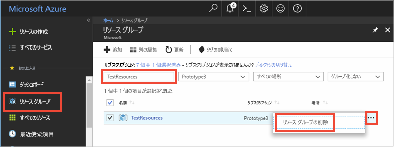

# <a name="quickstart-use-azure-cache-for-redis-in-net-core"></a>クイックスタート: .NET Core で Azure Cache for Redis を使用する

このクイック スタートでは、Azure 内の任意のアプリケーションからアクセスできるセキュリティで保護された専用キャッシュにアクセスするために、Azure Cache for Redis を .NET Core アプリに組み込みます。 具体的には、.NET Core コンソール アプリで [StackExchange.Redis](https://github.com/StackExchange/StackExchange.Redis) クライアントと C# コードを使用します。

## <a name="skip-to-the-code-on-github"></a>GitHub のコードにスキップする

この記事をスキップしてすぐにコードをご覧になりたい方は、GitHub にある [.NET Core のクイックスタート](https://github.com/Azure-Samples/azure-cache-redis-samples/tree/main/quickstart/dotnet-core)を参照してください。

## <a name="prerequisites"></a>前提条件

- Azure サブスクリプション - [無料アカウントを作成する](https://azure.microsoft.com/free/)
- [.NET Core SDK](https://dotnet.microsoft.com/download)

## <a name="create-a-cache"></a>キャッシュの作成
[!INCLUDE [redis-cache-create](../../includes/redis-cache-create.md)]

[!INCLUDE [redis-cache-access-keys](../../includes/redis-cache-access-keys.md)]

**ホスト名** と **プライマリ** アクセス キーをメモします。 これらの値は、後で *CacheConnection* のシークレットを構築するときに使用します。


## <a name="create-a-console-app"></a>コンソール アプリを作成する

新しいコマンド ウィンドウを開き、次のコマンドを実行して新しい .NET Core コンソール アプリを作成します。

```
dotnet new console -o Redistest
```

コマンド ウィンドウで、新しい *Redistest* プロジェクト ディレクトリに移動します。


## <a name="add-secret-manager-to-the-project"></a>プロジェクトにシークレット マネージャーを追加します

このセクションでは、プロジェクトに[シークレット マネージャー ツール](/aspnet/core/security/app-secrets)を追加します。 シークレット マネージャー ツールは、開発作業の機密データをプロジェクト ツリーの外部に格納します。 これにより、ソース コード内のアプリ シークレットが偶発的に共有されるのを防止できます。

*Redistest.csproj* ファイルを開きます。 `DotNetCliToolReference` 要素を追加して、*Microsoft.Extensions.SecretManager.Tools* を含めます。 また、`UserSecretsId` 要素を下記のように追加して、ファイルを保存します。

```xml
<Project Sdk="Microsoft.NET.Sdk">
    <PropertyGroup>
        <OutputType>Exe</OutputType>
        <TargetFramework>net5.0</TargetFramework>
        <UserSecretsId>Redistest</UserSecretsId>
    </PropertyGroup>
    <ItemGroup>
        <DotNetCliToolReference Include="Microsoft.Extensions.SecretManager.Tools" Version="2.0.0" />
    </ItemGroup>
</Project>
```

次のコマンドを実行して、*Microsoft.Extensions.Configuration.UserSecrets* パッケージをプロジェクトに追加します。

```
dotnet add package Microsoft.Extensions.Configuration.UserSecrets
```

次のコマンドを実行して、パッケージを復元します。

```
dotnet restore
```

コマンド ウィンドウで、キャッシュ名とプライマリ アクセス キーのプレースホルダー (角かっこを含む) を置き換えた後、次のコマンドを実行して *CacheConnection* という新しいシークレットを保存します。

```
dotnet user-secrets set CacheConnection "<cache name>.redis.cache.windows.net,abortConnect=false,ssl=true,allowAdmin=true,password=<primary-access-key>"
```

次の `using` ステートメントを *Program.cs* に追加します。

```csharp
using Microsoft.Extensions.Configuration;
```

次のメンバーを *Program.cs* の `Program` クラスに追加します。 このコードは、Azure Cache for Redis 接続文字列のユーザー シークレットにアクセスするように構成を初期化します。

```csharp
private static IConfigurationRoot Configuration { get; set; }
const string SecretName = "CacheConnection";

private static void InitializeConfiguration()
{
    var builder = new ConfigurationBuilder()
        .AddUserSecrets<Program>();

    Configuration = builder.Build();
}
```

## <a name="configure-the-cache-client"></a>キャッシュ クライアントを構成する

このセクションでは、.NET に [StackExchange.Redis](https://github.com/StackExchange/StackExchange.Redis) クライアントを使用するようにコンソール アプリを構成します。

コマンド ウィンドウで、*Redistest* プロジェクト ディレクトリで次のコマンドを実行します。

```
dotnet add package StackExchange.Redis
```

インストールが完了すると、*StackExchange.Redis* キャッシュ クライアントをプロジェクトに使用できるようになります。


## <a name="connect-to-the-cache"></a>キャッシュに接続する

次の `using` ステートメントを *Program.cs* に追加します。

```csharp
using StackExchange.Redis;
```

Azure Cache for Redis への接続には、`ConnectionMultiplexer` クラスを使用します。 このクラスは、クライアント アプリケーション全体で共有して再利用する必要があります。 操作ごとに新しい接続を作成しないでください。 

*Program.cs* で、次のメンバーをコンソール アプリの `Program` クラスに追加します。

```csharp
private static Lazy<ConnectionMultiplexer> lazyConnection = CreateConnection();

public static ConnectionMultiplexer Connection
{
    get
    {
        return lazyConnection.Value;
    }
}

private static Lazy<ConnectionMultiplexer> CreateConnection()
{
    return new Lazy<ConnectionMultiplexer>(() =>
    {
        string cacheConnection = Configuration[SecretName];
        return ConnectionMultiplexer.Connect(cacheConnection);
    });
}
```

アプリで `ConnectionMultiplexer` インスタンスを共有するこの方法では、接続されたインスタンスを返す静的プロパティを使用します。 このコードにより、接続された 1 つの `ConnectionMultiplexer` インスタンスだけがスレッドセーフな方法で初期化されます。 `abortConnect` は false に設定されており、Azure Cache for Redis への接続が確立されていない場合でも呼び出しが成功します。 `ConnectionMultiplexer` の主な機能の 1 つは、ネットワーク問題などの原因が解決されると、キャッシュへの接続が自動的に復元されることです。

*CacheConnection* シークレットの値には、シークレット マネージャー構成プロバイダーを使用してアクセスします。この値はパスワード パラメーターとして使用されます。

## <a name="handle-redisconnectionexception-and-socketexception-by-reconnecting"></a>再接続によって RedisConnectionException と SocketException を処理する

`ConnectionMultiplexer` のメソッドを呼び出すときに推奨されるベスト プラクティスは、接続を閉じて再確立することによって、`RedisConnectionException` と `SocketException` の例外を自動的に解決しようとすることです。

次の `using` ステートメントを *Program.cs* に追加します。

```csharp
using System.Net.Sockets;
using System.Threading;
```

*Program.cs* で、次のメンバーを `Program` クラスに追加します。

```csharp
private static long lastReconnectTicks = DateTimeOffset.MinValue.UtcTicks;
private static DateTimeOffset firstErrorTime = DateTimeOffset.MinValue;
private static DateTimeOffset previousErrorTime = DateTimeOffset.MinValue;

private static readonly object reconnectLock = new object();

// In general, let StackExchange.Redis handle most reconnects,
// so limit the frequency of how often ForceReconnect() will
// actually reconnect.
public static TimeSpan ReconnectMinFrequency => TimeSpan.FromSeconds(60);

// If errors continue for longer than the below threshold, then the
// multiplexer seems to not be reconnecting, so ForceReconnect() will
// re-create the multiplexer.
public static TimeSpan ReconnectErrorThreshold => TimeSpan.FromSeconds(30);

public static int RetryMaxAttempts => 5;

private static void CloseConnection(Lazy<ConnectionMultiplexer> oldConnection)
{
    if (oldConnection == null)
        return;

    try
    {
        oldConnection.Value.Close();
    }
    catch (Exception)
    {
        // Example error condition: if accessing oldConnection.Value causes a connection attempt and that fails.
    }
}

/// <summary>
/// Force a new ConnectionMultiplexer to be created.
/// NOTES:
///     1. Users of the ConnectionMultiplexer MUST handle ObjectDisposedExceptions, which can now happen as a result of calling ForceReconnect().
///     2. Don't call ForceReconnect for Timeouts, just for RedisConnectionExceptions or SocketExceptions.
///     3. Call this method every time you see a connection exception. The code will:
///         a. wait to reconnect for at least the "ReconnectErrorThreshold" time of repeated errors before actually reconnecting
///         b. not reconnect more frequently than configured in "ReconnectMinFrequency"
/// </summary>
public static void ForceReconnect()
{
    var utcNow = DateTimeOffset.UtcNow;
    long previousTicks = Interlocked.Read(ref lastReconnectTicks);
    var previousReconnectTime = new DateTimeOffset(previousTicks, TimeSpan.Zero);
    TimeSpan elapsedSinceLastReconnect = utcNow - previousReconnectTime;

    // If multiple threads call ForceReconnect at the same time, we only want to honor one of them.
    if (elapsedSinceLastReconnect < ReconnectMinFrequency)
        return;

    lock (reconnectLock)
    {
        utcNow = DateTimeOffset.UtcNow;
        elapsedSinceLastReconnect = utcNow - previousReconnectTime;

        if (firstErrorTime == DateTimeOffset.MinValue)
        {
            // We haven't seen an error since last reconnect, so set initial values.
            firstErrorTime = utcNow;
            previousErrorTime = utcNow;
            return;
        }

        if (elapsedSinceLastReconnect < ReconnectMinFrequency)
            return; // Some other thread made it through the check and the lock, so nothing to do.

        TimeSpan elapsedSinceFirstError = utcNow - firstErrorTime;
        TimeSpan elapsedSinceMostRecentError = utcNow - previousErrorTime;

        bool shouldReconnect =
            elapsedSinceFirstError >= ReconnectErrorThreshold // Make sure we gave the multiplexer enough time to reconnect on its own if it could.
            && elapsedSinceMostRecentError <= ReconnectErrorThreshold; // Make sure we aren't working on stale data (e.g. if there was a gap in errors, don't reconnect yet).

        // Update the previousErrorTime timestamp to be now (e.g. this reconnect request).
        previousErrorTime = utcNow;

        if (!shouldReconnect)
            return;

        firstErrorTime = DateTimeOffset.MinValue;
        previousErrorTime = DateTimeOffset.MinValue;

        Lazy<ConnectionMultiplexer> oldConnection = lazyConnection;
        CloseConnection(oldConnection);
        lazyConnection = CreateConnection();
        Interlocked.Exchange(ref lastReconnectTicks, utcNow.UtcTicks);
    }
}

// In real applications, consider using a framework such as
// Polly to make it easier to customize the retry approach.
private static T BasicRetry<T>(Func<T> func)
{
    int reconnectRetry = 0;
    int disposedRetry = 0;

    while (true)
    {
        try
        {
            return func();
        }
        catch (Exception ex) when (ex is RedisConnectionException || ex is SocketException)
        {
            reconnectRetry++;
            if (reconnectRetry > RetryMaxAttempts)
                throw;
            ForceReconnect();
        }
        catch (ObjectDisposedException)
        {
            disposedRetry++;
            if (disposedRetry > RetryMaxAttempts)
                throw;
        }
    }
}

public static IDatabase GetDatabase()
{
    return BasicRetry(() => Connection.GetDatabase());
}

public static System.Net.EndPoint[] GetEndPoints()
{
    return BasicRetry(() => Connection.GetEndPoints());
}

public static IServer GetServer(string host, int port)
{
    return BasicRetry(() => Connection.GetServer(host, port));
}
```

## <a name="executing-cache-commands"></a>キャッシュ コマンドの実行

*Program.cs* で、コンソール アプリの `Program` クラスの `Main` プロシージャに次のコードを追加します。

```csharp
static void Main(string[] args)
{
    InitializeConfiguration();

    IDatabase cache = GetDatabase();

    // Perform cache operations using the cache object...

    // Simple PING command
    string cacheCommand = "PING";
    Console.WriteLine("\nCache command  : " + cacheCommand);
    Console.WriteLine("Cache response : " + cache.Execute(cacheCommand).ToString());

    // Simple get and put of integral data types into the cache
    cacheCommand = "GET Message";
    Console.WriteLine("\nCache command  : " + cacheCommand + " or StringGet()");
    Console.WriteLine("Cache response : " + cache.StringGet("Message").ToString());

    cacheCommand = "SET Message \"Hello! The cache is working from a .NET Core console app!\"";
    Console.WriteLine("\nCache command  : " + cacheCommand + " or StringSet()");
    Console.WriteLine("Cache response : " + cache.StringSet("Message", "Hello! The cache is working from a .NET Core console app!").ToString());

    // Demonstrate "SET Message" executed as expected...
    cacheCommand = "GET Message";
    Console.WriteLine("\nCache command  : " + cacheCommand + " or StringGet()");
    Console.WriteLine("Cache response : " + cache.StringGet("Message").ToString());

    // Get the client list, useful to see if connection list is growing...
    // Note that this requires allowAdmin=true in the connection string
    cacheCommand = "CLIENT LIST";
    Console.WriteLine("\nCache command  : " + cacheCommand);
    var endpoint = (System.Net.DnsEndPoint)GetEndPoints()[0];
    IServer server = GetServer(endpoint.Host, endpoint.Port);
    ClientInfo[] clients = server.ClientList();

    Console.WriteLine("Cache response :");
    foreach (ClientInfo client in clients)
    {
        Console.WriteLine(client.Raw);
    }

    CloseConnection(lazyConnection);
}
```

*Program.cs* を保存します。

Azure Cache for Redis には、Azure Cache for Redis 内のデータを論理的に分離する目的に使用できるデータベースがあります (既定ではデータベースの数が 16 個ですが、設定により変更できます)。 コードは、既定のデータベース DB 0 に接続されます。 詳細については、「[What are Redis databases? (Redis データベースとは)](cache-development-faq.md#what-are-redis-databases)」と「[既定の Redis サーバー構成](cache-configure.md#default-redis-server-configuration)」を参照してください。

キャッシュ項目の格納と取得には、`StringSet` および `StringGet`メソッドを使用します。

Redis では、ほとんどのデータが Redis 文字列として保存されますが、これらの文字列には、さまざまなデータ型を格納することができます。シリアル化したバイナリ データもその 1 つで、.NET のオブジェクトをキャッシュに保存する際に使用することができます。

コマンド ウィンドウで次のコマンドを実行し、アプリをビルドします。

```
dotnet build
```

次のコマンドを使用してアプリを実行します。

```
dotnet run
```

次の例では、`Message` キーは、前に Azure portal の Redis コンソールを使って設定されたキャッシュ値を持っていたことがわかります。 アプリは、そのキャッシュ値を更新しました。 また、アプリは `PING` および `CLIENT LIST` コマンドも実行しました。


## <a name="work-with-net-objects-in-the-cache"></a>キャッシュ内で .NET オブジェクトを使用する

Azure Cache for Redis は .NET オブジェクトとプリミティブ データ型の両方をキャッシュできますが、.NET オブジェクトをキャッシュするためには、あらかじめシリアル化しておく必要があります。 この .NET オブジェクトのシリアル化はアプリケーション開発者が行わなければなりません。逆にそのことでシリアライザーの選択に幅が生まれ、開発者にとってのメリットとなっています。

オブジェクトをシリアル化する簡単な方法の 1 つは、[Newtonsoft.Json](https://www.nuget.org/packages/Newtonsoft.Json/) の `JsonConvert` シリアル化メソッドを使用して、JSON へおよび JSON からシリアル化する方法です。 このセクションでは、.NET オブジェクトをキャッシュに追加します。

次のコマンドを実行して、*Newtonsoft.json* パッケージをアプリに追加します。

```
dotnet add package Newtonsoft.json
```

*Program.cs* の先頭に次の `using` ステートメントを追加します。

```csharp
using Newtonsoft.Json;
```

次の `Employee` クラス定義を *Program.cs* に追加します。

```csharp
class Employee
{
    public string Id { get; set; }
    public string Name { get; set; }
    public int Age { get; set; }

    public Employee(string employeeId, string name, int age)
    {
        Id = employeeId;
        Name = name;
        Age = age;
    }
}
```

*Program.cs* の `Main()` プロシージャの一番下と、`CloseConnection()` の呼び出しの前に、シリアル化された .NET オブジェクトをキャッシュして取得する以下のコード行を追加します。

```csharp
    // Store .NET object to cache
    Employee e007 = new Employee("007", "Davide Columbo", 100);
    Console.WriteLine("Cache response from storing Employee .NET object : " + 
    cache.StringSet("e007", JsonConvert.SerializeObject(e007)));

    // Retrieve .NET object from cache
    Employee e007FromCache = JsonConvert.DeserializeObject<Employee>(cache.StringGet("e007"));
    Console.WriteLine("Deserialized Employee .NET object :\n");
    Console.WriteLine("\tEmployee.Name : " + e007FromCache.Name);
    Console.WriteLine("\tEmployee.Id   : " + e007FromCache.Id);
    Console.WriteLine("\tEmployee.Age  : " + e007FromCache.Age + "\n");
```

*Program.cs* を保存し、次のコマンドでアプリをリビルドします。

```
dotnet build
```

次のコマンドを使用してアプリケーションを実行して、.NET オブジェクトのシリアル化をテストします。

```
dotnet run
```


## <a name="clean-up-resources"></a>リソースをクリーンアップする

次のチュートリアルに進む場合は、このクイック スタートで作成したリソースを維持して、再利用することができます。

クイック スタートのサンプル アプリケーションの使用を終える場合は、課金を避けるために、このクイック スタートで作成した Azure リソースを削除することができます。 

> [!IMPORTANT]
> いったん削除したリソース グループを元に戻すことはできません。リソース グループとそこに存在するすべてのリソースは完全に削除されます。 間違ったリソース グループやリソースをうっかり削除しないようにしてください。 このサンプルのホストとなるリソースを、保持するリソースが含まれている既存のリソース グループ内に作成した場合は、リソース グループを削除するのではなく、個々のブレードから各リソースを個別に削除することができます。
>

[Azure ポータル](https://portal.azure.com) にサインインし、 **[リソース グループ]** をクリックします。

**[名前でフィルター]** ボックスにリソース グループの名前を入力します。 この記事の手順では、*TestResources* という名前のリソース グループを使用しました。 結果一覧でリソース グループの **[...]** をクリックし、 **[リソース グループの削除]** をクリックします。



リソース グループの削除の確認を求めるメッセージが表示されます。 確認のためにリソース グループの名前を入力し、 **[削除]** をクリックします。

しばらくすると、リソース グループとそこに含まれているすべてのリソースが削除されます。


<a name="next-steps"></a>

## <a name="next-steps"></a>次のステップ

このクイック スタートでは、.NET Core アプリケーションから Azure Cache for Redis を使用する方法を説明しました。 ASP.NET Web アプリと Azure Cache for Redis を使用するには、次のクイック スタートに進みます。

> [!div class="nextstepaction"]
> [Azure Cache for Redis を使用する ASP.NET Web アプリを作成する](./cache-web-app-howto.md)

クラウドの支出を最適化して節約しますか?

> [!div class="nextstepaction"]
> [Cost Management を使用してコスト分析を開始する](../cost-management-billing/costs/quick-acm-cost-analysis.md?WT.mc_id=costmanagementcontent_docsacmhorizontal_-inproduct-learn)