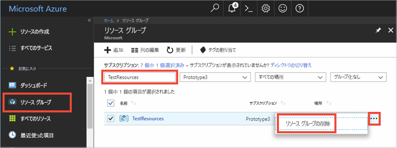

# <a name="quickstart-use-azure-cache-for-redis-with-nodejs"></a>クイック スタート:Node.js で Azure Cache for Redis を使用する

このクイック スタートでは、Azure 内の任意のアプリケーションからアクセスできるセキュリティで保護された専用キャッシュにアクセスするために、Azure Cache for Redis を Node.js アプリに組み込みます。

## <a name="prerequisites"></a>前提条件

- Azure サブスクリプション - [無料アカウントを作成する](https://azure.microsoft.com/free/)
- [node_redis](https://github.com/mranney/node_redis)。これは `npm install redis` コマンドでインストールできます。 

他の Node.js クライアントを使用する例については、 [Node.js Redis クライアント](https://redis.io/clients#nodejs)に関するセクションに記載されている Node.js クライアントの個々のドキュメントを参照してください。

## <a name="create-a-cache"></a>キャッシュの作成
[!INCLUDE [redis-cache-create](../../includes/redis-cache-create.md)]

[!INCLUDE [redis-cache-access-keys](../../includes/redis-cache-access-keys.md)]


**[ホスト名]** と **[プライマリ]** アクセス キーの環境変数を追加します。 コードに機密情報を直接含める代わりに、これらの変数をコードから使用します。

```
set REDISCACHEHOSTNAME=contosoCache.redis.cache.windows.net
set REDISCACHEKEY=XXXXXXXXXXXXXXXXXXXXXXXXXXXXXXXXXXXXXXXXXXXX
```

## <a name="connect-to-the-cache"></a>キャッシュに接続する

[node_redis](https://github.com/mranney/node_redis) の最新のビルドでは、TLS を使用した Azure Cache for Redis への接続をサポートしています。 次の例では、TLS エンドポイント 6380 を使用して Azure Cache for Redis に接続する方法を示しています。 

```js
var redis = require("redis");

// Add your cache name and access key.
var client = redis.createClient(6380, process.env.REDISCACHEHOSTNAME,
    {auth_pass: process.env.REDISCACHEKEY, tls: {servername: process.env.REDISCACHEHOSTNAME}});
```

コード内の操作ごとに新しい接続を作成せず、 可能な限り接続を再利用してください。 

## <a name="create-a-new-nodejs-app"></a>新しい Node.js アプリを作成する

*redistest.js* という名前の新しいスクリプト ファイルを作成します。 `npm install redis bluebird` コマンドを使用して、必要なパッケージをインストールします。

次の例の JavaScript をファイルに追加します。 このコードでは、キャッシュ ホスト名とキー環境変数を使用して Azure Cache for Redis のインスタンスに接続する方法を示しています。 コードでは、キャッシュ内の文字列値の格納および取得も行います。 `PING` および `CLIENT LIST` コマンドも実行されます。 Redis と [node_redis](https://github.com/mranney/node_redis) クライアントを使用する他の例については、[https://redis.js.org/](https://redis.js.org/) を参照してください。

```js
var redis = require("redis");
var bluebird = require("bluebird");

// Convert Redis client API to use promises, to make it usable with async/await syntax
bluebird.promisifyAll(redis.RedisClient.prototype);
bluebird.promisifyAll(redis.Multi.prototype);

async function testCache() {

    // Connect to the Azure Cache for Redis over the TLS port using the key.
    var cacheConnection = redis.createClient(6380, process.env.REDISCACHEHOSTNAME, 
        {auth_pass: process.env.REDISCACHEKEY, tls: {servername: process.env.REDISCACHEHOSTNAME}});
        
    // Perform cache operations using the cache connection object...

    // Simple PING command
    console.log("\nCache command: PING");
    console.log("Cache response : " + await cacheConnection.pingAsync());

    // Simple get and put of integral data types into the cache
    console.log("\nCache command: GET Message");
    console.log("Cache response : " + await cacheConnection.getAsync("Message"));    

    console.log("\nCache command: SET Message");
    console.log("Cache response : " + await cacheConnection.setAsync("Message",
        "Hello! The cache is working from Node.js!"));    

    // Demonstrate "SET Message" executed as expected...
    console.log("\nCache command: GET Message");
    console.log("Cache response : " + await cacheConnection.getAsync("Message"));    

    // Get the client list, useful to see if connection list is growing...
    console.log("\nCache command: CLIENT LIST");
    console.log("Cache response : " + await cacheConnection.clientAsync("LIST"));    
}

testCache();
```

Node.js でスクリプトを実行します。

```
node redistest.js
```

次の例では、`Message` キーは、前に Azure portal の Redis コンソールを使って設定されたキャッシュ値を持っていたことがわかります。 アプリは、そのキャッシュ値を更新しました。 また、アプリは `PING` および `CLIENT LIST` コマンドも実行しました。


## <a name="clean-up-resources"></a>リソースをクリーンアップする

次のチュートリアルに進む場合は、このクイック スタートで作成したリソースを維持して、再利用することができます。

クイック スタートのサンプル アプリケーションの使用を終える場合は、課金を避けるために、このクイック スタートで作成した Azure リソースを削除することができます。 

> [!IMPORTANT]
> いったん削除したリソース グループを元に戻すことはできません。リソース グループとそこに存在するすべてのリソースは完全に削除されます。 間違ったリソース グループやリソースをうっかり削除しないようにしてください。 このサンプルのホストとなるリソースを、保持するリソースが含まれている既存のリソース グループ内に作成した場合は、リソース グループを削除するのではなく、個々のブレードから各リソースを個別に削除することができます。
>

[Azure portal](https://portal.azure.com) にサインインし、 **[リソース グループ]** を選択します。

**[名前でフィルター]** テキスト ボックスにリソース グループの名前を入力します。 この記事の手順では、*TestResources* という名前のリソース グループを使用しました。 結果一覧でリソース グループの **[...]** を選択し、 **[リソース グループの削除]** を選択します。



リソース グループの削除の確認を求めるメッセージが表示されます。 確認のためにリソース グループの名前を入力し、 **[削除]** を選択します。

しばらくすると、リソース グループとそこに含まれているすべてのリソースが削除されます。

## <a name="next-steps"></a>次のステップ

このクイック スタートでは、Node.js アプリケーションから Azure Cache for Redis を使用する方法を説明しました。 ASP.NET Web アプリと Azure Cache for Redis を使用するには、次のクイック スタートに進みます。

> [!div class="nextstepaction"]
> [Azure Cache for Redis を使用する ASP.NET Web アプリを作成する](./cache-web-app-howto.md)
