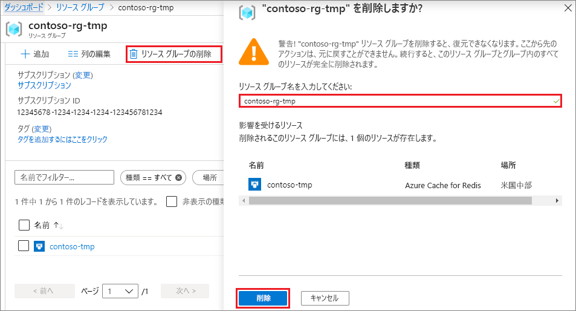

# <a name="quickstart-create-a-python-app-that-uses-azure-cache-for-redis"></a>クイック スタート:Azure Cache for Redis を使用する Python アプリを作成する

この記事では、Azure 内の任意のアプリケーションからアクセスできるセキュリティで保護された専用キャッシュにアクセスするために、Azure Cache for Redis を Python アプリに組み込みます。

## <a name="prerequisites"></a>前提条件

- Azure サブスクリプション - [無料アカウントを作成する](https://azure.microsoft.com/free/)
- [Python 2 または 3](https://www.python.org/downloads/)

## <a name="create-an-azure-cache-for-redis-instance"></a>Azure Cache for Redis インスタンスを作成する
[!INCLUDE [redis-cache-create](../../includes/redis-cache-create.md)]

[!INCLUDE [redis-cache-create](../../includes/redis-cache-access-keys.md)]

## <a name="install-redis-py"></a>redis-py をインストールする

[redis-py](https://github.com/andymccurdy/redis-py) は、Azure Cache for Redis の Python インターフェイスです。 Python パッケージ ツールの *pip* を使用して、コマンド プロンプトから *redis-py* パッケージをインストールします。 

次の例では、Python 3 の *pip3* を使用して、管理者コマンド プロンプトから Windows 10 に *redis-py* をインストールしました。


## <a name="read-and-write-to-the-cache"></a>キャッシュの読み取りと書き込みを実行する

コマンド ラインから Python を実行し、次のコードを使用してキャッシュをテストします。 `<Your Host Name>` と `<Your Access Key>` を、Azure Cache for Redis インスタンスの値に置き換えます。 ホスト名は、 *\<DNS 名>.redis.cache.windows.net* の形式になります。

```python
>>> import redis
>>> r = redis.StrictRedis(host='<Your Host Name>',
        port=6380, db=0, password='<Your Access Key>', ssl=True)
>>> r.set('foo', 'bar')
True
>>> r.get('foo')
b'bar'
```

> [!IMPORTANT]
> Azure Cache for Redis バージョン 3.0 以降では、TLS/SSL 証明書の確認が適用されます。 Azure Cache for Redis に接続するときは、ssl_ca_certs を明示的に設定する必要があります。 RedHat Linux の場合、ssl_ca_certs は */etc/pki/tls/certs/ca-bundle.crt* 証明書モジュールにあります。

## <a name="create-a-python-sample-app"></a>Python サンプル アプリを作成する

新しいテキスト ファイルを作成し、次のスクリプトを追加して、ファイルを *PythonApplication1.py* として保存します。 `<Your Host Name>` と `<Your Access Key>` を、Azure Cache for Redis インスタンスの値に置き換えます。 ホスト名は、 *\<DNS 名>.redis.cache.windows.net* の形式になります。

```python
import redis

myHostname = "<Your Host Name>"
myPassword = "<Your Access Key>"

r = redis.StrictRedis(host=myHostname, port=6380,
                      password=myPassword, ssl=True)

result = r.ping()
print("Ping returned : " + str(result))

result = r.set("Message", "Hello!, The cache is working with Python!")
print("SET Message returned : " + str(result))

result = r.get("Message")
print("GET Message returned : " + result.decode("utf-8"))

result = r.client_list()
print("CLIENT LIST returned : ")
for c in result:
    print("id : " + c['id'] + ", addr : " + c['addr'])
```

Python で *PythonApplication1.py* を実行します。 次の例のような結果が表示されるはずです。


## <a name="clean-up-resources"></a>リソースをクリーンアップする

このクイック スタートで作成した Azure リソース グループとリソースを使い終わった場合は、課金されないようにそれらを削除することができます。

> [!IMPORTANT]
> リソース グループを削除すると元に戻すことはできません。リソース グループとそこに存在するすべてのリソースは完全に削除されます。 保持したい既存のリソース グループに Azure Cache for Redis インスタンスを作成した場合は、キャッシュの **[概要]** ページから **[削除]** を選択して、キャッシュのみを削除できます。 

リソース グループとその Redis Cache for Azure インスタンスを削除するには、次のようにします。

1. [Azure portal](https://portal.azure.com) から、 **[リソース グループ]** を検索して選択します。
1. **[名前でフィルター]** テキストボックスに、キャッシュ インスタンスを含むリソース グループの名前を入力し、検索結果からそれを選択します。 
1. リソース グループ ページで **[リソース グループの削除]** を選択します。
1. リソース グループの名前を入力してから、 **[削除]** を選択します。
   
   

## <a name="next-steps"></a>次のステップ

> [!div class="nextstepaction"]
> [Azure Cache for Redis を使用する単純な ASP.NET Web アプリを作成する](./cache-web-app-howto.md)

