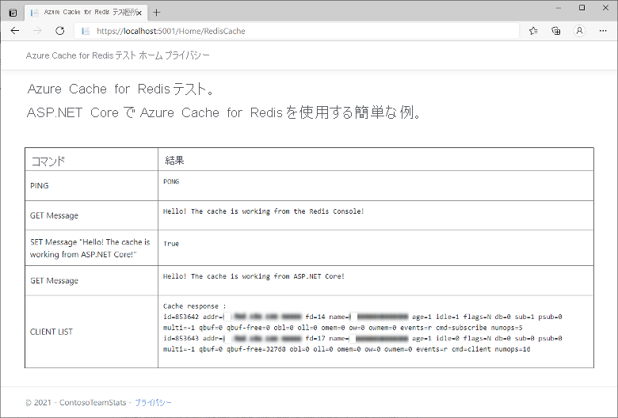

# <a name="quickstart-use-azure-cache-for-redis-with-an-aspnet-core-web-app"></a>クイックスタート: ASP.NET Core Web アプリで Azure Cache for Redis を使用する 

このクイックスタートでは、Azure Cache for Redis を、Azure Cache for Redis に接続してキャッシュからデータを格納および取得する ASP.NET Core Web アプリケーションに組み込みます。

## <a name="skip-to-the-code-on-github"></a>GitHub のコードにスキップする

この記事をスキップしてすぐにコードをご覧になりたい方は、GitHub にある [ASP.NET Core のクイックスタート](https://github.com/Azure-Samples/azure-cache-redis-samples/tree/main/quickstart/aspnet-core)を参照してください。

## <a name="prerequisites"></a>前提条件

- Azure サブスクリプション - [無料アカウントを作成する](https://azure.microsoft.com/free/)
- [.NET Core SDK](https://dotnet.microsoft.com/download)

## <a name="create-a-cache"></a>キャッシュの作成

[!INCLUDE [redis-cache-create](../../includes/redis-cache-create.md)]

[!INCLUDE [redis-cache-access-keys](../../includes/redis-cache-access-keys.md)]

**ホスト名** と **プライマリ** アクセス キーをメモします。 これらの値は、後で *CacheConnection* のシークレットを構築するときに使用します。

## <a name="create-an-aspnet-core-web-app"></a>ASP.NET Core Web アプリを作成する

新しいコマンド ウィンドウを開き、次のコマンドを実行して新しい ASP.NET Core Web アプリを作成します (Model-View-Controller)。

```dotnetcli
dotnet new mvc -o ContosoTeamStats
```

コマンド ウィンドウで、新しい *ContosoTeamStats* プロジェクト ディレクトリに移動します。

[!INCLUDE[Add Secret Manager support to an ASP.NET Core project](../../includes/azure-app-configuration-add-secret-manager.md)]

次のコマンドを実行して、*Microsoft.Extensions.Configuration.UserSecrets* パッケージをプロジェクトに追加します。

```dotnetcli
dotnet add package Microsoft.Extensions.Configuration.UserSecrets
```

次のコマンドを実行して、パッケージを復元します。

```dotnetcli
dotnet restore
```

コマンド ウィンドウで、キャッシュ名とプライマリ アクセス キーのプレースホルダー (角かっこを含む) を置き換えた後、次のコマンドを実行して *CacheConnection* という新しいシークレットを保存します。

```dotnetcli
dotnet user-secrets set CacheConnection "<cache name>.redis.cache.windows.net,abortConnect=false,ssl=true,allowAdmin=true,password=<primary-access-key>"
```

## <a name="configure-the-cache-client"></a>キャッシュ クライアントを構成する

このセクションでは、.NET に [StackExchange.Redis](https://github.com/StackExchange/StackExchange.Redis) クライアントを使用するようにアプリケーションを構成します。

コマンド ウィンドウ内の *ContosoTeamStats* プロジェクト ディレクトリで次のコマンドを実行します。

```dotnetcli
dotnet add package StackExchange.Redis
```

インストールが完了すると、*StackExchange.Redis* キャッシュ クライアントをプロジェクトに使用できるようになります。

## <a name="update-the-homecontroller-and-layout"></a>HomeController と Layout を更新する

次の `using` ステートメントを *Controllers\HomeController.cs* に追加します。

```csharp
using System.Net.Sockets;
using System.Text;
using System.Threading;

using Microsoft.Extensions.Configuration;

using StackExchange.Redis;
```

置換前のコード:

```csharp
private readonly ILogger<HomeController> _logger;

public HomeController(ILogger<HomeController> logger)
{
    _logger = logger;
}
```

次の内容に置き換えます。

```csharp
private readonly ILogger<HomeController> _logger;
private static IConfiguration Configuration { get; set; }

public HomeController(ILogger<HomeController> logger, IConfiguration configuration)
{
    _logger = logger;
    if (Configuration == null)
        Configuration = configuration;
}
```

新しいキャッシュに対していくつかのコマンドを実行する新しい `RedisCache` アクションをサポートするために、次のメンバーを `HomeController` クラスに追加します。

```csharp
public ActionResult RedisCache()
{
    ViewBag.Message = "A simple example with Azure Cache for Redis on ASP.NET Core.";

    IDatabase cache = GetDatabase();

    // Perform cache operations using the cache object...

    // Simple PING command
    ViewBag.command1 = "PING";
    ViewBag.command1Result = cache.Execute(ViewBag.command1).ToString();

    // Simple get and put of integral data types into the cache
    ViewBag.command2 = "GET Message";
    ViewBag.command2Result = cache.StringGet("Message").ToString();

    ViewBag.command3 = "SET Message \"Hello! The cache is working from ASP.NET Core!\"";
    ViewBag.command3Result = cache.StringSet("Message", "Hello! The cache is working from ASP.NET Core!").ToString();

    // Demonstrate "SET Message" executed as expected...
    ViewBag.command4 = "GET Message";
    ViewBag.command4Result = cache.StringGet("Message").ToString();

    // Get the client list, useful to see if connection list is growing...
    // Note that this requires allowAdmin=true in the connection string
    ViewBag.command5 = "CLIENT LIST";
    StringBuilder sb = new StringBuilder();
    var endpoint = (System.Net.DnsEndPoint)GetEndPoints()[0];
    IServer server = GetServer(endpoint.Host, endpoint.Port);
    ClientInfo[] clients = server.ClientList();

    sb.AppendLine("Cache response :");
    foreach (ClientInfo client in clients)
    {
        sb.AppendLine(client.Raw);
    }

    ViewBag.command5Result = sb.ToString();

    return View();
}

private const string SecretName = "CacheConnection";

private static long lastReconnectTicks = DateTimeOffset.MinValue.UtcTicks;
private static DateTimeOffset firstErrorTime = DateTimeOffset.MinValue;
private static DateTimeOffset previousErrorTime = DateTimeOffset.MinValue;

private static readonly object reconnectLock = new object();

// In general, let StackExchange.Redis handle most reconnects,
// so limit the frequency of how often ForceReconnect() will
// actually reconnect.
public static TimeSpan ReconnectMinFrequency => TimeSpan.FromSeconds(60);

// If errors continue for longer than the below threshold, then the
// multiplexer seems to not be reconnecting, so ForceReconnect() will
// re-create the multiplexer.
public static TimeSpan ReconnectErrorThreshold => TimeSpan.FromSeconds(30);

public static int RetryMaxAttempts => 5;

private static Lazy<ConnectionMultiplexer> lazyConnection = CreateConnection();

public static ConnectionMultiplexer Connection
{
    get
    {
        return lazyConnection.Value;
    }
}

private static Lazy<ConnectionMultiplexer> CreateConnection()
{
    return new Lazy<ConnectionMultiplexer>(() =>
    {
        string cacheConnection = Configuration[SecretName];
        return ConnectionMultiplexer.Connect(cacheConnection);
    });
}

private static void CloseConnection(Lazy<ConnectionMultiplexer> oldConnection)
{
    if (oldConnection == null)
        return;

    try
    {
        oldConnection.Value.Close();
    }
    catch (Exception)
    {
        // Example error condition: if accessing oldConnection.Value causes a connection attempt and that fails.
    }
}

/// <summary>
/// Force a new ConnectionMultiplexer to be created.
/// NOTES:
///     1. Users of the ConnectionMultiplexer MUST handle ObjectDisposedExceptions, which can now happen as a result of calling ForceReconnect().
///     2. Don't call ForceReconnect for Timeouts, just for RedisConnectionExceptions or SocketExceptions.
///     3. Call this method every time you see a connection exception. The code will:
///         a. wait to reconnect for at least the "ReconnectErrorThreshold" time of repeated errors before actually reconnecting
///         b. not reconnect more frequently than configured in "ReconnectMinFrequency"
/// </summary>
public static void ForceReconnect()
{
    var utcNow = DateTimeOffset.UtcNow;
    long previousTicks = Interlocked.Read(ref lastReconnectTicks);
    var previousReconnectTime = new DateTimeOffset(previousTicks, TimeSpan.Zero);
    TimeSpan elapsedSinceLastReconnect = utcNow - previousReconnectTime;

    // If multiple threads call ForceReconnect at the same time, we only want to honor one of them.
    if (elapsedSinceLastReconnect < ReconnectMinFrequency)
        return;

    lock (reconnectLock)
    {
        utcNow = DateTimeOffset.UtcNow;
        elapsedSinceLastReconnect = utcNow - previousReconnectTime;

        if (firstErrorTime == DateTimeOffset.MinValue)
        {
            // We haven't seen an error since last reconnect, so set initial values.
            firstErrorTime = utcNow;
            previousErrorTime = utcNow;
            return;
        }

        if (elapsedSinceLastReconnect < ReconnectMinFrequency)
            return; // Some other thread made it through the check and the lock, so nothing to do.

        TimeSpan elapsedSinceFirstError = utcNow - firstErrorTime;
        TimeSpan elapsedSinceMostRecentError = utcNow - previousErrorTime;

        bool shouldReconnect =
            elapsedSinceFirstError >= ReconnectErrorThreshold // Make sure we gave the multiplexer enough time to reconnect on its own if it could.
            && elapsedSinceMostRecentError <= ReconnectErrorThreshold; // Make sure we aren't working on stale data (e.g. if there was a gap in errors, don't reconnect yet).

        // Update the previousErrorTime timestamp to be now (e.g. this reconnect request).
        previousErrorTime = utcNow;

        if (!shouldReconnect)
            return;

        firstErrorTime = DateTimeOffset.MinValue;
        previousErrorTime = DateTimeOffset.MinValue;

        Lazy<ConnectionMultiplexer> oldConnection = lazyConnection;
        CloseConnection(oldConnection);
        lazyConnection = CreateConnection();
        Interlocked.Exchange(ref lastReconnectTicks, utcNow.UtcTicks);
    }
}

// In real applications, consider using a framework such as
// Polly to make it easier to customize the retry approach.
private static T BasicRetry<T>(Func<T> func)
{
    int reconnectRetry = 0;
    int disposedRetry = 0;

    while (true)
    {
        try
        {
            return func();
        }
        catch (Exception ex) when (ex is RedisConnectionException || ex is SocketException)
        {
            reconnectRetry++;
            if (reconnectRetry > RetryMaxAttempts)
                throw;
            ForceReconnect();
        }
        catch (ObjectDisposedException)
        {
            disposedRetry++;
            if (disposedRetry > RetryMaxAttempts)
                throw;
        }
    }
}

public static IDatabase GetDatabase()
{
    return BasicRetry(() => Connection.GetDatabase());
}

public static System.Net.EndPoint[] GetEndPoints()
{
    return BasicRetry(() => Connection.GetEndPoints());
}

public static IServer GetServer(string host, int port)
{
    return BasicRetry(() => Connection.GetServer(host, port));
}
```

*Views\Shared\\_Layout.cshtml* を開きます。

置換前のコード:

```cshtml
<a class="navbar-brand" asp-area="" asp-controller="Home" asp-action="Index">ContosoTeamStats</a>
```

次の内容に置き換えます。

```cshtml
<a class="navbar-brand" asp-area="" asp-controller="Home" asp-action="RedisCache">Azure Cache for Redis Test</a>
```

## <a name="add-a-new-rediscache-view-and-update-the-styles"></a>新しい RedisCache ビューを追加してスタイルを更新する

新しいファイル *Views\Home\RedisCache.cshtml* を作成します。その内容は次のとおりです。

```cshtml
@{
    ViewBag.Title = "Azure Cache for Redis Test";
}

<h2>@ViewBag.Title.</h2>
<h3>@ViewBag.Message</h3>
<br /><br />
<table border="1" cellpadding="10" class="redis-results">
    <tr>
        <th>Command</th>
        <th>Result</th>
    </tr>
    <tr>
        <td>@ViewBag.command1</td>
        <td><pre>@ViewBag.command1Result</pre></td>
    </tr>
    <tr>
        <td>@ViewBag.command2</td>
        <td><pre>@ViewBag.command2Result</pre></td>
    </tr>
    <tr>
        <td>@ViewBag.command3</td>
        <td><pre>@ViewBag.command3Result</pre></td>
    </tr>
    <tr>
        <td>@ViewBag.command4</td>
        <td><pre>@ViewBag.command4Result</pre></td>
    </tr>
    <tr>
        <td>@ViewBag.command5</td>
        <td><pre>@ViewBag.command5Result</pre></td>
    </tr>
</table>
```

*wwwroot\css\site.css* に次の行を追加します。

```css
.redis-results pre {
  white-space: pre-wrap;
}
```

## <a name="run-the-app-locally"></a>アプリをローカルで実行する

コマンド ウィンドウで次のコマンドを実行し、アプリをビルドします。

```dotnetcli
dotnet build
```

次のコマンドを使用してアプリを実行します。

```dotnetcli
dotnet run
```

Web ブラウザーで `https://localhost:5001` を参照します。

Web ページにあるナビゲーション バーの **[Azure Cache for Redis Test]\(Azure Cache for Redis テスト\)** を選択して、キャッシュへのアクセスをテストします。

次の例では、`Message` キーは、前に Azure portal の Redis コンソールを使って設定されたキャッシュ値を持っていたことがわかります。 アプリは、そのキャッシュ値を更新しました。 また、アプリは `PING` および `CLIENT LIST` コマンドも実行しました。



## <a name="clean-up-resources"></a>リソースをクリーンアップする

次のチュートリアルに進む場合は、このクイック スタートで作成したリソースを維持して、再利用することができます。

クイック スタートのサンプル アプリケーションの使用を終える場合は、課金を避けるために、このクイック スタートで作成した Azure リソースを削除することができます。

> [!IMPORTANT]
> リソース グループを削除すると、元に戻すことができません。 リソース グループを削除すると、そのリソース グループ内のすべてのリソースは完全に削除されます。 間違ったリソース グループやリソースをうっかり削除しないようにしてください。 このサンプルのホストとなるリソースを、保持するリソースが含まれている既存のリソース グループ内に作成した場合は、リソース グループを削除するのではなく、個々のブレードから各リソースを個別に削除することができます。

### <a name="to-delete-a-resource-group"></a>リソース グループを削除するには

1. [Azure portal](https://portal.azure.com) にサインインし、 **[リソース グループ]** を選択します。

2. **[名前でフィルター]** ボックスにリソース グループの名前を入力します。 この記事の手順では、*TestResources* という名前のリソース グループを使用しました。 リソース グループの結果一覧で、**[...]** を選択し、**[リソース グループの削除]** を選択します。

    

リソース グループの削除の確認を求めるメッセージが表示されます。 確認のためにリソース グループの名前を入力し、**[削除]** を選択します。

しばらくすると、リソース グループとそのリソースのすべてが削除されます。

## <a name="next-steps"></a>次のステップ

Azure へのデプロイについては、次を参照してください。

> [!div class="nextstepaction"]
> [チュートリアル:Azure App Service での ASP.NET Core および SQL Database アプリの作成](/azure/app-service/tutorial-dotnetcore-sqldb-app)

Azure Key Vault にキャッシュ接続のシークレットを格納する方法の詳細については、次を参照してください。

> [!div class="nextstepaction"]
> [ASP.NET Core の Azure Key Vault 構成プロバイダー](/aspnet/core/security/key-vault-configuration)

下位レベルから上位レベルにキャッシュをスケーリングする場合は、次を参照してください。

> [!div class="nextstepaction"]
> [Azure Cache for Redis のスケーリング方法](./cache-how-to-scale.md)

クラウドの支出を最適化して節約しますか?

> [!div class="nextstepaction"]
> [Cost Management を使用してコスト分析を開始する](../cost-management-billing/costs/quick-acm-cost-analysis.md?WT.mc_id=costmanagementcontent_docsacmhorizontal_-inproduct-learn)
