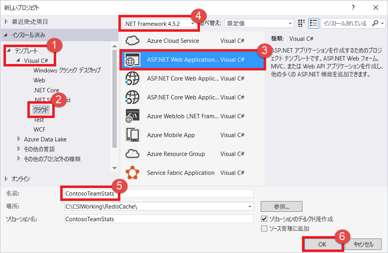
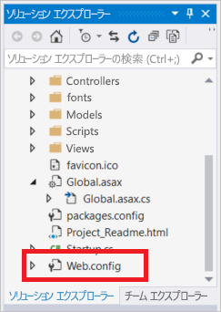
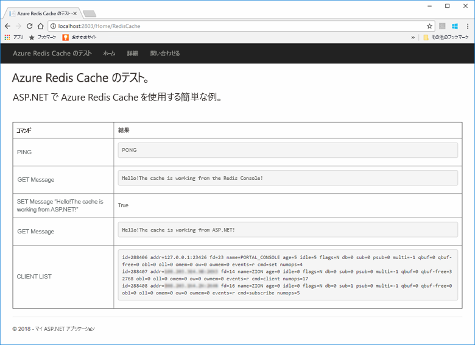
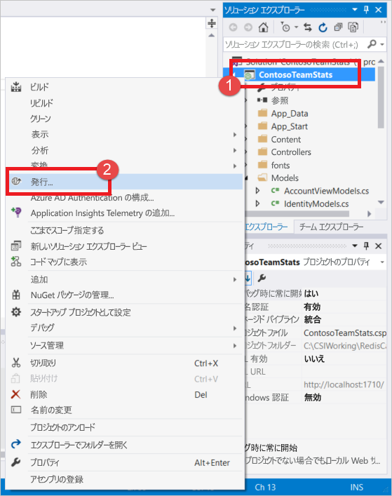
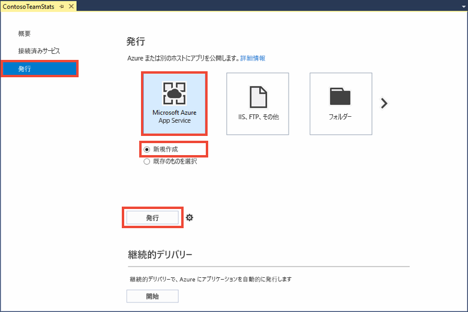
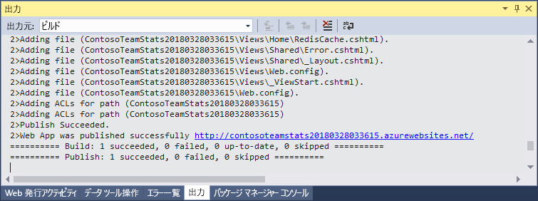
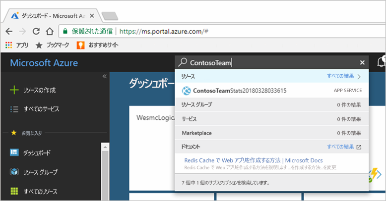
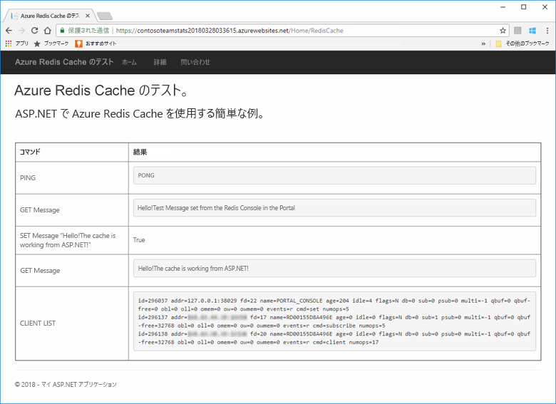

# <a name="quickstart-use-azure-cache-for-redis-with-an-aspnet-web-app"></a>クイックスタート: ASP.NET Web アプリで Azure Cache for Redis を使用する 

このクイック スタートでは、Visual Studio 2019 を使用して、Azure Cache for Redis に接続してキャッシュからデータを格納および取得する ASP.NET Web アプリケーションを作成します。 次に、アプリを Azure App Service にデプロイします。

## <a name="skip-to-the-code-on-github"></a>GitHub のコードにスキップする

この記事をスキップしてすぐにコードをご覧になりたい方は、GitHub にある [ASP.NET のクイックスタート](https://github.com/Azure-Samples/azure-cache-redis-samples/tree/main/quickstart/aspnet)を参照してください。

## <a name="prerequisites"></a>前提条件

- Azure サブスクリプション - [無料アカウントを作成する](https://azure.microsoft.com/free/dotnet)
- **ASP.NET と Web 開発** ワークロードおよび **Azure の開発** ワークロードを含む、[Visual Studio 2019](https://www.visualstudio.com/downloads/)。

## <a name="create-the-visual-studio-project"></a>Visual Studio プロジェクトの作成

1. Visual Studio を開き、 **[ファイル]**  >  **[新規]**  >  **[プロジェクト]** の順に選択します。

2. **[新しいプロジェクトの作成]** ダイアログ ボックスで、次の手順を実行します。

    

    a. 検索ボックスに、「_C# ASP.NET Web アプリケーション_」と入力します。

    b. **[ASP.NET Web アプリケーション (.NET Framework)]** を選択します。

    c. **[次へ]** を選択します。

3. **[プロジェクト名]** ボックスで、プロジェクトに名前を付けます。 この例では、**ContosoTeamStats** という名前を使用しました。

4. **.NET Framework 4.6.1** 以降が選択されていることを確認します。

5. **［作成］** を選択します
   
6. プロジェクトの種類として、 **[MVC]** を選択します。

7. **[認証]** の設定で **[認証なし]** が指定されていることを確認します。 Visual Studio のバージョンによっては、既定の **[認証]** が別の設定になっている場合があります。 これを変更するには、**[認証の変更]**、**[認証なし]** の順に選択します。

8. **[作成]** を選択してプロジェクトを作成します。

## <a name="create-a-cache"></a>キャッシュの作成

次に、アプリ用のキャッシュを作成します。

[!INCLUDE [redis-cache-create](../../includes/redis-cache-create.md)]

[!INCLUDE [redis-cache-access-keys](../../includes/redis-cache-access-keys.md)]

#### <a name="to-edit-the-cachesecretsconfig-file"></a>*CacheSecrets.config* ファイルを編集するには

1. コンピューター上に *CacheSecrets.config* というファイルを作成します。そのファイルをサンプル アプリケーションのソース コードでチェックインされない場所に配置します。 このクイック スタートでは、*CacheSecrets.config* ファイルを *C:\AppSecrets\CacheSecrets.config* に配置します。

1. *CacheSecrets.config* ファイルを編集します。 次の内容を追加します。

    ```xml
    <appSettings>
        <add key="CacheConnection" value="<cache-name>.redis.cache.windows.net,abortConnect=false,ssl=true,allowAdmin=true,password=<access-key>"/>
    </appSettings>
    ```

1. `<cache-name>` は実際のキャッシュ ホスト名に置き換えます。

1. `<access-key>` は、実際のキャッシュのプライマリ キーに置き換えます。

    > [!TIP]
    > セカンダリ アクセス キーは、プライマリ アクセス キーを再生成する間の代替キーとして、キー ローテーションのときに使用できます。
   >
1. ファイルを保存します。

## <a name="update-the-mvc-application"></a>MVC アプリケーションを更新する

このセクションでは、Azure Cache for Redis に対する簡単なテストを表示する新しいビューをサポートするようにアプリケーションを更新します。

* [キャッシュ用のアプリ設定で web.config ファイルを更新する](#update-the-webconfig-file-with-an-app-setting-for-the-cache)
* StackExchange.Redis クライアントを使うようにアプリケーションを構成する
* HomeController と Layout を更新する
* 新しい RedisCache ビューを追加する

### <a name="update-the-webconfig-file-with-an-app-setting-for-the-cache"></a>キャッシュ用のアプリ設定で web.config ファイルを更新する

アプリケーションをローカルで実行すると、*CacheSecrets.config* 内の情報が、Azure Cache for Redis インスタンスへの接続に使われます。 後でこのアプリケーションを Azure にデプロイします。 そのときに、アプリケーションがこのファイルの代わりにキャッシュ接続情報の取得に使用するアプリ設定を Azure 内で構成します。 

*CacheSecrets.config* はアプリケーションと一緒に Azure にデプロイされず、アプリケーションのローカルなテストの間にだけ使われます。 キャッシュ データへの不正アクセスを防ぐため、この情報は可能な限り安全に保持してください。

#### <a name="to-update-the-webconfig-file"></a>*web.config* ファイルを更新するには
1. **ソリューション エクスプローラー** で、*web.config* ファイルをダブルクリックして開きます。

    

2. *web.config* ファイルで `<appSetting>` 要素を見つけます。 次の `file` 属性を追加します。 異なるファイル名または場所を使用した場合は、この例の値を実際の値で置き換えてください。

* 変更前: `<appSettings>`
* 変更後: `<appSettings file="C:\AppSecrets\CacheSecrets.config">`

`<appSettings>` 要素内のマークアップは、ASP.NET ランタイムによって外部ファイルの内容と結合されます。 指定したファイルが見つからない場合、このファイル属性は無視されます。 このアプリケーションのソース コードにシークレット (キャッシュへの接続文字列) は含まれていません。 Web アプリを Azure にデプロイするときに、*CacheSecrets.config* ファイルはデプロイされません。

### <a name="to-configure-the-application-to-use-stackexchangeredis"></a>StackExchange.Redis を使用するようにアプリケーションを構成するには

1. Visual Studio 用の [StackExchange.Redis](https://github.com/StackExchange/StackExchange.Redis) NuGet パッケージを使うようにアプリを構成するには、**[ツール] > [NuGet パッケージ マネージャー] > [パッケージ マネージャー コンソール]** の順に選択します。

2. [`Package Manager Console`] ウィンドウで、次のコマンドを実行します。

    ```powershell
    Install-Package StackExchange.Redis
    ```

3. クライアント アプリケーションから StackExchange.Azure Cache for Redis クライアントを使用して Azure Cache for Redis にアクセスするために必要なアセンブリ参照が NuGet パッケージによってダウンロードされ追加されます。 `StackExchange.Redis` クライアント ライブラリの厳密な名前を持つバージョンを使用する場合は、`StackExchange.Redis.StrongName` パッケージをインストールします。

### <a name="to-update-the-homecontroller-and-layout"></a>HomeController とレイアウトを更新するには

1. **ソリューション エクスプローラー** で **Controllers** フォルダーを展開し、*HomeController.cs* ファイルを開きます。

2. ファイルの先頭に、次の `using` ステートメントを追加します。

    ```csharp
    using StackExchange.Redis;
    using System.Configuration;
    using System.Net.Sockets;
    using System.Text;
    using System.Threading;
    ```

3. 新しいキャッシュに対していくつかのコマンドを実行する新しい `RedisCache` アクションをサポートするために、次のメンバーを `HomeController` クラスに追加します。

    ```csharp
    public ActionResult RedisCache()
    {
        ViewBag.Message = "A simple example with Azure Cache for Redis on ASP.NET.";

        IDatabase cache = GetDatabase();

        // Perform cache operations using the cache object...

        // Simple PING command
        ViewBag.command1 = "PING";
        ViewBag.command1Result = cache.Execute(ViewBag.command1).ToString();

        // Simple get and put of integral data types into the cache
        ViewBag.command2 = "GET Message";
        ViewBag.command2Result = cache.StringGet("Message").ToString();

        ViewBag.command3 = "SET Message \"Hello! The cache is working from ASP.NET!\"";
        ViewBag.command3Result = cache.StringSet("Message", "Hello! The cache is working from ASP.NET!").ToString();

        // Demonstrate "SET Message" executed as expected...
        ViewBag.command4 = "GET Message";
        ViewBag.command4Result = cache.StringGet("Message").ToString();

        // Get the client list, useful to see if connection list is growing...
        // Note that this requires allowAdmin=true in the connection string
        ViewBag.command5 = "CLIENT LIST";
        StringBuilder sb = new StringBuilder();
        var endpoint = (System.Net.DnsEndPoint)GetEndPoints()[0];
        IServer server = GetServer(endpoint.Host, endpoint.Port);
        ClientInfo[] clients = server.ClientList();

        sb.AppendLine("Cache response :");
        foreach (ClientInfo client in clients)
        {
            sb.AppendLine(client.Raw);
        }

        ViewBag.command5Result = sb.ToString();

        return View();
    }

    private static long lastReconnectTicks = DateTimeOffset.MinValue.UtcTicks;
    private static DateTimeOffset firstErrorTime = DateTimeOffset.MinValue;
    private static DateTimeOffset previousErrorTime = DateTimeOffset.MinValue;

    private static readonly object reconnectLock = new object();

    // In general, let StackExchange.Redis handle most reconnects,
    // so limit the frequency of how often ForceReconnect() will
    // actually reconnect.
    public static TimeSpan ReconnectMinFrequency => TimeSpan.FromSeconds(60);

    // If errors continue for longer than the below threshold, then the
    // multiplexer seems to not be reconnecting, so ForceReconnect() will
    // re-create the multiplexer.
    public static TimeSpan ReconnectErrorThreshold => TimeSpan.FromSeconds(30);

    public static int RetryMaxAttempts => 5;

    private static Lazy<ConnectionMultiplexer> lazyConnection = CreateConnection();

    public static ConnectionMultiplexer Connection
    {
        get
        {
            return lazyConnection.Value;
        }
    }

    private static Lazy<ConnectionMultiplexer> CreateConnection()
    {
        return new Lazy<ConnectionMultiplexer>(() =>
        {
            string cacheConnection = ConfigurationManager.AppSettings["CacheConnection"].ToString();
            return ConnectionMultiplexer.Connect(cacheConnection);
        });
    }

    private static void CloseConnection(Lazy<ConnectionMultiplexer> oldConnection)
    {
        if (oldConnection == null)
            return;

        try
        {
            oldConnection.Value.Close();
        }
        catch (Exception)
        {
            // Example error condition: if accessing oldConnection.Value causes a connection attempt and that fails.
        }
    }

    /// <summary>
    /// Force a new ConnectionMultiplexer to be created.
    /// NOTES:
    ///     1. Users of the ConnectionMultiplexer MUST handle ObjectDisposedExceptions, which can now happen as a result of calling ForceReconnect().
    ///     2. Don't call ForceReconnect for Timeouts, just for RedisConnectionExceptions or SocketExceptions.
    ///     3. Call this method every time you see a connection exception. The code will:
    ///         a. wait to reconnect for at least the "ReconnectErrorThreshold" time of repeated errors before actually reconnecting
    ///         b. not reconnect more frequently than configured in "ReconnectMinFrequency"
    /// </summary>
    public static void ForceReconnect()
    {
        var utcNow = DateTimeOffset.UtcNow;
        long previousTicks = Interlocked.Read(ref lastReconnectTicks);
        var previousReconnectTime = new DateTimeOffset(previousTicks, TimeSpan.Zero);
        TimeSpan elapsedSinceLastReconnect = utcNow - previousReconnectTime;

        // If multiple threads call ForceReconnect at the same time, we only want to honor one of them.
        if (elapsedSinceLastReconnect < ReconnectMinFrequency)
            return;

        lock (reconnectLock)
        {
            utcNow = DateTimeOffset.UtcNow;
            elapsedSinceLastReconnect = utcNow - previousReconnectTime;

            if (firstErrorTime == DateTimeOffset.MinValue)
            {
                // We haven't seen an error since last reconnect, so set initial values.
                firstErrorTime = utcNow;
                previousErrorTime = utcNow;
                return;
            }

            if (elapsedSinceLastReconnect < ReconnectMinFrequency)
                return; // Some other thread made it through the check and the lock, so nothing to do.

            TimeSpan elapsedSinceFirstError = utcNow - firstErrorTime;
            TimeSpan elapsedSinceMostRecentError = utcNow - previousErrorTime;

            bool shouldReconnect =
                elapsedSinceFirstError >= ReconnectErrorThreshold // Make sure we gave the multiplexer enough time to reconnect on its own if it could.
                && elapsedSinceMostRecentError <= ReconnectErrorThreshold; // Make sure we aren't working on stale data (e.g. if there was a gap in errors, don't reconnect yet).

            // Update the previousErrorTime timestamp to be now (e.g. this reconnect request).
            previousErrorTime = utcNow;

            if (!shouldReconnect)
                return;

            firstErrorTime = DateTimeOffset.MinValue;
            previousErrorTime = DateTimeOffset.MinValue;

            Lazy<ConnectionMultiplexer> oldConnection = lazyConnection;
            CloseConnection(oldConnection);
            lazyConnection = CreateConnection();
            Interlocked.Exchange(ref lastReconnectTicks, utcNow.UtcTicks);
        }
    }

    // In real applications, consider using a framework such as
    // Polly to make it easier to customize the retry approach.
    private static T BasicRetry<T>(Func<T> func)
    {
        int reconnectRetry = 0;
        int disposedRetry = 0;

        while (true)
        {
            try
            {
                return func();
            }
            catch (Exception ex) when (ex is RedisConnectionException || ex is SocketException)
            {
                reconnectRetry++;
                if (reconnectRetry > RetryMaxAttempts)
                    throw;
                ForceReconnect();
            }
            catch (ObjectDisposedException)
            {
                disposedRetry++;
                if (disposedRetry > RetryMaxAttempts)
                    throw;
            }
        }
    }

    public static IDatabase GetDatabase()
    {
        return BasicRetry(() => Connection.GetDatabase());
    }

    public static System.Net.EndPoint[] GetEndPoints()
    {
        return BasicRetry(() => Connection.GetEndPoints());
    }

    public static IServer GetServer(string host, int port)
    {
        return BasicRetry(() => Connection.GetServer(host, port));
    }
    ```

4. **ソリューション エクスプローラー** で、**[ビュー]** > **[共有]** フォルダーを順に展開します。 次に *_Layout.cshtml ファイル* を開きます。

    置換前のコード:
    
    ```csharp
    @Html.ActionLink("Application name", "Index", "Home", new { area = "" }, new { @class = "navbar-brand" })
    ```

    次の内容に置き換えます。

    ```csharp
    @Html.ActionLink("Azure Cache for Redis Test", "RedisCache", "Home", new { area = "" }, new { @class = "navbar-brand" })
    ```

### <a name="to-add-a-new-rediscache-view"></a>新しい RedisCache ビューを追加するには

1. **ソリューション エクスプローラー** で、**[Views]** フォルダーを展開し、**[Home]** フォルダーを右クリックします。 **[追加]**  >  **[ビュー...]** を選択します。

2. **[ビューの追加]** ダイアログで、ビューの名前に「**RedisCache**」と入力します。 その後、 **[追加]** を選択します。

3. *RedisCache.cshtml* ファイルのコードを次のコードに置き換えます。

    ```csharp
    @{
        ViewBag.Title = "Azure Cache for Redis Test";
    }

    <h2>@ViewBag.Title.</h2>
    <h3>@ViewBag.Message</h3>
    <br /><br />
    <table border="1" cellpadding="10">
        <tr>
            <th>Command</th>
            <th>Result</th>
        </tr>
        <tr>
            <td>@ViewBag.command1</td>
            <td><pre>@ViewBag.command1Result</pre></td>
        </tr>
        <tr>
            <td>@ViewBag.command2</td>
            <td><pre>@ViewBag.command2Result</pre></td>
        </tr>
        <tr>
            <td>@ViewBag.command3</td>
            <td><pre>@ViewBag.command3Result</pre></td>
        </tr>
        <tr>
            <td>@ViewBag.command4</td>
            <td><pre>@ViewBag.command4Result</pre></td>
        </tr>
        <tr>
            <td>@ViewBag.command5</td>
            <td><pre>@ViewBag.command5Result</pre></td>
        </tr>
    </table>
    ```

## <a name="run-the-app-locally"></a>アプリをローカルで実行する

既定では、プロジェクトはテストとデバッグのためにアプリを [IIS Express](/iis/extensions/introduction-to-iis-express/iis-express-overview) にローカルにホストするように構成されます。

### <a name="to-run-the-app-locally"></a>アプリをローカルで実行するには
1. Visual Studio で **[デバッグ]**  >  **[デバッグの開始]** の順に選択してアプリをビルドし、テストとデバッグのためにアプリをローカルで起動します。

2. ブラウザーで、ナビゲーション バーの **[Azure Cache for Redis Test]** を選択します。

3. 次の例では、以前に `Message` キーにキャッシュされた値がありました。この値は、ポータルの Azure Cache for Redis コンソールを使用して設定されています。 アプリは、そのキャッシュ値を更新しました。 また、アプリは `PING` および `CLIENT LIST` コマンドも実行しました。

    

## <a name="publish-and-run-in-azure"></a>Azure に発行して実行する

アプリのローカル テストが正常に終了したら、アプリを Azure にデプロイして、クラウドで実行します。

### <a name="to-publish-the-app-to-azure"></a>アプリを Azure に発行するには

1. Visual Studio で、ソリューション エクスプローラーのプロジェクト ノードを右クリックします。 **[発行]** を選択します。

    

2. **[Microsoft Azure App Service]**、**[新規作成]**、**[発行]** の順に選択します。

    

3. **[App Service の作成]** ダイアログ ボックスで、次のように変更します。

    | 設定 | 推奨値 | 説明 |
    | ------- | :---------------: | ----------- |
    | **アプリ名** | 既定値を使用します。 | アプリ名は、Azure へのデプロイ時にアプリのホスト名になります。 必要に応じて、名前を一意にするためにタイムスタンプのサフィックスが追加される場合があります。 |
    | **[サブスクリプション]**: 。 | Azure サブスクリプションを選択します。 | 関連するホスティング料金は、このサブスクリプションに請求されます。 複数の Azure サブスクリプションがある場合は、適切なサブスクリプションを選択したことを確認します。|
    | **リソース グループ** | キャッシュを作成したものと同じリソース グループを使います (*TestResourceGroup* など)。 | リソース グループは、すべてのリソースをグループとして管理するときに便利です。 後でアプリを削除する必要があるときは、グループを削除するだけで済みます。 |
    | **App Service プラン** | **[新規]** を選択し、*TestingPlan* という名前で新しい App Service プランを作成します。 <br />キャッシュを作成するときに使ったものと同じ **[場所]** を使います。 <br />サイズでは **[Free]** を選びます。 | App Service プランでは、Web アプリを実行するための一連のコンピューティング リソースを定義します。 |

    ![[App Service] ダイアログ ボックス](./media/cache-web-app-howto/cache-create-app-service-dialog.png)

4. App Service のホスティング設定を構成したら、**[作成]** を選択します。

5. Visual Studio の **[出力]** ウィンドウを監視して、発行の状態を確認します。 アプリが発行されると、アプリの URL がログに記録されます。

    

### <a name="add-the-app-setting-for-the-cache"></a>キャッシュ用のアプリの設定を追加する

新しいアプリが発行されたら、新しいアプリの設定を追加します。 この設定は、キャッシュの接続情報を格納するために使われます。 

#### <a name="to-add-the-app-setting"></a>アプリの設定を追加するには 

1. Azure portal の上部にある検索バーにアプリ名を入力し、作成した新しいアプリを検索します。

    

2. キャッシュへの接続に使用する **CacheConnection** という名前の新しいアプリ設定をアプリに追加します。 *CacheSecrets.config* ファイルで `CacheConnection` 用に構成したものと同じ値を使います。 値には、キャッシュのホスト名とアクセス キーが含まれます。

    

### <a name="run-the-app-in-azure"></a>Azure でアプリを実行する

ブラウザーで、アプリの URL にアクセスします。 URL は、Visual Studio 出力ウィンドウの発行操作の結果に表示されます。 Azure portal の作成したアプリの [概要] ページにも表示されます。

ナビゲーション バーの **[Azure Cache for Redis Test]** を選択して、キャッシュへのアクセスをテストします。



## <a name="clean-up-resources"></a>リソースをクリーンアップする

次のチュートリアルに進む場合は、このクイック スタートで作成したリソースを維持して、再利用することができます。

クイック スタートのサンプル アプリケーションの使用を終える場合は、課金を避けるために、このクイック スタートで作成した Azure リソースを削除することができます。 

> [!IMPORTANT]
> リソース グループを削除すると、元に戻すことができません。 リソース グループを削除すると、そのリソース グループ内のすべてのリソースは完全に削除されます。 間違ったリソース グループやリソースをうっかり削除しないようにしてください。 このサンプルのホストとなるリソースを、保持するリソースが含まれている既存のリソース グループ内に作成した場合は、リソース グループを削除するのではなく、個々のブレードから各リソースを個別に削除することができます。

### <a name="to-delete-a-resource-group"></a>リソース グループを削除するには

1. [Azure portal](https://portal.azure.com) にサインインし、 **[リソース グループ]** を選択します。

2. **[名前でフィルター]** ボックスにリソース グループの名前を入力します。 この記事の手順では、*TestResources* という名前のリソース グループを使用しました。 リソース グループの結果一覧で、**[...]** を選択し、**[リソース グループの削除]** を選択します。

    

リソース グループの削除の確認を求めるメッセージが表示されます。 確認のためにリソース グループの名前を入力し、**[削除]** を選択します。

しばらくすると、リソース グループとそのリソースのすべてが削除されます。

## <a name="next-steps"></a>次のステップ

次のチュートリアルでは、より現実的なシナリオで Azure Cache for Redis を使って、アプリのパフォーマンスを向上させます。 このアプリケーションを更新し、ASP.NET とデータベースでキャッシュ アサイド パターンを使ってスコアボードの結果をキャッシュします。

> [!div class="nextstepaction"]
> [ASP.NET でキャッシュ アサイド スコアボードを作成する](cache-web-app-cache-aside-leaderboard.md)