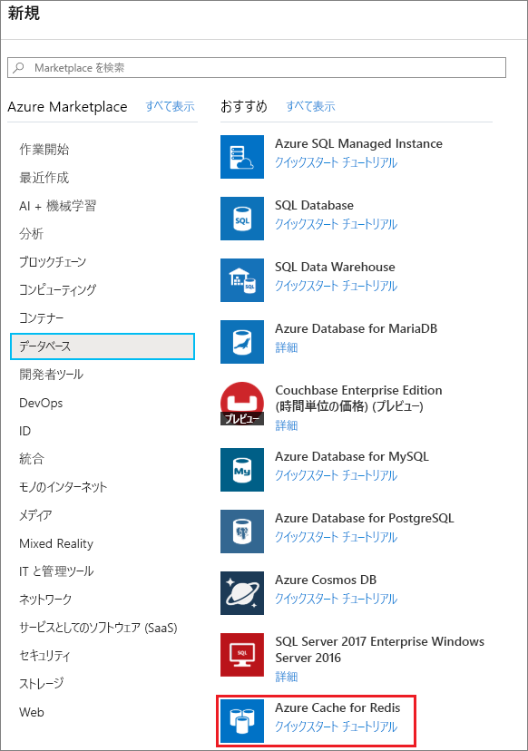
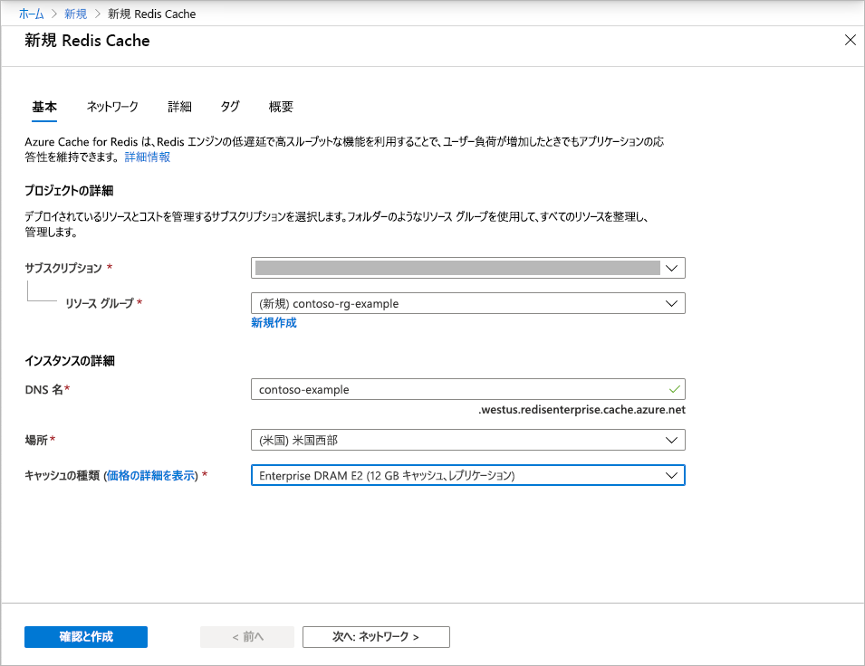
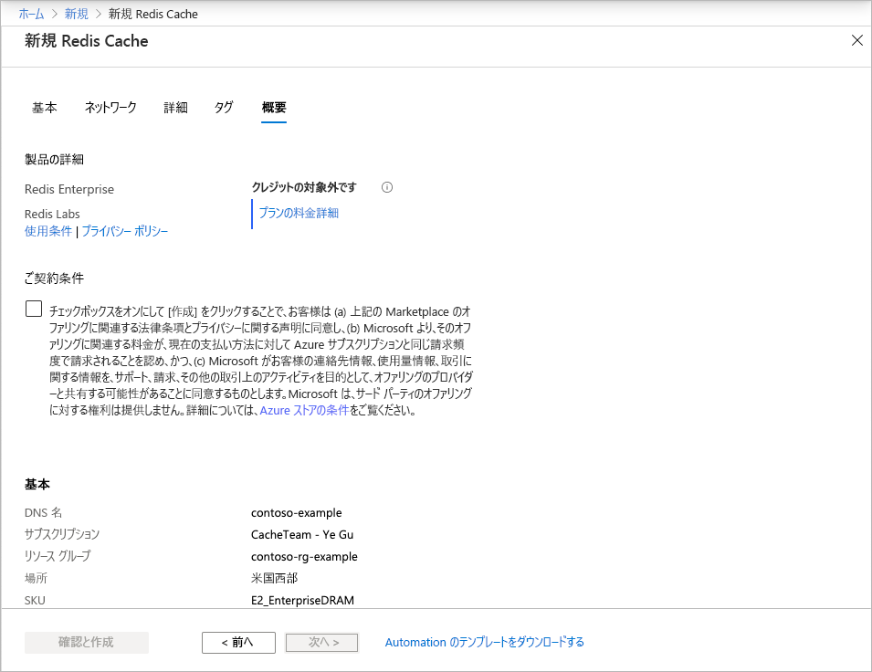

# クイック スタート:Enterprise レベルのキャッシュを作成する (プレビュー)

Azure Cache for Redis の Enterprise レベルは、Azure 上で完全に統合されたマネージド [Redis Enterprise](https://redislabs.com/redis-enterprise/) を提供します。 このレベルは、現在、プレビューとして提供されています。 このプレビューには、次の 2 つの新しいレベルがあります。
* Enterprise。データは、仮想マシンの揮発性メモリ (DRAM) を使用して格納されます
* Enterprise SSD。データは、揮発性メモリと不揮発性メモリ (NVMe) の両方を使用して格納されます。

プレビューに参加するうえで費用はかかりません。 興味がある方は、[Azure Marketplace](https://aka.ms/redispreviewsignup/) の **[連絡する]** からご登録ください。 参加可能人数は非常に限られているため、プレビューへの参加が認められる保証はありません。

## 前提条件

開始する前に、Azure サブスクリプションが必要です。 アカウントがない場合は、最初に[無料アカウント](https://azure.microsoft.com/free/)を作成してください。

## キャッシュの作成
1. キャッシュを作成するには、プレビュー招待内のリンクを使用して Azure portal にサインインし、 **[リソースの作成]** を選択します。

   > [!IMPORTANT] 
   > Marketplace 内の "*Azure Cache for Redis, Enterprise Tiers*" 直接をサブスクライブしないでください。
   > この手順は、Azure Cache for Redis ポータルの UI によって自動的に実行されます。
   >
   
1. **[新規]** ページで、 **[データベース]** を選択し、 **[Azure Cache for Redis]** を選択します。
   
   
   
1. **[新規 Redis Cache]** ページで、新しいキャッシュの設定を構成します。
   
   | 設定      | 推奨値  | 説明 |
   | ------------ |  ------- | -------------------------------------------------- |
   | **サブスクリプション** | ドロップダウンで、ご自身のサブスクリプションを選択します。 | この新しい Azure Cache for Redis インスタンスが作成されるサブスクリプション。 | 
   | **リソース グループ** | ドロップ ダウンでリソース グループを選択するか、 **[新規作成]** を選択し、新しいリソース グループの名前を入力します。 | その中にキャッシュやその他のリソースを作成するリソース グループの名前。 すべてのアプリ リソースを 1 つのリソース グループに配置することで、それらをまとめて簡単に管理または削除できます。 | 
   | **DNS 名** | グローバルに一意の名前を入力します。 | キャッシュ名は 1 から 63 文字の文字列で、数字、英字、ハイフンのみを使用する必要があります。 名前の先頭と末尾には数字または文字を使用する必要があり、連続するハイフンを含めることはできません。 キャッシュ インスタンスの "*ホスト名*" は、 *\<DNS 名>.<Azure region>.redisenterprise.cache.azure.net* になります。 | 
   | **場所** | ドロップ ダウンで場所を選択します。 | Enterprise レベルは、米国西部、米国東部 2、および西ヨーロッパで利用できます。 |
   | **Cache tier (キャッシュ レベル)** | ドロップダウンして、*Enterprise DRAM* または *Enterprise SSD* レベルとサイズを選択します。 |  レベルによって、キャッシュに使用できるのサイズ、パフォーマンス、および機能が決まります。 |
   
    

1. **ネットワーク** を選択してスキップします。

   > [!NOTE] 
   > プライベート リンクのサポートは後で提供されます。
   >

1. **高度** を選択します。
   
   既定の設定をそのまま使用することも、必要に応じて変更することもできます。 **[Allow access only via TLS]\(TLS 経由でのみアクセスを許可する\)** をオンにした場合、アプリケーションから新しいキャッシュにアクセスするために TLS を使用する必要があります。

    

   > [!NOTE] 
   > Enterprise SSD レベルでは Redis モジュールはまだサポートされていません。 Redis モジュールの使用を計画している場合は、必ず Enterprise レベルのキャッシュを選択してください。
   >
   
1. **タグ** を選択してスキップします。

1. **概要** を選択します。

    

1. **[ご契約条件]** の下のチェック ボックスをオンにし、設定を確認して、 **[確認と作成]** を選択します。
   
   キャッシュが作成されるまで、しばらく時間がかかります。 Azure Cache for Redis の **[概要]** ページで進行状況を監視できます。 **[状態]** に "**実行中**" と表示されている場合は、キャッシュを使用する準備ができています。

   > [!NOTE] 
   > Enterprise レベルのキャッシュが作成されてからしばらくすると、"*Azure Cache for Redis, Enterprise Tiers*" を構成するための "**アクションが必要です**" という内容の電子メールが Azure Marketplace から届きます。 このアクションは必要ありません。 その電子メールは無視してかまいません。
   >

## 次のステップ

このクイックスタートでは、Azure Cache for Redis の Enterprise レベルのインスタンスを作成する方法について学習しました。

> [!div class="nextstepaction"]
> [Azure Cache for Redis を使用する ASP.NET Web アプリを作成する](./cache-web-app-howto.md)

