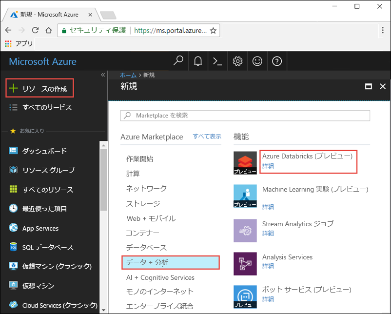
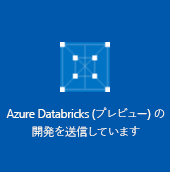
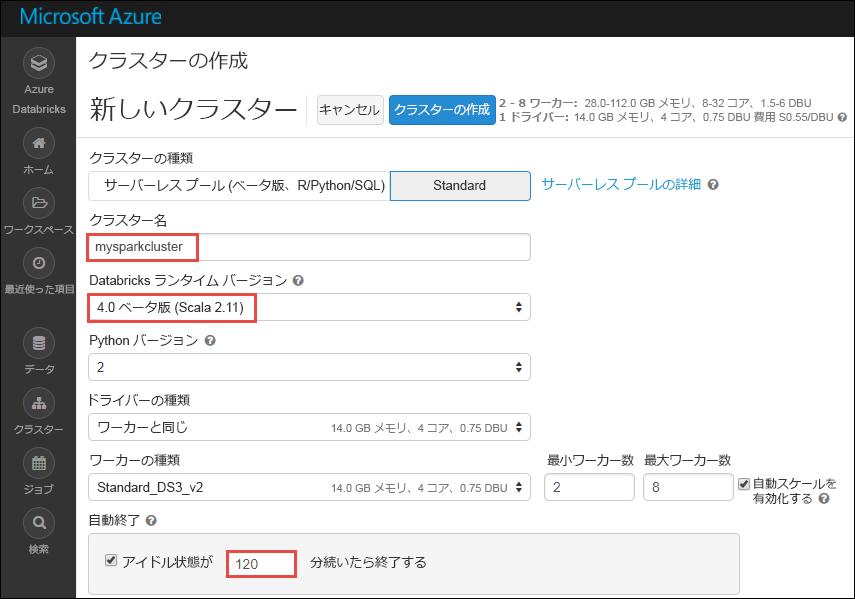
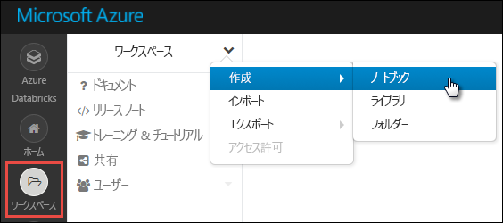
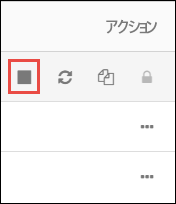

# チュートリアル: Azure Databricks を使用したストリーミング データに対する感情分析

このチュートリアルでは、Azure Databricks を使用して、データ ストリームに対し、ほぼリアルタイムで感情分析を実行する方法について説明します。 Azure Event Hubs を使用して、データ インジェスト システムを設定します。 Spark Event Hubs コネクタを使用して Event Hubs から Azure Databricks にメッセージを読み取ります。 そして、Microsoft Cognitive Services API を使用して、ストリーム配信されたデータに対して感情分析を実行します。

このチュートリアルの完了時には、内容に用語 "Azure" が含まれたツイートを Twitter からストリーム配信し、それらのツイートに対して感情分析を実行することになります。

次の図に、アプリケーション フローを示します。

このチュートリアルに含まれるタスクは次のとおりです。

> [!div class="checklist"]
> * Azure Databricks ワークスペースを作成する
> * Azure Databricks で Spark クラスターを作成する
> * ストリーミング データにアクセスする Twitter アプリを作成する
> * Azure Databricks でノートブックを作成する
> * Event Hubs と Twitter API のライブラリをアタッチする
> * Microsoft Cognitive Services アカウントを作成し、アクセス キーを取得する
> * ツイートを Event Hubs に送信する
> * Event Hubs からツイートを読み取る
> * ツイートに対して感情分析を実行する

Azure サブスクリプションをお持ちでない場合は、開始する前に[無料アカウントを作成](https://azure.microsoft.com/free/)してください。

## 前提条件

このチュートリアルを開始する前に、次の要件を満たしてください。
- Azure Event Hubs 名前空間。
- 名前空間内のイベント ハブ。
- Event Hubs 名前空間にアクセスするための接続文字列。 接続文字列は次のような形式になります。`Endpoint=sb://<namespace>.servicebus.windows.net/;SharedAccessKeyName=<key name>;SharedAccessKey=<key value>`
- Event Hubs の共有アクセス ポリシー名とポリシー キー。

これらの要件は、[Azure Event Hubs 名前空間とイベント ハブの作成](../event-hubs/event-hubs-create.md)に関する記事の手順を完了することで満たせます。

## Azure Portal にログインする

[Azure Portal](https://portal.azure.com/) にログインします。

## Azure Databricks ワークスペースを作成する

このセクションでは、Azure Portal を使って Azure Databricks ワークスペースを作成します。

1. Azure Portal で、**[リソースの作成]** > **[データ + 分析]** > **[Azure Databricks]** の順に選択します。

    

3. **[Azure Databricks サービス]** で値を指定して、Databricks ワークスペースを作成します。

    

    次の値を指定します。

    |プロパティ  |[説明]  |
    |---------|---------|
    |**[ワークスペース名]**     | Databricks ワークスペースの名前を指定します        |
    |**サブスクリプション**     | ドロップダウンから Azure サブスクリプションを選択します。        |
    |**[リソース グループ]**     | 新しいリソース グループを作成するか、既存のリソース グループを使用するかを指定します。 リソース グループは、Azure ソリューションの関連するリソースを保持するコンテナーです。 詳しくは、[Azure リソース グループの概要](../azure-resource-manager/resource-group-overview.md)に関するページをご覧ください。 |
    |**場所**     | **[米国東部 2]** を選択します。 使用可能な他のリージョンについては、「[リージョン別の利用可能な製品](https://azure.microsoft.com/regions/services/)」をご覧ください。        |
    |**価格レベル**     |  **Standard** と **Premium** のいずれかを選択します。 これらのレベルの詳細については、[Databricks の価格に関するページ](https://azure.microsoft.com/pricing/details/databricks/)を参照してください。       |

    **[ダッシュボードにピン留めする]** チェック ボックスをオンにして、**[作成]** を選択します。

4. アカウントの作成には数分かかります。 アカウント作成時に、ポータルの右側に **[Submitting deployment for Azure Databricks]\(Azure Databricks のデプロイを送信しています\)** タイルが表示されます。 このタイルを表示するために、ダッシュボードを右へスクロールしなければならない場合があります。 スクリーンの上部に進行状況バーも表示されます。 いずれかの領域で進行状況を確認できます。

    

## Databricks に Spark クラスターを作成する

1. Azure Portal で、作成した Databricks ワークスペースに移動して、**[Launch Workspace]\(ワークスペースの起動\)** を選択します。

2. Azure Databricks ポータルにリダイレクトされます。 ポータルで **[クラスター]** を選択します。

    

3. **[New cluster]\(新しいクラスター\)** ページで、クラスターを作成するための値を指定します。

    

    以下を除くすべての値は、既定値のままにします。

    * クラスターの名前を入力します。
    * この記事では、**4.0 (ベータ)** ランタイムを使用してクラスターを作成します。
    * **[Terminate after ____ minutes of inactivity]\(アクティビティが ____ 分ない場合は終了する\)** チェック ボックスをオンにします。 クラスターが使われていない場合にクラスターを終了するまでの時間 (分単位) を指定します。

    **[クラスターの作成]** を選択します。 クラスターが実行されたら、ノートブックをクラスターにアタッチして、Spark ジョブを実行できます。

## Twitter アプリケーションを作成する

ツイートのストリームを受け取るには、Twitter でアプリケーションを作成する必要があります。 手順に従って Twitter アプリケーションを作成し、このチュートリアルの完了に必要な値を記録してください。

1. Web ブラウザーで [Twitter アプリケーション管理](https://apps.twitter.com/)に移動して、**[Create New App]\(新しいアプリの作成\)** を選択します。

    

2. **[Create an application]\(アプリケーションの作成\)** ページで新しいアプリの詳細を入力し、**[Create your Twitter application]\(Twitter アプリケーションの作成\)** を選択します。

    

3. アプリケーションのページで **[Keys and Access Tokens]\(キーとアクセス トークン\)** タブを選択し、**[Consumer Key]\(コンシューマー キー\)** と **[Consumer Secret]\(コンシューマー シークレット\)** の値をコピーします。 さらに、**[Create my access token]\(アクセス トークンの作成\)** を選択してアクセス トークンを生成します。 **[Access Token]\(アクセス トークン\)** と **[Access Token Secret]\(アクセス トークン シークレット\)** の値をコピーします。

    

Twitter アプリケーションについて取得した値を保存します。 値は、このチュートリアルの後の方で必要になります。

## ライブラリを Spark クラスターにアタッチする

このチュートリアルでは、Twitter API を使用してツイートを Event Hubs に送信します。 さらに、[Apache Spark Event Hubs コネクタ](https://github.com/Azure/azure-event-hubs-spark)を使用して、Azure Event Hubs に対するデータの読み取りと書き込みを行います。 これらの API をクラスターの一部として使用するには、それらをライブラリとして Azure Databricks に追加し、Spark クラスターに関連付けます。 次の手順では、ワークスペースの **[共有]** フォルダーにライブラリを追加する方法について説明します。

1.  Azure Databricks ワークスペースで **[ワークスペース]** を選択し、**[共有]** を右クリックします。 コンテキスト メニューで **[作成]** > **[ライブラリ]** の順に選択します。

    ![[ライブラリの追加] ダイアログ ボックス](./media/databricks-sentiment-analysis-cognitive-services/databricks-add-library-option.png "[ライブラリの追加] ダイアログ ボックス")

2. [新しいライブラリ] ページの **[ソース]** で、**[Maven Coordinate]\(Maven 座標\)** を選択します。 **[座標]** には、追加したいパッケージの座標を入力します。 ここでは、このチュートリアルで使用するライブラリの Maven 座標です。

    * Spark Event Hubs コネクタ - `com.microsoft.azure:azure-eventhubs-spark_2.11:2.3.1`
    * Twitter API - `org.twitter4j:twitter4j-core:4.0.6`

    

3. **[ライブラリの作成]** を選択します。

4. ライブラリを追加したフォルダーを選択し、ライブラリ名を選択します。

    

5. ライブラリのページで、ライブラリを使用するクラスターを選択します。 ライブラリとクラスターの関連付けに成功したら、状態はすぐに **[接続済み]** に変わります。

    

6. Twitter パッケージ `twitter4j-core:4.0.6` について、これらの手順を繰り返します。

## Cognitive Services のアクセス キーを取得する

このチュートリアルでは、[Microsoft Cognitive Services Text Analytics API](../cognitive-services/text-analytics/overview.md) を使用して、ツイートのストリームに対し、ほぼリアルタイムで感情分析を実行します。 API を使用する前に、Azure で Microsoft Cognitive Services アカウントを作成し、Text Analytics API を使用するためのアクセス キーを取得する必要があります。

1. [Azure Portal](https://portal.azure.com/) にサインインします。

2. **[+ リソースの作成]** を選択します。

3. Azure Marketplace で、**[AI + Cognitive Services]** > **[Text Analytics API]** の順に選択します。

    

4. **[作成]** ダイアログ ボックスで、次の値を入力します。

    

    - Cognitive Services アカウントの名前を入力します。
    - アカウントが作成される Azure サブスクリプションを選択します。
    - Azure の場所を選択します。
    - サービスの価格レベルを選択します。 Cognitive Services の価格の詳細については、[料金ページ](https://azure.microsoft.com/pricing/details/cognitive-services/)を参照してください。
    - 新しいリソース グループを作成するか、既存のリソース グループを選択するかを指定します。

    **作成**を選択します。

5. アカウントの作成後、**[概要]** タブで **[アクセス キーを表示]** を選択します。

    

    さらに、スクリーンショットに示されているようにエンドポイント URL の一部をコピーします。 この URL はチュートリアルで必要になります。

6. **[キーの管理]** で、使用したいキーのコピー アイコンを選択します。

    

7. この手順で取得したエンドポイント URL とアクセス キーの値を保存します。 これは、このチュートリアルで後ほど必要になります。

## Databricks でノートブックを作成する

このセクションでは、次の名前を使用して、Databricks ワークスペース内に 2 つのノートブックを作成します

- **SendTweetsToEventHub** - Twitter からツイートを取得し、Event Hubs にそれらをストリーム配信するために使用されるプロデューサー ノートブック。
- **AnalyzeTweetsFromEventHub** - Event Hubs からのツイートの読み取りと感情分析の実行に使用されるコンシューマー ノートブック。

1. 左側のウィンドウで、**[ワークスペース]** を選択します。 **[ワークスペース]** ドロップダウンの **[作成]** を選択して、**[ノートブック]** を選択します。

    

2. **[Create Notebook]\(ノートブックの作成\)** ダイアログ ボックスに「**SendTweetsToEventHub**」と入力し、言語として **[Scala]** を選んで、前に作成した Spark クラスターを選びます。

    

    **作成**を選択します。

3. 手順を繰り返して **AnalyzeTweetsFromEventHub** ノートブックを作成します。

## ツイートを Event Hubs に送信する

**SendTweetsToEventHub** ノートブックで次のコードを貼り付けて、プレースホルダーを、先ほど作成した Event Hubs 名前空間と Twitter アプリケーションの値に置き換えます。 このノートブックによって、キーワード "Azure" が含まれたツイートがリアルタイムで Event Hubs にストリーム配信されます。

    import java.util._
    import scala.collection.JavaConverters._
    import com.microsoft.azure.eventhubs._
    import java.util.concurrent._

    val namespaceName = "<EVENT HUBS NAMESPACE>"
    val eventHubName = "<EVENT HUB NAME>"
    val sasKeyName = "<POLICY NAME>"
    val sasKey = "<POLICY KEY>"
    val connStr = new ConnectionStringBuilder()
                .setNamespaceName(namespaceName)
                .setEventHubName(eventHubName)
                .setSasKeyName(sasKeyName)
                .setSasKey(sasKey)

    val pool = Executors.newFixedThreadPool(1)
    val eventHubClient = EventHubClient.create(connStr.toString(), pool)

    def sendEvent(message: String) = {
      val messageData = EventData.create(message.getBytes("UTF-8"))
      eventHubClient.get().send(messageData)
      System.out.println("Sent event: " + message + "\n")
    }

    import twitter4j._
    import twitter4j.TwitterFactory
    import twitter4j.Twitter
    import twitter4j.conf.ConfigurationBuilder

    // Twitter configuration!
    // Replace values below with yours

    val twitterConsumerKey = "<CONSUMER KEY>"
    val twitterConsumerSecret = "<CONSUMER SECRET>"
    val twitterOauthAccessToken = "<ACCESS TOKEN>"
    val twitterOauthTokenSecret = "<TOKEN SECRET>"

    val cb = new ConfigurationBuilder()
      cb.setDebugEnabled(true)
      .setOAuthConsumerKey(twitterConsumerKey)
      .setOAuthConsumerSecret(twitterConsumerSecret)
      .setOAuthAccessToken(twitterOauthAccessToken)
      .setOAuthAccessTokenSecret(twitterOauthTokenSecret)

    val twitterFactory = new TwitterFactory(cb.build())
    val twitter = twitterFactory.getInstance()

    // Getting tweets with keyword "Azure" and sending them to the Event Hub in realtime!

    val query = new Query(" #Azure ")
    query.setCount(100)
    query.lang("en")
    var finished = false
    while (!finished) {
      val result = twitter.search(query)
      val statuses = result.getTweets()
      var lowestStatusId = Long.MaxValue
      for (status <- statuses.asScala) {
        if(!status.isRetweet()){
          sendEvent(status.getText())
        }
        lowestStatusId = Math.min(status.getId(), lowestStatusId)
        Thread.sleep(2000)
      }
      query.setMaxId(lowestStatusId - 1)
    }

    // Closing connection to the Event Hub
    eventHubClient.get().close()

ノートブックを実行するには、**Shift + Enter** キーを押します。 次のスニペットに示されているような出力が表示されます。 出力の各イベントは、Event Hubs に取り込まれたツイートです。

    Sent event: @Microsoft and @Esri launch Geospatial AI on Azure https://t.co/VmLUCiPm6q via @geoworldmedia #geoai #azure #gis #ArtificialIntelligence

    Sent event: Public preview of Java on App Service, built-in support for Tomcat and OpenJDK
    https://t.co/7vs7cKtvah
    #cloudcomputing #Azure

    Sent event: 4 Killer #Azure Features for #Data #Performance https://t.co/kpIb7hFO2j by @RedPixie

    Sent event: Migrate your databases to a fully managed service with Azure SQL Database Managed Instance | #Azure | #Cloud https://t.co/sJHXN4trDk

    Sent event: Top 10 Tricks to #Save Money with #Azure Virtual Machines https://t.co/F2wshBXdoz #Cloud

    ...
    ...

## Event Hubs からツイートを読み取る

**AnalyzeTweetsFromEventHub** ノートブックで次のコードを貼り付けて、プレースホルダーを、先ほど作成した Azure Event Hubs の値に置き換えます。 このノートブックによって、先ほど **SendTweetsToEventHub** ノートブックを使用して Event Hubs にストリーム配信したツイートが読み取られます。

    import org.apache.spark.eventhubs._

    // Build connection string with the above information
    val connectionString = ConnectionStringBuilder("<EVENT HUBS CONNECTION STRING>")
      .setEventHubName("<EVENT HUB NAME>")
      .build

    val customEventhubParameters =
      EventHubsConf(connectionString)
      .setMaxEventsPerTrigger(5)

    val incomingStream = spark.readStream.format("eventhubs").options(customEventhubParameters.toMap).load()

    incomingStream.printSchema

    // Sending the incoming stream into the console.
    // Data comes in batches!
    incomingStream.writeStream.outputMode("append").format("console").option("truncate", false).start().awaitTermination()

次の出力が得られます。

    root
     |-- body: binary (nullable = true)
     |-- offset: long (nullable = true)
     |-- seqNumber: long (nullable = true)
     |-- enqueuedTime: long (nullable = true)
     |-- publisher: string (nullable = true)
     |-- partitionKey: string (nullable = true)

    -------------------------------------------
    Batch: 0
    -------------------------------------------
    +------+------+--------------+---------------+---------+------------+
    |body  |offset|sequenceNumber|enqueuedTime   |publisher|partitionKey|
    +------+------+--------------+---------------+---------+------------+
    |[50 75 62 6C 69 63 20 70 72 65 76 69 65 77 20 6F 66 20 4A 61 76 61 20 6F 6E 20 41 70 70 20 53 65 72 76 69 63 65 2C 20 62 75 69 6C 74 2D 69 6E 20 73 75 70 70 6F 72 74 20 66 6F 72 20 54 6F 6D 63 61 74 20 61 6E 64 20 4F 70 65 6E 4A 44 4B 0A 68 74 74 70 73 3A 2F 2F 74 2E 63 6F 2F 37 76 73 37 63 4B 74 76 61 68 20 0A 23 63 6C 6F 75 64 63 6F 6D 70 75 74 69 6E 67 20 23 41 7A 75 72 65]                              |0     |0             |2018-03-09 05:49:08.86 |null     |null        |
    |[4D 69 67 72 61 74 65 20 79 6F 75 72 20 64 61 74 61 62 61 73 65 73 20 74 6F 20 61 20 66 75 6C 6C 79 20 6D 61 6E 61 67 65 64 20 73 65 72 76 69 63 65 20 77 69 74 68 20 41 7A 75 72 65 20 53 51 4C 20 44 61 74 61 62 61 73 65 20 4D 61 6E 61 67 65 64 20 49 6E 73 74 61 6E 63 65 20 7C 20 23 41 7A 75 72 65 20 7C 20 23 43 6C 6F 75 64 20 68 74 74 70 73 3A 2F 2F 74 2E 63 6F 2F 73 4A 48 58 4E 34 74 72 44 6B]            |168   |1             |2018-03-09 05:49:24.752|null     |null        |
    +------+------+--------------+---------------+---------+------------+

    -------------------------------------------
    Batch: 1
    -------------------------------------------
    ...
    ...

出力はバイナリ モードのため、次のスニペットを使用して文字列に変換します。

    import org.apache.spark.sql.types._
    import org.apache.spark.sql.functions._

    // Event Hub message format is JSON and contains "body" field
    // Body is binary, so we cast it to string to see the actual content of the message
    val messages =
      incomingStream
      .withColumn("Offset", $"offset".cast(LongType))
      .withColumn("Time (readable)", $"enqueuedTime".cast(TimestampType))
      .withColumn("Timestamp", $"enqueuedTime".cast(LongType))
      .withColumn("Body", $"body".cast(StringType))
      .select("Offset", "Time (readable)", "Timestamp", "Body")

    messages.printSchema

    messages.writeStream.outputMode("append").format("console").option("truncate", false).start().awaitTermination()

これで、次のようなスニペットが出力されます。

    root
     |-- Offset: long (nullable = true)
     |-- Time (readable): timestamp (nullable = true)
     |-- Timestamp: long (nullable = true)
     |-- Body: string (nullable = true)

    -------------------------------------------
    Batch: 0
    -------------------------------------------
    +------+-----------------+----------+-------+
    |Offset|Time (readable)  |Timestamp |Body
    +------+-----------------+----------+-------+
    |0     |2018-03-09 05:49:08.86 |1520574548|Public preview of Java on App Service, built-in support for Tomcat and OpenJDK
    https://t.co/7vs7cKtvah
    #cloudcomputing #Azure          |
    |168   |2018-03-09 05:49:24.752|1520574564|Migrate your databases to a fully managed service with Azure SQL Database Managed Instance | #Azure | #Cloud https://t.co/sJHXN4trDk    |
    |0     |2018-03-09 05:49:02.936|1520574542|@Microsoft and @Esri launch Geospatial AI on Azure https://t.co/VmLUCiPm6q via @geoworldmedia #geoai #azure #gis #ArtificialIntelligence|
    |176   |2018-03-09 05:49:20.801|1520574560|4 Killer #Azure Features for #Data #Performance https://t.co/kpIb7hFO2j by @RedPixie                                                    |
    +------+-----------------+----------+-------+
    -------------------------------------------
    Batch: 1
    -------------------------------------------
    ...
    ...

これで、Apache Spark 用の Event Hubs コネクタを使用して、Azure Event Hubs から Azure Databricks にデータをほぼリアルタイムでストリーム配信できました。 Spark 用の Event Hubs コネクタを使用する方法の詳細については、[コネクタに関するドキュメント](https://github.com/Azure/azure-event-hubs-spark/tree/master/docs)を参照してください。

## ツイートに対して感情分析を実行する

このセクションでは、Twitter API を使用して受信されたツイートに対して感情分析を実行します。 このセクションでは同じ **AnalyzeTweetsFromEventHub** ノートブックにコード スニペットを追加します。

まず、ノートブックに新しいコード セルを追加し、下記のコード スニペットを貼り付けます。 このコード スニペットでは、言語およびセンチメント API で扱うデータ型を定義します。

    import java.io._
    import java.net._
    import java.util._

    class Document(var id: String, var text: String, var language: String = "", var sentiment: Double = 0.0) extends Serializable

    class Documents(var documents: List[Document] = new ArrayList[Document]()) extends Serializable {

        def add(id: String, text: String, language: String = "") {
            documents.add (new Document(id, text, language))
        }
        def add(doc: Document) {
            documents.add (doc)
        }
    }

新しいコード セルを追加して、下記のコード スニペットを貼り付けます。 このコード スニペットは、JSON 文字列の解析に必要です。

    class CC[T] extends Serializable { def unapply(a:Any):Option[T] = Some(a.asInstanceOf[T]) }
    object M extends CC[scala.collection.immutable.Map[String, Any]]
    object L extends CC[scala.collection.immutable.List[Any]]
    object S extends CC[String]
    object D extends CC[Double]

新しいコード セルを追加して、下記のスニペットを貼り付けます。 このスニペットでは、Text Analysis API を呼び出す関数が含まれたオブジェクトを定義します。この Text Analysis API が言語検出と感情分析を実行します。 プレースホルダー `<PROVIDE ACCESS KEY HERE>` および `<PROVIDE HOST HERE>` は、Cognitive Services アカウントに関して取得した値に置き換えてください。

    import javax.net.ssl.HttpsURLConnection
    import com.google.gson.Gson
    import com.google.gson.GsonBuilder
    import com.google.gson.JsonObject
    import com.google.gson.JsonParser
    import scala.util.parsing.json._

    object SentimentDetector extends Serializable {

      // Cognitive Services API connection settings
      val accessKey = "<PROVIDE ACCESS KEY HERE>"
      val host = "<PROVIDE HOST HERE>"
      val languagesPath = "/text/analytics/v2.0/languages"
      val sentimentPath = "/text/analytics/v2.0/sentiment"
      val languagesUrl = new URL(host+languagesPath)
      val sentimenUrl = new URL(host+sentimentPath)

      def getConnection(path: URL): HttpsURLConnection = {
        val connection = path.openConnection().asInstanceOf[HttpsURLConnection]
        connection.setRequestMethod("POST")
        connection.setRequestProperty("Content-Type", "text/json")
        connection.setRequestProperty("Ocp-Apim-Subscription-Key", accessKey)
        connection.setDoOutput(true)
        return connection
      }

      def prettify (json_text: String): String = {
        val parser = new JsonParser()
        val json = parser.parse(json_text).getAsJsonObject()
        val gson = new GsonBuilder().setPrettyPrinting().create()
        return gson.toJson(json)
      }

      // Handles the call to Cognitive Services API.
      // Expects Documents as parameters and the address of the API to call.
      // Returns an instance of Documents in response.
      def processUsingApi(inputDocs: Documents, path: URL): String = {
        val docText = new Gson().toJson(inputDocs)
        val encoded_text = docText.getBytes("UTF-8")
        val connection = getConnection(path)
        val wr = new DataOutputStream(connection.getOutputStream())
        wr.write(encoded_text, 0, encoded_text.length)
        wr.flush()
        wr.close()

        val response = new StringBuilder()
        val in = new BufferedReader(new InputStreamReader(connection.getInputStream()))
        var line = in.readLine()
        while (line != null) {
            response.append(line)
            line = in.readLine()
        }
        in.close()
        return response.toString()
      }

      // Calls the language API for specified documents.
      // Returns a documents with language field set.
      def getLanguage (inputDocs: Documents): Documents = {
        try {
          val response = processUsingApi(inputDocs, languagesUrl)
          // In case we need to log the json response somewhere
          val niceResponse = prettify(response)
          val docs = new Documents()
          val result = for {
                // Deserializing the JSON response from the API into Scala types
                Some(M(map)) <- scala.collection.immutable.List(JSON.parseFull(niceResponse))
                L(documents) = map("documents")
                M(document) <- documents
                S(id) = document("id")
                L(detectedLanguages) = document("detectedLanguages")
                M(detectedLanguage) <- detectedLanguages
                S(language) = detectedLanguage("iso6391Name")
          } yield {
                docs.add(new Document(id = id, text = id, language = language))
          }
          return docs
        } catch {
              case e: Exception => return new Documents()
        }
      }

      // Calls the sentiment API for specified documents. Needs a language field to be set for each of them.
      // Returns documents with sentiment field set, taking a value in the range from 0 to 1.
      def getSentiment (inputDocs: Documents): Documents = {
        try {
          val response = processUsingApi(inputDocs, sentimenUrl)
          val niceResponse = prettify(response)
          val docs = new Documents()
          val result = for {
                // Deserializing the JSON response from the API into Scala types
                Some(M(map)) <- scala.collection.immutable.List(JSON.parseFull(niceResponse))
                L(documents) = map("documents")
                M(document) <- documents
                S(id) = document("id")
                D(sentiment) = document("score")
          } yield {
                docs.add(new Document(id = id, text = id, sentiment = sentiment))
          }
          return docs
        } catch {
            case e: Exception => return new Documents()
        }
      }
    }

    // User Defined Function for processing content of messages to return their sentiment.
    val toSentiment = udf((textContent: String) => {
      val inputDocs = new Documents()
      inputDocs.add (textContent, textContent)
      val docsWithLanguage = SentimentDetector.getLanguage(inputDocs)
      val docsWithSentiment = SentimentDetector.getSentiment(docsWithLanguage)
      if (docsWithLanguage.documents.isEmpty) {
        // Placeholder value to display when unable to perform sentiment request for text in unknown language
        (-1).toDouble
      } else {
        docsWithSentiment.documents.get(0).sentiment.toDouble
      }
    })

最後のコード セルを追加して、ツイートの内容とツイートに関連付けられた感情が含まれたデータフレームを準備します。

    // Prepare a dataframe with Content and Sentiment columns
    val streamingDataFrame = incomingStream.selectExpr("cast (body as string) AS Content").withColumn("Sentiment", toSentiment($"Content"))

    // Display the streaming data with the sentiment
    streamingDataFrame.writeStream.outputMode("append").format("console").option("truncate", false).start().awaitTermination()

次のスニペットのような出力が表示されます。

    -------------------------------------------
    Batch: 0
    -------------------------------------------
    +--------------------------------+------------------+
    |Content                         |Sentiment         |
    +--------------------------------+------------------+
    |Public preview of Java on App Service, built-in support for Tomcat and OpenJDK
    https://t.co/7vs7cKtvah   #cloudcomputing #Azure          |0.7761918306350708|
    |Migrate your databases to a fully managed service with Azure SQL Database Managed Instance | #Azure | #Cloud https://t.co/sJHXN4trDk    |0.8558163642883301|
    |@Microsoft and @Esri launch Geospatial AI on Azure https://t.co/VmLUCiPm6q via @geoworldmedia #geoai #azure #gis #ArtificialIntelligence|0.5               |
    |4 Killer #Azure Features for #Data #Performance https://t.co/kpIb7hFO2j by @RedPixie                                                    |0.5               |
    +--------------------------------+------------------+

**1** に近い値が **Sentiment** 列に含まれていることは、Azure でのエクスペリエンスが優れていることを示唆します。 **0** に近い値は、Microsoft Azure での作業中にユーザーが問題に直面したことを示唆します。

これで完了です。 Azure Databricks を使用して、Azure Event Hubs にデータをストリーム配信し、Event Hubs コネクタによってデータ ストリームを読み取り、ストリーミング データに対し、ほぼリアルタイムで感情分析を実行することができました。

## リソースのクリーンアップ

チュートリアルの実行が完了したら、クラスターを終了できます。 そのためには、Azure Databricks ワークスペースの左側のウィンドウで、**[クラスター]** を選択します。 終了するクラスターで、**[アクション]** 列の下にある省略記号をポイントし、**[終了]** アイコンを選択します。

クラスター作成時に **[Terminate after __ minutes of inactivity]\(アクティビティが __ 分ない場合は終了する\)** チェック ボックスをオンにしていた場合、手動で終了しなくともクラスターは自動で停止します。 このような場合、クラスターは、一定の時間だけ非アクティブな状態が続くと自動的に停止します。

## 次の手順
このチュートリアルでは、Azure Databricks を使用して、データを Azure Event Hubs にストリーム配信し、Event Hubs からストリーミング データをリアルタイムで読み取る方法について説明しました。 以下の方法について学習しました。
> [!div class="checklist"]
> * Azure Databricks ワークスペースを作成する
> * Azure Databricks で Spark クラスターを作成する
> * ストリーミング データにアクセスする Twitter アプリを作成する
> * Azure Databricks でノートブックを作成する
> * Event Hubs と Twitter API のライブラリを追加およびアタッチする
> * Microsoft Cognitive Services アカウントを作成し、アクセス キーを取得する
> * ツイートを Event Hubs に送信する
> * Event Hubs からツイートを読み取る
> * ツイートに対して感情分析を実行する

次のチュートリアルに進み、Azure Databricks を使用して機械学習タスクを実行する方法について学習してください。

> [!div class="nextstepaction"]
>[Azure Databricks を使用した機械学習 ](https://docs.azuredatabricks.net/spark/latest/mllib/decision-trees.html)
