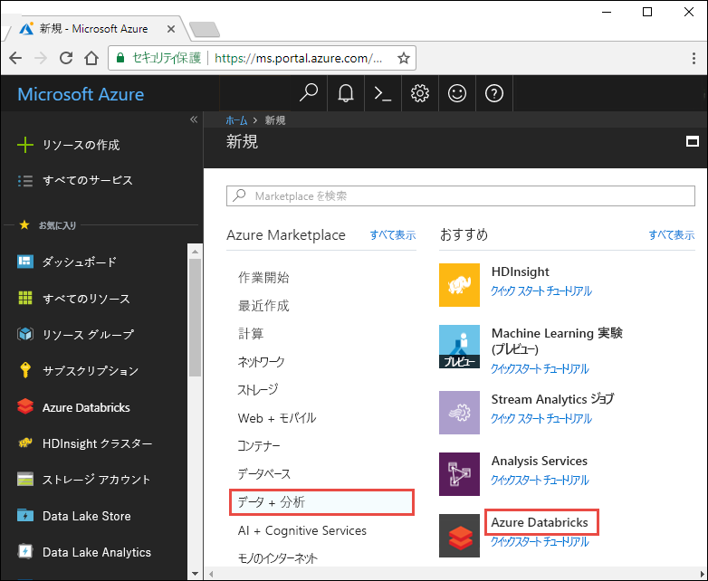
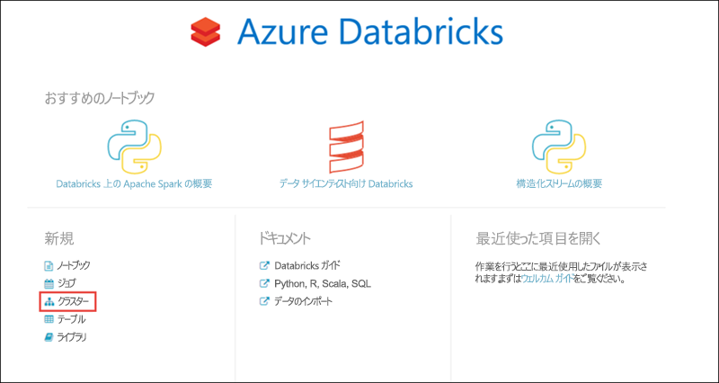

# <a name="tutorial-stream-data-into-azure-databricks-using-event-hubs"></a>チュートリアル:Event Hubs を使用してデータを Azure Databricks にストリーム配信する

> [!IMPORTANT]
> このチュートリアルでは、Azure Databricks Runtime のバージョン 5.2 を使用します。

このチュートリアルでは、データ インジェスト システムを Azure Databricks に接続し、ほぼリアルタイムで Apache Spark クラスターにデータをストリーム配信します。 Azure Event Hubs を使用してデータ インジェスト システムを設定し、それを Azure Databricks に接続して、届いたメッセージを処理します。 データ ストリームにアクセスするために、Twitter API を使用してツイートを Event Hubs に取り込みます。 Azure Databricks にデータを用意したら、分析ジョブを実行してデータをさらに分析できます。

このチュートリアルの完了時には、内容に用語 "Azure" が含まれたツイートを Twitter からストリーム配信し、そのツイートを Azure Databricks で読み取ることができるようになります。

次の図に、アプリケーション フローを示します。


このチュートリアルに含まれるタスクは次のとおりです。

> [!div class="checklist"]
> * Azure Databricks ワークスペースを作成する
> * Azure Databricks で Spark クラスターを作成する
> * ストリーミング データにアクセスする Twitter アプリを作成する
> * Azure Databricks でノートブックを作成する
> * Event Hubs と Twitter API のライブラリをアタッチする
> * ツイートを Event Hubs に送信する
> * Event Hubs からツイートを読み取る

Azure サブスクリプションをお持ちでない場合は、開始する前に[無料アカウントを作成](https://azure.microsoft.com/free/)してください。

> [!Note]
> **Azure 無料試用版サブスクリプション**を使用してこのチュートリアルを実行することはできません。
> 無料アカウントを使用して Azure Databricks クラスターを作成するには、クラスターを作成する前に、プロファイルにアクセスし、サブスクリプションを**従量課金制**に変更します。 詳細については、[Azure 無料アカウント](https://azure.microsoft.com/free/)に関するページをご覧ください。

## <a name="prerequisites"></a>前提条件

このチュートリアルを開始する前に、次の要件を満たしてください。
- Azure Event Hubs 名前空間。
- 名前空間内のイベント ハブ。
- Event Hubs 名前空間にアクセスするための接続文字列。 接続文字列は次のような形式になります。`Endpoint=sb://<namespace>.servicebus.windows.net/;SharedAccessKeyName=<key name>;SharedAccessKey=<key value>`
- Event Hubs の共有アクセス ポリシー名とポリシー キー。

これらの要件は、[Azure Event Hubs 名前空間とイベント ハブの作成](../event-hubs/event-hubs-create.md)に関する記事の手順を完了することで満たせます。

## <a name="sign-in-to-the-azure-portal"></a>Azure portal にサインインします

[Azure Portal](https://portal.azure.com/) にサインインします。

## <a name="create-an-azure-databricks-workspace"></a>Azure Databricks ワークスペースを作成する

このセクションでは、Azure Portal を使って Azure Databricks ワークスペースを作成します。

1. Azure Portal で、 **[リソースの作成]**  >  **[データ + 分析]**  >  **[Azure Databricks]** の順に選択します。

    

3. **[Azure Databricks サービス]** で値を指定して、Databricks ワークスペースを作成します。

    

    次の値を指定します。

    |プロパティ  |説明  |
    |---------|---------|
    |**ワークスペース名**     | Databricks ワークスペースの名前を指定します        |
    |**サブスクリプション**     | ドロップダウンから Azure サブスクリプションを選択します。        |
    |**リソース グループ**     | 新しいリソース グループを作成するか、既存のリソース グループを使用するかを指定します。 リソース グループは、Azure ソリューションの関連するリソースを保持するコンテナーです。 詳しくは、[Azure リソース グループの概要](../azure-resource-manager/resource-group-overview.md)に関するページをご覧ください。 |
    |**場所**     | **[米国東部 2]** を選択します。 使用可能な他のリージョンについては、「[リージョン別の利用可能な製品](https://azure.microsoft.com/regions/services/)」をご覧ください。        |
    |**価格レベル**     |  **Standard** と **Premium** のいずれかを選択します。 これらのレベルの詳細については、[Databricks の価格に関するページ](https://azure.microsoft.com/pricing/details/databricks/)を参照してください。       |

    **[ダッシュボードにピン留めする]** チェック ボックスをオンにして、 **[作成]** を選択します。

4. アカウントの作成には数分かかります。 アカウント作成時に、ポータルの右側に **[Submitting deployment for Azure Databricks]\(Azure Databricks のデプロイを送信しています\)** タイルが表示されます。 このタイルを表示するために、ダッシュボードを右へスクロールしなければならない場合があります。 スクリーンの上部に進行状況バーも表示されます。 いずれかの領域で進行状況を確認できます。

    

## <a name="create-a-spark-cluster-in-databricks"></a>Databricks に Spark クラスターを作成する

1. Azure Portal で、作成した Databricks ワークスペースに移動して、 **[Launch Workspace]\(ワークスペースの起動\)** を選択します。

2. Azure Databricks ポータルにリダイレクトされます。 ポータルで **[クラスター]** を選択します。

    

3. **[New cluster]\(新しいクラスター\)** ページで、クラスターを作成するための値を指定します。

    

    以下を除くすべての値は、既定値のままにします。

   * クラスターの名前を入力します。
   * この記事では、**5.2** ランタイムを使用してクラスターを作成します。
   * **[Terminate after \_\_ minutes of inactivity]** \(アクティビティが \_\_ 分ない場合は終了する\) チェック ボックスをオンにします。 クラスターが使われていない場合にクラスターを終了するまでの時間 (分単位) を指定します。

   技術的条件と[予算](https://azure.microsoft.com/en-us/pricing/details/databricks/)に適したクラスター ワーカーとドライバー ノードのサイズを選択します。

     **[クラスターの作成]** を選択します。 クラスターが実行されたら、ノートブックをクラスターにアタッチして、Spark ジョブを実行できます。

## <a name="create-a-twitter-application"></a>Twitter アプリケーションを作成する

ツイートのストリームを受け取るには、Twitter でアプリケーションを作成します。 手順に従って Twitter アプリケーションを作成し、このチュートリアルの完了に必要な値を記録します。

1. Web ブラウザーで [Twitter の開発者用ページ](https://developer.twitter.com/en/apps)に移動して、 **[Create an app]\(アプリの作成\)** を選択します。 Twitter 開発者アカウントを申請する必要があるというメッセージが表示される場合があります。 お気軽にお申し込みください。申請が承認されると、確認メールを受け取ります。 開発者アカウントの承認には、数日かかることがあります。

    

2. **[Create an application]\(アプリケーションの作成\)** ページで新しいアプリの詳細を入力し、 **[Create your Twitter application]\(Twitter アプリケーションの作成\)** を選択します。

    

    

3. アプリケーションのページで **[Keys and Tokens]\(キーとトークン\)** タブを選択し、 **[Consumer API Key]\(コンシューマー API キー\)** と **[Consumer API Secret Key]\(コンシューマー API シークレット キー\)** の値をコピーします。 さらに、 **[Access Token and Access Token Secret]\(アクセス トークンとアクセス トークン シークレット\)** の下の **[Create]\(作成\)** を選択して、アクセス トークンを生成します。 **[Access Token]\(アクセス トークン\)** と **[Access Token Secret]\(アクセス トークン シークレット\)** の値をコピーします。

    

Twitter アプリケーションについて取得した値を保存します。 値は、このチュートリアルの後の方で必要になります。

## <a name="attach-libraries-to-spark-cluster"></a>ライブラリを Spark クラスターにアタッチする

このチュートリアルでは、Twitter API を使用してツイートを Event Hubs に送信します。 さらに、[Apache Spark Event Hubs コネクタ](https://github.com/Azure/azure-event-hubs-spark)を使用して、Azure Event Hubs に対するデータの読み取りと書き込みを行います。 これらの API をクラスターの一部として使用するには、それらをライブラリとして Azure Databricks に追加し、Spark クラスターに関連付けます。 次の手順は、ライブラリを追加する方法を示しています。

1. Azure Databricks ワークスペースで **[クラスター]** を選択し、既存の Spark クラスターを選択します。 クラスター メニューで、 **[ライブラリ]** を選択し、 **[新規インストール]** をクリックします。

   ![[ライブラリの追加] ダイアログ ボックス](./media/databricks-stream-from-eventhubs/databricks-add-library-locate-cluster.png "[ライブラリの追加] でのクラスターの検索")

   ![[ライブラリの追加] ダイアログ ボックス](./media/databricks-stream-from-eventhubs/databricks-add-library-install-new.png "[ライブラリの追加] での新規インストール")

2. [新しいライブラリ] ページの **[ソース]** で、 **[Maven]** を選択します。 **[座標]** では、追加したいパッケージの **[パッケージの検索]** をクリックします。 ここでは、このチュートリアルで使用するライブラリの Maven 座標です。

   * Spark Event Hubs コネクタ - `com.microsoft.azure:azure-eventhubs-spark_2.11:2.3.10`
   * Twitter API - `org.twitter4j:twitter4j-core:4.0.7`

     

     

3. **[インストール]** を選択します。

4. クラスター メニューで、両方のライブラリが正しくインストールされ、アタッチされていることを確認します。

    

6. Twitter パッケージ `twitter4j-core:4.0.7` について、これらの手順を繰り返します。

## <a name="create-notebooks-in-databricks"></a>Databricks でノートブックを作成する

このセクションでは、次の名前を使用して、Databricks ワークスペース内に 2 つのノートブックを作成します。

- **SendTweetsToEventHub** - Twitter からツイートを取得し、Event Hubs にそれらをストリーム配信するために使用されるプロデューサー ノートブック。
- **ReadTweetsFromEventHub** - Event Hubs からツイートを読み取るために使用されるコンシューマー ノートブック。

1. 左側のウィンドウで、 **[ワークスペース]** を選択します。 **[ワークスペース]** ドロップダウンで、 **[作成]**  >  **[ノートブック]** の順に選択します。

    

2. **[Create Notebook]\(ノートブックの作成\)** ダイアログ ボックスに「**SendTweetsToEventHub**」と入力し、言語として **[Scala]** を選んで、前に作成した Spark クラスターを選びます。

    

    **作成** を選択します。

3. 手順を繰り返して **ReadTweetsFromEventHub** ノートブックを作成します。

## <a name="send-tweets-to-event-hubs"></a>ツイートを Event Hubs に送信する

**SendTweetsToEventHub** ノートブックで次のコードを貼り付けて、プレースホルダーを、先ほど作成した Event Hubs 名前空間と Twitter アプリケーションの値に置き換えます。 このノートブックによって、キーワード "Azure" が含まれたツイートがリアルタイムで Event Hubs にストリーム配信されます。

> [!NOTE]
> Twitter API には、特定の要求の制限と[クォータ](https://developer.twitter.com/en/docs/basics/rate-limiting.html)があります。 Twitter API の標準のレート制限では不足の場合、この例では Twitter API を使用せずにテキスト コンテンツを生成できます。 そうするには、変数 **dataSource** を `twitter` ではなく `test` に設定し、リスト **testSource** に適切なテスト入力を設定します。

```scala
    import scala.collection.JavaConverters._
    import com.microsoft.azure.eventhubs._
    import java.util.concurrent._
    import scala.collection.immutable._
    import scala.concurrent.Future
    import scala.concurrent.ExecutionContext.Implicits.global

    val namespaceName = "<EVENT HUBS NAMESPACE>"
    val eventHubName = "<EVENT HUB NAME>"
    val sasKeyName = "<POLICY NAME>"
    val sasKey = "<POLICY KEY>"
    val connStr = new ConnectionStringBuilder()
                .setNamespaceName(namespaceName)
                .setEventHubName(eventHubName)
                .setSasKeyName(sasKeyName)
                .setSasKey(sasKey)

    val pool = Executors.newScheduledThreadPool(1)
    val eventHubClient = EventHubClient.create(connStr.toString(), pool)

    def sleep(time: Long): Unit = Thread.sleep(time)

    def sendEvent(message: String, delay: Long) = {
      sleep(delay)
      val messageData = EventData.create(message.getBytes("UTF-8"))
      eventHubClient.get().send(messageData)
      System.out.println("Sent event: " + message + "\n")
    }

    // Add your own values to the list
    val testSource = List("Azure is the greatest!", "Azure isn't working :(", "Azure is okay.")

    // Specify 'test' if you prefer to not use Twitter API and loop through a list of values you define in `testSource`
    // Otherwise specify 'twitter'
    val dataSource = "test"

    if (dataSource == "twitter") {

      import twitter4j._
      import twitter4j.TwitterFactory
      import twitter4j.Twitter
      import twitter4j.conf.ConfigurationBuilder

      // Twitter configuration!
      // Replace values below with you

      val twitterConsumerKey = "<CONSUMER API KEY>"
      val twitterConsumerSecret = "<CONSUMER API SECRET>"
      val twitterOauthAccessToken = "<ACCESS TOKEN>"
      val twitterOauthTokenSecret = "<TOKEN SECRET>"

      val cb = new ConfigurationBuilder()
        cb.setDebugEnabled(true)
        .setOAuthConsumerKey(twitterConsumerKey)
        .setOAuthConsumerSecret(twitterConsumerSecret)
        .setOAuthAccessToken(twitterOauthAccessToken)
        .setOAuthAccessTokenSecret(twitterOauthTokenSecret)

      val twitterFactory = new TwitterFactory(cb.build())
      val twitter = twitterFactory.getInstance()

      // Getting tweets with keyword "Azure" and sending them to the Event Hub in realtime!
      val query = new Query(" #Azure ")
      query.setCount(100)
      query.lang("en")
      var finished = false
      while (!finished) {
        val result = twitter.search(query)
        val statuses = result.getTweets()
        var lowestStatusId = Long.MaxValue
        for (status <- statuses.asScala) {
          if(!status.isRetweet()){
            sendEvent(status.getText(), 5000)
          }
          lowestStatusId = Math.min(status.getId(), lowestStatusId)
        }
        query.setMaxId(lowestStatusId - 1)
      }

    } else if (dataSource == "test") {
      // Loop through the list of test input data
      while (true) {
        testSource.foreach {
          sendEvent(_,5000)
        }
      }

    } else {
      System.out.println("Unsupported Data Source. Set 'dataSource' to \"twitter\" or \"test\"")
    }

    // Closing connection to the Event Hub
    eventHubClient.get().close()
```

ノートブックを実行するには、**Shift + Enter** キーを押します。 以下のようなスニペットが出力されます。 出力の各イベントは、用語 "Azure" が含まれているため Event Hubs に取り込まれたツイートです。

    Sent event: @Microsoft and @Esri launch Geospatial AI on Azure https://t.co/VmLUCiPm6q via @geoworldmedia #geoai #azure #gis #ArtificialIntelligence

    Sent event: Public preview of Java on App Service, built-in support for Tomcat and OpenJDK
    https://t.co/7vs7cKtvah
    #cloudcomputing #Azure

    Sent event: 4 Killer #Azure Features for #Data #Performance https://t.co/kpIb7hFO2j by @RedPixie

    Sent event: Migrate your databases to a fully managed service with Azure SQL Database Managed Instance | #Azure | #Cloud https://t.co/sJHXN4trDk

    Sent event: Top 10 Tricks to #Save Money with #Azure Virtual Machines https://t.co/F2wshBXdoz #Cloud

    ...
    ...

## <a name="read-tweets-from-event-hubs"></a>Event Hubs からツイートを読み取る

**ReadTweetsFromEventHub** ノートブックで次のコードを貼り付けて、プレースホルダーを、先ほど作成した Azure Event Hubs の値に置き換えます。 このノートブックによって、先ほど **SendTweetsToEventHub** ノートブックを使用して Event Hubs にストリーム配信したツイートが読み取られます。

```scala

    import org.apache.spark.eventhubs._
    import com.microsoft.azure.eventhubs._

    // Build connection string with the above information
    val namespaceName = "<EVENT HUBS NAMESPACE>"
    val eventHubName = "<EVENT HUB NAME>"
    val sasKeyName = "<POLICY NAME>"
    val sasKey = "<POLICY KEY>"
    val connStr = new com.microsoft.azure.eventhubs.ConnectionStringBuilder()
                .setNamespaceName(namespaceName)
                .setEventHubName(eventHubName)
                .setSasKeyName(sasKeyName)
                .setSasKey(sasKey)

    val customEventhubParameters =
      EventHubsConf(connStr.toString())
      .setMaxEventsPerTrigger(5)

    val incomingStream = spark.readStream.format("eventhubs").options(customEventhubParameters.toMap).load()

    incomingStream.printSchema

    // Sending the incoming stream into the console.
    // Data comes in batches!
    incomingStream.writeStream.outputMode("append").format("console").option("truncate", false).start().awaitTermination()
```

次の出力が得られます。


    root
     |-- body: binary (nullable = true)
     |-- offset: long (nullable = true)
     |-- seqNumber: long (nullable = true)
     |-- enqueuedTime: long (nullable = true)
     |-- publisher: string (nullable = true)
     |-- partitionKey: string (nullable = true)

    -------------------------------------------
    Batch: 0
    -------------------------------------------
    +------+------+--------------+---------------+---------+------------+
    |body  |offset|sequenceNumber|enqueuedTime   |publisher|partitionKey|
    +------+------+--------------+---------------+---------+------------+
    |[50 75 62 6C 69 63 20 70 72 65 76 69 65 77 20 6F 66 20 4A 61 76 61 20 6F 6E 20 41 70 70 20 53 65 72 76 69 63 65 2C 20 62 75 69 6C 74 2D 69 6E 20 73 75 70 70 6F 72 74 20 66 6F 72 20 54 6F 6D 63 61 74 20 61 6E 64 20 4F 70 65 6E 4A 44 4B 0A 68 74 74 70 73 3A 2F 2F 74 2E 63 6F 2F 37 76 73 37 63 4B 74 76 61 68 20 0A 23 63 6C 6F 75 64 63 6F 6D 70 75 74 69 6E 67 20 23 41 7A 75 72 65]                              |0     |0             |2018-03-09 05:49:08.86 |null     |null        |
    |[4D 69 67 72 61 74 65 20 79 6F 75 72 20 64 61 74 61 62 61 73 65 73 20 74 6F 20 61 20 66 75 6C 6C 79 20 6D 61 6E 61 67 65 64 20 73 65 72 76 69 63 65 20 77 69 74 68 20 41 7A 75 72 65 20 53 51 4C 20 44 61 74 61 62 61 73 65 20 4D 61 6E 61 67 65 64 20 49 6E 73 74 61 6E 63 65 20 7C 20 23 41 7A 75 72 65 20 7C 20 23 43 6C 6F 75 64 20 68 74 74 70 73 3A 2F 2F 74 2E 63 6F 2F 73 4A 48 58 4E 34 74 72 44 6B]            |168   |1             |2018-03-09 05:49:24.752|null     |null        |
    +------+------+--------------+---------------+---------+------------+

    -------------------------------------------
    Batch: 1
    -------------------------------------------
    ...
    ...

出力はバイナリ モードのため、次のスニペットを使用して文字列に変換します。

```scala
    import org.apache.spark.sql.types._
    import org.apache.spark.sql.functions._

    // Event Hub message format is JSON and contains "body" field
    // Body is binary, so we cast it to string to see the actual content of the message
    val messages =
      incomingStream
      .withColumn("Offset", $"offset".cast(LongType))
      .withColumn("Time (readable)", $"enqueuedTime".cast(TimestampType))
      .withColumn("Timestamp", $"enqueuedTime".cast(LongType))
      .withColumn("Body", $"body".cast(StringType))
      .select("Offset", "Time (readable)", "Timestamp", "Body")

    messages.printSchema

    messages.writeStream.outputMode("append").format("console").option("truncate", false).start().awaitTermination()
```

これで、次のようなスニペットが出力されます。

    root
     |-- Offset: long (nullable = true)
     |-- Time (readable): timestamp (nullable = true)
     |-- Timestamp: long (nullable = true)
     |-- Body: string (nullable = true)

    -------------------------------------------
    Batch: 0
    -------------------------------------------
    +------+-----------------+----------+-------+
    |Offset|Time (readable)  |Timestamp |Body
    +------+-----------------+----------+-------+
    |0     |2018-03-09 05:49:08.86 |1520574548|Public preview of Java on App Service, built-in support for Tomcat and OpenJDK
    https://t.co/7vs7cKtvah
    #cloudcomputing #Azure          |
    |168   |2018-03-09 05:49:24.752|1520574564|Migrate your databases to a fully managed service with Azure SQL Database Managed Instance | #Azure | #Cloud https://t.co/sJHXN4trDk    |
    |0     |2018-03-09 05:49:02.936|1520574542|@Microsoft and @Esri launch Geospatial AI on Azure https://t.co/VmLUCiPm6q via @geoworldmedia #geoai #azure #gis #ArtificialIntelligence|
    |176   |2018-03-09 05:49:20.801|1520574560|4 Killer #Azure Features for #Data #Performance https://t.co/kpIb7hFO2j by @RedPixie                                                    |
    +------+-----------------+----------+-------+
    -------------------------------------------
    Batch: 1
    -------------------------------------------
    ...
    ...

これで完了です。 Azure Databricks を使用して、データを Azure Event Hubs にほぼリアルタイムで正常にストリーム配信できました。 次に、Apache Spark 用の Event Hubs コネクタを使用してストリーム データを読み取りました。 Spark 用の Event Hubs コネクタを使用する方法の詳細については、[コネクタに関するドキュメント](https://github.com/Azure/azure-event-hubs-spark/tree/master/docs)を参照してください。

## <a name="clean-up-resources"></a>リソースのクリーンアップ

チュートリアルの実行が完了したら、クラスターを終了できます。 そのためには、Azure Databricks ワークスペースの左側のウィンドウで、 **[クラスター]** を選択します。 終了するクラスターで、 **[アクション]** 列の下にある省略記号をポイントし、 **[終了]** アイコンを選択します。


クラスター作成時に **[Terminate after \_\_ minutes of inactivity]** \(アクティビティが \_\_ 分ない場合は終了する\) チェック ボックスをオンにしていた場合、手動で終了しなくともクラスターは自動で停止します。 このような場合、クラスターは、一定の時間だけ非アクティブな状態が続くと自動的に停止します。

## <a name="next-steps"></a>次の手順
このチュートリアルで学習した内容は次のとおりです。

> [!div class="checklist"]
> * Azure Databricks ワークスペースを作成する
> * Azure Databricks で Spark クラスターを作成する
> * ストリーミング データを生成する Twitter アプリを作成する
> * Azure Databricks でノートブックを作成する
> * Event Hubs と Twitter API のライブラリを追加する
> * ツイートを Event Hubs に送信する
> * Event Hubs からツイートを読み取る

次のチュートリアルに進み、Azure Databricks と [Cognitive Services API](../cognitive-services/text-analytics/overview.md) を使用して、ストリーム配信されたデータに対して感情分析を実行する方法について学習してください。

> [!div class="nextstepaction"]
>[Azure Databricks を使用した、ストリーミング データに対する感情分析](databricks-sentiment-analysis-cognitive-services.md)
