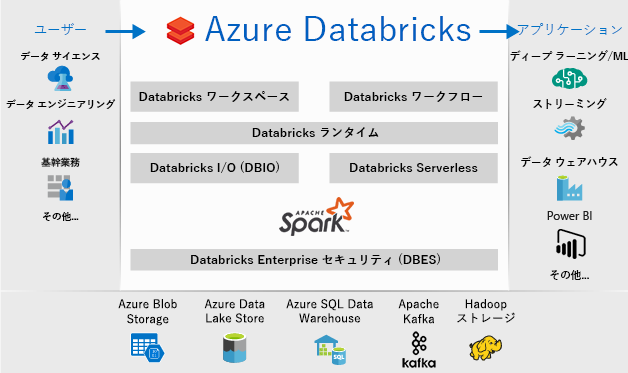
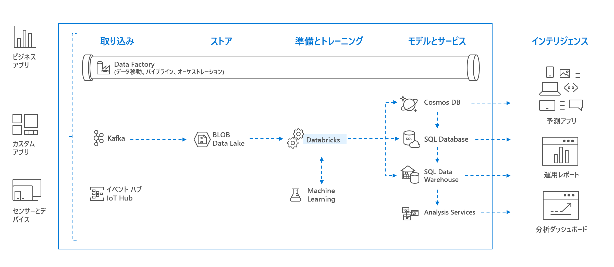

# Azure Databricks とは

Azure Databricks は、Microsoft Azure クラウド サービス プラットフォームに最適化された Apache Spark ベースの分析プラットフォームです。 Apache Spark の創始者たちと共に設計され、Azure に統合された Databricks では、ワンクリックでのセットアップと効率的なワークフローのほか、データ サイエンティスト、データ エンジニア、ビジネス アナリストが共同作業できるインタラクティブなワークスペースが実現されています。

Azure Databricks は、高速で使いやすい、コラボレーション対応の Apache Spark ベースの分析サービスです。 ビッグ データ パイプラインに使用されるデータ (生データまたは構造化データ) は、Azure Data Factory を介して一連のバッチに分けて Azure に取り込まれるか、Kafka、Event Hubs、IoT Hub を使ってほぼリアルタイムでストリーム配信されます。 このデータは、長期永続保管を目的としたデータ レイク (Azure Blob Storage または Azure Data Lake Storage) に到達します。 Azure Databricks は、分析ワークフローの過程で使います。[Azure Blob Storage](../storage/blobs/storage-blobs-introduction.md)、[Azure Data Lake Storage](../data-lake-store/index.md)、[Azure Cosmos DB](../cosmos-db/index.yml)、[Azure SQL Data Warehouse](../sql-data-warehouse/index.yml) などさまざまなデータ ソースから、Azure Databricks を使ってデータを読み取り、そのデータを Spark で変換することによって重要な分析情報が得られます。

## Apache Spark ベースの分析プラットフォーム

Azure Databricks は、完全なオープン ソースの Apache Spark クラスター テクノロジと機能から構成されています。 Azure Databricks の Spark には、次のコンポーネントが含まれています。

* **Spark SQL と DataFrame**: Spark SQL は構造化データを処理するための Spark モジュールです。 DataFrame は、名前付きの列に編成されたデータの分散型コレクションです。 概念的には、リレーショナル データベースのテーブルまたは R/Python のデータ フレームと同等のものです。

* **Streaming**: 分析アプリケーションおよび対話型アプリケーションのためのリアルタイムのデータ処理と分析です。 HDFS、Flume、Kafka と統合されています。

* **MLlib**: 分類、回帰、クラスタリング、協調フィルタリング、次元縮小、基になっている最適化プリミティブなど、一般的な学習アルゴリズムとユーティリティで構成された Machine Learning ライブラリです。

* **GraphX**: 認知分析からデータ探索まで、さまざまなユース ケースを対象とするグラフおよびグラフ計算です。

* **Spark Core API**: R、SQL、Python、Scala、Java のサポートが含まれます。

## Azure Databricks における Apache Spark

Azure Databricks は、次のようなゼロ管理クラウド プラットフォームを提供することによって Spark の機能を基に構築されています。

- フル マネージドの Spark クラスター
- 探索および視覚化のための対話型ワークスペース
- 任意の Spark ベース アプリケーションを強化するプラットフォーム

### クラウド内のフル マネージドの Apache Spark クラスター

Azure Databricks は、安全で信頼性の高い運用環境をクラウド内に持っており、Spark エキスパートによって管理およびサポートされています。 次のようにすることができます。

* 秒単位でクラスターを作成できます。
* クラスターを動的かつ自動的にスケールアップおよびスケールダウンでき (サーバーレス クラスターなど)、チーム間で共有できます。 
* REST API を使ってプログラムからクラスターを使うことができます。 
* Spark 上に構築されたセキュリティ保護されたデータ統合機能を使って、集中化しないでデータを統合できます。 
* リリースごとに最新の Apache Spark 機能にすぐにアクセスできます。

### Databricks ランタイム
Databricks ランタイムは、Apache Spark を基盤として、Azure クラウドにネイティブに対応するように構築されています。 

**サーバーなし**オプションを使うと、Azure Databricks は、インフラストラクチャの複雑さと、データ インフラストラクチャをセットアップして構成するための専門知識の必要性を、完全に抽象化します。 サーバーなしオプションは、データ サイエンティストがチームとして簡単に反復作業するのに役立ちます。

運用ジョブのパフォーマンスに気を掛けるデータ エンジニアに対しては、Azure Databricks は、I/O レイヤーと処理レイヤー (Databricks I/O) でのさまざまな最適化によって、高速で高性能な Spark エンジンを提供します。

### コラボレーションのためのワークスペース

コラボレーション対応で統合された環境により、Azure Databricks は、Spark でのデータ探査、プロトタイプ作成、およびデータ ドリブン アプリケーション実行のプロセスを簡単にします。

* 簡単なデータ探索でデータの使用方法を決定します。
* R、Python、Scala、または SQL のノートブックで進行状況を文書化します。
* 数回のクリックでデータを視覚化でき、Matplotlib、ggplot、d3 などの使い慣れたツールを使うことができます。
* 対話型ダッシュボードを使って、動的なレポートを作成できます。
* Spark を使い、データを同時に操作できます。

## エンタープライズ セキュリティ

Azure Active Directory の統合、ロール ベースの制御、データとビジネスを保護する SLA など、Azure Databricks はエンタープライズ レベルの Azure セキュリティを提供します。

* Azure Active Directory との統合により、Azure Databricks を使って Azure ベースの完全なソリューションを実行することができます。
* Azure Databricks のロール ベースのアクセスでは、ノートブック、クラスター、ジョブ、およびデータに対してきめ細かいユーザー権限を設定できます。
* エンタープライズ グレードの SLA です。 

## Azure サービスとの統合

Azure Databricks は、SQL Data Warehouse、Cosmos DB、Data Lake Store、Blob Storage などの Azure のデータベースおよびストアと深いレベルで統合します。 

## Power BI との統合
Power BI とのリッチな統合により、Azure Databricks は大きな影響を与えるインサイトを迅速かつ簡単に検出して共有することができます。 JDBC/ODBC クラスター エンドポイントを介して Tableau Software などの他の BI ツールを使うこともできます。

## 次のステップ

* [クイック スタート:Azure Databricks で Spark ジョブを実行する](quickstart-create-databricks-workspace-portal.md)
* [Spark クラスターを使用する](/azure/databricks/clusters/index)
* [Notebook を使用する](/azure/databricks/notebooks/index)
* [Spark ジョブを作成する](/azure/databricks/jobs)

 

