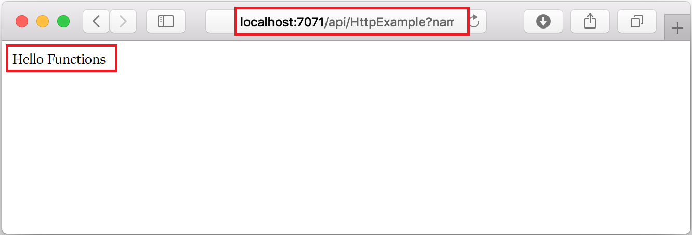
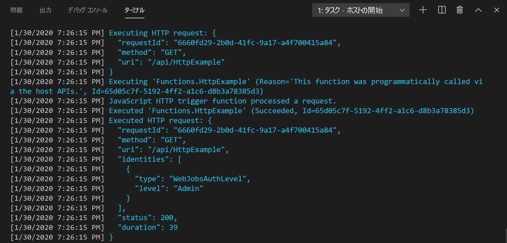
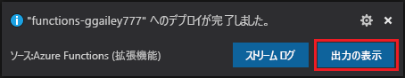
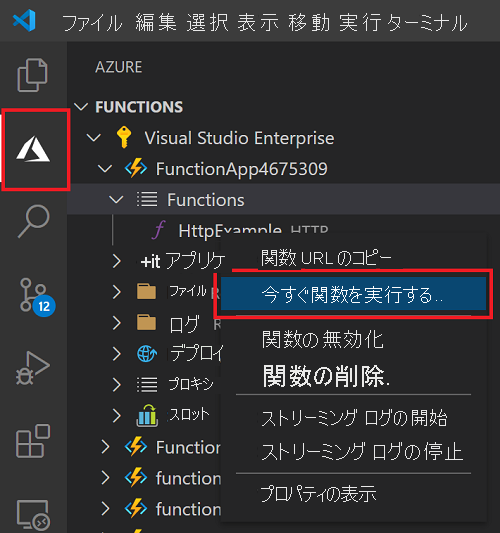

# クイックスタート: Visual Studio Code を使用して Azure に JavaScript 関数を作成する

> [!div class="op_single_selector" title1="関数の言語を選択します。 "]
> - [JavaScript](create-first-function-vs-code-node.md)
> - [C#](create-first-function-vs-code-csharp.md)
> - [Java](create-first-function-vs-code-java.md)
> - [PowerShell](create-first-function-vs-code-powershell.md)
> - [Python](create-first-function-vs-code-python.md)
> - [TypeScript](create-first-function-vs-code-typescript.md)
> - [その他 (Go/Rust)](create-first-function-vs-code-other.md)

Visual Studio Code を使用して、HTTP 要求に応答する JavaScript 関数を作成します。 コードをローカルでテストした後、Azure Functions のサーバーレス環境にデプロイします。

このクイックスタートを完了すると、わずかな (数セント未満の) コストが発生します。 <abbr title="Azure アカウントは、Azure サービスと Azure サブスクリプションへのアクセスを可能にするグローバルに一意のエンティティです。">Azure アカウント</abbr>.

## 1.環境を準備する

作業を開始する前に、次の要件が満たされていることを確認します。

+ Azure アカウント。 <abbr title="Azure サブスクリプションは、Azure でリソースをプロビジョニングするために使用される論理コンテナーです。 仮想マシン (VM) やデータベースなどのすべてのリソースの詳細が保持されます。">アクティブなサブスクリプション</abbr>. [無料でアカウントを作成できます](https://azure.microsoft.com/free/?ref=microsoft.com&utm_source=microsoft.com&utm_medium=docs&utm_campaign=visualstudio)。

+ [Node.js 10.14.1 以降](https://nodejs.org/)

+ [Visual Studio Code](https://code.visualstudio.com/)

+ Visual Studio Code 用 [Azure Functions 拡張機能](https://marketplace.visualstudio.com/items?itemName=ms-azuretools.vscode-azurefunctions)。

+ [Azure Functions Core Tools](functions-run-local.md?tabs=linux%2Ccsharp%2Cbash#install-the-azure-functions-core-tools)

 

## 2. ローカル Functions プロジェクトを作成する

1. Azure アイコンを <abbr title="">アクティビティ バー</abbr>で選択し、 **[Azure: Functions]** 領域の **[新しいプロジェクトの作成]** アイコンを選択します。

    ![[新しいプロジェクトの作成] を選択する](./media/functions-create-first-function-vs-code/create-new-project.png)

1. プロジェクト ワークスペースの **ディレクトリの場所を選択** し、 **[選択]** を選択します。 

1. プロンプトで、次の情報を入力します。

    + **Select a language for your function project (関数プロジェクトの言語を選択してください)** : [`JavaScript`] を選択します。

    + **Select a template for your project's first function (プロジェクトの最初の関数のテンプレートを選択してください)** : [`HTTP trigger`] を選択します。

    + **Provide a function name (関数名を指定してください):** 「`HttpExample`.

    + **承認レベル**: `Anonymous` を選択します。この場合、すべてのユーザーが関数のエンドポイントを呼び出すことができます。

    + **Select how you would like to open your project (プロジェクトを開く方法を選択してください)** : [`Add to workspace`] を選択します。

 

<strong>関数プロジェクトを作成できない場合</strong>

ローカル Functions プロジェクトの作成時に解決すべき最も一般的な問題は次のとおりです。
* Azure Functions 拡張機能がインストールされていません。 

 

## 3. 関数をローカルで実行する

1. <kbd>F5</kbd> キーを押して関数アプリ プロジェクトを起動します。 

1. ローカルで実行されている関数の URL エンドポイントを **ターミナル** で確認します。

    

1. 次の URL をコピーして Web ブラウザーに貼り付け、Enter キーを押します。

    `http://localhost:7071/api/HttpExample?name=Functions`

1. 返された応答を確認します。

    

1. **[Terminal]\(ターミナル\)** パネルで、要求に関する情報を確認します。

    

1. <kbd>Ctrl + C</kbd> キーを押して Core Tools を停止し、デバッガーの接続を解除します。

 

<strong>関数をローカルで実行できない場合</strong>

ローカル Functions プロジェクトの実行時に解決すべき最も一般的な問題は次のとおりです。
* Core Tools がインストールされていません。 
*  Windows での実行に問題がある場合、Visual Studio Code の既定のターミナル シェルが WSL Bash に設定されていないことをご確認ください。 

 

## 4.Azure へのサインイン

アプリを発行するには、Azure にサインインします。 既にサインインしている場合は、次のセクションに進んでください。

1. アクティビティ バーで Azure アイコンを選択し、 **[Azure: Functions]** 領域の **[Azure にサインイン]** を選択します。

    

1. ブラウザーでプロンプトが表示されたら、**ご利用の Azure アカウントを選択** し、その Azure アカウントの資格情報を使用して **サインイン** します。

1. 正常にサインインしたら、新しいブラウザー ウィンドウを閉じて Visual Studio Code に戻ります。 

 

## 5.Azure にプロジェクトを発行する

初めてコードをデプロイする際は、Azure サブスクリプションに関数リソースを作成します。 

1. アクティビティ バーの Azure アイコンを選択し、 **[Azure: Functions]** 領域で、 **[Deploy to function app]\(関数アプリにデプロイ\)** ボタンを選択します。

    

1. プロンプトで、次の情報を入力します。

    + **フォルダーの選択**: 関数アプリが格納されているフォルダーを選択します。 

    + **Select subscription (サブスクリプションを選択してください)** : 使用するサブスクリプションを選択します。 サブスクリプションが 1 つのみの場合、このプロンプトは表示されません。

    + **Select function app in Azure (Azure で関数アプリを選択してください)** : [`+ Create new Function App`] を選択します。

    + **Enter a globally unique name for the function app (関数アプリのグローバルに一意の名前を入力します)** : Azure 全体で一意の名前を URL パスに入力します。 入力した名前は、グローバルな一意性を確保するために検証されます。

    + **Select a runtime (ランタイムを選択してください)** : ローカルで実行している Node.js のバージョンを選択します。 `node --version` コマンドを使用してバージョンを確認してください。

    + **Select a location for new resources (新しいリソースの場所を選択してください)** : パフォーマンスを向上させるために、お近くの [リージョン](https://azure.microsoft.com/regions/)を選択してください。 

1. 関数アプリが作成され、展開パッケージが適用されると、通知が表示されます。 **[View Output]\(出力の表示\)** を選択して、作成とデプロイの結果を表示します。 
    
    

 

<strong>関数を発行できない場合</strong>

このセクションでは Azure リソースを作成し、ローカル コードを関数アプリにデプロイしました。 成功しなかった場合は、次のことを確認してください。

* 出力でエラー情報を確認します。 出力は、右下隅にあるベル アイコンでも確認できます。 
* 既存の関数アプリに発行していないか確認します。 この操作を実行すると、Azure にあるそのアプリの内容が上書きされます。

 

<strong>作成されたリソース</strong>

完了すると、関数アプリ名に基づく名前を使用して、次の Azure リソースがサブスクリプションに作成されます。 
* **リソース グループ**: 同じリージョンにある関連するリソースの論理上のコンテナーです。
* **Azure ストレージ アカウント**: プロジェクトの状態など、プロジェクトに関する情報はストレージ リソースに保管されます。
* **従量課金プラン**: サーバーレス関数アプリの実行環境となるホストを定義します。
* **関数アプリ**: 関数コードを実行するための環境を提供し、論理ユニットとして関数をグループ化します。
* **Application Insights**: サーバーレス関数の使用状況を追跡します。

 

## 6.Azure で関数を実行する
1. **[Azure: Functions]** サイド バーで、新しい関数アプリを展開します。 
1. **[Functions]** を展開し、 **[HttpExample]** を右クリックして、 **[Execute Function Now]\(今すぐ関数を実行\)** を選択します。

    

1. **Enter キーを押して**、既定の要求メッセージを関数に送信します。 

1. 関数の実行が完了すると、Visual Studio Code で通知が生成されます。

 

<strong>クラウドベースの関数アプリを実行できなかった場合</strong>

* URL の末尾にクエリ文字列を追加したことを確認します。

 

## 7.リソースをクリーンアップする

不要なコストが発生しないよう、関数アプリとそのリソースを削除してください。

1. Visual Studio Code のアクティビティ バーにある Azure アイコンを選択し、サイド バーの [Functions]\(関数\) 領域を選択します。 
1. 関数アプリを選択し、右クリックして **[Delete Function app]\(関数アプリの削除\)** を選択します。

 

## 次のステップ

を追加して関数を展開します。 <abbr title="関数へのバインドは、宣言によって別のリソースを関数に接続する手段の一つです。">出力バインディング</abbr>. このバインディングでは、HTTP 要求の文字列が Azure Queue Storage キュー内のメッセージに書き込まれます。 

> [!div class="nextstepaction"]
> [Azure Storage キューに接続する](functions-add-output-binding-storage-queue-vs-code.md?pivots=programming-language-javascript)

[Azure Functions Core Tools]: functions-run-local.md
[Azure Functions extension for Visual Studio Code]: https://marketplace.visualstudio.com/items?itemName=ms-azuretools.vscode-azurefunctions
