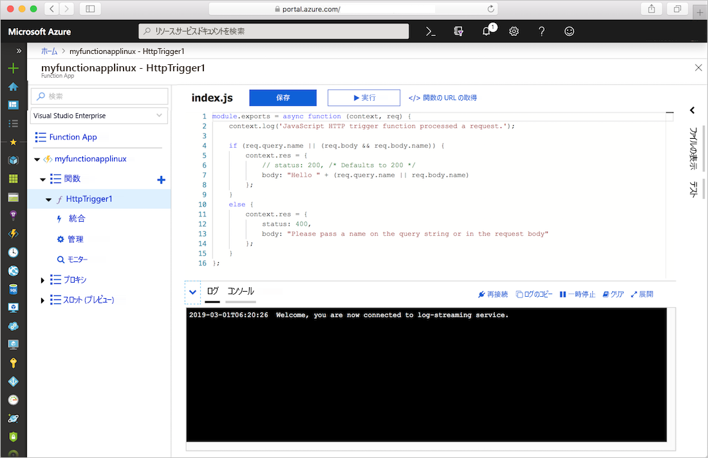
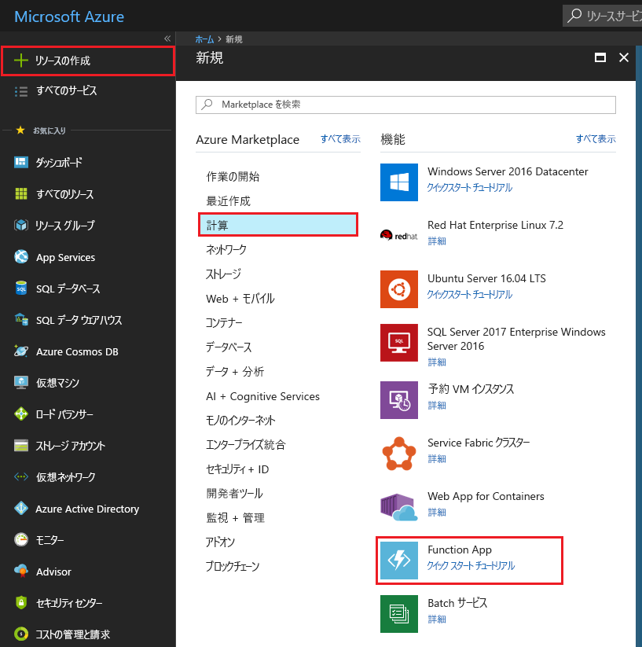
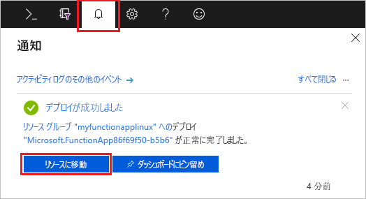
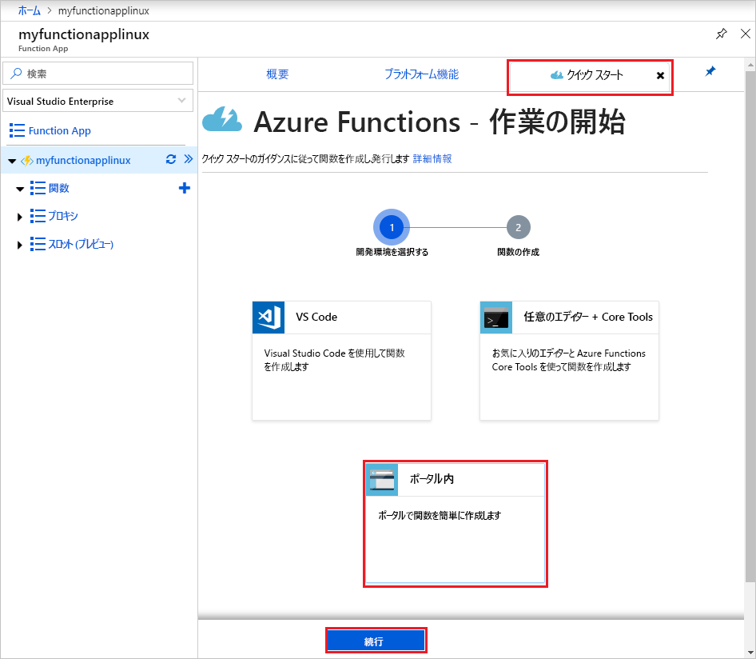
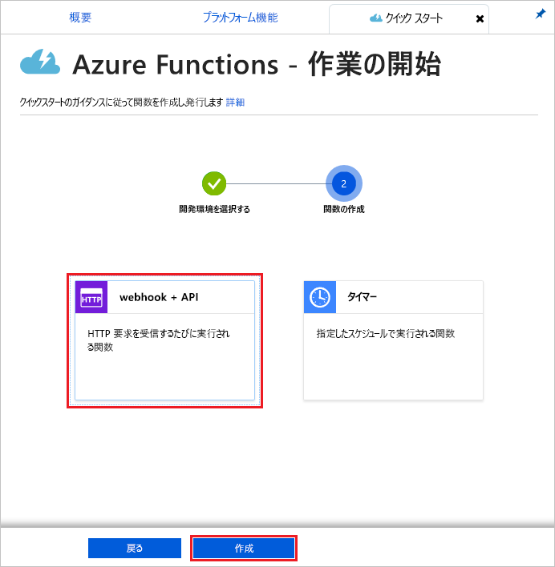
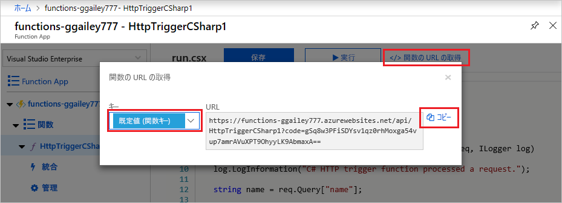
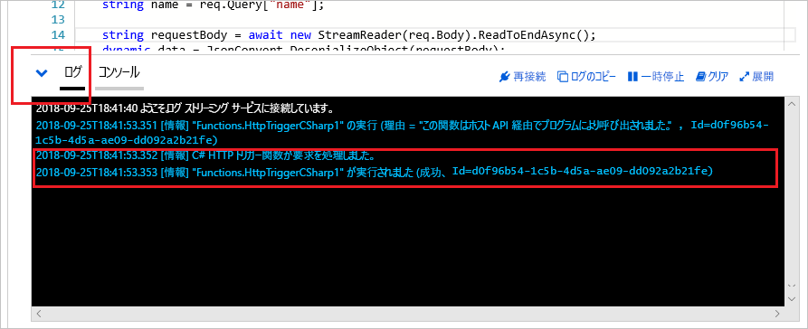

# Azure App Service プランで Linux 上に関数アプリを作成する

Azure Functions を使うと、既定の Azure App Service コンテナー内の Linux で関数をホストできます。 この記事では、[Azure portal](https://portal.azure.com) を使用して、Linux でホストされた関数アプリを作成し、[App Service プラン](functions-scale.md#app-service-plan)内で実行する方法について説明します。 [独自のカスタム コンテナーを利用する](functions-create-function-linux-custom-image.md)こともできます。

[!INCLUDE [quickstarts-free-trial-note](../../includes/quickstarts-free-trial-note.md)]

## Azure へのサインイン

Azure アカウントで Azure Portal (<https://portal.azure.com>) にサインインします。

## Function App を作成する

Linux での関数の実行をホストするための関数アプリが必要です。 関数アプリは、関数コードの実行環境を提供します。 これにより、リソースの管理、デプロイ、スケーリング、および共有を容易にするための論理ユニットとして関数をグループ化できます。 この記事では、関数アプリを作成するときに App Service プランを作成します。

1. Azure portal の左上にある **[リソースの作成]** ボタンを選択し、 **[コンピューティング]**  >  **[Function App]** を選択します。

    

2. 図の下にある表に指定されている関数アプリの設定を使用します。

    

    | 設定      | 推奨値  | 説明                                        |
    | ------------ |  ------- | -------------------------------------------------- |
    | **アプリ名** | グローバルに一意の名前 | 新しい Function App を識別する名前。 有効な文字は、`a-z`、`0-9`、および `-` です。  | 
    | **サブスクリプション** | 該当するサブスクリプション | この新しい Function App が作成されるサブスクリプション。 | 
    | **[リソース グループ](../azure-resource-manager/management/overview.md)** |  myResourceGroup | Function App を作成するための新しいリソース グループの名前。 |
    | **OS** | Linux | Linux 上で関数アプリを実行する |
    | **公開** | コード | **ランタイム スタック**の既定の Linux コンテナーが使用されます。 用意する必要があるのは関数アプリ プロジェクトのコードのみです。 もう 1 つの選択肢は、カスタムの [Docker イメージ](functions-create-function-linux-custom-image.md)を公開することです。 |
    | **[ホスティング プラン](functions-scale.md)** | App Service プラン | Function App にどのようにリソースが割り当てられるかを定義するホスティング プラン。 App Service プランで実行する場合は、[関数アプリのスケーリング](functions-scale.md)を制御できます。  |
    | **App Service プラン/場所** | プランの作成 | **[新規作成]** を選択し、 **[App Service プラン]** の名前を指定します。 最寄りの**リージョン**または関数がアクセスする他のサービスの近くのリージョン内の [[場所]](https://azure.microsoft.com/regions/) を選択します。 目的の **[[価格レベル]](https://azure.microsoft.com/pricing/details/app-service/linux/)** を選択します。  同じ App Service プランで Linux と Windows の両方の関数アプリを実行することはできません。 |
    | **ランタイム スタック** | 優先言語 | お気に入りの関数プログラミング言語をサポートするランタイムを選択します。 C# および F# 関数用の **[.NET]** を選択します。 |
    | **[Storage](../storage/common/storage-account-create.md)** |  グローバルに一意の名前 |  関数アプリで使用されるストレージ アカウントを作成します。 ストレージ アカウント名の長さは 3 ～ 24 文字で、数字と小文字のみを使用できます。 既存のアカウントを使用することもできますが、[ストレージ アカウントの要件](storage-considerations.md#storage-account-requirements)を満たしている必要があります。 |
    | **[Application Insights](functions-monitoring.md)** | 有効 | Application Insights は、既定で無効です。 今すぐ Application Insights 統合を有効にして、App Service プランの場所に近いホスティング場所を選択することをお勧めします。 これを後で行う場合は、「[Azure 関数を監視する](functions-monitoring.md)」を参照してください。  |

3. **[作成]** を選択して、Function App をプロビジョニングし、デプロイします。

4. ポータルの右上隅の通知アイコンを選択し、"**デプロイメントに成功しました**" というメッセージが表示されるまで待ちます。

    

5. **[リソースに移動]** を選択して、新しい関数アプリを確認します。

次に、新しい Function App で関数を作成します。 関数アプリを使用できるようになった後でも、完全に初期化されるまでに数分かかることがあります。

## HTTP によってトリガーされる関数の作成

このセクションでは、ポータルの新しい関数アプリで関数を作成する方法について説明します。

> [!NOTE]
> Azure Functions を試す場合、ポータル開発の経験があれば役立ちます。 ほとんどのシナリオでは、[Visual Studio Code](functions-create-first-function-vs-code.md#create-an-azure-functions-project) または [Azure Functions Core Tools](functions-run-local.md#create-a-local-functions-project) を使用して、ローカルで関数を開発し、プロジェクトを関数アプリに公開することを検討してください。  

1. 新しい関数アプリで、 **[概要]** タブを選択し、読み込みが完了したら **[+ 新しい関数]** を選択します。

    ![[概要] タブから新しい関数を作成する](./media/create-function-app-linux-app-service-plan/overview-create-function.png)

1. **[クイック スタート]** タブで **[ポータル内]** を選択し、 **[続行]** を選択します。

    

1. **[webhook + API]** を選択し、 **[作成]** を選択します。

    

HTTP によってトリガーされる関数の言語固有のテンプレートを使用して、関数が作成されます。

ここで、HTTP 要求を送信することで、新しい関数を実行できます。

## 関数をテストする

1. 新しい関数で、右上の **[</> 関数の URL の取得]** をクリックし、 **[既定値 (関数キー)]** を選択して、 **[コピー]** をクリックします。 

    

2. 関数 URL をブラウザーのアドレス バーに貼り付けます。 この URL の末尾にクエリ文字列 `&name=<yourname>` を追加し、キーボードで`Enter` キーを押して要求を実行します。 ブラウザーに表示される関数によって返される応答が表示されます。  

    次の例は、ブラウザーでの応答を示しています。

    

    要求 URL には、既定では HTTP 経由で関数にアクセスするために必要なキーが含まれています。

3. 関数が実行されると、ログにトレース情報が書き込まれます。 前の実行からのトレース出力を表示するには、ポータルで関数に戻り、画面の下部にある矢印をクリックして **[ログ]** を展開します。

   

## リソースをクリーンアップする

[!INCLUDE [Clean-up resources](../../includes/functions-quickstart-cleanup.md)]

## 次のステップ

HTTP によってトリガーされる単純な関数を含む Function App を作成しました。  

[!INCLUDE [Next steps note](../../includes/functions-quickstart-next-steps.md)]

詳細は、「[Azure Functions の HTTP バインド](functions-bindings-http-webhook.md)」を参照してください。
