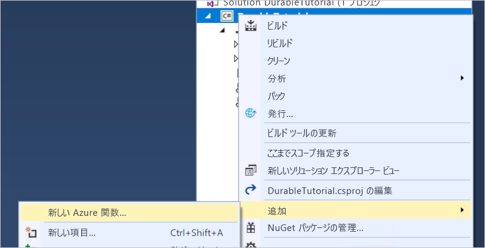

---
title: C# を使用して Azure で最初の永続関数を作成する
description: Visual Studio を使用して Azure 永続関数を作成して発行します。
services: functions
documentationcenter: na
author: jeffhollan
manager: jeconnoc
keywords: Azure Functions, 関数, イベント処理, コンピューティング, サーバーなしのアーキテクチャ
ms.service: azure-functions
ms.devlang: multiple
ms.topic: quickstart
ms.date: 11/07/2018
ms.author: azfuncdf
ms.openlocfilehash: a9794c25bd5f0acd48362611d13bac17fc502450
ms.sourcegitcommit: edacc2024b78d9c7450aaf7c50095807acf25fb6
ms.translationtype: HT
ms.contentlocale: ja-JP
ms.lasthandoff: 12/13/2018
ms.locfileid: "53341050"
---
# <a name="create-your-first-durable-function-in-c"></a>C\# で最初の Durable Functions を作成する

*Durable Functions* は、サーバーレス環境でステートフル関数を記述できる [Azure Functions](../functions-overview.md) の拡張機能です。 この拡張機能は状態、チェックポイント、再起動を管理します。

この記事では、Visual Studio 2017 Tools for Azure Functions を使用して、"hello world" の Durable Functions をローカルで作成してテストする方法を学習します。この関数は、他の関数の呼び出しを調整し、連結します。 その後、関数コードを Azure に発行します。 これらのツールは、Visual Studio 2017 の Azure 開発ワークロードの一部として利用できます。


## <a name="prerequisites"></a>前提条件

このチュートリアルを完了するには、以下が必要です。

* [Visual Studio 2017](https://azure.microsoft.com/downloads/) をインストールし、**Azure 開発**ワークロードもインストールされていることを確認します。

* [最新の Azure Functions ツール](../functions-develop-vs.md#check-your-tools-version)があることを確認します。

* [Azure Storage Emulator](../../storage/common/storage-use-emulator.md) がインストールされ、実行されていることを確認します。

[!INCLUDE [quickstarts-free-trial-note](../../../includes/quickstarts-free-trial-note.md)]

## <a name="create-a-function-app-project"></a>関数アプリ プロジェクトを作成する

Visual Studio の Azure Functions プロジェクト テンプレートでは、Azure の関数アプリに発行できるプロジェクトを作成します。 関数アプリを使用すると、リソースを管理、デプロイ、および共有するための論理ユニットとして関数をグループ化できます。

1. Visual Studio で、**[ファイル]** メニューから **[新規]** > **[プロジェクト]** の順に選択します。

2. **[新しいプロジェクト]** ダイアログで、**[インストール済み]** を選択し、**[Visual C#]** > **[クラウド]** の順に展開して **[Azure Functions]** を選択します。プロジェクトの**名前**を入力して、**[OK]** をクリックします。 関数アプリ名は、C# 名前空間として有効である必要があります。そのため、アンダースコア、ハイフン、その他の英数字以外の文字は使用しないでください。

    ![Visual Studio で関数を作成するための [新しいプロジェクト] ダイアログ](./media/durable-functions-create-first-csharp/functions-vs-new-project.png)

3. 図の下の表に示した設定を使用してください。

    ![Visual Studio の [新しい関数] ダイアログ](./media/durable-functions-create-first-csharp/functions-vs-new-function.png)

    | Setting      | 推奨値  | 説明                      |
    | ------------ |  ------- |----------------------------------------- |
    | **バージョン** | Azure Functions 2.x <br />(.NET Core) | .NET Core をサポートする Azure Functions のバージョン 2.x ランタイムを使用する関数プロジェクトを作成します。 Azure Functions 1.x では、.NET Framework がサポートされます。 詳細については、「[Azure Functions ランタイム バージョンをターゲットにする方法](../functions-versions.md)」をご覧ください。   |
    | **テンプレート** | Empty | これで空の関数アプリが作成されます。 |
    | **ストレージ アカウント**  | ストレージ エミュレーター | Durable Functions の状態管理にはストレージ アカウントが必要です。 |

4. **[OK]** をクリックして、空の関数プロジェクトを作成します。

## <a name="add-functions-to-the-app"></a>アプリに関数を追加する

Visual Studio で空の関数アプリ プロジェクトが作成されます。  これにはアプリに必要な基本的な構成ファイルが含まれていますが、関数はまだ含まれていません。  プロジェクトに Durable Functions テンプレートを追加する必要があります。

1. Visual Studio でプロジェクトを右クリックし、**[追加]** > **[新しい Azure 関数]** を選択します。

    

2. 追加メニューから **[Azure Function]** が選択されていることを確認し、C# ファイルに名前を付けます。  **[追加]** をクリックします。

3. **[Durable Functions Orchestration]** テンプレートを選択し、**[OK]** をクリックします。

      

新しい Durable Functions がアプリに追加されます。  新しいファイルを開いて内容を表示します。  この Durable Functions は、単純な関数チェーンの例です。  

* `RunOrchestrator` メソッドは、オーケストレーター関数に関連付けられています。  この関数が起動し、一覧が作成され、3 つの関数呼び出しの結果が一覧に追加されます。  3 つの関数呼び出しが完了すると、一覧が返されます。  呼び出す関数は `SayHello` メソッドです (既定では `<NameOfFile>_Hello` と呼ばれます)。
* `SayHello` 関数から hello が返されます。
* `HttpStart` メソッドには、オーケストレーションのインスタンスを開始する関数を記述します。  これは、オーケストレーターの新しいインスタンスを開始し、チェック状態の応答を返す [HTTP トリガー](../functions-bindings-http-webhook.md)に関連付けられています。

関数プロジェクトと Durable Functions を作成できたので、この関数をローカル コンピューターでテストすることができます。

## <a name="test-the-function-locally"></a>関数をローカルでテストする

Azure Functions Core Tools を使用すると、ローカルの開発用コンピューター上で Azure Functions プロジェクトを実行できます。 Visual Studio から初めて関数を開始すると、これらのツールをインストールするよう求めるメッセージが表示されます。

1. 関数をテストするには、F5 キーを押します。 メッセージが表示されたら、Visual Studio からの要求に同意し、Azure Functions Core (CLI) ツールをダウンロードしてインストールします。 また、ツールで HTTP 要求を処理できるようにファイアウォールの例外を有効にすることが必要になる場合もあります。

2. Azure Functions のランタイムの出力から、関数の URL をコピーします。

    

3. HTTP 要求の URL をブラウザーのアドレス バーに貼り付け、要求を実行します。 関数によって返されたローカルの GET 要求に対するブラウザーでの応答を次に示します。

    

    応答は、永続的なオーケストレーションが正常に開始されたことを示す HTTP 関数の最初の結果です。  これはまだオーケストレーションの最終的な結果ではありません。  応答には、いくつかの便利な URL が含まれています。  ここでは、オーケストレーションの状態を照会してみましょう。

4. `statusQueryGetUri` の URL 値をコピーし、ブラウザーのアドレス バーに貼り付け、要求を実行します。

    この要求によって、オーケストレーション インスタンスの状態が照会されます。 最終的な応答は次のようになります。  これはインスタンスが完了したことを示し、Durable Functions の出力または結果を含みます。

    ```json
    {
        "instanceId": "d495cb0ac10d4e13b22729c37e335190",
        "runtimeStatus": "Completed",
        "input": null,
        "customStatus": null,
        "output": [
            "Hello Tokyo!",
            "Hello Seattle!",
            "Hello London!"
        ],
        "createdTime": "2018-11-08T07:07:40Z",
        "lastUpdatedTime": "2018-11-08T07:07:52Z"
    }
    ```

5. デバッグを停止するには、**Shift キーを押しながら F5 キー**を押します。

関数がローカル コンピューター上で正常に動作することを確認した後、プロジェクトを Azure に発行します。

## <a name="publish-the-project-to-azure"></a>Azure にプロジェクトを発行する

プロジェクトを発行するには、Azure サブスクリプションに関数アプリがあることが必要です。 関数アプリは、Visual Studio から直接作成できます。

[!INCLUDE [Publish the project to Azure](../../../includes/functions-vstools-publish.md)]

## <a name="test-your-function-in-azure"></a>Azure で関数をテストする

1. [発行プロファイル] ページから関数アプリのベース URL をコピーします。 関数をローカルでテストしたときに使用した URL の `localhost:port` 部分を新しいベース URL に置き換えます。

    Durable Functions の HTTP トリガーを呼び出す URL は、次の形式である必要があります。

        http://<APP_NAME>.azurewebsites.net/api/<FUNCTION_NAME>_HttpStart

2. HTTP 要求のこの新しい URL をブラウザーのアドレス バーに貼り付けます。 以前の発行済みアプリの使用時と同じ状態応答を受け取るはずです。

## <a name="next-steps"></a>次の手順

Visual Studio を使用して、C# の Durable Functions アプリを作成して発行しました。

> [!div class="nextstepaction"]
> [Durable Functions の一般的なパターンについて学習する。](durable-functions-overview.md)
