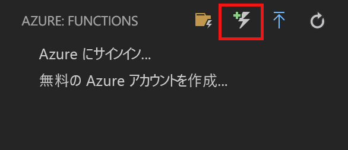
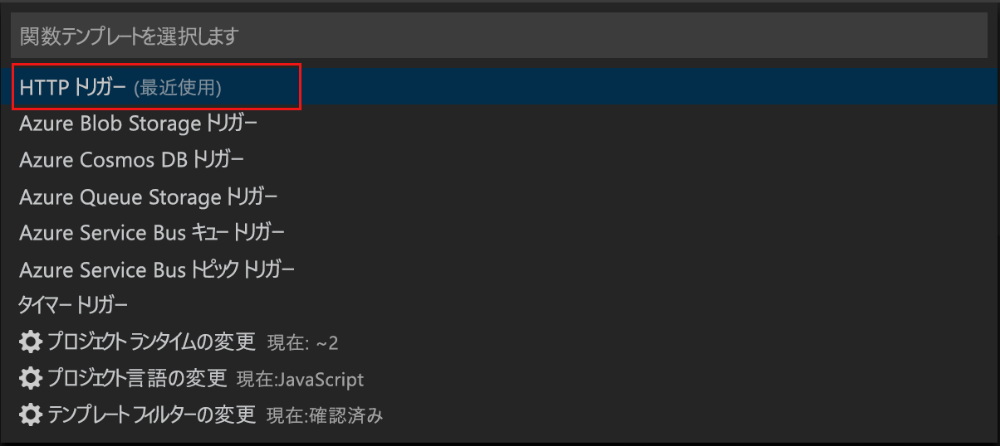
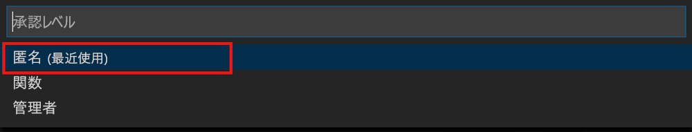
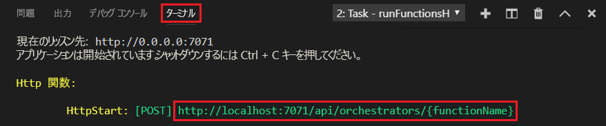

# JavaScript で最初の永続関数を作成する

*Durable Functions* は、サーバーレス環境でステートフル関数を記述できる [Azure Functions](../functions-overview.md) の拡張機能です。 この拡張機能は状態、チェックポイント、再起動を管理します。

この記事では、Visual Studio Code Azure Functions 拡張機能を使用して、"hello world" 永続関数をローカルで作成してテストする方法について説明します。  この関数は、他の関数の呼び出しを調整し、連結します。 その後、関数コードを Azure に発行します。

## 前提条件

このチュートリアルを完了するには、以下が必要です。

* [Visual Studio Code](https://code.visualstudio.com/download) をインストールします。

* [最新の Azure Functions ツール](../functions-develop-vs.md#check-your-tools-version)があることを確認します。

* Windows コンピューターでは、[Azure Storage Emulator](../../storage/common/storage-use-emulator.md) がインストールされ、実行されていることを確認します。 Mac または Linux コンピューターでは、実際の Azure ストレージ アカウントを使用する必要があります。

* バージョン 8.0 以降の [Node.js](https://nodejs.org/) がインストールされていることを確認します。

[!INCLUDE [quickstarts-free-trial-note](../../../includes/quickstarts-free-trial-note.md)]

[!INCLUDE [functions-install-vs-code-extension](../../../includes/functions-install-vs-code-extension.md)]

[!INCLUDE [functions-create-function-app-vs-code](../../../includes/functions-create-function-app-vs-code.md)]

## Durable Functions npm パッケージをインストールする

1. 関数アプリのルート ディレクトリで `npm install durable-functions` を実行して、`durable-functions` npm パッケージをインストールします。

## starter 関数を作成する

まず、永続関数のオーケストレーションを開始する HTTP トリガー関数を作成します。

1. **[Azure:Functions]** で [関数の作成] アイコンを選択します。

    

2. 関数アプリ プロジェクトが含まれたフォルダーを選択し、**[HTTP トリガー]** 関数テンプレートを選択します。

    

3. 関数名として「`HttpStart`」と入力して Enter キーを押し、**[匿名]** 認証を選択します。

    

    HTTP によってトリガーされる関数のテンプレートを使用して、選択した言語で関数が作成されます。

4. index.js を以下の JavaScript に置き換えます。

    [!code-javascript[Main](~/samples-durable-functions/samples/javascript/HttpStart/index.js)]

5. function.json を以下の JSON に置き換えます。

    [!code-json[Main](~/samples-durable-functions/samples/javascript/HttpStart/function.json)]

これで永続関数へのエントリ ポイントが作成されます。 オーケストレーターを追加してみましょう。

## オーケストレーター関数を作成する

次に、オーケストレーターにする別の関数を作成します。 便宜的に、HTTP トリガー関数テンプレートを使用します。 関数コード自体は、オーケストレーター コードに置き換えられます。

1. 前のセクションの手順を繰り返し、HTTP トリガー テンプレートを使用して 2 つ目の関数を作成します。 今回は関数に `OrchestratorFunction` と名前を付けます。

2. 新しい関数の index.js ファイルを開き、内容を次のコードに置き換えます。

    [!code-json[Main](~/samples-durable-functions/samples/javascript/E1_HelloSequence/index.js)]

3. function.json ファイルを開き、次の JSON ファイルに置き換えます。

    [!code-json[Main](~/samples-durable-functions/samples/javascript/E1_HelloSequence/function.json)]

ここでは、アクティビティ関数を調整するオーケストレーターを追加しました。 次は参照アクティビティ関数を追加してみましょう。

## アクティビティ関数を作成する

1. 前のセクションの手順を繰り返し、HTTP トリガー テンプレートを使用して 3 つ目の関数を作成します。 ただし、今回は関数に `SayHello` と名前を付けます。

2. 新しい関数の index.js ファイルを開き、内容を次のコードに置き換えます。

    [!code-javascript[Main](~/samples-durable-functions/samples/javascript/E1_SayHello/index.js)]

3. function.json を以下の JSON に置き換えます。

    [!code-json[Main](~/samples-durable-functions/samples/csx/E1_SayHello/function.json)]

これで、オーケストレーションを開始し、アクティビティ関数を連結するために必要なすべてのコンポーネントが追加されます。

## 関数をローカルでテストする

Azure Functions Core Tools を使用すると、ローカルの開発用コンピューター上で Azure Functions プロジェクトを実行できます。 Visual Studio Code から初めて関数を起動すると、これらのツールをインストールするよう求めるメッセージが表示されます。  

1. Windows コンピューターでは、Azure Storage Emulator を起動し、local.settings.json の **AzureWebJobsStorage** プロパティが `UseDevelopmentStorage=true` に設定されていることを確認します。 Mac または Linux コンピューターでは、既存の Azure ストレージ アカウントの接続文字列に **AzureWebJobsStorage** プロパティを設定する必要があります。 ストレージ アカウントの作成については、この記事で後述します。

2. 関数をテストするには、関数コードにブレークポイントを設定し、F5 キーを押して関数アプリ プロジェクトを開始します。 Core Tools からの出力が**ターミナル** パネルに表示されます。 Durable Functions を初めて使用する場合は、Durable Functions 拡張機能がインストールされるので、ビルドに数秒かかる場合があります。

    > [!NOTE]
    > JavaScript Durable Functions では、バージョン **1.7.0** 以降の **Microsoft.Azure.WebJobs.Extensions.DurableTask** 拡張機能が必要です。 `extensions.csproj` ファイルで、Durable Functions 拡張機能のバージョンがこの要件を満たすことを確認します。 そうなっていない場合は、関数アプリを停止し、バージョンを変更した後、F5 キーを押して関数アプリを再起動します。

3. **ターミナル** パネルで、HTTP によってトリガーされる関数の URL エンドポイントをコピーします。

    

4. ブラウザーのアドレス バーに HTTP 要求の URL を貼り付け、オーケストレーションの状態を確認します。

5. デバッグを停止するには、Shift キーを押しながら F1 キーを押します。

関数がローカル コンピューター上で正常に動作することを確認したら、プロジェクトを Azure に発行します。

[!INCLUDE [functions-create-function-app-vs-code](../../../includes/functions-sign-in-vs-code.md)]

[!INCLUDE [functions-publish-project-vscode](../../../includes/functions-publish-project-vscode.md)]

## Azure で関数をテストする

1. **出力**パネルから HTTP トリガーの URL をコピーします。 HTTP によってトリガーされる関数を呼び出す URL は、次の形式である必要があります。

        http://<functionappname>.azurewebsites.net/orchestrators/<functionname>

2. HTTP 要求のこの新しい URL をブラウザーのアドレス バーに貼り付けます。 以前の発行済みアプリの使用時と同じ状態応答を受け取るはずです。

## 次の手順

Visual Studio Code を使用して、JavaScript の永続関数アプリを作成して発行しました。

> [!div class="nextstepaction"]
> [永続関数の一般的なパターンについて学習する](durable-functions-overview.md)