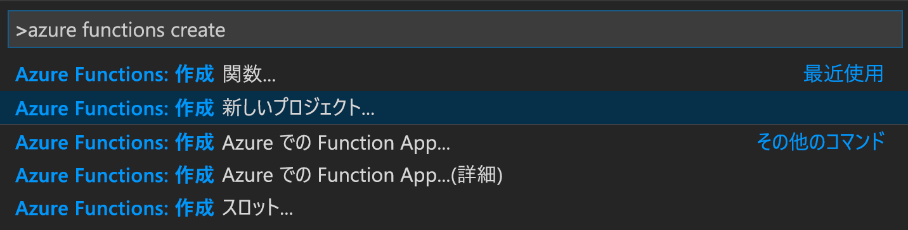
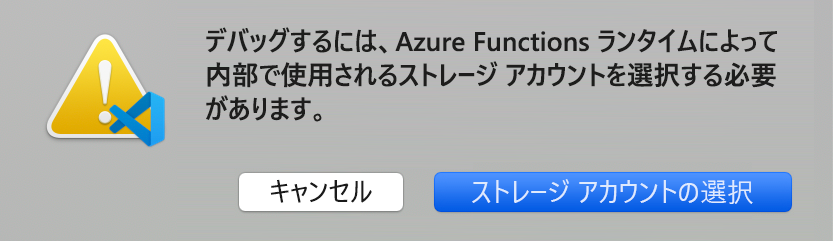

# <a name="create-your-first-durable-function-in-python"></a>Python で最初の永続関数を作成する

*Durable Functions* は、サーバーレス環境でステートフル関数を記述できる [Azure Functions](../functions-overview.md) の拡張機能です。 この拡張機能は状態、チェックポイント、再起動を管理します。

この記事では、Visual Studio Code Azure Functions 拡張機能を使用して、"hello world" Durable Functions をローカルで作成してテストする方法について説明します。  この関数は、他の関数の呼び出しを調整し、連結します。 その後、関数コードを Azure に発行します。


## <a name="prerequisites"></a>前提条件

このチュートリアルを完了するには、以下が必要です。

* [Visual Studio Code](https://code.visualstudio.com/download) をインストールします。

* [Azure Functions](https://marketplace.visualstudio.com/items?itemName=ms-azuretools.vscode-azurefunctions) VS Code 拡張機能をインストールします。

* 最新バージョンの [Azure Functions Core Tools](../functions-run-local.md) があることを確認します。

* Durable Functions には Azure ストレージ アカウントが必要です。 Azure サブスクリプションが必要です。

* [Python](https://www.python.org/) のバージョン 3.6、3.7、または 3.8 がインストールされていることを確認します。

[!INCLUDE [quickstarts-free-trial-note](../../../includes/quickstarts-free-trial-note.md)]

## <a name="create-your-local-project"></a><a name="create-an-azure-functions-project"></a>ローカル プロジェクトを作成する 

このセクションでは、Visual Studio Code を使用して、ローカル Azure Functions プロジェクトを作成します。 

1. Visual Studio Code で、F1 (または <kbd>Ctrl または Cmd + Shift + P</kbd>) キーを押して、コマンド パレットを開きます。 コマンド パレットで、`Azure Functions: Create New Project...` を検索して選択します。

    

1. プロジェクト用に空のフォルダーの場所を選択し、 **[選択]** を選択します。

1. プロンプトに従って、次の情報を入力します。

    | Prompt | 値 | 説明 |
    | ------ | ----- | ----------- |
    | Select a language for your function app project (関数アプリ プロジェクトの言語を選択してください) | Python | ローカル Python 関数プロジェクトを作成します。 |
    | Select a version (バージョンを選択してください) | Azure Functions v3 | このオプションが表示されるのは、Core Tools がまだインストールされていない場合だけです。 その場合、アプリの初回実行時に Core Tools がインストールされます。 |
    | Python バージョン | Python 3.6、3.7、または 3.8 | VS Code により、選択したバージョンの仮想環境が作成されます。 |
    | Select a template for your project's first function (プロジェクトの最初の関数のテンプレートを選択してください) | 今はしない | |
    | Select how you would like to open your project (プロジェクトを開く方法を選択してください) | 現在のウィンドウで開く | 選択したフォルダーで VS Code を開き直します。 |

Azure Functions Core Tools は、必要に応じて Visual Studio Code によりインストールされます。 また、関数アプリ プロジェクトがフォルダーに作成されます。 このプロジェクトには、[host.json](../functions-host-json.md) および [local.settings.json](../functions-run-local.md#local-settings-file) 構成ファイルが含まれています。

また、ルート フォルダーに *requirements.txt* ファイルが作成されます。 関数アプリを実行するために必要な Python パッケージを指定します。

## <a name="install-azure-functions-durable-from-pypi"></a>PyPI からの azure-functions-durable のインストール

プロジェクトを作成すると、Azure Functions VS Code 拡張機能によって、選択した Python バージョンの仮想環境が自動的に作成されます。 ターミナルで仮想環境をアクティブ化し、Azure Functions と Durable Functions に必要ないくつかの依存関係をインストールします。

1. エディターで *requirements.txt* を開き、内容を次のように変更します。

    ```
    azure-functions
    azure-functions-durable
    ```

1. 現在のフォルダーで、エディターの統合ターミナルを開きます (<kbd>Ctrl + Shift + `</kbd> キー)。

1. 統合ターミナルで、現在のフォルダーの仮想環境をアクティブにします。

    **Linux または macOS**

    ```bash
    source .venv/bin/activate
    ```

    **Windows**

    ```powershell
    .venv\scripts\activate
    ```

    

1. 仮想環境がアクティブになっている統合ターミナルで pip を使用して、先ほど定義したパッケージをインストールします。

    ```bash
    python -m pip install -r requirements.txt
    ```

## <a name="create-your-functions"></a>関数を作成する

基本的な Durable Functions アプリには、3 つの関数が含まれています。

* "*オーケストレーター関数*" - 他の関数を調整するワークフローを記述します。
* "*アクティビティ関数*" - オーケストレーター関数によって呼び出され、作業を実行し、必要に応じて値を返します。
* *クライアント関数* - オーケストレーター関数を開始する通常の Azure Functions。 この例では、HTTP によってトリガーされる関数を使用しています。

### <a name="orchestrator-function"></a>オーケストレーター関数

テンプレートを使用してプロジェクト内に永続関数のコードを作成します。

1. コマンド パレットで、`Azure Functions: Create Function...` を検索して選択します。

1. プロンプトに従って、次の情報を入力します。

    | Prompt | 値 | 説明 |
    | ------ | ----- | ----------- |
    | Select a template for your function (関数のテンプレートを選択してください) | Durable Functions オーケストレーター | Durable Functions オーケストレーションを作成します |
    | Provide a function name (関数名を指定してください) | HelloOrchestrator | 持続的な関数の名前 |

アクティビティ関数を調整するオーケストレーターを追加しました。 *HelloOrchestrator/\_\_init__.py* を開いて、オーケストレーター関数を確認します。 `context.call_activity` を呼び出すたびに、`Hello` という名前のアクティビティ関数が呼び出されます。

次に、参照先の `Hello` アクティビティ関数を追加します。

### <a name="activity-function"></a>アクティビティ関数

1. コマンド パレットで、`Azure Functions: Create Function...` を検索して選択します。

1. プロンプトに従って、次の情報を入力します。

    | Prompt | 値 | 説明 |
    | ------ | ----- | ----------- |
    | Select a template for your function (関数のテンプレートを選択してください) | Durable Functions のアクティビティ | アクティビティ関数を作成する |
    | Provide a function name (関数名を指定してください) | こんにちは | アクティビティ関数の名前 |

オーケストレーターによって呼び出される `Hello` アクティビティ関数を追加しました。 *Hello/\_\_init__.py* を開いて、それが入力として名前を受け取り、あいさつを返すことを確認します。 アクティビティ関数では、データベース呼び出しや計算の実行などのアクションを実行します。

最後に、オーケストレーションを開始する、HTTP によってトリガーされる関数を追加します。

### <a name="client-function-http-starter"></a>クライアント関数 (HTTP スターター)

1. コマンド パレットで、`Azure Functions: Create Function...` を検索して選択します。

1. プロンプトに従って、次の情報を入力します。

    | Prompt | 値 | 説明 |
    | ------ | ----- | ----------- |
    | Select a template for your function (関数のテンプレートを選択してください) | Durable Functions HTTP スターター | HTTP スターター関数を作成する |
    | Provide a function name (関数名を指定してください) | DurableFunctionsHttpStart | アクティビティ関数の名前 |
    | 承認レベル | Anonymous | デモの目的で、認証を使用せずに関数を呼び出すことができるようにします。 |

オーケストレーションを開始する、HTTP によってトリガーされる関数を追加しました。 *DurableFunctionsHttpStart/\_\_init__.py* を開いて、`client.start_new` を使用して新しいオーケストレーションが開始されていることを確認します。 次に、`client.create_check_status_response` を使用して HTTP 応答が返されます。その応答には、新しいオーケストレーションを監視および管理するために使用できる URL が含まれています。

これで、ローカルで実行して Azure にデプロイできる Durable Functions アプリが作成されました。

## <a name="test-the-function-locally"></a>関数をローカルでテストする

Azure Functions Core Tools を使用すると、ローカルの開発用コンピューター上で Azure Functions プロジェクトを実行できます。 インストールしていない場合は、Visual Studio Code から初めて関数を起動すると、これらのツールをインストールするよう求めるメッセージが表示されます。

1. 関数をテストするには、`Hello` アクティビティ関数のコード (*Hello/\_\_init__.py*) にブレークポイントを設定します。 F5 キーを押すか、コマンド パレットから `Debug: Start Debugging` を選択して、関数アプリ プロジェクトを開始します。 Core Tools からの出力が **ターミナル** パネルに表示されます。

    > [!NOTE]
    > デバッグについて詳しくは、[Durable Functions の診断](durable-functions-diagnostics.md#debugging)に関する記事をご覧ください。

1. Durable Functions を実行するには Azure ストレージ アカウントが必要です。 VS Code でストレージ アカウント選択のプロンプトが表示されたら、 **[ストレージ アカウントの選択]** を選択します。

    

1. プロンプトに従って次の情報を入力し、Azure で新しいストレージ アカウントを作成します。

    | Prompt | 値 | 説明 |
    | ------ | ----- | ----------- |
    | サブスクリプションの選択 | *<お使いのサブスクリプションの名前>* | Azure サブスクリプションを選択します。 |
    | Select a storage account (ストレージ アカウントを選択する) | 新しいストレージ アカウントの作成 |  |
    | Enter the name of the new storage account (新しいストレージ アカウントの名前を入力する) | *<一意の名前>* | 作成するストレージ アカウントの名前 |
    | リソース グループの選択 | *<一意の名前>* | 作成するリソース グループの名前 |
    | 場所を選択します。 | *リージョン* | 近くのリージョンを選択します |

1. **ターミナル** パネルで、HTTP によってトリガーされる関数の URL エンドポイントをコピーします。

    

1. ブラウザーもしくは、[Postman](https://www.getpostman.com/) または [cURL](https://curl.haxx.se/) のようなツールを使用して、HTTP 要求を URL エンドポイントに送信します。 最後のセグメントをオーケストレーター関数の名前 (`HelloOrchestrator`) に置き換えます。 この URL は `http://localhost:7071/api/orchestrators/HelloOrchestrator` のようになります。

   応答は、永続的なオーケストレーションが正常に開始されたことを示す HTTP 関数の最初の結果です。 これはまだオーケストレーションの最終的な結果ではありません。 応答には、いくつかの便利な URL が含まれています。 ここでは、オーケストレーションの状態を照会してみましょう。

1. `statusQueryGetUri` の URL 値をコピーし、ブラウザーのアドレス バーに貼り付け、要求を実行します。 また、引き続き Postman を使用して GET 要求を発行することもできます。

   この要求によって、オーケストレーション インスタンスの状態が照会されます。 インスタンスが完了したことを示し、持続的な関数の出力または結果を含む、最終的な応答を受け取ります。 次のように表示されます。 

    ```json
    {
        "name": "HelloOrchestrator",
        "instanceId": "9a528a9e926f4b46b7d3deaa134b7e8a",
        "runtimeStatus": "Completed",
        "input": null,
        "customStatus": null,
        "output": [
            "Hello Tokyo!",
            "Hello Seattle!",
            "Hello London!"
        ],
        "createdTime": "2020-03-18T21:54:49Z",
        "lastUpdatedTime": "2020-03-18T21:54:54Z"
    }
    ```

1. デバッグを停止するには、VS Code で <kbd>Shift キーを押しながら F5 キー</kbd>を押します。

関数がローカル コンピューター上で正常に動作することを確認したら、プロジェクトを Azure に発行します。

[!INCLUDE [functions-create-function-app-vs-code](../../../includes/functions-sign-in-vs-code.md)]

[!INCLUDE [functions-publish-project-vscode](../../../includes/functions-publish-project-vscode.md)]

## <a name="test-your-function-in-azure"></a>Azure で関数をテストする

1. **出力** パネルから HTTP トリガーの URL をコピーします。 HTTP によってトリガーされる関数を呼び出す URL は、次の形式である必要があります: `http://<functionappname>.azurewebsites.net/api/orchestrators/HelloOrchestrator`

2. HTTP 要求のこの新しい URL をブラウザーのアドレス バーに貼り付けます。 以前の発行済みアプリの使用時と同じ状態応答を受け取るはずです。

## <a name="next-steps"></a>次のステップ

Visual Studio Code を使用して、Python の永続関数アプリを作成して発行しました。

> [!div class="nextstepaction"]
> [Durable Functions の一般的なパターンについて学習する](durable-functions-overview.md#application-patterns)
