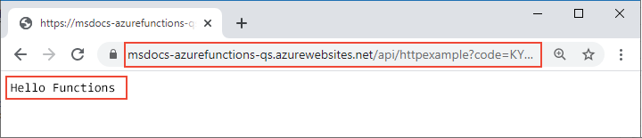

# <a name="connect-azure-functions-to-azure-storage-using-command-line-tools"></a>コマンド ライン ツールを使用して Azure Functions を Azure Storage に接続する

この記事では、[前のクイックスタート](functions-create-first-azure-function-azure-cli.md)で作成したストレージ アカウントと関数に Azure Storage キューを統合します。 この統合は、HTTP 要求からキュー内のメッセージにデータを書き込む "*出力バインディング*" を使用して実現します。 この記事を完了しても、前のクイックスタートの数セントを超えるコストが追加で発生することはありません。 バインドの詳細については、「[Azure Functions でのトリガーとバインドの概念](functions-triggers-bindings.md)」を参照してください。

## <a name="configure-your-local-environment"></a>ローカル環境を構成する

開始する前に、「[クイックスタート:コマンド ラインから Azure Functions プロジェクトを作成する](functions-create-first-azure-function-azure-cli.md)」という記事を終える必要があります。 その記事の最後でリソースをクリーンアップした場合は、もう一度手順に従って Azure で関数アプリと関連リソースを再作成してください。

[!INCLUDE [functions-cli-get-storage-connection](../../includes/functions-cli-get-storage-connection.md)]

[!INCLUDE [functions-register-storage-binding-extension-csharp](../../includes/functions-register-storage-binding-extension-csharp.md)]

[!INCLUDE [functions-add-output-binding-cli](../../includes/functions-add-output-binding-cli.md)]

::: zone pivot="programming-language-csharp"  
[!INCLUDE [functions-add-storage-binding-csharp-library](../../includes/functions-add-storage-binding-csharp-library.md)]  
::: zone-end  
::: zone pivot="programming-language-java" 
[!INCLUDE [functions-add-output-binding-java-cli](../../includes/functions-add-output-binding-java-cli.md)]
::: zone-end   

バインディングの詳細については、「[Azure Functions でのトリガーとバインドの概念](functions-triggers-bindings.md)」と[キューの出力の構成](functions-bindings-storage-queue-output.md#configuration)に関する記事を参照してください。

## <a name="add-code-to-use-the-output-binding"></a>出力バインディングを使用するコードを追加する

キュー バインディングが定義されたら、`msg` 出力パラメーターを受け取ってメッセージをキューに書き込むように関数を更新することができます。

::: zone pivot="programming-language-python"     
[!INCLUDE [functions-add-output-binding-python](../../includes/functions-add-output-binding-python.md)]
::: zone-end  

::: zone pivot="programming-language-javascript"  
[!INCLUDE [functions-add-output-binding-js](../../includes/functions-add-output-binding-js.md)]
::: zone-end  

::: zone pivot="programming-language-typescript"  
[!INCLUDE [functions-add-output-binding-ts](../../includes/functions-add-output-binding-ts.md)]
::: zone-end  

::: zone pivot="programming-language-powershell"  
[!INCLUDE [functions-add-output-binding-powershell](../../includes/functions-add-output-binding-powershell.md)]  
::: zone-end

::: zone pivot="programming-language-csharp"  
[!INCLUDE [functions-add-storage-binding-csharp-library-code](../../includes/functions-add-storage-binding-csharp-library-code.md)]
::: zone-end 

::: zone pivot="programming-language-java"
[!INCLUDE [functions-add-output-binding-java-code](../../includes/functions-add-output-binding-java-code.md)]

[!INCLUDE [functions-add-output-binding-java-test-cli](../../includes/functions-add-output-binding-java-test-cli.md)]
::: zone-end

認証、キューの参照の取得、データの書き込みのためのコードを記述する必要が "*ない*" 点に注目してください。 これらの統合タスクはすべて、Azure Functions ランタイムとキュー出力バインディングで処理され、手間がかかりません。

[!INCLUDE [functions-run-function-test-local-cli](../../includes/functions-run-function-test-local-cli.md)]

[!INCLUDE [functions-extension-bundles-info](../../includes/functions-extension-bundles-info.md)]

## <a name="view-the-message-in-the-azure-storage-queue"></a>Azure Storage キューのメッセージを確認する

[!INCLUDE [functions-add-output-binding-view-queue-cli](../../includes/functions-add-output-binding-view-queue-cli.md)]

## <a name="redeploy-the-project-to-azure"></a>Azure にプロジェクトを再デプロイする

関数から Azure Storage キューにメッセージが書き込まれたことをローカルで確認したので、プロジェクトを再デプロイして、Azure 上で実行するようにエンドポイントを更新することができます。

::: zone pivot="programming-language-javascript,programming-language-typescript,programming-language-python,programming-language-powershell,programming-language-csharp" 
*LocalFunctionsProj* フォルダーで [`func azure functionapp publish`](functions-run-local.md#project-file-deployment) コマンドを使用してプロジェクトを再デプロイし、`<APP_NAME>` を自分のアプリの名前に置き換えます。

```
func azure functionapp publish <APP_NAME>
```
::: zone-end  

::: zone pivot="programming-language-java" 

ローカル プロジェクト フォルダーで、次の Maven コマンドを使用してプロジェクトを再発行します。
```
mvn azure-functions:deploy
```
::: zone-end

## <a name="verify-in-azure"></a>Azure で確認する

1. 前のクイックスタートと同様、ブラウザーまたは CURL を使用して、再デプロイした関数をテストします。

    # <a name="browser"></a>[ブラウザー](#tab/browser)
    
    publish コマンドの出力に表示されている完全な**呼び出し URL** にクエリ パラメーター `&name=Functions` を追加して、ブラウザーのアドレス バーにコピーします。 関数をローカルで実行したときと同様の出力がブラウザーに表示されるはずです。

    

    # <a name="curl"></a>[curl](#tab/curl)
    
    **呼び出し URL** にパラメーター `&name=Functions` を追加して [`curl`](https://curl.haxx.se/) を実行します。 "Hello Functions" というテキストがコマンドの出力として表示されます。
    
    

    --- 

1. 前セクションの説明に従って、もう一度ストレージ キューを確認します。キューに新しいメッセージが書き込まれていることを確かめてください。

## <a name="clean-up-resources"></a>リソースをクリーンアップする

終了後は、追加コストの発生を避けるために、次のコマンドを使用して、リソース グループとそこに含まれるすべてのリソースを削除してください。

```azurecli
az group delete --name AzureFunctionsQuickstart-rg
```

## <a name="next-steps"></a>次のステップ

HTTP によってトリガーされる関数を、ストレージ キューにデータを書き込むように更新しました。 この後は、Core Tools と Azure CLI を使用してコマンド ラインから行う Functions の開発について理解を深めましょう。

+ [Azure Functions Core Tools の操作](functions-run-local.md)  

::: zone pivot="programming-language-csharp"  
+ [C# での完全な関数プロジェクトの例](/samples/browse/?products=azure-functions&languages=csharp)。

+ [Azure Functions C# developer reference (Azure Functions C# 開発者向けリファレンス)](functions-dotnet-class-library.md)  
::: zone-end 
::: zone pivot="programming-language-javascript"  
+ [JavaScript での完全な関数プロジェクトの例](/samples/browse/?products=azure-functions&languages=javascript)。

+ [Azure Functions の JavaScript 開発者向けガイド](functions-reference-node.md)  
::: zone-end  
::: zone pivot="programming-language-typescript"  
+ [TypeScript での完全な関数プロジェクトの例](/samples/browse/?products=azure-functions&languages=typescript)。

+ [Azure Functions の TypeScript 開発者向けガイド](functions-reference-node.md#typescript)  
::: zone-end  
::: zone pivot="programming-language-python"  
+ [Python での完全な関数プロジェクトの例](/samples/browse/?products=azure-functions&languages=python)。

+ [Azure Functions の Python 開発者向けガイド](functions-reference-python.md)  
::: zone-end  
::: zone pivot="programming-language-powershell"  
+ [PowerShell での完全な関数プロジェクトの例](/samples/browse/?products=azure-functions&languages=azurepowershell)。

+ [Azure Functions の PowerShell 開発者向けガイド](functions-reference-powershell.md) 
::: zone-end
+ [Azure Functions triggers and bindings (Azure Functions のトリガーとバインド)](functions-triggers-bindings.md)

+ [Functions の価格に関するページ](https://azure.microsoft.com/pricing/details/functions/)

+ [従量課金プランのコストの見積もり](functions-consumption-costs.md) 
