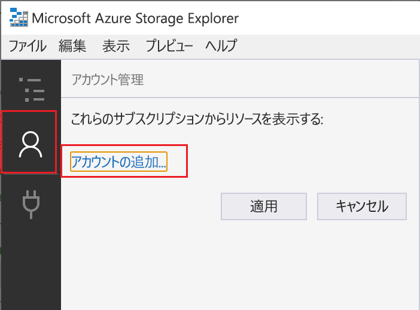
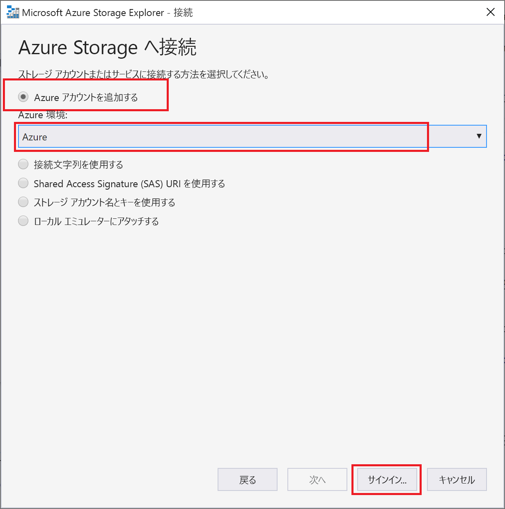
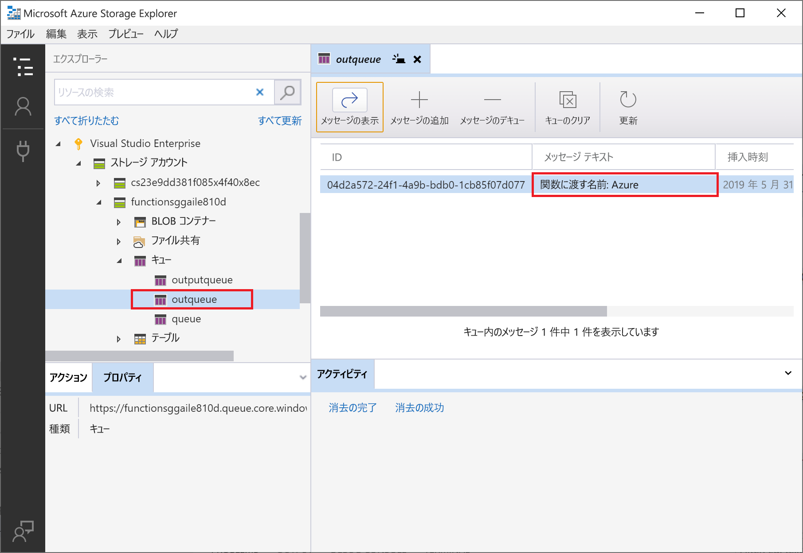
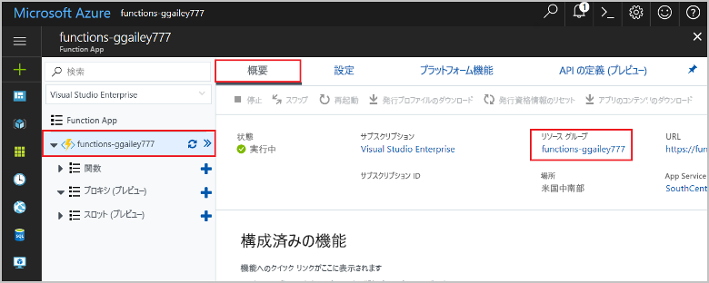

# <a name="connect-functions-to-azure-storage-using-visual-studio-code"></a>Visual Studio Code を使用して関数を Azure Storage に接続する

Azure Functions を使用すると、独自の統合コードを記述しなくても、Azure サービスやその他のリソースに関数を接続できます。 これらの*バインド*は、入力と出力の両方を表し、関数定義内で宣言されます。 バインドからのデータは、パラメーターとして関数に提供されます。 トリガーは、特殊な種類の入力バインドです。 関数はトリガーを 1 つしか持てませんが、複数の入力および出力バインドを持つことができます。 詳細については、「[Azure Functions でのトリガーとバインドの概念](functions-triggers-bindings.md)」を参照してください。

この記事では、Visual Studio Code を使用して、[前のクイックスタートの記事](functions-create-first-function-vs-code.md)で作成した関数を Azure Storage に接続する方法を説明します。 この関数に追加する出力バインドは、HTTP 要求のデータを Azure Queue storage キュー内のメッセージに書き込みます。 

ほとんどのバインドでは、バインドされているサービスにアクセスするために関数が使用する、保存されている接続文字列が必要です。 作業を簡単にするために、関数アプリで作成したストレージ アカウントを使用します。 このアカウントへの接続は、既に `AzureWebJobsStorage` という名前のアプリ設定に保存されています。  

## <a name="prerequisites"></a>前提条件

この記事を始める前に、以下の要件を満たす必要があります。

* [Visual Studio Code 用の Azure Storage 拡張機能](https://marketplace.visualstudio.com/items?itemName=ms-azuretools.vscode-azurestorage)をインストールする。
* [Azure Storage Explorer](https://storageexplorer.com/) をインストールする。 Storage Explorer は、出力バインドによって生成されるキュー メッセージの調査に使用するツールです。 Storage Explorer は、macOS、Windows、Linux ベースのオペレーティング システムでサポートされます。
* [.NET Core CLI ツール](https://docs.microsoft.com/dotnet/core/tools/?tabs=netcore2x)をインストールする (C# プロジェクトのみ)。
* [Visual Studio Code のクイックスタートのパート 1](functions-create-first-function-vs-code.md) の手順を完了する。 

この記事では、Visual Studio Code から Azure サブスクリプションに既にサインインしていることを前提としています。 コマンド パレットから `Azure: Sign In` を実行するとサインインできます。 

## <a name="download-the-function-app-settings"></a>関数アプリの設定をダウンロードする

[前のクイックスタートの記事](functions-create-first-function-vs-code.md)では、必要なストレージ アカウントと共に Azure で関数アプリを作成しました。 このアカウントの接続文字列は、Azure のアプリ設定に安全に格納されています。 この記事では、同じアカウントのストレージ キューにメッセージを書き込みます。 関数をローカルで実行しているときにストレージ アカウントに接続するには、アプリ設定を local.settings.json ファイルにダウンロードする必要があります。 

1. F1 キーを押してコマンド パレットを開き、コマンド `Azure Functions: Download Remote Settings....` を検索して実行します。 

1. 前の記事で作成した関数アプリを選択します。 **[すべてはい]** を選択して既存のローカル設定を上書きします。 

    > [!IMPORTANT]  
    > local.settings.json ファイルは、機密情報が含まれているため、公開されることはなく、ソース管理から除外されます。

1. ストレージ アカウントの接続文字列値のキーである `AzureWebJobsStorage` をコピーします。 この接続を使用して、出力バインドが期待どおりに動作することを確認します。

## <a name="register-binding-extensions"></a>バインディング拡張機能を登録する

Queue storage の出力バインドを使用しているため、このプロジェクトを実行する前に Storage のバインド拡張機能をインストールしておく必要があります。 

### <a name="javascript"></a>JavaScript

[!INCLUDE [functions-extension-bundles](../../includes/functions-extension-bundles.md)]

### <a name="c-class-library"></a>C\# クラス ライブラリ

HTTP トリガーとタイマー トリガーを除き、バインドは拡張機能パッケージとして実装されます。 ターミナル ウィンドウで次の [dotnet add package](/dotnet/core/tools/dotnet-add-package) コマンドを実行して、Storage 拡張機能パッケージをプロジェクトに追加します。

```bash
dotnet add package Microsoft.Azure.WebJobs.Extensions.Storage --version 3.0.4
```

これで、Storage の出力バインドをプロジェクトに追加できるようになります。

## <a name="add-an-output-binding"></a>出力バインディングを追加する

Functions では、各種のバインドで、`direction`、`type`、および固有の `name` が function.json ファイル内で定義される必要があります。 これらの属性を定義する方法は、関数アプリの言語によって異なります。

### <a name="javascript"></a>JavaScript

バインドの属性は、function.json ファイルで直接定義されています。 バインドの種類によっては、追加のプロパティが必要になることもあります。 [キュー出力構成](functions-bindings-storage-queue.md#output---configuration)では、Azure Storage キュー バインドに必要なフィールドについて説明されています。 この拡張機能により、バインドを簡単に function.json ファイルに追加できます。 

バインドを作成するには、HttpTrigger フォルダー内の `function.json` ファイルを右クリック (macOS では Ctrl キーを押しながらクリック) して、 **[バインドの追加]** を選択します。プロンプトに従って、新しいバインドの次のバインド プロパティを定義します。

| Prompt | 値 | 説明 |
| -------- | ----- | ----------- |
| **Select binding direction (バインドの方向の選択)** | `out` | バインドは出力バインドです。 |
| **Select binding with direction... (方向を使用してバインドを選択する...)** | `Azure Queue Storage` | バインドは Azure Storage キュー バインドです。 |
| **The name used to identify this binding in your code (このバインドをコード内で特定するための名前)** | `msg` | コードで参照されているバインド パラメーターを識別する名前。 |
| **The queue to which the message will be sent (メッセージの送信先となるキュー)** | `outqueue` | バインドが書き込むキューの名前。 *queueName* が存在しない場合は、バインドによって最初に使用されるときに作成されます。 |
| **Select setting from "local.setting.json" ("local.setting.json" から設定を選択する)** | `AzureWebJobsStorage` | ストレージ アカウントの接続文字列を含むアプリケーション設定の名前。 `AzureWebJobsStorage` 設定には、関数アプリで作成したストレージ アカウントの接続文字列が含まれています。 |

バインドは、function.json ファイルの `bindings` 配列に追加されます。このファイルは次の例のようになります。

```json
{
   ...

  "bindings": [
    {
      "authLevel": "function",
      "type": "httpTrigger",
      "direction": "in",
      "name": "req",
      "methods": [
        "get",
        "post"
      ]
    },
    {
      "type": "http",
      "direction": "out",
      "name": "$return"
    },
    {
      "type": "queue",
      "direction": "out",
      "name": "msg",
      "queueName": "outqueue",
      "connection": "AzureWebJobsStorage"
    }
  ]
}
```

### <a name="c-class-library"></a>C\# クラス ライブラリ

C# クラス ライブラリ プロジェクトでは、バインドは関数メソッドのバインド属性として定義されます。 その後、function.json ファイルは、これらの属性に基づいて自動的に生成されます。

HttpTrigger.cs プロジェクト ファイルを開き、次の `using` ステートメントを追加します。

```cs
using Microsoft.Azure.WebJobs.Extensions.Storage;
```

次のパラメーターを `Run` メソッドの定義に追加します。

```cs
[Queue("outqueue"),StorageAccount("AzureWebJobsStorage")] ICollector<string> msg
```

`msg` パラメーターは `ICollector<T>` 型です。これは、関数の完了時に出力バインドに書き込まれるメッセージのコレクションを表します。 この場合、出力は `outqueue` という名前のストレージ キューです。 このストレージ アカウントの接続文字列は、`StorageAccountAttribute` で設定されます。 この属性は、ストレージ アカウントの接続文字列を含む設定を示し、クラス、メソッド、パラメーター レベルで適用できます。 この例では、既定のストレージ アカウントを既に使用しているため、`StorageAccountAttribute` を省略できます。

Run メソッドの定義は次のようになります。  

```cs
[FunctionName("HttpTrigger")]
public static async Task<IActionResult> Run(
    [HttpTrigger(AuthorizationLevel.Function, "get", "post", Route = null)] HttpRequest req, 
    [Queue("outqueue"),StorageAccount("AzureWebJobsStorage")] ICollector<string> msg, ILogger log)
```

## <a name="add-code-that-uses-the-output-binding"></a>出力バインディングを使用するコードを追加する

バインドが定義されたら、そのバインドの `name` を使用して、関数シグネチャの属性としてアクセスできます。 出力バインドを使用すると、認証、キュー参照の取得、またはデータの書き込みに、Azure Storage SDK のコードを使用する必要がなくなります。 Functions ランタイムおよびキューの出力バインドが、ユーザーに代わってこれらのタスクを処理します。

### <a name="javascript"></a>JavaScript

`context.bindings` の `msg` 出力バインド オブジェクトを使用してキュー メッセージを作成するコードを追加します。 このコードを `context.res` ステートメントの前に追加します。

```javascript
// Add a message to the Storage queue.
context.bindings.msg = "Name passed to the function: " + 
(req.query.name || req.body.name);
```

この時点で、関数は次のようになります。

```javascript
module.exports = async function (context, req) {
    context.log('JavaScript HTTP trigger function processed a request.');

    if (req.query.name || (req.body && req.body.name)) {
        // Add a message to the Storage queue.
        context.bindings.msg = "Name passed to the function: " + 
        (req.query.name || req.body.name);
        context.res = {
            // status: 200, /* Defaults to 200 */
            body: "Hello " + (req.query.name || req.body.name)
        };
    }
    else {
        context.res = {
            status: 400,
            body: "Please pass a name on the query string or in the request body"
        };
    }
};
```

### <a name="c"></a>C\#

`msg` 出力バインド オブジェクトを使用してキュー メッセージを作成するコードを追加します。 このコードは、メソッドから制御が戻る前に追加します。

```cs
if (!string.IsNullOrEmpty(name))
{
    // Add a message to the output collection.
    msg.Add(string.Format("Name passed to the function: {0}", name));
}
```

この時点で、関数は次のようになります。

```cs
[FunctionName("HttpTrigger")]
public static async Task<IActionResult> Run(
    [HttpTrigger(AuthorizationLevel.Function, "get", "post", Route = null)] HttpRequest req, 
    [Queue("outqueue"),StorageAccount("AzureWebJobsStorage")] ICollector<string> msg, ILogger log)
{
    log.LogInformation("C# HTTP trigger function processed a request.");

    string name = req.Query["name"];

    string requestBody = await new StreamReader(req.Body).ReadToEndAsync();
    dynamic data = JsonConvert.DeserializeObject(requestBody);
    name = name ?? data?.name;

    if (!string.IsNullOrEmpty(name))
    {
        // Add a message to the output collection.
        msg.Add(string.Format("Name passed to the function: {0}", name));
    }
    return name != null
        ? (ActionResult)new OkObjectResult($"Hello, {name}")
        : new BadRequestObjectResult("Please pass a name on the query string or in the request body");
}
```

[!INCLUDE [functions-run-function-test-local-vs-code](../../includes/functions-run-function-test-local-vs-code.md)]

出力バインディングを最初に使用するときに、**outqueue** という名前の新しいキューが、Functions ランタイムによってストレージ アカウントに作成されます。 このキューが新しいメッセージと共に作成されたことを確認するために、Storage Explorer を使用します。

### <a name="connect-storage-explorer-to-your-account"></a>ストレージ エクスプローラーをアカウントに接続する

既に Azure Storage Explorer をインストールして Azure アカウントに接続している場合は、このセクションをスキップしてください。

1. [Azure Storage Explorer] ツールを実行し、左側の接続アイコンを選択して、 **[アカウントの追加]** を選択します。

    

1. **[接続]** ダイアログで、 **[Add an Azure account]\(Azure アカウントを追加する\)** を選択し、お使いの **Azure 環境**を選択して、 **[サインイン]** を選択します。 

    

自分のアカウントへのサインインが成功すると、そのアカウントに関連付けられている Azure サブスクリプションがすべて表示されます。

### <a name="examine-the-output-queue"></a>出力キューを確認する

1. Visual Studio Code で、F1 キーを押してコマンド パレットを開き、コマンド `Azure Storage: Open in Storage Explorer` を検索して実行し、自分のストレージ アカウント名を選択します。 Azure Storage Explorer で自分のストレージ アカウントが開きます。  

1. **[キュー]** ノードを展開して、**outqueue** という名前のキューを選択します。 

   このキューには、HTTP によってトリガーされる関数を実行したときにキューの出力バインディングが作成されたというメッセージが含まれます。 *Azure* の既定の `name` 値で関数を呼び出した場合、キュー メッセージは「*Name passed to the function: Azure*」(関数に渡された名前: Azure) になります。

    

1. 関数を再度実行し、別の要求を送信すると、キューに新しいメッセージが表示されます。  

ここで、更新された関数アプリを Azure に再発行します。

## <a name="redeploy-and-test-the-updated-app"></a>更新したアプリを再デプロイしてテストする

1. Visual Studio Code で、F1 キーを押してコマンド パレットを開きます。 コマンド パレットで、`Azure Functions: Deploy to function app...` を検索して選択します。

1. 最初の記事で作成した関数アプリを選択します。 同じアプリにプロジェクトを再デプロイしているため、 **[デプロイ]** を選択して、ファイルの上書きに関する警告を無視します。

1. デプロイが完了したら、もう一度 curl またはブラウザーを使用して、再デプロイされた関数をテストすることができます。 次の例のように、前の手順と同様にクエリ文字列 `&name=<yourname>` を URL に追加します。

    ```bash
    curl https://myfunctionapp.azurewebsites.net/api/httptrigger?code=cCr8sAxfBiow548FBDLS1....&name=<yourname>
    ```

1. もう一度[ストレージ キューのメッセージを表示](#examine-the-output-queue)して、出力バインドによってキューに新しいメッセージが再生成されていることを確認します。

## <a name="clean-up-resources"></a>リソースのクリーンアップ

Azure の*リソース*とは、Function App、関数、ストレージ アカウントなどのことを指します。 これらは*リソース グループ*に分類されており、グループを削除することでグループ内のすべてのものを削除できます。

これらのクイックスタートを完了するためにリソースを作成しました。 これらのリソースには、[アカウントの状態](https://azure.microsoft.com/account/)と[サービスの価格](https://azure.microsoft.com/pricing/)に応じて課金される場合があります。 リソースの必要がなくなった場合にそれらを削除する方法を、次に示します。

1. Visual Studio Code で、F1 キーを押してコマンド パレットを開きます。 コマンド パレットで、`Azure Functions: Open in portal` を検索して選択します。

1. 関数アプリを選択し、Enter キーを押します。 その関数アプリのページが [Azure portal](https://portal.azure.com) で開きます。

1. **[概要]** タブの **[リソース グループ]** で名前付きリンクを選択します。

    

1. **[リソース グループ]** ページで、含まれているリソースの一覧を確認し、削除するものであることを確認します。
 
1. **[リソース グループの削除]** を選択し、指示に従います。

   削除には数分かかることがあります。 実行されると、通知が数秒間表示されます。 ページの上部にあるベルのアイコンを選択して、通知を表示することもできます。

## <a name="next-steps"></a>次の手順

HTTP によってトリガーされる関数を、ストレージ キューにデータを書き込むように更新しました。 Functions の開発の詳細については、「[Visual Studio Code を使用して Azure Functions を開発する](functions-develop-vs-code.md)」を参照してください。

次に、関数アプリに対して Application Insights の監視を有効にする必要があります。

> [!div class="nextstepaction"]
> [Application Insights との統合を有効にする](functions-monitoring.md#manually-connect-an-app-insights-resource)

[Azure Storage Explorer]: https://storageexplorer.com/
