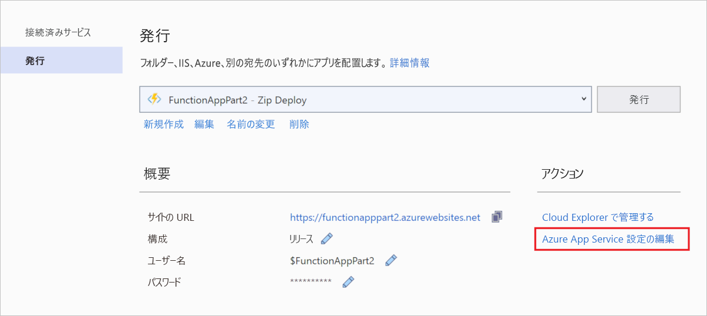

# <a name="connect-functions-to-azure-storage-using-visual-studio"></a>Visual Studio を使用して関数を Azure Storage に接続する

[!INCLUDE [functions-add-storage-binding-intro](../../includes/functions-add-storage-binding-intro.md)]

この記事では、Visual Studio を使用して、[前のクイックスタートの記事]で作成した関数を Azure Storage に接続する方法を説明します。 この関数に追加する出力バインドは、HTTP 要求のデータを Azure Queue storage キュー内のメッセージに書き込みます。 

ほとんどのバインドでは、バインドされているサービスにアクセスするために関数が使用する、保存されている接続文字列が必要です。 作業を簡単にするために、関数アプリで作成したストレージ アカウントを使用します。 このアカウントへの接続は、既に `AzureWebJobsStorage` という名前のアプリ設定に保存されています。  

## <a name="prerequisites"></a>前提条件

この記事を読み始める前に、以下を用意する必要があります。 

 - [Visual Studio クイックスタートのパート 1](./functions-create-first-function-vs-code.md) を完了します。 

- Visual Studio から対象の Azure サブスクリプションにサインインします。

## <a name="download-the-function-app-settings"></a>関数アプリの設定をダウンロードする

[前のクイックスタートの記事](functions-create-first-function-vs-code.md)では、必要なストレージ アカウントと共に Azure で関数アプリを作成しました。 このアカウントの接続文字列は、Azure のアプリ設定に安全に格納されています。 この記事では、同じアカウントのストレージ キューにメッセージを書き込みます。 関数をローカルで実行しているときにストレージ アカウントに接続するには、アプリ設定を *local.settings.json* ファイルにダウンロードする必要があります。 

1. **ソリューション エクスプローラー**で、プロジェクトを右クリックし、 **[発行]** を選択します。 

1. **[アクション]** で **[Azure App Service の設定を編集する]** を選択します。 

    

1. **[AzureWebJobsStorage]** で、 **[リモート]** の文字列値を **[ローカル]** にコピーし、 **[OK]** を選択します。 

接続に `AzureWebJobsStorage` 設定を使用するストレージ バインドは、ローカルで実行しているときに Queue storage に接続できるようになりました。

## <a name="register-binding-extensions"></a>バインディング拡張機能を登録する

Queue storage の出力バインドを使用しているため、このプロジェクトを実行する前に Storage のバインド拡張機能をインストールしておく必要があります。 HTTP トリガーとタイマー トリガーを除き、バインドは拡張機能パッケージとして実装されます。 

1. **[ツール]** メニューで、 **[NuGet パッケージ マネージャー]**  >  **[パッケージ マネージャー コンソール]** の順に選択します。 

1. コンソールで次の [Install-Package](/nuget/tools/ps-ref-install-package) コマンドを実行して、ストレージ拡張機能をインストールします。

    ```Command
    Install-Package Microsoft.Azure.WebJobs.Extensions.Storage -Version 3.0.6
    ````

これで、Storage の出力バインドをプロジェクトに追加できるようになります。

## <a name="add-an-output-binding"></a>出力バインディングを追加する

[!INCLUDE [functions-add-storage-binding-csharp-library](../../includes/functions-add-storage-binding-csharp-library.md)]

## <a name="add-code-that-uses-the-output-binding"></a>出力バインディングを使用するコードを追加する

バインドが定義されたら、そのバインドの `name` を使用して、関数シグネチャの属性としてアクセスできます。 出力バインドを使用すると、認証、キュー参照の取得、またはデータの書き込みに、Azure Storage SDK のコードを使用する必要がなくなります。 Functions ランタイムおよびキューの出力バインドが、ユーザーに代わってこれらのタスクを処理します。

[!INCLUDE [functions-add-storage-binding-csharp-library-code](../../includes/functions-add-storage-binding-csharp-library-code.md)]

## <a name="run-the-function-locally"></a>関数をローカルで実行する

[!INCLUDE [functions-run-function-test-local-vs](../../includes/functions-run-function-test-local-vs.md)]

出力バインディングを最初に使用するときに、`outqueue` という名前の新しいキューが、Functions ランタイムによってストレージ アカウントに作成されます。 このキューが新しいメッセージと共に作成されたことを確認するために、Cloud Explorer を使用します。

## <a name="examine-the-output-queue"></a>出力キューを確認する

1. Visual Studio の **[表示]** メニューで、 **[Cloud Explorer]** を選択します。

1. **Cloud Explorer** で、Azure サブスクリプションと**ストレージ アカウント**を展開してから、関数で使用されているストレージ アカウントを展開します。 ストレージ アカウント名を思い出せない場合は、*local.settings.json* ファイルの `AzureWebJobsStorage` 接続文字列設定を確認してください。  

1. **[キュー]** ノードを展開し、**outqueue** という名前のキューをダブルクリックして、Visual Studio でキューの内容を表示します。 

   このキューには、HTTP によってトリガーされる関数を実行したときにキューの出力バインディングが作成されたというメッセージが含まれます。 *Azure* の既定の `name` 値で関数を呼び出した場合、キュー メッセージは「*Name passed to the function: Azure*」(関数に渡された名前: Azure) になります。

    

1. 関数を再度実行し、別の要求を送信すると、キューに新しいメッセージが表示されます。  

ここで、更新された関数アプリを Azure に再発行します。

## <a name="redeploy-and-verify-the-updated-app"></a>更新したアプリを再デプロイして検証する

1. **ソリューション エクスプローラー**で、プロジェクトを右クリックして **[発行]** を選択し、 **[発行]** を選択してプロジェクトを Azure に再発行します。

1. デプロイが完了したら、もう一度ブラウザーを使用して、再デプロイされた関数をテストすることができます。 前のように、URL にクエリ文字列 `&name=<yourname>` を追加します。

1. もう一度[ストレージ キューのメッセージを表示](#examine-the-output-queue)して、出力バインドによってキューに新しいメッセージが再生成されていることを確認します。

## <a name="clean-up-resources"></a>リソースのクリーンアップ

[!INCLUDE [Clean-up resources](../../includes/functions-quickstart-cleanup.md)]

## <a name="next-steps"></a>次の手順

HTTP によってトリガーされる関数を、ストレージ キューにデータを書き込むように更新しました。 Functions の開発の詳細については、「[Visual Studio を使用して Azure Functions を開発する](functions-develop-vs.md)」を参照してください。

次に、関数アプリに対して Application Insights の監視を有効にする必要があります。

> [!div class="nextstepaction"]
> [Application Insights との統合を有効にする](functions-monitoring.md#manually-connect-an-app-insights-resource)

[Azure Storage Explorer]: https://storageexplorer.com/
[前のクイックスタートの記事]: functions-create-your-first-function-visual-studio.md
