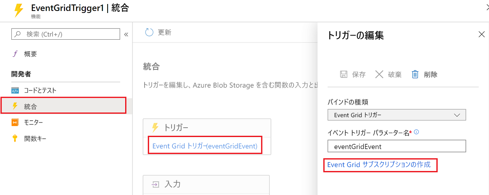
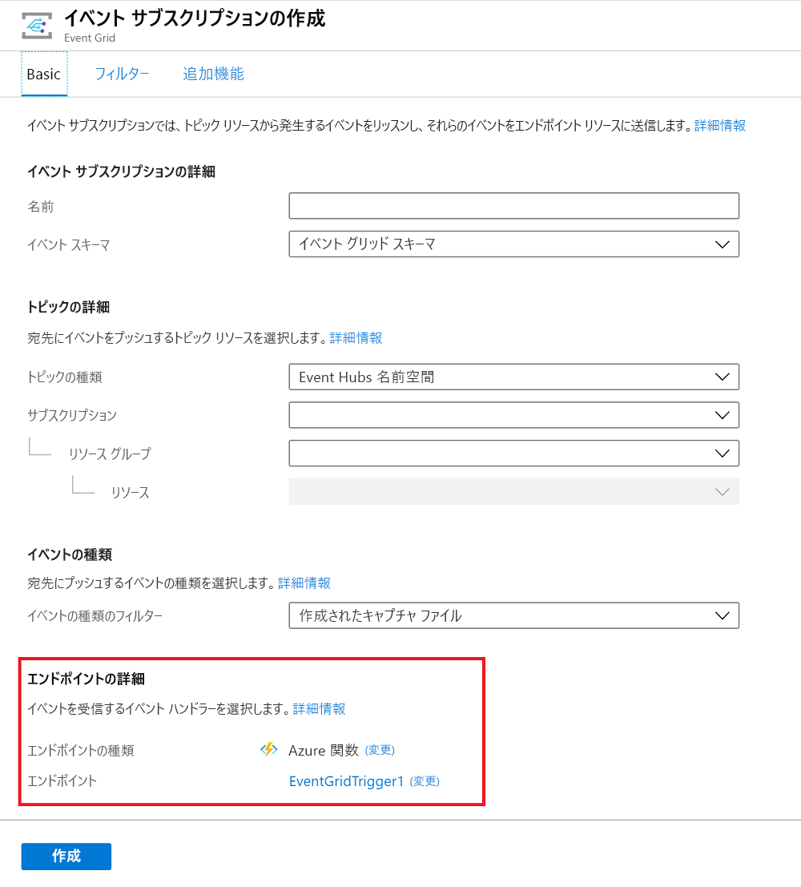

# <a name="azure-event-grid-trigger-for-azure-functions"></a>Azure Functions の Azure Event Grid トリガー

Event Grid に送信されたイベントに応答するには、関数トリガーを使用します。

セットアップと構成の詳細については、[概要](./functions-bindings-event-grid.md)を参照してください。

## <a name="example"></a>例

# <a name="c"></a>[C#](#tab/csharp)

HTTP トリガーの例については、「[HTTP エンドポイントへのイベントの受信](../event-grid/receive-events.md)」を参照してください。

### <a name="c-2x-and-higher"></a>C# (2.x 以降)

次の例は、[ にバインドする](functions-dotnet-class-library.md) C# 関数`EventGridEvent`を示したものです。

```cs
using Microsoft.Azure.EventGrid.Models;
using Microsoft.Azure.WebJobs;
using Microsoft.Azure.WebJobs.Extensions.EventGrid;
using Microsoft.Azure.WebJobs.Host;
using Microsoft.Extensions.Logging;

namespace Company.Function
{
    public static class EventGridTriggerCSharp
    {
        [FunctionName("EventGridTest")]
        public static void EventGridTest([EventGridTrigger]EventGridEvent eventGridEvent, ILogger log)
        {
            log.LogInformation(eventGridEvent.Data.ToString());
        }
    }
}
```

詳しくは、「パッケージ」、「[属性](#attributes-and-annotations)」、「[構成](#configuration)」、および「[使用法](#usage)」をご覧ください。

### <a name="version-1x"></a>バージョン 1.x

次の例は、[ にバインドする Functions 1.x の ](functions-dotnet-class-library.md)C# 関数`JObject`を示したものです。

```cs
using Microsoft.Azure.WebJobs;
using Microsoft.Azure.WebJobs.Extensions.EventGrid;
using Microsoft.Azure.WebJobs.Host;
using Newtonsoft.Json;
using Newtonsoft.Json.Linq;
using Microsoft.Extensions.Logging;

namespace Company.Function
{
    public static class EventGridTriggerCSharp
    {
        [FunctionName("EventGridTriggerCSharp")]
        public static void Run([EventGridTrigger]JObject eventGridEvent, ILogger log)
        {
            log.LogInformation(eventGridEvent.ToString(Formatting.Indented));
        }
    }
}
```

# <a name="c-script"></a>[C# スクリプト](#tab/csharp-script)

次の例は、*function.json* ファイルのトリガー バインドと、そのバインドが使用される [C# スクリプト関数](functions-reference-csharp.md)を示しています。

*function.json* ファイルのバインディング データを次に示します。

```json
{
  "bindings": [
    {
      "type": "eventGridTrigger",
      "name": "eventGridEvent",
      "direction": "in"
    }
  ],
  "disabled": false
}
```

### <a name="version-2x-and-higher"></a>バージョン 2.x 以降

`EventGridEvent` にバインドする例を次に示します。

```csharp
#r "Microsoft.Azure.EventGrid"
using Microsoft.Azure.EventGrid.Models;
using Microsoft.Extensions.Logging;

public static void Run(EventGridEvent eventGridEvent, ILogger log)
{
    log.LogInformation(eventGridEvent.Data.ToString());
}
```

詳しくは、「パッケージ」、「[属性](#attributes-and-annotations)」、「[構成](#configuration)」、および「[使用法](#usage)」をご覧ください。

### <a name="version-1x"></a>バージョン 1.x

`JObject` にバインドする Functions 1.x の C# スクリプト コードを次に示します。

```cs
#r "Newtonsoft.Json"

using Newtonsoft.Json;
using Newtonsoft.Json.Linq;

public static void Run(JObject eventGridEvent, TraceWriter log)
{
    log.Info(eventGridEvent.ToString(Formatting.Indented));
}
```

# <a name="javascript"></a>[JavaScript](#tab/javascript)

次の例は、*function.json* ファイルのトリガー バインドと、そのバインドを使用する [JavaScript 関数](functions-reference-node.md)を示しています。

*function.json* ファイルのバインディング データを次に示します。

```json
{
  "bindings": [
    {
      "type": "eventGridTrigger",
      "name": "eventGridEvent",
      "direction": "in"
    }
  ],
  "disabled": false
}
```

JavaScript コードを次に示します。

```javascript
module.exports = function (context, eventGridEvent) {
    context.log("JavaScript Event Grid function processed a request.");
    context.log("Subject: " + eventGridEvent.subject);
    context.log("Time: " + eventGridEvent.eventTime);
    context.log("Data: " + JSON.stringify(eventGridEvent.data));
    context.done();
};
```

# <a name="python"></a>[Python](#tab/python)

次の例は、*function.json* ファイルのトリガー バインドと、そのバインドが使用される [Python 関数](functions-reference-python.md)を示しています。

*function.json* ファイルのバインディング データを次に示します。

```json
{
  "bindings": [
    {
      "type": "eventGridTrigger",
      "name": "event",
      "direction": "in"
    }
  ],
  "disabled": false,
  "scriptFile": "__init__.py"
}
```

Python コードを次に示します。

```python
import json
import logging

import azure.functions as func

def main(event: func.EventGridEvent):

    result = json.dumps({
        'id': event.id,
        'data': event.get_json(),
        'topic': event.topic,
        'subject': event.subject,
        'event_type': event.event_type,
    })

    logging.info('Python EventGrid trigger processed an event: %s', result)
```

# <a name="java"></a>[Java](#tab/java)

このセクションには、次の例が含まれています。

* [Event Grid グリッド トリガー、文字列パラメーター](#event-grid-trigger-string-parameter)
* [Event Grid グリッド トリガー、POJO パラメーター](#event-grid-trigger-pojo-parameter)

次の例は、バインドを使用してイベントを出力する [Java](functions-reference-java.md) のトリガー バインドを示しています。最初の例ではイベントを `String` として受け取り、2 番目の例では POJO として受け取ります。

### <a name="event-grid-trigger-string-parameter"></a>Event Grid グリッド トリガー、文字列パラメーター

```java
  @FunctionName("eventGridMonitorString")
  public void logEvent(
    @EventGridTrigger(
      name = "event"
    ) 
    String content, 
    final ExecutionContext context) {
      context.getLogger().info("Event content: " + content);      
  }
```

### <a name="event-grid-trigger-pojo-parameter"></a>Event Grid グリッド トリガー、POJO パラメーター

この例では、次の POJO が使用されています。Event Grid イベントの最上位プロパティを表します。

```java
import java.util.Date;
import java.util.Map;

public class EventSchema {

  public String topic;
  public String subject;
  public String eventType;
  public Date eventTime;
  public String id;
  public String dataVersion;
  public String metadataVersion;
  public Map<String, Object> data;

}
```

受け取り時、イベントの JSON ペイロードが ```EventSchema``` POJO に逆シリアル化され、関数で使用されます。 このプロセスにより、関数はオブジェクト指向でイベントのプロパティにアクセスできます。

```java
  @FunctionName("eventGridMonitor")
  public void logEvent(
    @EventGridTrigger(
      name = "event"
    ) 
    EventSchema event, 
    final ExecutionContext context) {
      context.getLogger().info("Event content: ");
      context.getLogger().info("Subject: " + event.subject);
      context.getLogger().info("Time: " + event.eventTime); // automatically converted to Date by the runtime
      context.getLogger().info("Id: " + event.id);
      context.getLogger().info("Data: " + event.data);
  }
```

[Java 関数ランタイム ライブラリ](/java/api/overview/azure/functions/runtime)で、その値が EventGrid に由来するパラメーター上で `EventGridTrigger` 注釈を使用します。 これらの注釈を使用したパラメーターによって、イベントを受信したときに関数が実行されます。  この注釈は、Java のネイティブ型、POJO、または `Optional<T>` を使用した null 許容値で使用できます。

---

## <a name="attributes-and-annotations"></a>属性と注釈

# <a name="c"></a>[C#](#tab/csharp)

[C# クラス ライブラリ](functions-dotnet-class-library.md)では、[EventGridTrigger](https://github.com/Azure/azure-functions-eventgrid-extension/blob/master/src/EventGridExtension/TriggerBinding/EventGridTriggerAttribute.cs) 属性を使用します。

メソッド シグネチャでの `EventGridTrigger` 属性を次に示します。

```csharp
[FunctionName("EventGridTest")]
public static void EventGridTest([EventGridTrigger] JObject eventGridEvent, ILogger log)
{
    ...
}
```

完全な例については、「C# の例」を参照してください。

# <a name="c-script"></a>[C# スクリプト](#tab/csharp-script)

属性は、C# スクリプトではサポートされていません。

# <a name="javascript"></a>[JavaScript](#tab/javascript)

属性は、JavaScript ではサポートされていません。

# <a name="python"></a>[Python](#tab/python)

属性は、Python ではサポートされていません。

# <a name="java"></a>[Java](#tab/java)

[EventGridTrigger](https://github.com/Azure/azure-functions-java-library/blob/master/src/main/java/com/microsoft/azure/functions/annotation/EventGridTrigger.java) 注釈を使用すると、構成値を指定して、Event Grid のバインディングを宣言によって構成できます。 詳細については、[例](#example)と[構成](#configuration)に関するセクションを参照してください。

---

## <a name="configuration"></a>構成

次の表は、*function.json* ファイルで設定したバインド構成のプロパティを説明しています。 `EventGridTrigger` 属性で設定するコンストラクター パラメーターまたはプロパティはありません。

|function.json のプロパティ |説明|
|---------|---------|
| **type** | 必須 - `eventGridTrigger` に設定する必要があります。 |
| **direction** | 必須 - `in` に設定する必要があります。 |
| **name** | 必須 - イベント データを受信するパラメーターの、関数コードで使われている変数名。 |

## <a name="usage"></a>使用法

# <a name="c"></a>[C#](#tab/csharp)

Azure Functions 1.x では、Event Grid トリガーに次のパラメーター型を使用できます。

* `JObject`
* `string`

Azure Functions 2.x では、Event Grid トリガーに次のパラメーター型を使用することもできます。

* `Microsoft.Azure.EventGrid.Models.EventGridEvent`- すべてのイベントの種類に共通するフィールドのプロパティを定義します。

> [!NOTE]
> Functions 1.x では、`Microsoft.Azure.WebJobs.Extensions.EventGrid.EventGridEvent` にバインドしようとした場合、コンパイラに「非推奨」メッセージが表示され、代わりに `Microsoft.Azure.EventGrid.Models.EventGridEvent` 使用するよう推奨されます。 新しい種類を使用するには、[Microsoft.Azure.EventGrid](https://www.nuget.org/packages/Microsoft.Azure.EventGrid) NuGet パッケージを参照し、`EventGridEvent` の種類名の先頭に `Microsoft.Azure.EventGrid.Models` を付けることによって完全修飾します。

# <a name="c-script"></a>[C# スクリプト](#tab/csharp-script)

Azure Functions 1.x では、Event Grid トリガーに次のパラメーター型を使用できます。

* `JObject`
* `string`

Azure Functions 2.x では、Event Grid トリガーに次のパラメーター型を使用することもできます。

* `Microsoft.Azure.EventGrid.Models.EventGridEvent`- すべてのイベントの種類に共通するフィールドのプロパティを定義します。

> [!NOTE]
> Functions 1.x では、`Microsoft.Azure.WebJobs.Extensions.EventGrid.EventGridEvent` にバインドしようとした場合、コンパイラに「非推奨」メッセージが表示され、代わりに `Microsoft.Azure.EventGrid.Models.EventGridEvent` 使用するよう推奨されます。 新しい種類を使用するには、[Microsoft.Azure.EventGrid](https://www.nuget.org/packages/Microsoft.Azure.EventGrid) NuGet パッケージを参照し、`EventGridEvent` の種類名の先頭に `Microsoft.Azure.EventGrid.Models` を付けることによって完全修飾します。 C# スクリプト関数で NuGet パッケージを参照する方法については、「[NuGet パッケージを使用する](functions-reference-csharp.md#using-nuget-packages)」をご覧ください

# <a name="javascript"></a>[JavaScript](#tab/javascript)

Event Grid インスタンスは、*function.json* ファイルの `name` プロパティで構成されたパラメーターを介して使用できます。

# <a name="python"></a>[Python](#tab/python)

Event Grid インスタンスは、*function.json* ファイルの `name` プロパティで構成されたパラメーターを介して、`func.EventGridEvent` と型指定して使用できます。

# <a name="java"></a>[Java](#tab/java)

Event Grid インスタンスは、`EventGridTrigger` 属性に関連付けられたパラメーターを介して、`EventSchema` と型指定して使用できます。 詳細については、[例](#example)を参照してください。

---

## <a name="event-schema"></a>イベント スキーマ

Event Grid イベントのデータは、HTTP 要求の本文内の JSON オブジェクトとして受信されます。 JSON は次の例のようになります。

```json
[{
  "topic": "/subscriptions/{subscriptionid}/resourceGroups/eg0122/providers/Microsoft.Storage/storageAccounts/egblobstore",
  "subject": "/blobServices/default/containers/{containername}/blobs/blobname.jpg",
  "eventType": "Microsoft.Storage.BlobCreated",
  "eventTime": "2018-01-23T17:02:19.6069787Z",
  "id": "{guid}",
  "data": {
    "api": "PutBlockList",
    "clientRequestId": "{guid}",
    "requestId": "{guid}",
    "eTag": "0x8D562831044DDD0",
    "contentType": "application/octet-stream",
    "contentLength": 2248,
    "blobType": "BlockBlob",
    "url": "https://egblobstore.blob.core.windows.net/{containername}/blobname.jpg",
    "sequencer": "000000000000272D000000000003D60F",
    "storageDiagnostics": {
      "batchId": "{guid}"
    }
  },
  "dataVersion": "",
  "metadataVersion": "1"
}]
```

示されている例は、1 要素の配列です。 Event Grid は常に配列を送信し、配列で複数のイベントを送信できます。 ランタイムは、配列の各要素に対して 1 回、関数を呼び出します。

イベント JSON データの最上位レベルのプロパティはすべてのイベントの種類で同じですが、`data` プロパティの内容は各イベントの種類に固有です。 この例では、BLOB ストレージ イベントのものです。

共通プロパティとイベント固有プロパティについて詳しくは、Event Grid のドキュメントの「[イベントのプロパティ](../event-grid/event-schema.md#event-properties)」をご覧ください。

`EventGridEvent` 型では、最上位レベルのプロパティのみが定義されています。`Data` プロパティは `JObject` です。

## <a name="create-a-subscription"></a>サブスクリプションの作成

Event Grid の HTTP 要求の受信を始めるには、関数を呼び出すエンドポイント URL を指定する Event Grid サブスクリプションを作成します。

### <a name="azure-portal"></a>Azure portal

Event Grid トリガーを使って Azure Portal で開発した関数の場合は、 **[vent Grid サブスクリプションの追加]** を選びます。



このリンクを選ぶと、ポータルに **[イベント サブスクリプションの作成]** ページが表示され、エンドポイント URL があらかじめ設定されています。



Azure Portal を使ってサブスクリプションを作成する方法について詳しくは、Event Grid のドキュメントの「[カスタム イベントの作成 - Azure Portal](../event-grid/custom-event-quickstart-portal.md)」をご覧ください。

### <a name="azure-cli"></a>Azure CLI

[Azure CLI](https://docs.microsoft.com/cli/azure/get-started-with-azure-cli?view=azure-cli-latest) を使ってサブスクリプションを作成するには、[az eventgrid event-subscription create](https://docs.microsoft.com/cli/azure/eventgrid/event-subscription?view=azure-cli-latest#az-eventgrid-event-subscription-create) コマンドを使います。

このコマンドには、関数を呼び出すエンドポイント URL が必要です。 バージョン固有の URL パターンの例を次に示します。

#### <a name="version-2x-and-higher-runtime"></a>バージョン 2.x (以降) のランタイム

    https://{functionappname}.azurewebsites.net/runtime/webhooks/eventgrid?functionName={functionname}&code={systemkey}

#### <a name="version-1x-runtime"></a>バージョン 1.x ランタイム

    https://{functionappname}.azurewebsites.net/admin/extensions/EventGridExtensionConfig?functionName={functionname}&code={systemkey}

システム キーは、Event Grid トリガー用のエンドポイント URL に含める必要のある承認キーです。 次のセクションでは、システム キーを取得する方法について説明します。

BLOB ストレージ アカウントをサブスクライブする例を次に示します (システム キーのプレースホルダーを含みます)。

#### <a name="version-2x-and-higher-runtime"></a>バージョン 2.x (以降) のランタイム

```azurecli
az eventgrid resource event-subscription create -g myResourceGroup \
--provider-namespace Microsoft.Storage --resource-type storageAccounts \
--resource-name myblobstorage12345 --name myFuncSub  \
--included-event-types Microsoft.Storage.BlobCreated \
--subject-begins-with /blobServices/default/containers/images/blobs/ \
--endpoint https://mystoragetriggeredfunction.azurewebsites.net/runtime/webhooks/eventgrid?functionName=imageresizefunc&code=<key>
```

#### <a name="version-1x-runtime"></a>バージョン 1.x ランタイム

```azurecli
az eventgrid resource event-subscription create -g myResourceGroup \
--provider-namespace Microsoft.Storage --resource-type storageAccounts \
--resource-name myblobstorage12345 --name myFuncSub  \
--included-event-types Microsoft.Storage.BlobCreated \
--subject-begins-with /blobServices/default/containers/images/blobs/ \
--endpoint https://mystoragetriggeredfunction.azurewebsites.net/admin/extensions/EventGridExtensionConfig?functionName=imageresizefunc&code=<key>
```

サブスクリプションを作成する方法について詳しくは、[BLOB ストレージのクイック スタート](../storage/blobs/storage-blob-event-quickstart.md#subscribe-to-your-storage-account)または他の Event Grid クイック スタートのページをご覧ください。

### <a name="get-the-system-key"></a>システム キーを取得する

次の API (HTTP GET) を使って、システム キーを取得できます。

#### <a name="version-2x-and-higher-runtime"></a>バージョン 2.x (以降) のランタイム

```
http://{functionappname}.azurewebsites.net/admin/host/systemkeys/eventgrid_extension?code={masterkey}
```

#### <a name="version-1x-runtime"></a>バージョン 1.x ランタイム

```
http://{functionappname}.azurewebsites.net/admin/host/systemkeys/eventgridextensionconfig_extension?code={masterkey}
```

これは管理 API なので、お使いの関数アプリの[マスター キー](functions-bindings-http-webhook-trigger.md#authorization-keys)が必要です。 システム キー (Event Grid トリガー関数を呼び出す場合) とマスター キー (関数アプリで管理タスクを実行する場合) を混同しないでください。 Event Grid トピックをサブスクライブするときは、システム キーを使います。

システム キーを提供する応答の例を次に示します。

```
{
  "name": "eventgridextensionconfig_extension",
  "value": "{the system key for the function}",
  "links": [
    {
      "rel": "self",
      "href": "{the URL for the function, without the system key}"
    }
  ]
}
```

ポータルの **[Function App の設定]** タブから関数アプリのマスター キーを取得できます。

> [!IMPORTANT]
> マスター キーでは、関数アプリへの管理者アクセス権が提供されます。 このキーを第三者と共有したり、ネイティブ クライアント アプリケーションで配布したりしないでください。

詳しくは、HTTP トリガーのリファレンス記事の「[承認キー](functions-bindings-http-webhook-trigger.md#authorization-keys)」をご覧ください。

代わりに、HTTP PUT を送信して自分でキーの値を指定することもできます。

## <a name="local-testing-with-viewer-web-app"></a>ビューアー Web アプリでのローカル テスト

Event Grid トリガーをローカルにテストするには、クラウド内の送信元からローカル コンピューターに配信された Event Grid の HTTP 要求を取得する必要があります。 これを行う方法の 1 つは、オンラインで要求をキャプチャし、ローカル コンピューター上でそれを手動で再送信することです。

1. イベント メッセージをキャプチャする[ビューアー Web アプリを作成](#create-a-viewer-web-app)します。
1. ビューアー アプリにイベントを送信する [Event Grid サブスクリプションを作成](#create-an-event-grid-subscription)します。
1. [要求を生成](#generate-a-request)し、ビューアー アプリから要求本文をコピーします。
1. Event Grid トリガー関数の localhost URL に[要求を手動で投稿](#manually-post-the-request)します。

テストが完了したら、エンドポイントを更新することで、同じサブスクリプションを運用環境に使うことができます。 [az eventgrid event-subscription update](https://docs.microsoft.com/cli/azure/eventgrid/event-subscription?view=azure-cli-latest#az-eventgrid-event-subscription-update) Azure CLI コマンドを使います。

### <a name="create-a-viewer-web-app"></a>ビューアー Web アプリを作成する

イベント メッセージのキャプチャを簡素化するために、イベント メッセージを表示する[構築済みの Web アプリ](https://github.com/Azure-Samples/azure-event-grid-viewer)をデプロイすることができます。 デプロイされたソリューションには、App Service プラン、App Service Web アプリ、および GitHub からのソース コードが含まれています。

**[Deploy to Azure]\(Azure にデプロイ\)** を選択して、ソリューションをサブスクリプションにデプロイします。 Azure portal で、パラメーターの値を指定します。

<a href="https://portal.azure.com/#create/Microsoft.Template/uri/https%3A%2F%2Fraw.githubusercontent.com%2FAzure-Samples%2Fazure-event-grid-viewer%2Fmaster%2Fazuredeploy.json" target="_blank"></a>

デプロイが完了するまでに数分かかる場合があります。 デプロイが成功した後で、Web アプリを表示して、実行されていることを確認します。 Web ブラウザーで `https://<your-site-name>.azurewebsites.net` にアクセスします

サイトは表示されますが、イベントはまだ送信されていません。


### <a name="create-an-event-grid-subscription"></a>Event Grid のサブスクリプションを作成する

テストする種類の Event Grid サブスクリプションを作成し、イベント通知のエンドポイントとして Web アプリからの URL を指定します。 Web アプリのエンドポイントには、サフィックス `/api/updates/` が含まれている必要があります。 したがって、完全な URL は `https://<your-site-name>.azurewebsites.net/api/updates` となります。

Azure Portal を使ってサブスクリプションを作成する方法については、Event Grid のドキュメントの「[カスタム イベントの作成 - Azure Portal](../event-grid/custom-event-quickstart-portal.md)」を参照してください。

### <a name="generate-a-request"></a>要求を生成する

Web アプリ エンドポイントへの HTTP トラフィックを生成するイベントをトリガーします。  たとえば、BLOB ストレージ サブスクリプションを作成した場合は、BLOB をアップロードまたは削除します。 要求が Web アプリに表示されたら、要求本文をコピーします。

最初に、サブスクリプション検証要求を受信します。検証要求はすべて無視し、イベント要求をコピーします。


### <a name="manually-post-the-request"></a>要求を手動で投稿する

Event Grid 関数をローカルで実行します。

[Postman](https://www.getpostman.com/) や [curl](https://curl.haxx.se/docs/httpscripting.html) などのツールを使って、HTTP POST 要求を作成します。

* `Content-Type: application/json` ヘッダーを設定します。
* `aeg-event-type: Notification` ヘッダーを設定します。
* 要求本文に RequestBin のデータを貼り付けます。
* Event Grid トリガー関数の URL に投稿します。
  * 2\.x 以降の場合は、次のパターンを使用します。

    ```
    http://localhost:7071/runtime/webhooks/eventgrid?functionName={FUNCTION_NAME}
    ```

  * 1\.x の場合は、以下を使用します。

    ```
    http://localhost:7071/admin/extensions/EventGridExtensionConfig?functionName={FUNCTION_NAME}
    ```

`functionName` パラメーターには、`FunctionName` 属性で指定されている名前を指定する必要があります。

次のスクリーンショットでは、Postman のヘッダーと要求本文を示します。


Event Grid トリガー関数が実行されて、次の例のようなログが表示されます。


## <a name="next-steps"></a>次のステップ

* [Event Grid イベントをディスパッチする](./functions-bindings-event-grid-output.md)
