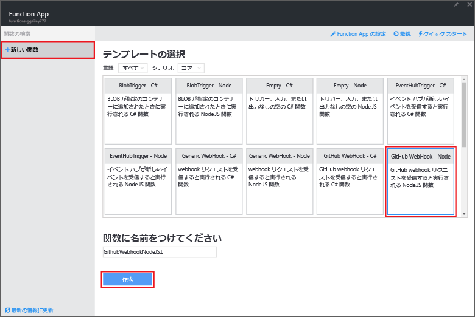
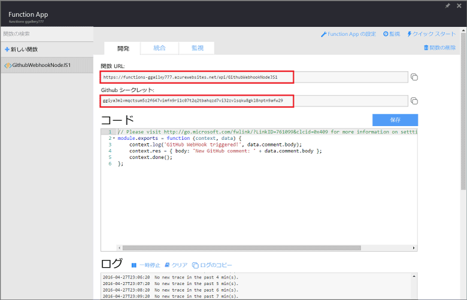
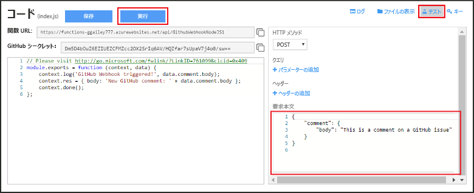
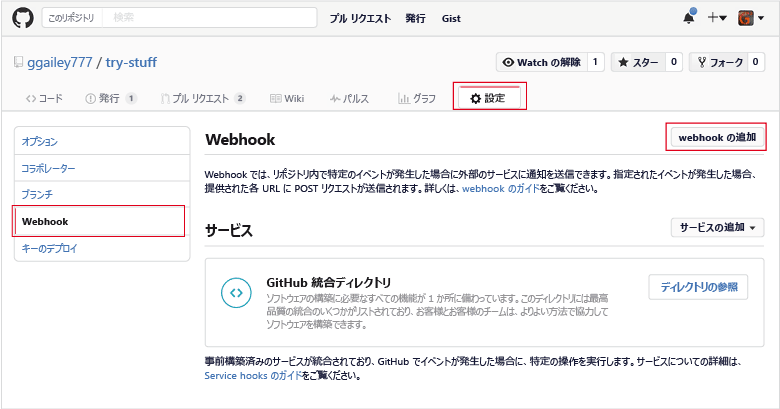
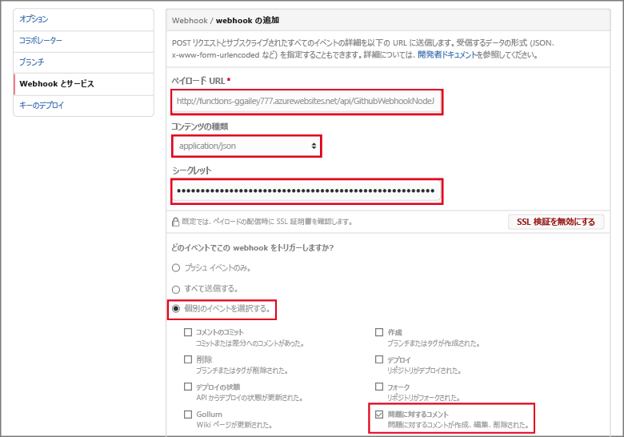

# webhook または API Azure Function を作成する
Azure Functions では、イベント ドリブンでオンデマンドのコンピューティング体験により、スケジュールやトリガーが設定されたコード ユニットを、さまざまなプログラミング言語で作成できます。 Azure Functions の詳細については、「 [Azure Functions の概要](functions-overview.md)」を参照してください。

このトピックでは、GitHub webhook で呼び出される JavaScript 関数を作成する方法を示します。 この新しい関数は、Azure Functions ポータルで定義済みテンプレートに基づいて作成されます。 また、ポータルでこれらの手順を実行する方法についての短いビデオも視聴できます。

このチュートリアルの一般的な手順は、JavaScript ではなく C# または F# で関数を作成するためにも使用できます。 

## ビデオを見る
次のビデオでは、このチュートリアルの基本的な手順を実行する方法について説明します。 

>[!VIDEO https://channel9.msdn.com/Series/Windows-Azure-Web-Sites-Tutorials/Create-a-Web-Hook-or-API-Azure-Function/player]
>
>

## 前提条件

このチュートリアルを最後まで行うには、以下のものが必要です。

+ アクティブな Azure アカウント。 まだアカウントを持っていない場合は、[無料の Azure アカウントにサインアップ](https://azure.microsoft.com/free/)できます。  
 [Functions の試用](https://functions.azure.com/try)を通じて、Azure アカウントを使用せずにこのチュートリアルを完了することもできます。
+ GitHub アカウント。 まだアカウントを持っていない場合は、[無料の GitHub アカウントにサインアップ](https://github.com/join)できます。 

## webhook でトリガーされる関数をテンプレートから作成する
関数アプリは Azure での関数の実行をホストします。 

1. [Azure Functions ポータル](https://functions.azure.com/signin) に移動し、Azure アカウントでサインインします。

2. 使用する既存の関数アプリがある場合は、**[Your function apps (関数アプリ)]** から選択し、**[開く]** をクリックします。 関数アプリを作成するには、新しい関数アプリ用に一意の **[名前]** を入力するか、生成された名前をそのまま使用し、希望する **[リージョン]** を選択して **[作成 + 開始]** をクリックします。 

3. 関数アプリで、**[+ 新しい関数]** > **[GitHub Webhook - JavaScript]** > **[作成]** をクリックします。 この手順により、指定したテンプレートに基づく既定の名前の関数が作成されます。 代わりに、C# または F# の関数を作成できます。
   
     

4. **[開発]** の **[コード]** ウィンドウに、サンプルの express.js 関数が表示されます。 この関数は、問題のコメント webhook から GitHub 要求を受信し、問題のテキストをログに記録し、webhook への応答を `New GitHub comment: <Your issue comment text>`として送信します。

     

1. **[関数の URL]** と **[GitHub シークレット]** の値をコピーし、保存します。 次のセクションでこれらの値を使用して、GitHub の webhook を構成します。 

2. **[テスト]** をクリックし、問題のコメントの定義済みの JSON 本文を**要求本文**で確認して、**[実行]** をクリックします。 

    
   
    > [!NOTE]
    > 新しいテンプレート ベースの関数は、**[開発]** タブでいつでも直接テストできます。テストするには、必要な本文 JSON データを指定し、**[実行]** をクリックします。 ここでは、テンプレートに問題のコメントの定義済み本体が含まれています。 

次に、GitHub リポジトリ内の実際の webhook を作成します。

## webhook を構成する
1. GitHub で、自分が所有するリポジトリに移動します。 フォークした任意のリポジトリを使用することもできます。
 
2. **[設定]** > **[Webhooks & services (Webhook とサービス)]** > **[Add webhook (webhook の追加)]** をクリックします。
   
       

3. 関数の URL とシークレットを **[Payload URL (ペイロード URL)]** と **[Secret (シークレット)]** に貼り付け、**[Content type (コンテンツの種類)]** で **[application/json]** を選択します。

4. **[Let me select individual events (個々のイベントを自分で選択する)]** をクリックし、**[Issue comment (問題に対するコメント)]** を選択して、**[Add webhook (webhook の追加)]** をクリックします。
   
     

この時点で、GitHub の webhook は、新しい問題のコメントが追加された場合に関数をトリガーするよう構成されます。  
では、テストしてみましょう。

## 関数をテストする
1. GitHub のリポジトリの新しいブラウザー ウィンドウで、**[Issues (問題)]** タブを開きます。

2. 新しいウィンドウで **[New Issue (新しい問題)]** をクリックし、タイトルを入力して、**[Submit new issue (新しい問題の送信)]** をクリックします。 既存の問題を開くこともできます。

2. 問題にコメントを入力し、 **[コメント]**をクリックします。 

3. その他の GitHub ウィンドウで新しい webhook の横の **[Edit (編集)]** をクリックし、**[Recent Deliveries (最近の配信)]** まで下へスクロールして、webhook 要求が送信されたことと、応答の本文が `New GitHub comment: <Your issue comment text>` であることを確認します。

3. Functions ポータルに戻り、ログまで下にスクロールすると、関数がトリガーされ、値 `New GitHub comment: <Your issue comment text>` がストリーミング ログに書き込まれています。

## 次のステップ
Azure Functions の詳細については、次のトピックを参照してください。

* [Azure Functions 開発者向けリファレンス](functions-reference.md)  
  関数のコーディングに関するプログラマ向けリファレンスです。
* [Azure Functions のテスト](functions-test-a-function.md)  
  関数をテストするための各種ツールと手法について説明します。
* [Azure Functions のスケーリング方法](functions-scale.md)  
  Azure Functions で利用できるサービス プラン (従量課金ホスティング プランを含む) と、適切なプランを選択する方法について説明します。  

[!INCLUDE [Getting Started Note](../../includes/functions-get-help.md)]

