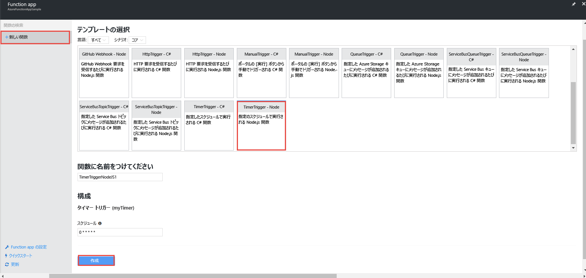
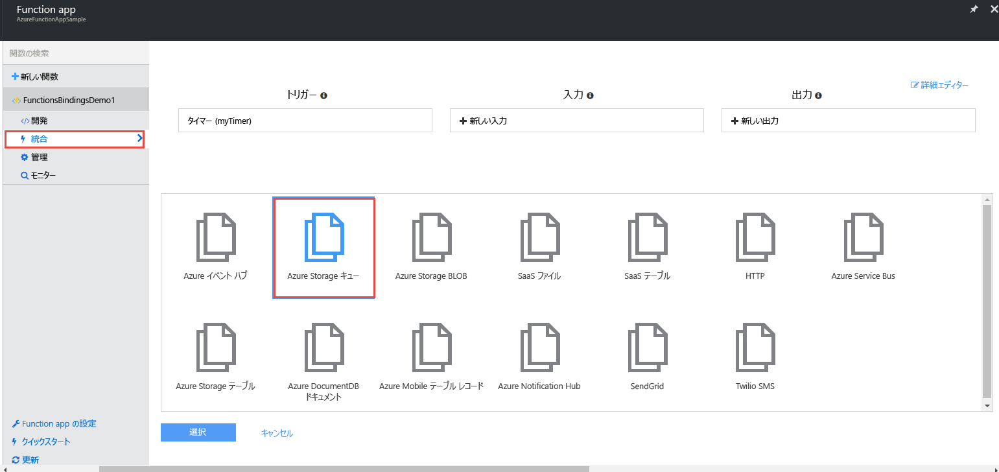
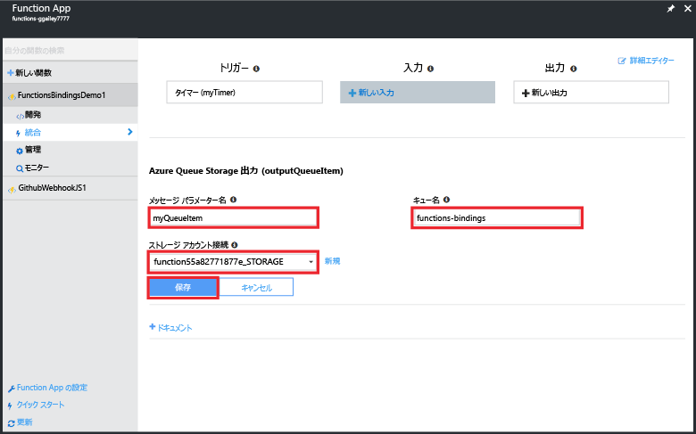
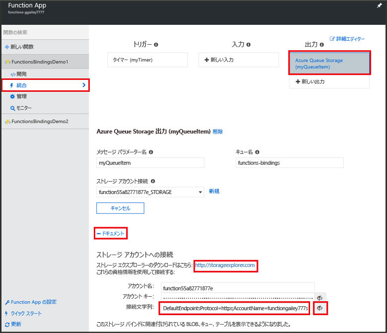
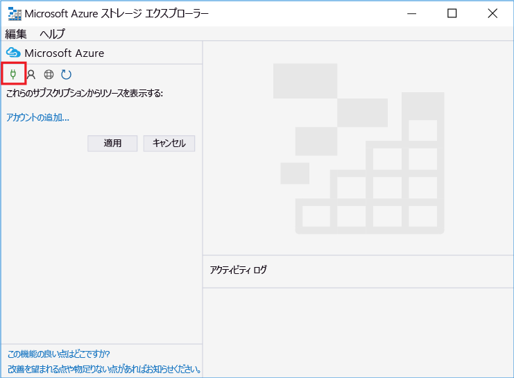
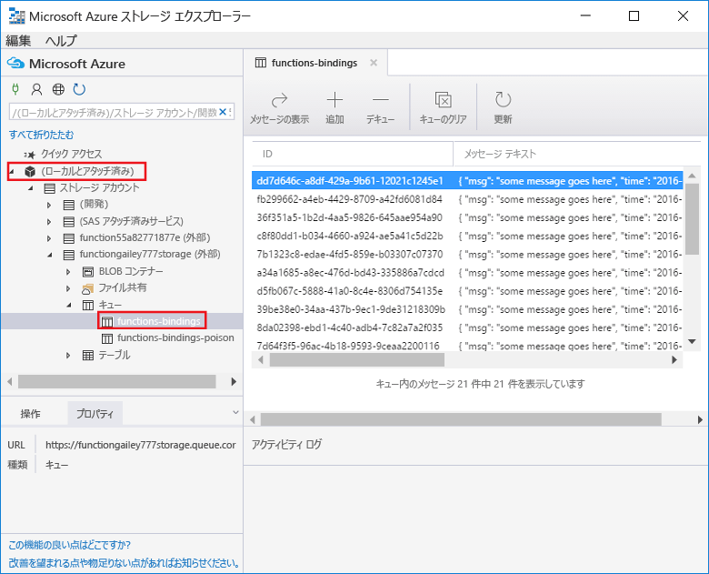
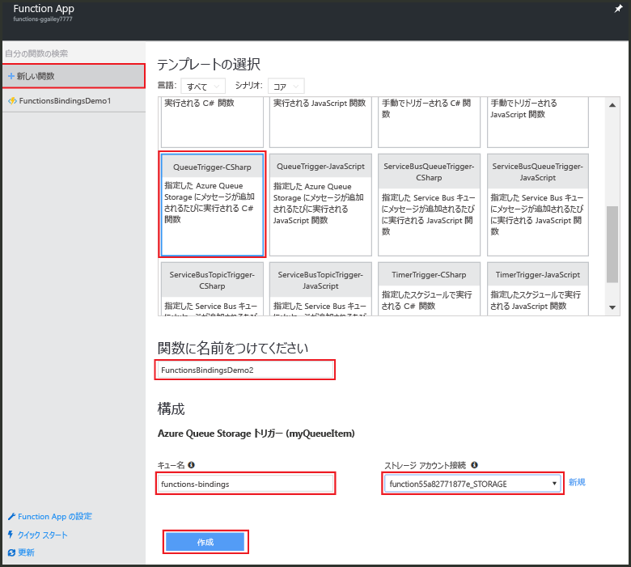
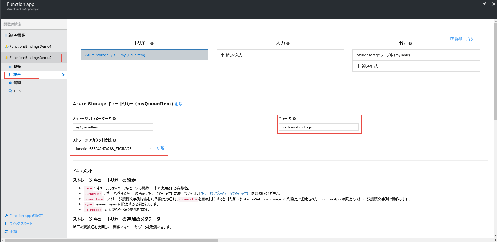
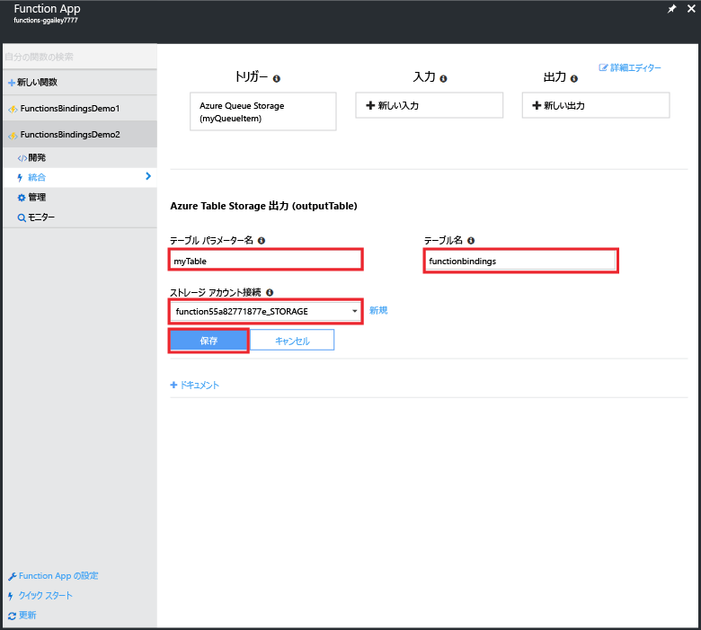
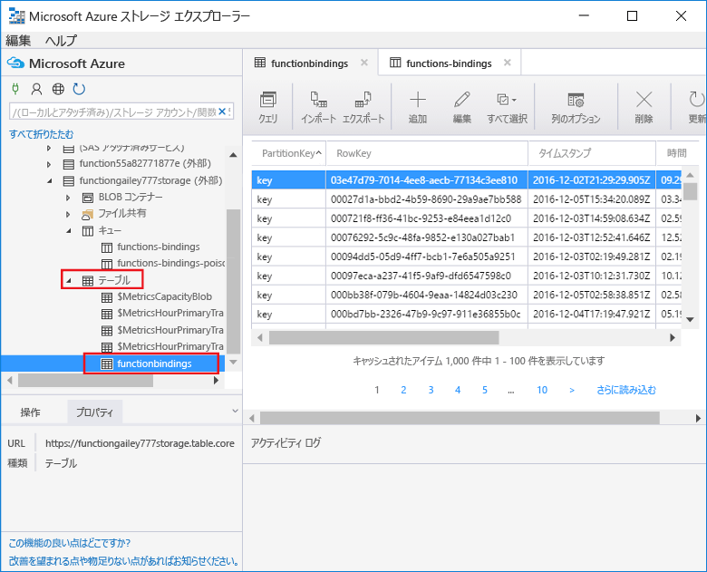

# <a name="use-azure-functions-to-create-a-function-that-connects-to-other-azure-services"></a>他の Azure サービスに接続する関数を Azure Functions を使用して作成する

このトピックでは、Azure Storage キューでメッセージをリッスンし、そのメッセージを Azure Storage テーブル内の行にコピーする関数を Azure Functions を作成する方法を説明します。 タイマーでトリガーされる関数は、キューにメッセージを読み込むのに使用されます。 2 つ目の関数は、キューからメッセージを読み取り、テーブルに書き込みます。 バインドの定義に基づき、Azure Functions によってキューとテーブルの両方が作成されます。 

おもしろいことに、一方の関数は JavaScript で記述されており、もう一方は C# スクリプトで記述されています。 このことから、Function App ではさまざまな言語の関数を扱えることがわかります。 

このシナリオのデモを、[Channel 9 のビデオ](https://channel9.msdn.com/Series/Windows-Azure-Web-Sites-Tutorials/Create-an-Azure-Function-which-binds-to-an-Azure-service/player)で見ることができます。

## <a name="create-a-function-that-writes-to-the-queue"></a>キューに書き込む関数を作成する

ストレージ キューに接続するには、メッセージ キューを読み込む関数を作成しておく必要があります。 この JavaScript 関数は、10 秒おきにキューにメッセージを書き込むタイマー トリガーを使用します。 Azure アカウントがない場合は、[Azure Functions の試用](https://functions.azure.com/try)に関するエクスペリエンスを確認するか、[無料の Azure アカウントを作成](https://azure.microsoft.com/free/)します。

1. Azure Portal に移動し、使用する Function App を検索します。

2. **[新しい関数]** > **[TimerTrigger-JavaScript]** の順にクリックします。 

3. 関数に **FunctionsBindingsDemo1** と名前を付け、CRON 式の値 `0/10 * * * * *` を **[スケジュール]** に入力し、**[作成]** をクリックします。
   
    

    これで、タイマーでトリガーされ、10 秒おきに実行される関数が作成されました。

5. **[開発]** タブで **[ログ]** をクリックし、ログでアクティビティを確認します。 ログ エントリが10 秒おきに書き込まれていることがわかります。
   
    

## <a name="add-a-message-queue-output-binding"></a>メッセージ キュー出力バインドを追加する

1. **[統合]** タブで、**[新しい出力]** > **[Azure Queue Storage]** > **[選択]** の順に選択します。

    

2. **[メッセージ パラメーター名]** に「`myQueueItem`」、**[キュー名]** に「`functions-bindings`」と入力してから、既存の**ストレージ アカウント接続**を選択するか、**[新規]** をクリックしてストレージ アカウント接続を作成して、**[保存]** をクリックします。  

    

1. **[開発]** タブに戻り、関数に次のコードを追加します。
   
    ```javascript
   
    function myQueueItem() 
    {
        return {
            msg: "some message goes here",
            time: "time goes here"
        }
    }
   
    ```
2. 関数の 9 行目あたりの *if* ステートメントの後に次のコードを挿入します。
   
    ```javascript
   
    var toBeQed = myQueueItem();
    toBeQed.time = timeStamp;
    context.bindings.myQueueItem = toBeQed;
   
    ```  
   
    このコードでは、**myQueueItem** を作成し、その **time** プロパティを現在の timeStamp に設定します。 その後、コンテキストの **myQueueItem** バインドに新しいキュー アイテムを追加します。

3. **[保存および実行]** をクリックします。

## <a name="view-storage-updates-by-using-storage-explorer"></a>ストレージ エクスプローラーを使用してストレージの更新を表示する
作成したキューにメッセージを表示すると、関数が動作することを確認できます。  Visual Studio の Cloud Explorer を使用することで、ストレージ キューに接続できます。 ただし、ポータルでは、Microsoft Azure ストレージ エクスプローラーを使用して簡単にストレージ アカウントに接続できます。

1. **[統合]** タブで、キュー出力バインド、**[ドキュメント]** の順にクリックし、ストレージ アカウントの接続文字列を再表示して、値をコピーします。 ストレージ アカウントに接続するには、この値を使用します。

    


2. まだインストールしていない場合は、[Microsoft Azure ストレージ エクスプローラー](http://storageexplorer.com)をダウンロードしてインストールします。 
 
3. ストレージ エクスプローラーで、Azure Storage への接続アイコンをクリックし、フィールドに接続文字列を貼り付けて、ウィザードを完了します。

    

4. **[Local and attached (ローカルで接続済み)]** で、**[ストレージ アカウント]** > お使いのストレージ アカウント > **[キュー]** > [**functions-bindings**] の順に展開し、メッセージがキューに書き込まれていることを確認します。

    

    キューが存在しないか空の場合、関数バインドまたはコードに問題が存在するものと思われます。

## <a name="create-a-function-that-reads-from-the-queue"></a>キューから読み取る関数を作成する

メッセージをキューに追加したら、別の関数を作成できます。キューからメッセージを読み取り、永続的に Azure Storage テーブルに書き込む関数です。

1. **[新しい関数]** > **[QueueTrigger-CSharp]** の順にクリックします。 
 
2. 関数に `FunctionsBindingsDemo2` と名前を付け、**[キュー名]** フィールドに「**functions-bindings**」と入力します。次に、既存のストレージ アカウント接続を選択するか、新しいストレージ アカウント接続を作成して、**[作成]** をクリックします。

     

3. (省略可能) 以前と同様にストレージ エクスプローラーで新しいキューを表示することで、新しい関数が動作することを確認できます。 Visual Studio の Cloud Explorer を使用することもできます。  

4. (省略可能) **functions-bindings** キューを更新します。アイテムがキューから削除されたことに注意してください。 関数が **functions-bindings** キューに入力トリガーとしてバインドされ、その関数がキューを読み取るので、このような削除が行われます。 
 
## <a name="add-a-table-output-binding"></a>テーブル出力バインドを追加する

1. [FunctionsBindingsDemo2] で、**[統合]** > **[新しい出力]** > **[Azure Table Storage]** > **[選択]** の順にクリックします。

     

2. **[テーブル名]** に「`functionbindings`」、**[テーブル パラメーター名]** に「`myTable`」と入力し、**ストレージ アカウント接続**を選択するか、新しいストレージ アカウント接続を作成して、**[保存]** をクリックします。

    
   
3. **[開発]** タブで、既存の関数コードを次のコードに置き換えます。
   
    ```cs
    
    using System;
    
    public static void Run(QItem myQueueItem, ICollector<TableItem> myTable, TraceWriter log)
    {    
        TableItem myItem = new TableItem
        {
            PartitionKey = "key",
            RowKey = Guid.NewGuid().ToString(),
            Time = DateTime.Now.ToString("hh.mm.ss.ffffff"),
            Msg = myQueueItem.Msg,
            OriginalTime = myQueueItem.Time    
        };
        
        // Add the item to the table binding collection.
        myTable.Add(myItem);
    
        log.Verbose($"C# Queue trigger function processed: {myItem.RowKey} | {myItem.Msg} | {myItem.Time}");
    }
    
    public class TableItem
    {
        public string PartitionKey {get; set;}
        public string RowKey {get; set;}
        public string Time {get; set;}
        public string Msg {get; set;}
        public string OriginalTime {get; set;}
    }
    
    public class QItem
    {
        public string Msg { get; set;}
        public string Time { get; set;}
    }
    ```
    **TableItem** クラスはストレージ テーブル内の行を表します。アイテムは **TableItem** オブジェクトの `myTable` コレクションに追加します。 **PartitionKey** プロパティと **RowKey** プロパティは、テーブルに挿入できるように設定する必要があります。

4. [ **Save**] をクリックします。  最後に、ストレージ エクスプローラーまたは Visual Studio の Cloud Explorer でテーブルを表示して、関数が動作することを確認できます。

5. (省略可能) ストレージ エクスプローラー内のストレージ アカウントで、**[テーブル]** > [**functionsbindings**] の順に展開し、テーブルに行が追加されたことを確認します。 Visual Studio の Cloud Explorer でも同様のことができます。

    

    テーブルが存在しないか空の場合、関数バインドまたはコードに問題が存在するものと思われます。 
 
[!INCLUDE [More binding information](../../includes/functions-bindings-next-steps.md)]

## <a name="next-steps"></a>次のステップ
Azure Functions の詳細については、次のトピックを参照してください。

* [Azure Functions 開発者向けリファレンス](functions-reference.md)  
  関数のコーディングとトリガーおよびバインドの定義に関するプログラマ向けリファレンスです。
* [Azure Functions のテスト](functions-test-a-function.md)  
  関数をテストするための各種ツールと手法について説明します。
* [Azure Functions のスケーリング方法](functions-scale.md)  
  Azure Functions で利用できるサービス プラン (従量課金ホスティング プランを含む) と、適切なプランを選択する方法について説明します。 

[!INCLUDE [Getting help note](../../includes/functions-get-help.md)]


