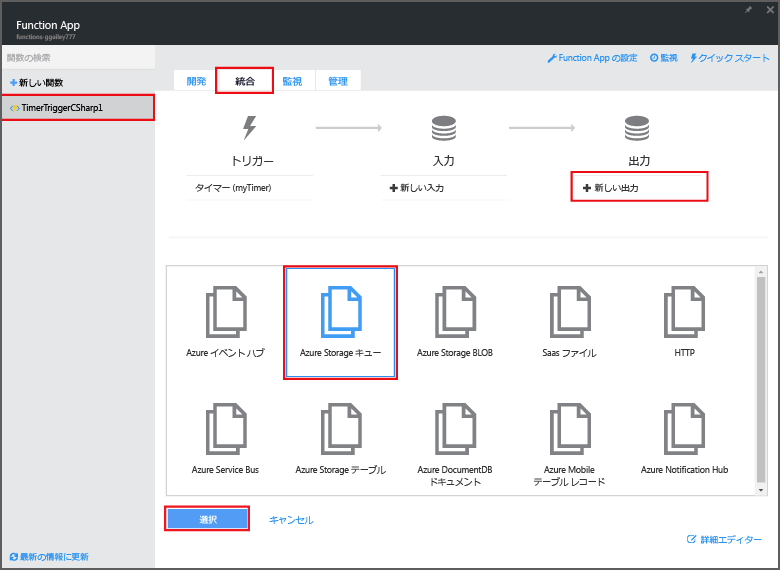
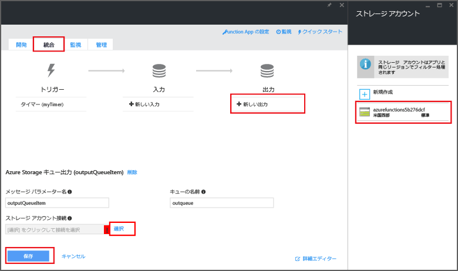

<properties
   pageTitle="イベント処理機能の作成 | Microsoft Azure"
   description="イベント タイマーに従って実行される C# 関数を Azure Functions で作成します。"
   services="functions"
   documentationCenter="na"
   authors="ggailey777"
   manager="erikre"
   editor=""
   tags=""
   />

<tags
   ms.service="functions"
   ms.devlang="multiple"
   ms.topic="get-started-article"
   ms.tgt_pltfrm="multiple"
   ms.workload="na"
   ms.date="09/25/2016"
   ms.author="glenga"/>
   
# イベント処理用の Azure の機能の作成

Azure Functions では、イベント ドリブンでオンデマンドのコンピューティング体験により、スケジュールやトリガーが設定されたコード ユニットを、さまざまなプログラミング言語で作成できます。Azure Functions の詳細については、「[Azure Functions の概要](functions-overview.md)」を参照してください。

このトピックでは、イベント タイマーに従って実行され、メッセージをストレージ キューに追加する新しい関数を C# で作成する方法について説明します。

## 前提条件 

関数を作成するには、アクティブな Azure アカウントを用意する必要があります。Azure アカウントがない場合は、[無料アカウントを利用できます](https://azure.microsoft.com/free/)。

## タイマーでトリガーされる関数をテンプレートから作成する

関数アプリは Azure での関数の実行をホストします。関数を作成するには、アクティブな Azure アカウントを用意する必要があります。Azure アカウントがない場合は、[無料アカウントを利用できます](https://azure.microsoft.com/free/)。

1. [Azure Functions ポータル](https://functions.azure.com/signin)に移動し、Azure アカウントでサインインします。

2. 使用する既存の関数アプリがある場合は、**[Your function apps]** (関数アプリ) から選択し、**[開く]** をクリックします。新しい関数アプリを作成するには、アプリ用に一意の **[Name]** (名前) を入力するか、生成された名前をそのまま使用し、希望する **[Region]** (リージョン) を選択して **[Create + get started]** (作成 + 開始) をクリックします。

3. 関数アプリで、**[+ New Function (+ 新しい関数)]**、**[TimerTrigger - C#]**、**[作成]** の順にクリックします。既定のスケジュールで (1 分おきに) 実行される関数が既定の名前で作成されます。

	

4. 新しい関数で、**[Integrate (統合)]** タブ、**[New Output (新しい出力)]**、**[Azure Storage Queue (Azure Storage キュー)]**、**[選択]** の順にクリックします。

	

5. **[Azure Storage Queue output (Azure Storage キューの出力)]** で、既存の**ストレージ アカウント接続**を選択するか、新しく作成して **[保存]** をクリックします。

	

6. **[開発]** タブに戻り、**[コード]** ウィンドウの既存の C# スクリプトを次のコードに置き換えます。

		using System;
		
		public static void Run(TimerInfo myTimer, out string outputQueueItem, TraceWriter log)
		{
		    // Add a new scheduled message to the queue.
		    outputQueueItem = $"Ping message added to the queue at: {DateTime.Now}.";
		    
		    // Also write the message to the logs.
		    log.Info(outputQueueItem);
		}

	このコードでは、関数が実行された時点の日付と時刻を含む新しいメッセージをキューに追加します。

7. **[保存]** をクリックし、**[ログ]** ウィンドウで次の関数の実行を確認します。

8. (省略可能) ストレージ アカウントに移動し、メッセージがキューに追加されていることを確認します。

9. **[Integrate (統合)]** タブに戻り、スケジュール フィールドを `0 0 * * * *` に変更します。これで、関数が 1 時間に 1 回実行されます。

これは、タイマー トリガーとストレージ キューの出力バインドの両方の非常に単純な例です。詳細については、「[Azure Functions におけるタイマー トリガー](functions-bindings-timer.md)」と「[Azure Functions における Azure Storage のトリガーとバインド](functions-bindings-storage.md)」の両方を参照してください。

##次のステップ

Azure Functions の詳細については、次のトピックを参照してください。

+ [Azure Functions 開発者向けリファレンス](functions-reference.md) 関数のコーディングとトリガーおよびバインドの定義に関するプログラマ向けリファレンスです。
+ [Azure Functions のテスト](functions-test-a-function.md) 関数をテストするための各種ツールと手法について説明します。
+ [Azure Functions のスケーリング方法](functions-scale.md) Azure Functions で利用できるサービス プラン (動的サービス プランを含む) と、適切なプランを選択する方法について説明します。

[AZURE.INCLUDE [概要のメモ](../../includes/functions-get-help.md)]

<!---HONumber=AcomDC_0928_2016-->