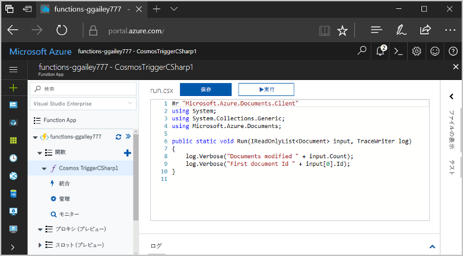
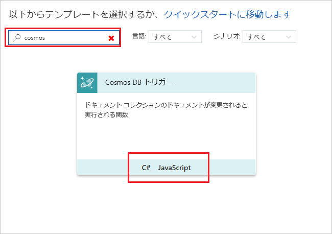
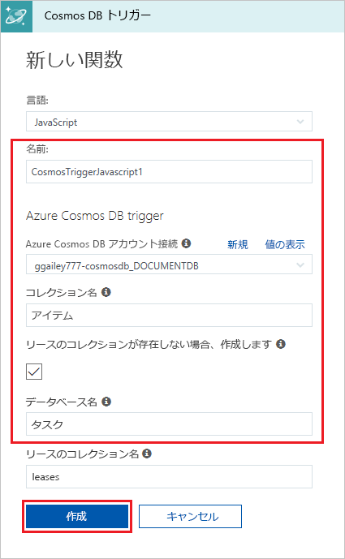
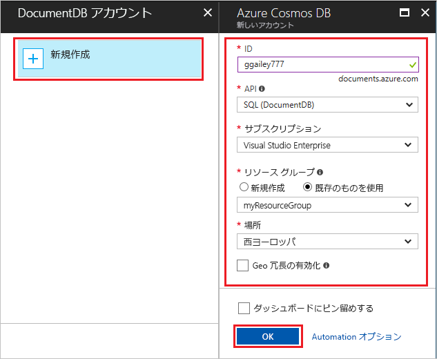
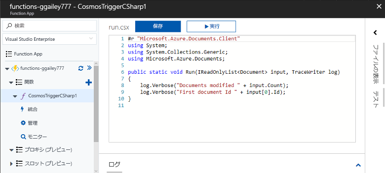
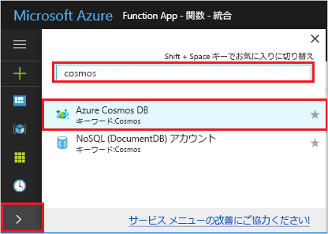
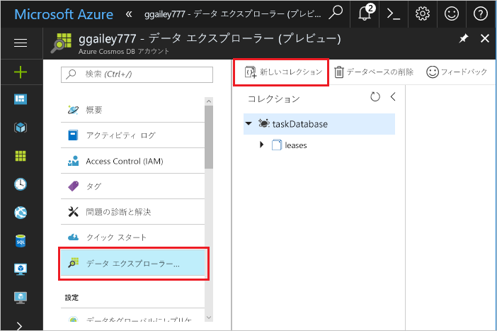
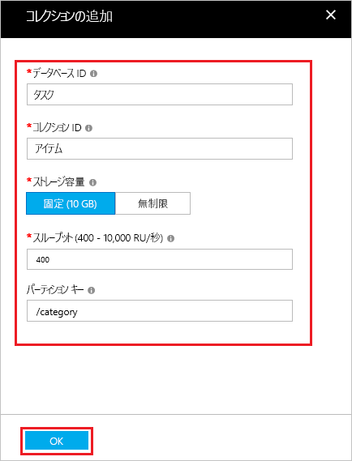
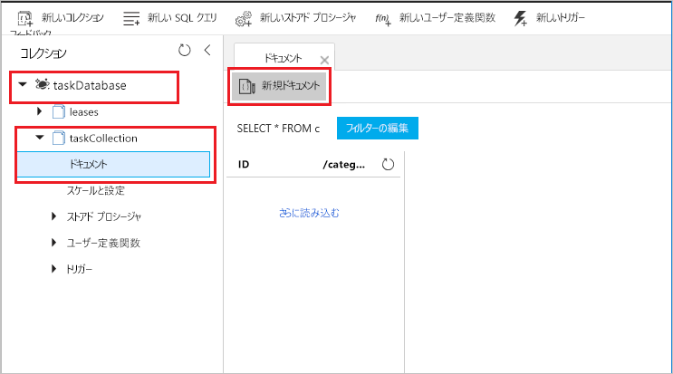
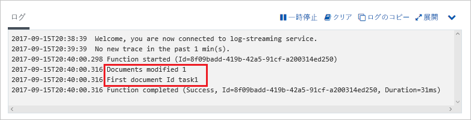

# Azure Cosmos DB によってトリガーされる関数を作成する

Azure Cosmos DB にデータが追加される、または変更されるときにトリガーされる関数の作成方法を説明します。 Azure Cosmos DB の詳細については、「[Azure Cosmos DB: Azure Functions を使用したサーバーなしのデータベースのコンピューティング](..\cosmos-db\serverless-computing-database.md)」をご覧ください。

## 前提条件

このチュートリアルを完了するには、以下が必要です。

+ Azure サブスクリプションをお持ちでない場合は、開始する前に [無料アカウント](https://azure.microsoft.com/free/?WT.mc_id=A261C142F) を作成してください。

## Azure Function App の作成

[!INCLUDE [Create function app Azure portal](../../includes/functions-create-function-app-portal.md)]

次に、新しい Function App で関数を作成します。

## Azure Cosmos DB のトリガーの作成

1. Function App を展開し、**[関数]** の横にある **[+]** ボタンをクリックします。 これが Function App で初めての関数の場合、**[カスタム関数]** を選びます。 関数テンプレートの完全なセットが表示されます。

    

2. 検索フィールドに、「`cosmos`」と入力し、Azure Cosmos DB トリガー テンプレート用の目的の言語を選択します。

    

3. 新しいトリガーは、次の画像の下の表に示したように設定します。

    
    
    | Setting      | 推奨値  | Description                                |
    | ------------ | ---------------- | ------------------------------------------ |
    | **名前** | 既定値 | テンプレートに示されている既定の関数名を使用します。 |
    | **[コレクション名]** | 項目 | 監視するコレクションの名前。 |
    | **[Create lease collection if it doesn't exist]\(リース コレクションが存在しない場合は作成する\)** | オン | コレクションはまだ存在していないため、作成します。 |
    | **[データベース名]** | タスク | 監視するコレクションのデータベース名。 |

4. **[Azure Cosmos DB アカウント接続]** ラベルの横にある **[新規]** を選び、既存の Cosmos DB アカウントを選ぶか、**[+ 新規作成]** を選びます。 
 
    

6. 新しい Cosmos DB アカウントを作成するときは、表で指定されているように **[新しいアカウント]** の設定を使います。

    | Setting      | 推奨値  | 説明                                |
    | ------------ | ---------------- | ------------------------------------------ |
    | **ID** | データベースの名前 | Azure Cosmos DB データベースの一意の ID  |
    | **API** | SQL | このトピックでは、SQL API を使用します。  |
    | **サブスクリプション** | Azure サブスクリプション | この新しい Cosmos DB アカウントが作成されるサブスクリプション。  |
    | **リソース グループ** | myResourceGroup |  関数アプリが含まれる既存のリソース グループを使用します。 |
    | **場所**  | 西ヨーロッパ | 関数アプリ、または格納されたドキュメントを使用するその他のアプリに近い場所を選択します。  |

6. **[OK]** をクリックしてデータベースを作成します。 データベースの作成には数分かかる場合があります。 データベースが作成されると、データベース接続文字列が関数アプリ設定として格納されます。 このアプリ設定の名前が、**[Azure Cosmos DB account connection]\(Azure Cosmos DB アカウント接続\)** に挿入されます。 

7. **[作成]** をクリックして、Azure Cosmos DB でトリガーされる関数を作成します。 関数が作成されると、テンプレート ベースの関数コードが表示されます。  

    

    この関数テンプレートは、ドキュメント数と最初のドキュメント ID をログに書き込みます。 

次に、Azure Cosmos DB アカウントに接続して、データベース内に**タスク** コレクションを作成します。 

## Items コレクションの作成

1. ブラウザーの新しいタブで、[Azure Portal](https://portal.azure.com) の 2 つ目のインスタンスを開きます。 

2. ポータルの左側のアイコン バーを展開し、検索フィールドに「`cosmos`」と入力して、**[Azure Cosmos DB]** を選択します。

    

2. Azure Cosmos DB アカウントを選択してから、**[データ エクスプローラー]** を選択します。 
 
3. **[コレクション]** で、**[taskDatabase]**、**[新しいコレクション]** の順に選択します。

    

4. **[コレクションの追加]** で、次の画像の下の表に示したように設定します。 
 
    
 
    | Setting|推奨値|説明 |
    | ---|---|--- |
    | **[データベース ID]** | タスク |新しいデータベースの名前。 これは、関数バインドで定義された名前と一致する必要があります。 |
    | **[コレクション ID]** | 項目 | 新しいコレクションの名前。 これは、関数バインドで定義された名前と一致する必要があります。  |
    | **[ストレージ容量]** | 固定 (10 GB)|既定値を使用します。 この値は、データベースの記憶域容量です。 |
    | **スループット** |400 RU| 既定値を使用します。 待ち時間を短縮する場合、後でスループットをスケールアップできます。 |
    | **[[パーティション キー]](../cosmos-db/partition-data.md#design-for-scale)** | /category|各パーティションに均等にデータを分散するパーティション キー。 効率の良いコレクションを作成するためには、正しいパーティション キーを選択することが大切です。 | 

1. **[OK]** をクリックして、**タスク** コレクションを作成します。 コレクションが作成されるまで多少時間がかかる場合があります。

関数バインドで指定されたコレクションが作成されたら、この新しいコレクションにドキュメントを追加することで関数をテストできます。

## 関数をテストする

1. データ エクスプローラーで新しい **[taskCollection]** を展開し、**[ドキュメント]**、**[新しいドキュメント]** の順に選択します。

    

2. 新しいドキュメントの内容を次の内容に置き換えて、**[保存]** を選択します。

        {
            "id": "task1",
            "category": "general",
            "description": "some task"
        }

1. ポータルでご利用の関数が表示されている、ブラウザーの 1 つ目のタブに切り替えます。 関数ログを展開し、新しいドキュメントがその関数をトリガーしたことを確認します。 `task1` のドキュメント ID の値がログに書き込まれていることを確認してください。 

    

4. (省略可能) ドキュメントに戻り、変更を加え、**[更新]** をクリックします。 次に、関数ログに戻り、この更新によっても関数がトリガーされたことを確認します。

## リソースのクリーンアップ

[!INCLUDE [Next steps note](../../includes/functions-quickstart-cleanup.md)]

## 次の手順

Azure Cosmos DB でドキュメントが追加または変更されたときに実行される関数を作成しました。

[!INCLUDE [Next steps note](../../includes/functions-quickstart-next-steps.md)]

Azure Cosmos DBのトリガーの詳細については、「[Azure Functions の Azure Cosmos DB バインド](functions-bindings-cosmosdb.md)」をご覧ください。
