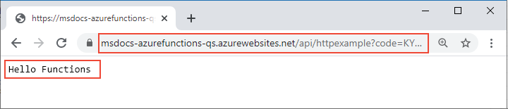

# <a name="quickstart-create-a-function-in-azure-that-responds-to-http-requests"></a>クイック スタート:HTTP 要求に応答する関数を Azure で作成する

この記事では、コマンドライン ツールを使用して、HTTP 要求に応答する関数を作成します。 コードをローカルでテストした後、Azure Functions のサーバーレス環境にデプロイします。 このクイックスタートを完了すると、ご利用の Azure アカウントでわずかな (数セント未満の) コストが発生します。

::: zone pivot="programming-language-csharp,programming-language-javascript,programming-language-typescript,programming-language-powershell,programming-language-python"  
また、この記事の [Visual Studio Code ベースのバージョン](functions-create-first-function-vs-code.md)も存在します。
::: zone-end  

::: zone pivot="programming-language-java"  
> [!NOTE]
> Maven が好みの開発ツールでない場合は、[Gradle](/azure/azure-functions/functions-create-first-java-gradle)、[IntelliJ IDEA](/azure/developer/java/toolkit-for-intellij/quickstart-functions)、および [VS Code](/azure/azure-functions/functions-create-first-function-vs-code?pivots=programming-language-java) を使用する Java 開発者向けの同様のチュートリアルを確認してください。
::: zone-end  

[!INCLUDE [functions-requirements-cli](../../includes/functions-requirements-cli.md)]

[!INCLUDE [functions-cli-verify-prereqs](../../includes/functions-cli-verify-prereqs.md)]

[!INCLUDE [functions-cli-create-venv](../../includes/functions-cli-create-venv.md)]

## <a name="create-a-local-function-project"></a>ローカル関数プロジェクトを作成する

Azure Functions における関数プロジェクトとは、それぞれが特定のトリガーに応答する個別の関数を 1 つまたは複数含んだコンテナーです。 プロジェクト内のすべての関数は、同じローカル構成とホスティング構成を共有します。 このセクションでは、関数を 1 つだけ含んだ関数プロジェクトを作成します。

::: zone pivot="programming-language-csharp,programming-language-javascript,programming-language-typescript,programming-language-powershell,programming-language-python"  
次のように `func init` コマンドを実行して、特定のランタイムを含んだ *LocalFunctionProj* という名前のフォルダーに関数プロジェクトを作成します。  
::: zone-end  
::: zone pivot="programming-language-python"  
```
func init LocalFunctionProj --python
```
::: zone-end  
::: zone pivot="programming-language-csharp"  
```
func init LocalFunctionProj --dotnet
```
::: zone-end  
::: zone pivot="programming-language-javascript"  
```
func init LocalFunctionProj --javascript
```
::: zone-end  
::: zone pivot="programming-language-typescript"  
```
func init LocalFunctionProj --typescript
```
::: zone-end  
::: zone pivot="programming-language-powershell"  
```
func init LocalFunctionProj --powershell
```
::: zone-end    
::: zone pivot="programming-language-java"  
空のフォルダーで次のコマンドを実行して、[Maven アーキタイプ](https://maven.apache.org/guides/introduction/introduction-to-archetypes.html)から Functions プロジェクトを生成します。

# <a name="bash"></a>[bash](#tab/bash)
```bash
mvn archetype:generate -DarchetypeGroupId=com.microsoft.azure -DarchetypeArtifactId=azure-functions-archetype 
```
# <a name="powershell"></a>[PowerShell](#tab/powershell)
```powershell
mvn archetype:generate "-DarchetypeGroupId=com.microsoft.azure" "-DarchetypeArtifactId=azure-functions-archetype" 
```
# <a name="cmd"></a>[Cmd](#tab/cmd)
```cmd
mvn archetype:generate "-DarchetypeGroupId=com.microsoft.azure" "-DarchetypeArtifactId=azure-functions-archetype" 
```
---

Maven により、デプロイ時にプロジェクトの生成を終了するための値の入力が求められます。   
入力を求められたら、次の値を入力します。

| Prompt | 値 | 説明 |
| ------ | ----- | ----------- |
| **groupId** | `com.fabrikam` | Java の[パッケージ命名規則](https://docs.oracle.com/javase/specs/jls/se6/html/packages.html#7.7)に従って、すべてのプロジェクトにわたって対象のプロジェクトを一意に識別する値。 |
| **artifactId** | `fabrikam-functions` | バージョン番号のない、jar の名前である値。 |
| **version** | `1.0-SNAPSHOT` | 既定値を選択します。 |
| **package** | `com.fabrikam.functions` | 生成された関数コードの Java パッケージである値。 既定値を使用します。 |

「`Y`」と入力するか、Enter キーを押して確認します。

Maven により、_artifactId_ という名前の新しいフォルダーにプロジェクト ファイルが作成されます (この例では `fabrikam-functions`)。 
::: zone-end  
プロジェクト フォルダーに移動します。

::: zone pivot="programming-language-csharp,programming-language-javascript,programming-language-typescript,programming-language-powershell,programming-language-python"  
```
cd LocalFunctionProj
```
::: zone-end  
::: zone pivot="programming-language-java"  
```
cd fabrikam-functions
```
::: zone-end  
このフォルダーにはプロジェクト用の各種ファイルが格納されています。たとえば、[local.settings.json](functions-run-local.md#local-settings-file) や [host.json](functions-host-json.md) といった名前の構成ファイルです。 *local.settings.json* には Azure からダウンロードしたシークレットを含めることができるため、このファイルは既定で *.gitignore* ファイルによってソース管理から除外されます。

[!INCLUDE [functions-cli-add-function](../../includes/functions-cli-add-function.md)]

### <a name="optional-examine-the-file-contents"></a>(省略可) ファイルの内容を確認する

先に「[関数をローカルで実行する](#run-the-function-locally)」に進み、ファイルの内容は後から確認してもかまいません。

::: zone pivot="programming-language-csharp"
#### <a name="httpexamplecs"></a>HttpExample.cs

*HttpExample.cs* には、`Run` メソッドが含まれています。これは、トリガー動作を定義する **HttpTriggerAttribute** で装飾された [HttpRequest](/dotnet/api/microsoft.aspnetcore.http.httprequest) 内の `req` 変数で要求データを受け取ります。 

:::code language="csharp" source="~/functions-docs-csharp/http-trigger-template/HttpExample.cs":::

返されるオブジェクトは、[OkObjectResult](/dotnet/api/microsoft.aspnetcore.mvc.okobjectresult) (200) または [BadRequestObjectResult](/dotnet/api/microsoft.aspnetcore.mvc.badrequestobjectresult) (400) として応答メッセージを返す [ActionResult](/dotnet/api/microsoft.aspnetcore.mvc.actionresult) です。 詳細については、「[Azure Functions の HTTP トリガーとバインド](/azure/azure-functions/functions-bindings-http-webhook?tabs=csharp)」を参照してください。
::: zone-end

::: zone pivot="programming-language-java"
#### <a name="functionjava"></a>Function.java
*Function.java* には、`run` メソッドが含まれています。これは、トリガー動作を定義する [HttpTrigger](/java/api/com.microsoft.azure.functions.annotation.httptrigger) 注釈で装飾された [HttpRequestMessage](/java/api/com.microsoft.azure.functions.httprequestmessage) 内の `request` 変数で要求データを受け取ります。 

:::code language="java" source="~/functions-quickstart-java/functions-add-output-binding-storage-queue/src/main/java/com/function/Function.java":::

応答メッセージは、[HttpResponseMessage.Builder](/java/api/com.microsoft.azure.functions.httpresponsemessage.builder) API によって生成されます。

#### <a name="pomxml"></a>pom.xml

アプリをホストするために作成された Azure リソースの設定は、生成された pom.xml ファイル内の `com.microsoft.azure` という **groupId** を持つプラグインの **configuration** 要素で定義されます。 たとえば、次の構成要素では、Maven ベースのデプロイに対して、`westus` リージョンの `java-functions-group` リソース グループに関数アプリを作成することを指示しています。 関数アプリ自体は、`java-functions-app-service-plan` プラン (既定では、サーバーレスの従量課金プラン) でホストされている Windows 上で実行されます。    

:::code language="java" source="~/functions-quickstart-java/functions-add-output-binding-storage-queue/pom.xml" range="116-155":::

これらの設定を変更して、Azure でのリソースの作成方法を制御できます。たとえば、初期デプロイの前に `runtime.os` を `windows` から `linux` に変更することができます。 Maven プラグインでサポートされている設定の完全な一覧については、[構成の詳細](https://github.com/microsoft/azure-maven-plugins/wiki/Azure-Functions:-Configuration-Details)に関するページを参照してください。

#### <a name="functiontestjava"></a>FunctionTest.java

このアーキタイプでは、関数の単体テストも生成されます。 関数を変更してバインドを追加したり、新しい関数をプロジェクトに追加したりする場合は、*FunctionTest.java* ファイル内のテストも変更する必要があります。
::: zone-end  
::: zone pivot="programming-language-python"
#### <a name="__init__py"></a>\_\_init\_\_.py

*\_\_init\_\_.py* には、*function.json* 内の構成に従ってトリガーされる Python 関数 `main()` が含まれます。

:::code language="python" source="~/functions-quickstart-templates/Functions.Templates/Templates/HttpTrigger-Python/__init__.py":::

HTTP トリガーの場合、この関数は、*function.json* に定義された変数 `req` で要求データを受け取ります。 `req` は、[azure.functions.HttpRequest クラス](/python/api/azure-functions/azure.functions.httprequest)のインスタンスです。 *function.json* に `$return` として定義されているリターン オブジェクトは、[azure.functions.HttpResponse クラス](/python/api/azure-functions/azure.functions.httpresponse)のインスタンスです。 詳細については、「[Azure Functions の HTTP トリガーとバインド](/azure/azure-functions/functions-bindings-http-webhook?tabs=python)」を参照してください。
::: zone-end

::: zone pivot="programming-language-javascript"
#### <a name="indexjs"></a>index.js

*index.js* は、*function.json* の構成に従ってトリガーされる関数をエクスポートします。

:::code language="javascript" source="~/functions-quickstart-templates/Functions.Templates/Templates/HttpTrigger-JavaScript/index.js":::

HTTP トリガーの場合、この関数は、*function.json* に定義された変数 `req` で要求データを受け取ります。 *function.json* で `$return` として定義されている返されるオブジェクトが応答です。 詳細については、「[Azure Functions の HTTP トリガーとバインド](/azure/azure-functions/functions-bindings-http-webhook?tabs=javascript)」を参照してください。
::: zone-end

::: zone pivot="programming-language-typescript"
#### <a name="indexts"></a>index.ts

*index.ts* は、*function.json* の構成に従ってトリガーされる関数をエクスポートします。

:::code language="typescript" source="~/functions-quickstart-templates/Functions.Templates/Templates/HttpTrigger-TypeScript/index.ts":::

HTTP トリガーの場合、この関数は、*function.json* に定義されている **HttpRequest** 型の変数 `req` で要求データを受け取ります。 *function.json* で `$return` として定義されている返されるオブジェクトが応答です。 
::: zone-end

::: zone pivot="programming-language-powershell"
#### <a name="runps1"></a>run.ps1

*run.ps1* は、*function.json* の構成に従ってトリガーされる関数スクリプトを定義します。

:::code language="powershell" source="~/functions-quickstart-templates/Functions.Templates/Templates/HttpTrigger-PowerShell/run.ps1":::

HTTP トリガーの場合、この関数は、*function.json* に定義された `$Request` パラメーターに渡された要求データを受け取ります。 *function.json* で `Response` として定義されている返されるオブジェクトが、応答として `Push-OutputBinding` コマンドレットに渡されます。 
::: zone-end

::: zone pivot="programming-language-javascript,programming-language-typescript,programming-language-python,programming-language-powershell"
#### <a name="functionjson"></a>function.json

*function.json* は、関数の入出力 `bindings` (トリガーの型を含む) を定義する構成ファイルです。 
::: zone-end

::: zone pivot="programming-language-python"
`scriptFile` を変更することで、必要に応じて異なる Python ファイルを呼び出せます。

:::code language="json" source="~/functions-quickstart-templates/Functions.Templates/Templates/HttpTrigger-Python/function.json":::
::: zone-end

::: zone pivot="programming-language-javascript,programming-language-typescript"
:::code language="json" source="~/functions-quickstart-templates/Functions.Templates/Templates/HttpTrigger-JavaScript/function.json":::
::: zone-end

::: zone pivot="programming-language-powershell"
:::code language="json" source="~/functions-quickstart-templates/Functions.Templates/Templates/HttpTrigger-PowerShell/function.json":::
::: zone-end

::: zone pivot="programming-language-javascript,programming-language-typescript,programming-language-python,programming-language-powershell"  
各バインディングは、方向、型、一意の名前を必要とします。 HTTP トリガーには、[`httpTrigger`](functions-bindings-http-webhook-trigger.md) 型の入力バインディングと、[`http`](functions-bindings-http-webhook-output.md) 型の出力バインディングが与えられます。
::: zone-end  

[!INCLUDE [functions-run-function-test-local-cli](../../includes/functions-run-function-test-local-cli.md)]

::: zone pivot="programming-language-javascript,programming-language-typescript,programming-language-python,programming-language-powershell,programming-language-csharp"    
## <a name="create-supporting-azure-resources-for-your-function"></a>関数用の関連 Azure リソースを作成する

関数コードを Azure にデプロイする前に、3 つのリソースを作成する必要があります。

- リソース グループ。関連リソースの論理コンテナーです。
- ストレージ アカウント。プロジェクトについての状態とその他の情報を保持します。
- 関数アプリ。関数コードを実行するための環境となります。 関数アプリは、ローカルの関数プロジェクトと対応関係にあります。これを使用すると、リソースの管理、デプロイ、共有を容易にするための論理ユニットとして関数をグループ化できます。

これらの項目を作成するには、次の Azure CLI コマンドを使用します。 それぞれのコマンドからは、完了時に JSON 出力が返されます。

まだ Azure にサインインしていない場合は、[az login](/cli/azure/reference-index#az-login) コマンドでサインインします。

```azurecli
az login
```
    
[az group create](/cli/azure/group#az-group-create) コマンドを使用して、リソース グループを作成します。 次の例では、`AzureFunctionsQuickstart-rg` という名前のリソース グループを `westeurope` リージョンに作成します。 (リソース グループとリソースは通常、近くのリージョンに作成します。`az account list-locations` コマンドから返される利用可能なリージョンを使用してください。)

```azurecli
az group create --name AzureFunctionsQuickstart-rg --location westeurope
```

> [!NOTE]
> Linux と Windows のアプリを同じリソース グループ内でホストすることはできません。 Windows の関数アプリまたは Web アプリで `AzureFunctionsQuickstart-rg` という名前のリソース グループが存在する場合、別のリソース グループを使用する必要があります。
 
    
[az storage account create](/cli/azure/storage/account#az-storage-account-create) コマンドを使用して、リソース グループとリージョン内に汎用ストレージ アカウントを作成します。 次の例の `<STORAGE_NAME>` は適宜、グローバルに一意の名前に置き換えてください。 名前は 3 文字から 24 文字とし、小文字のみを使用する必要があります。 `Standard_LRS` は汎用アカウントを指定します。これは [Functions でサポート](storage-considerations.md#storage-account-requirements)されています。

```azurecli
az storage account create --name <STORAGE_NAME> --location westeurope --resource-group AzureFunctionsQuickstart-rg --sku Standard_LRS
```

このクイックスタートでは、ストレージ アカウントに関して数セント (米国ドル) の料金が発生します。
    
[az functionapp create](/cli/azure/functionapp#az-functionapp-create) コマンドを使用して関数アプリを作成します。 次の例では、`<STORAGE_NAME>` を前の手順で使用したアカウントの名前に、`<APP_NAME>` を適宜グローバルに一意の名前に置き換えてください。 `<APP_NAME>` は、関数アプリの既定の DNS ドメインでもあります。 
::: zone-end  

::: zone pivot="programming-language-python"  
Python 3.8 を使用している場合は、`--runtime-version` を `3.8` に変更し、`--functions_version` を `3` に変更します。

Python 3.6 を使用している場合は、`--runtime-version` を `3.6` に変更します。

```azurecli
az functionapp create --resource-group AzureFunctionsQuickstart-rg --os-type Linux --consumption-plan-location westeurope --runtime python --runtime-version 3.7 --functions-version 2 --name <APP_NAME> --storage-account <STORAGE_NAME>
```
::: zone-end  

::: zone pivot="programming-language-javascript,programming-language-typescript"  
Node.js 8 を使用している場合は、さらに `--runtime-version` を `8` に変更します。


```azurecli
az functionapp create --resource-group AzureFunctionsQuickstart-rg --consumption-plan-location westeurope --runtime node --runtime-version 10 --functions-version 2 --name <APP_NAME> --storage-account <STORAGE_NAME>
```
::: zone-end  

::: zone pivot="programming-language-csharp"  
```azurecli
az functionapp create --resource-group AzureFunctionsQuickstart-rg --consumption-plan-location westeurope --runtime dotnet --functions-version 2 --name <APP_NAME> --storage-account <STORAGE_NAME>
```
::: zone-end  

::: zone pivot="programming-language-powershell"  
```azurecli
az functionapp create --resource-group AzureFunctionsQuickstart-rg --consumption-plan-location westeurope --runtime powershell --functions-version 2 --name <APP_NAME> --storage-account <STORAGE_NAME>
```
::: zone-end  

::: zone pivot="programming-language-javascript,programming-language-typescript,programming-language-python,programming-language-powershell,programming-language-csharp"  
このコマンドでは、[Azure Functions 従量課金プラン](functions-scale.md#consumption-plan) (ここで発生する使用量に関しては無料) で、指定された言語ランタイムで実行される関数アプリを作成します。 また、このコマンドを実行すると、関連する Azure Application Insights インスタンスが同じリソース グループにプロビジョニングされます。このインスタンスを使用することで、関数アプリを監視したりログを確認したりすることができます。 詳しくは、「[Azure Functions を監視する](functions-monitoring.md)」をご覧ください。 このインスタンスは、アクティブにするまでコストが発生しません。
    
## <a name="deploy-the-function-project-to-azure"></a>Azure に関数プロジェクトをデプロイする
::: zone-end  

::: zone pivot="programming-language-typescript"  
Core Tools を使用して対象のプロジェクトを Azure にデプロイする前に、TypeScript ソース ファイルから JavaScript ファイルの運用対応のビルドを作成します。

次のコマンドを使用して、TypeScript プロジェクトをデプロイする準備をします。

```
npm run build:production 
```
::: zone-end  

::: zone pivot="programming-language-javascript,programming-language-typescript,programming-language-python,programming-language-powershell,programming-language-csharp"  
必要なリソースが揃ったら、[func azure functionapp publish](functions-run-local.md#project-file-deployment) コマンドを使用して、ローカル関数プロジェクトを Azure の関数アプリにデプロイすることができます。 次の例の `<APP_NAME>` は、実際のアプリ名に置き換えてください。

```
func azure functionapp publish <APP_NAME>
```

"... という名前のアプリが見つからない" という内容のエラーが表示された場合は、数秒待ってからやり直してください。先ほどの `az functionapp create` コマンドの後、Azure でアプリが完全には初期化されていない可能性があります。

publish コマンドを実行すると、次のような出力結果が表示されます (簡潔にするため一部省略しています)。

<pre>
...

Getting site publishing info...
Creating archive for current directory...
Performing remote build for functions project.

...

Deployment successful.
Remote build succeeded!
Syncing triggers...
Functions in msdocs-azurefunctions-qs:
    HttpExample - [httpTrigger]
        Invoke url: https://msdocs-azurefunctions-qs.azurewebsites.net/api/httpexample?code=KYHrydo4GFe9y0000000qRgRJ8NdLFKpkakGJQfC3izYVidzzDN4gQ==
</pre>

::: zone-end  
::: zone pivot="programming-language-java"  
## <a name="deploy-the-function-project-to-azure"></a>Azure に関数プロジェクトをデプロイする

最初に関数プロジェクトをデプロイすると、関数アプリと関連リソースが Azure に作成されます。 アプリをホストするために作成された Azure リソースの設定は、[ファイル](#pomxml)で定義されています。 この記事では、既定値をそのまま使用します。

> [!TIP]
> Windows ではなく Linux で実行される関数アプリを作成するには、pom.xml ファイルの `runtime.os` 要素を `windows` から `linux` に変更します。 従量課金プランでの Linux の実行は、[これらのリージョン](https://github.com/Azure/azure-functions-host/wiki/Linux-Consumption-Regions)でサポートされています。 Linux 上で実行されるアプリと Windows 上で実行されるアプリを同じリソース グループに含めることはできません。

デプロイする前に、[az login](/cli/azure/authenticate-azure-cli) Azure CLI コマンドを使用して、対象の Azure サブスクリプションにサインインします。 

```azurecli
az login
```

次のコマンドを使用して、対象のプロジェクトを新しい関数アプリにデプロイします。 

```
mvn azure-functions:deploy
```

これにより、Azure に次のリソースが作成されます。

+ リソース グループ。 名前は _java-functions-group_ です。
+ ストレージ アカウント。 Functions に必要です。 名前は、ストレージ アカウント名の要件に基づいてランダムに生成されます。
+ ホスティング プラン。 _westus_ リージョンでの関数アプリのサーバーレス ホスティング。 名前は _java-functions-app-service-plan_ です。
+ 関数アプリ。 関数アプリは、関数のデプロイと実行の単位です。 名前は _artifactId_ に基づいてランダムに生成され、ランダムに生成された番号が付加されます。 

デプロイにより、プロジェクト ファイルがパッケージ化され、[zip デプロイ](functions-deployment-technologies.md#zip-deploy)を使用して新しい関数アプリにデプロイされます。 このコードは、Azure の展開パッケージから実行されます。
::: zone-end

## <a name="invoke-the-function-on-azure"></a>Azure 上の関数を呼び出す

この関数は HTTP トリガーを使用しているため、呼び出しは、その URL にブラウザーから HTTP 要求を送信するか、または curl などのツールを使用して行います。 どちらの場合も、`code` URL パラメーターは、関数エンドポイントの呼び出しを承認する一意の[関数キー](functions-bindings-http-webhook-trigger.md#authorization-keys)です。

# <a name="browser"></a>[ブラウザー](#tab/browser)

publish コマンドの出力に表示されている完全な**呼び出し URL** にクエリ パラメーター `&name=Functions` を追加して、ブラウザーのアドレス バーにコピーします。 関数をローカルで実行したときと同様の出力がブラウザーに表示されるはずです。




# <a name="curl"></a>[curl](#tab/curl)

**呼び出し URL** にパラメーター `&name=Functions` を追加して [`curl`](https://curl.haxx.se/) を実行します。 "Hello Functions" というテキストがコマンドの出力として表示されます。


---

> [!TIP]
> 公開された関数アプリのほぼリアルタイムのログを表示するには、[Application Insights Live Metrics Stream](functions-monitoring.md#streaming-logs) を使用します。

## <a name="clean-up-resources"></a>リソースをクリーンアップする

次の手順である [Azure Storage キュー出力バインディングの追加](functions-add-output-binding-storage-queue-cli.md)に進む場合、既存の作業をベースにするので、リソースはすべてそのままにしておいてください。

それ以外の場合は、追加コストの発生を避けるために、次のコマンドを使用して、リソース グループとそこに含まれるすべてのリソースを削除してください。

```azurecli
az group delete --name AzureFunctionsQuickstart-rg
```

## <a name="next-steps"></a>次のステップ

> [!div class="nextstepaction"]
> [Azure Storage キューに接続する](functions-add-output-binding-storage-queue-cli.md)
