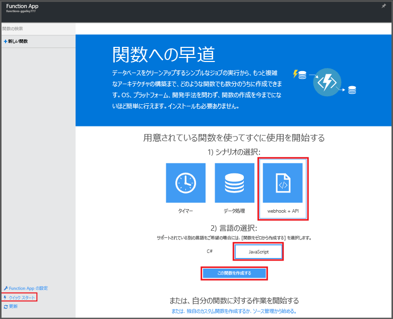

# Azure Portal で初めての関数を作成する

このトピックでは、HTTP 要求によって呼び出される簡単な "hello world" Azure 関数を作成する方法について説明します。 Azure Portal で関数を作成するには、関数の実行をホストするための Function App を Azure App Service で作成しておく必要があります。

このクイック スタートを完了するには、Azure アカウントが必要です。 [無料アカウント](https://azure.microsoft.com/free/)を入手できます。 また、Azure に登録せずに、[Azure Functions を試す](https://azure.microsoft.com/try/app-service/functions/)こともできます。

## Function App を作成する

[!INCLUDE [functions-create-function-app-portal](../../includes/functions-create-function-app-portal.md)]

詳しくは、「[Azure Portal から関数アプリを作成する](functions-create-function-app-portal.md)」をご覧ください。

## 関数を作成する
次の手順では、Azure Functions クイック スタートを使用して、新しい Function App で関数を作成します。

1. **[クイック スタート]** タブで、**[webhook + API]** をクリックし、関数の言語を選択して、**[この関数を作成する]** をクリックします。 選択した言語で、定義済み関数が新しく作成されます。  
   
    

4. (オプション) クイック スタートのこの時点で、ポータルの Azure Functions 機能のクイック ツアーを開始するかどうか選択することができます。 ツアーを完了するかスキップしたら、HTTP 要求を送信して、新しい関数をテストできます。

## 関数をテストする
[!INCLUDE [Functions quickstart test](../../includes/functions-quickstart-test.md)]

## 次のステップ
[!INCLUDE [Functions quickstart next steps](../../includes/functions-quickstart-next-steps.md)]

[!INCLUDE [Getting Started Note](../../includes/functions-get-help.md)]

