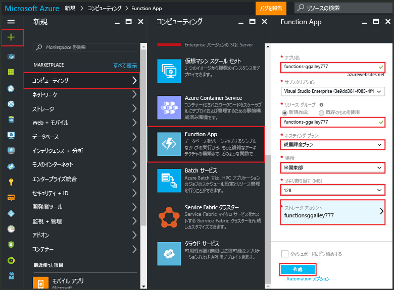

# Azure Portal からの関数の作成
## 概要
Azure Functions は、他の Azure サービス、SaaS 製品、オンプレミス システムで発生するイベントによってトリガーされるコードを実装する機能により、既存の Azure アプリケーション プラットフォームを拡張する、イベント ドリブンのオンデマンド コンピューティング エクスペリエンスを提供します。Azure Functions を利用すると、アプリケーションが要求に応じてスケーリングされ、使用したリソースに対してのみ課金が行われます。Azure Functions では、スケジュールやトリガーが設定されたコード ユニットを、さまざまなプログラミング言語で作成して実装できます。Azure Functions の詳細については、「[Azure Functions の概要](functions-overview.md)」をご覧ください。

このトピックでは、Azure Portal を使用して、HTTP トリガーによって呼び出される簡単な "hello world" Node.js Azure Function を作成する方法について説明します。Azure Portal で関数を作成するには、Azure App Service で Function App を明示的に作成しておく必要があります。Function App を自動的に作成する場合は、[こちらの Azure Functions クイック スタート チュートリアル](functions-create-first-azure-function.md)をご覧ください。このチュートリアルでは、よりシンプルなクイック スタート エクスペリエンスを提供し、ビデオも用意されています。

## Function App を作成する
Function App は、Azure での関数の実行をホストします。次の手順に従って、Azure Portal で Function App を作成します。

初めての関数を作成するには、アクティブな Azure アカウントを用意しておく必要があります。Azure アカウントがまだない場合は、[無料アカウントを利用できます](https://azure.microsoft.com/free/)。

1. [Azure Portal](https://portal.azure.com) に移動し、Azure アカウントでサインインします。
2. **[+新規]**、**[Web + モバイル]**、**[Function App]** をクリックし、**[サブスクリプション]** を選択します。Function App を識別する一意の**アプリ名**を入力し、次の設定を指定します。
   
   * **[[リソース グループ]](../azure-portal/resource-group-portal.md)**: **[新規作成]** を選択し、新しいリソース グループの名前を入力します。既存のリソース グループを選択することもできますが、Function App の動的 App Service プランを作成できない場合があります。
   * **[[App Service プラン]](../app-service/azure-web-sites-web-hosting-plans-in-depth-overview.md)**: *[動的]* または *[クラシック]* のいずれかを選択します。
     * **[動的]**: Azure Functions の既定のプランの種類。動的プランを選択したときは、**[場所]** の選択と **[メモリ割り当て]** (MB 単位) の設定も行う必要があります。メモリ割り当てのコストへの影響については、[Azure Functions の価格](https://azure.microsoft.com/pricing/details/functions/)に関するページをご覧ください。
     * **クラシック**: クラシック App Service プランの場合、**App Service プラン/場所**を作成するか、既存のものを選択する必要があります。これらの設定により、アプリに関連付けられる[場所、機能、コスト、コンピューティング リソース](https://azure.microsoft.com/pricing/details/app-service/)が決まります。
   * **[ストレージ アカウント]**: 各 Function App には、ストレージ アカウントが必要です。既存のストレージ アカウントを選択することも、新しいストレージ アカウントを作成することもできます。
     
     
3. **[作成]** をクリックして、新しい Function App をプロビジョニングし、デプロイします。

Function App をプロビジョニングしたら、初めての関数を作成できます。

## 関数を作成する
次の手順では、Azure Functions クイック スタートから関数を作成します。

1. **[クイック スタート]** タブで、**[WebHook + API]**、**[JavaScript]**、**[関数を作成する]** の順にクリックします。新しい定義済みの Node.js 関数が作成されます。
   
    
2. (オプション) クイック スタートのこの時点で、ポータルの Azure Functions 機能のクイック ツアーを開始するかどうか選択することができます。ツアーを完了するかスキップしたら、HTTP トリガーを使用して新しい関数をテストできます。

## 関数をテストする
Azure Functions クイック スタートには機能コードが含まれているため、新しい関数をすぐにテストできます。

1. **[開発]** タブで **[コード]** ウィンドウを確認すると、この Node.js コードでは、HTTP 要求で *name* 値をメッセージ本文またはクエリ文字列で渡す必要があることがわかります。関数を実行すると、応答メッセージでこの値が返されます。
   
    
2. 下にスクロールして **[要求本文]** ボックスを表示し、*name* プロパティの値を自分の名前に変更して、**[実行]** をクリックします。テスト HTTP 要求によって実行がトリガーされ、ストリーミング ログに情報が書き込まれて、"hello" という応答が **[出力]** に表示されます。
3. 同じ関数の実行を別のブラウザー ウィンドウやタブからトリガーするには、**[開発]** タブから **[関数の URL]** の値をコピーしてブラウザーのアドレス バーに貼り付け、クエリ文字列値 `&name=yourname` を追加して Enter キーを押します。同じ情報がログに書き込まれ、ブラウザーに "hello" という応答が前と同じように表示されます。

## 次のステップ
このクイック スタートでは、基本的な HTTP トリガーによる関数の非常に簡単な実行を紹介しました。Azure Functions の機能をアプリで使用する方法の詳細については、以下のトピックをご覧ください。

* [Azure Functions 開発者向けリファレンス](functions-reference.md) 関数のコーディングとトリガーおよびバインドの定義に関するプログラマ向けリファレンスです。
* [Azure Functions のテスト](functions-test-a-function.md) 関数をテストするための各種ツールと手法について説明します。
* [Azure Functions のスケーリング方法](functions-scale.md) Azure Functions で利用できるサービス プラン (動的サービス プランなど) と、適切なプランを選択する方法について説明します。
* [Azure App Service とは](../app-service/app-service-value-prop-what-is.md) Azure Functions では、デプロイ、環境変数、診断などの主要機能に Azure App Service プラットフォームを使用します。

[!INCLUDE [概要のメモ](../../includes/functions-get-help.md)]

<!---HONumber=AcomDC_0914_2016-->