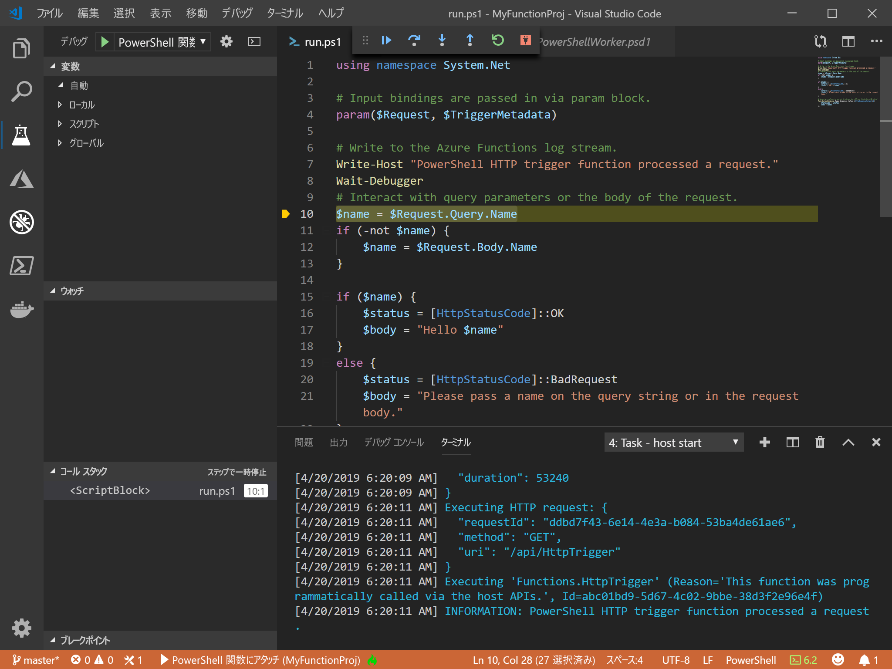
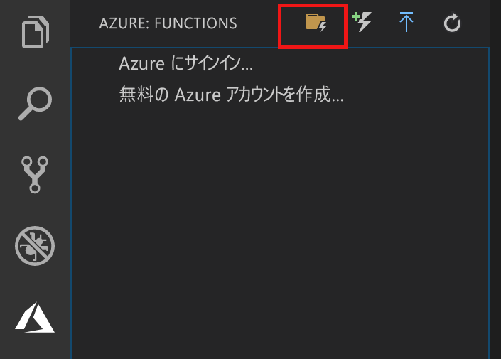

# <a name="create-your-first-powershell-function-in-azure"></a>Azure で初めての PowerShell 関数を作成する

このクイック スタート記事では、Visual Studio Code を使用して初めての[サーバーレス](https://azure.com/serverless) PowerShell 関数を作成する方法について説明します。



[Visual Studio Code 用 Azure Functions 拡張機能]を使用して、PowerShell 関数をローカルに作成し、Azure の新しい関数アプリにデプロイします。 この拡張機能は現在プレビュー段階にあります。 詳細については、[Visual Studio Code 用 Azure Functions 拡張機能]のページをご覧ください。

次の手順は、macOS、Windows、および Linux ベースのオペレーティング システムでサポートされます。

## <a name="prerequisites"></a>前提条件

このクイック スタートを完了するには、以下が必要です。

* [PowerShell Core](/powershell/scripting/install/installing-powershell-core-on-windows) をインストールします。

* [サポートされているプラットフォーム](https://code.visualstudio.com/docs/supporting/requirements#_platforms)のいずれかに [Visual Studio Code](https://code.visualstudio.com/) をインストールします。 

* [Visual Studio Code 用 PowerShell 拡張機能](https://marketplace.visualstudio.com/items?itemName=ms-vscode.PowerShell)をインストールします。

* [.NET Core SDK 2.2 以降](https://www.microsoft.com/net/download) (Azure Functions Core Tools で必要であり、すべてのプラットフォームで使用可能) をインストールします。

* [Azure Functions Core Tools](functions-run-local.md#v2) のバージョン 2.x をインストールします。

* アクティブな Azure サブスクリプションも必要です。

[!INCLUDE [quickstarts-free-trial-note](../../includes/quickstarts-free-trial-note.md)]

[!INCLUDE [functions-install-vs-code-extension](../../includes/functions-install-vs-code-extension.md)] 

## <a name="create-a-function-app-project"></a>関数アプリ プロジェクトを作成する

Visual Studio Code の Azure Functions プロジェクト テンプレートでは、Azure の関数アプリに発行できるプロジェクトを作成します。 関数アプリを使用すると、リソースの管理、デプロイ、スケーリング、および共有を容易にするための論理ユニットとして関数をグループ化できます。

1. Visual Studio Code で、Azure ロゴを選択して **[Azure:Functions]** 領域を表示し、[新しいプロジェクトの作成] アイコンを選択します。

    

1. Functions プロジェクト ワークスペースの場所を選択し、 **[選択]** を選択します。

    > [!NOTE]
    > この記事は、ワークスペースの外部で実行するように設計されています。 ここでは、ワークスペースに含まれるプロジェクト フォルダーは選択しないでください。

1. 関数アプリ プロジェクトの言語として **[Powershell]** を選択し、 **[Azure Functions v2]** を選択します。

1. 初めての関数のテンプレートとして **[HTTP Trigger]\(HTTP トリガー\)** を選択し、関数名として `HTTPTrigger` を使用します。次に、承認レベルとして **[Function]\(関数\)** を選択します。

    > [!NOTE]
    > **関数**承認レベルでは、Azure で関数エンドポイントを呼び出すときに[関数キー](functions-bindings-http-webhook-trigger.md#authorization-keys)の値が必要です。 これにより、あらゆるユーザーによる関数の呼び出しを防ぎます。

1. メッセージが表示されたら、 **[Add to workspace]\(ワークスペースに追加\)** を選択します。

Visual Studio Code により、新しいワークスペースに PowerShell 関数アプリ プロジェクトが作成されます。 このプロジェクトには、プロジェクト内のすべての関数に適用される [host.json](functions-host-json.md) および [local.settings.json](functions-run-local.md#local-settings-file) 構成ファイルが含まれます。 この [PowerShell プロジェクト](functions-reference-powershell.md#folder-structure)は、Azure で実行される関数アプリと同じです。

[!INCLUDE [functions-run-function-test-local-vs-code-ps](../../includes/functions-run-function-test-local-vs-code-ps.md)]

[!INCLUDE [functions-publish-project-vscode](../../includes/functions-publish-project-vscode.md)]

## <a name="test"></a> Azure で関数を実行する

公開した関数が Azure で実行されることを確認するには、次の PowerShell コマンドを実行します。`Uri` パラメーターは前の手順の HTTPTrigger 関数の URL で置き換えます。 次の例のように、前の手順と同様にクエリ文字列 `&name=<yourname>` を URL に追加します。

```powershell
PS > Invoke-WebRequest -Method Get -Uri "https://glengatest-vscode-powershell.azurewebsites.net/api/HttpTrigger?code=nrY05eZutfPqLo0som...&name=PowerShell"

StatusCode        : 200
StatusDescription : OK
Content           : Hello PowerShell
RawContent        : HTTP/1.1 200 OK
                    Content-Length: 16
                    Content-Type: text/plain; charset=utf-8
                    Date: Thu, 25 Apr 2019 16:01:22 GMT

                    Hello PowerShell
Forms             : {}
Headers           : {[Content-Length, 16], [Content-Type, text/plain; charset=utf-8], [Date, Thu, 25 Apr 2019 16:01:22 GMT]}
Images            : {}
InputFields       : {}
Links             : {}
ParsedHtml        : mshtml.HTMLDocumentClass
RawContentLength  : 16
```

## <a name="next-steps"></a>次のステップ

Visual Studio Code を使用して、HTTP によってトリガーされる単純な関数を含む PowerShell 関数アプリを作成しました。 Azure Functions Core Tools を使用して [PowerShell 関数のローカルでのデバッグ](functions-debug-powershell-local.md)についても学習できます。 [Azure Functions PowerShell 開発者ガイド](functions-reference-powershell.md)をご確認ください。

> [!div class="nextstepaction"]
> [Application Insights との統合を有効にする](functions-monitoring.md#manually-connect-an-app-insights-resource)

[Azure portal]: https://portal.azure.com
[Azure Functions Core Tools]: functions-run-local.md
[Visual Studio Code 用 Azure Functions 拡張機能]: https://marketplace.visualstudio.com/items?itemName=ms-azuretools.vscode-azurefunctions
[`Wait-Debugger`]: /powershell/module/microsoft.powershell.utility/wait-debugger?view=powershell-6
