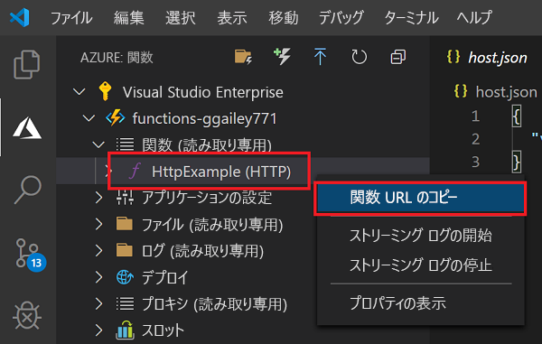
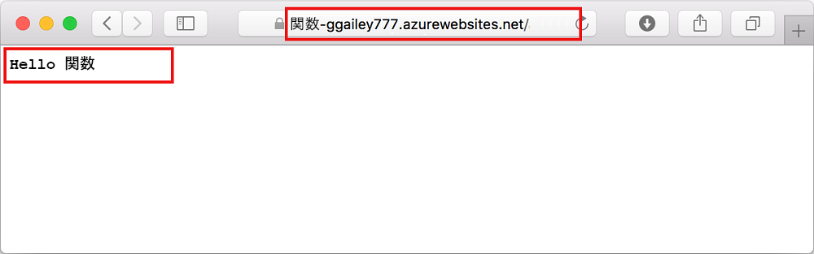

# クイック スタート:Visual Studio Code を使用して Azure Functions プロジェクトを作成する

この記事では、HTTP 要求に応答する関数を、Visual Studio Code を使用して作成します。 コードをローカルでテストした後、Azure Functions のサーバーレス環境にデプロイします。 このクイックスタートを完了すると、ご利用の Azure アカウントでわずかな (数セント未満の) コストが発生します。 

::: zone pivot="programming-language-csharp,programming-language-javascript,programming-language-typescript,programming-language-powershell,programming-language-python" 
また、この記事の [CLI ベースのバージョン](functions-create-first-azure-function-azure-cli.md)もあります。
::: zone-end  

::: zone pivot="programming-language-java"  
> [!NOTE]
> VS Code が好みの開発ツールでない場合は、[Maven](/azure/azure-functions/functions-create-first-azure-function-azure-cli?pivots=programming-language-java)、[Gradle](/azure/azure-functions/functions-create-first-java-gradle)、および [IntelliJ IDEA](/azure/java/intellij/azure-toolkit-for-intellij-quickstart-functions) を使用する Java 開発者向けの同様のチュートリアルを確認してください。
::: zone-end  

## 環境を構成する

作業を開始する前に、次の要件が満たされていることを確認します。

+ アクティブなサブスクリプションが含まれる Azure アカウント。 [無料でアカウントを作成できます](https://azure.microsoft.com/free/?ref=microsoft.com&utm_source=microsoft.com&utm_medium=docs&utm_campaign=visualstudio)。

::: zone pivot="programming-language-csharp,programming-language-powershell,programming-language-python"  
+ [Node.js](https://nodejs.org/)。Windows で npm を使用するために必要となります。 使用できるのは、[アクティブ LTS およびメンテナンス LTS バージョン](https://nodejs.org/about/releases/)のみです。 `node --version` コマンドを使用して、現在のバージョンを確認してください。
    macOS や Linux 上のローカル開発では必要ありません。   
::: zone-end  
::: zone pivot="programming-language-javascript,programming-language-typescript"  
+ [Node.js](https://nodejs.org/)。アクティブ LTS およびメンテナンス LTS バージョン (10.14.1 を推奨)。 `node --version` コマンドを使用して、現在のバージョンを確認してください。
::: zone-end 
::: zone pivot="programming-language-python"
+ [Python 3.8](https://www.python.org/downloads/release/python-381/)、[Python 3.7](https://www.python.org/downloads/release/python-375/)、[Python 3.6](https://www.python.org/downloads/release/python-368/) が Azure Functions (x64) でサポートされます。
::: zone-end   
::: zone pivot="programming-language-powershell"
+ [PowerShell Core](/powershell/scripting/install/installing-powershell-core-on-windows)

+ [.NET Core SDK 2.2 以上](https://www.microsoft.com/net/download)  
::: zone-end  
::: zone pivot="programming-language-java"  
+ [Java Developer Kit](https://aka.ms/azure-jdks)、バージョン 8。

+ [Apache Maven](https://maven.apache.org) バージョン 3.0 以降。
::: zone-end  
+ [サポートされているプラットフォーム](https://code.visualstudio.com/docs/supporting/requirements#_platforms)のいずれかにインストールされた [Visual Studio Code](https://code.visualstudio.com/)。  
::: zone pivot="programming-language-csharp"  
+ Visual Studio Code 用の [C# 拡張機能](https://marketplace.visualstudio.com/items?itemName=ms-dotnettools.csharp)。  
::: zone-end  
::: zone pivot="programming-language-python"
+ Visual Studio Code 用の [Python 拡張機能](https://marketplace.visualstudio.com/items?itemName=ms-python.python)。  
::: zone-end  
::: zone pivot="programming-language-powershell"
+ [Visual Studio Code 用 PowerShell 拡張機能](https://marketplace.visualstudio.com/items?itemName=ms-vscode.PowerShell)。 
::: zone-end  
::: zone pivot="programming-language-java"  
+ [Java Extension Pack](https://marketplace.visualstudio.com/items?itemName=vscjava.vscode-java-pack)
::: zone-end  

+ Visual Studio Code 用 [Azure Functions 拡張機能](https://marketplace.visualstudio.com/items?itemName=ms-azuretools.vscode-azurefunctions)。 

## ローカル プロジェクトを作成する 

このセクションでは、Visual Studio Code を使用し、選択した言語でローカル Azure Functions プロジェクトを作成します。 後からこの記事の中で、関数コードを Azure に発行します。 

1. アクティビティ バーの Azure アイコンを選択し、 **[Azure: Functions]** 領域で **[新しいプロジェクトの作成]** アイコンを選択します。

    ![[新しいプロジェクトの作成] を選択する](media/functions-create-first-function-vs-code/create-new-project.png)

1. プロジェクト ワークスペースのディレクトリの場所を選択し、 **[選択]** をクリックします。

    > [!NOTE]
    > これらの手順は、ワークスペースの外部で実行するように設計されています。 ここでは、ワークスペースに含まれるプロジェクト フォルダーは選択しないでください。

1. プロンプトで、次の情報を入力します。

    ::: zone pivot="programming-language-csharp"
    + **Select a language for your function project (関数プロジェクトの言語を選択してください)** : [`C#`] を選択します。
    ::: zone-end
    ::: zone pivot="programming-language-javascript"
    + **Select a language for your function project (関数プロジェクトの言語を選択してください)** : [`JavaScript`] を選択します。
    ::: zone-end
    ::: zone pivot="programming-language-typescript"
    + **Select a language for your function project (関数プロジェクトの言語を選択してください)** : [`TypeScript`] を選択します。
    ::: zone-end
    ::: zone pivot="programming-language-powershell"
    + **Select a language for your function project (関数プロジェクトの言語を選択してください)** : [`PowerShell`] を選択します。
    ::: zone-end
    ::: zone pivot="programming-language-python"
    + **Select a language for your function project (関数プロジェクトの言語を選択してください)** : [`Python`] を選択します。

    + **Select a Python alias to create a virtual environment (仮想環境を作成する Python エイリアスを選択してください)** : Python インタープリターの場所を選択します。 場所が表示されない場合は、Python バイナリの完全パスを入力してください。  
    ::: zone-end

    ::: zone pivot="programming-language-java"  
    + **Select a language for your function project (関数プロジェクトの言語を選択してください)** : [`Java`] を選択します。

    + **Provide a group ID (グループ ID を指定してください)** : [`com.function`] を選択します。

    + **Provide an artifact ID (成果物 ID を指定してください)** : [`myFunction`] を選択します。

    + **Provide a version (バージョンを指定してください)** : [`1.0-SNAPSHOT`] を選択します。

    + **Provide a package name (パッケージ名を指定してください)** : [`com.function`] を選択します。

    + **Provide an app name (アプリ名を指定してください)** : [`myFunction-12345`] を選択します。
    ::: zone-end  
    ::: zone pivot="programming-language-csharp,programming-language-javascript,programming-language-typescript,programming-language-powershell,programming-language-python"
    + **Select a template for your project's first function (プロジェクトの最初の関数のテンプレートを選択してください)** : [`HTTP trigger`] を選択します。
    
    + **Provide a function name (関数名を指定してください):** 「`HttpExample`.
    ::: zone-end  
    ::: zone pivot="programming-language-csharp"
    + **Provide a namespace (名前空間を指定してください)** : 「`My.Functions`. 
    ::: zone-end  
    ::: zone pivot="programming-language-csharp,programming-language-javascript,programming-language-typescript,programming-language-powershell,programming-language-python"
    + **承認レベル**: `Anonymous` を選択します。この場合、すべてのユーザーが関数のエンドポイントを呼び出すことができます。 承認レベルについては、「[承認キー](functions-bindings-http-webhook-trigger.md#authorization-keys)」を参照してください。
    ::: zone-end  
    + **Select how you would like to open your project (プロジェクトを開く方法を選択してください)** : [`Add to workspace`] を選択します。

1. Visual Studio Code は、この情報を使用して、HTTP トリガーによる Azure Functions プロジェクトを生成します。 ローカル プロジェクト ファイルは、エクスプローラーで表示できます。 作成されるファイルの詳細については、「[生成されるプロジェクト ファイル](functions-develop-vs-code.md#generated-project-files)」を参照してください。 

::: zone pivot="programming-language-csharp,programming-language-javascript,programming-language-python,programming-language-java"

[!INCLUDE [functions-run-function-test-local-vs-code](../../includes/functions-run-function-test-local-vs-code.md)]

::: zone-end

::: zone pivot="programming-language-powershell"

[!INCLUDE [functions-run-function-test-local-vs-code-ps](../../includes/functions-run-function-test-local-vs-code-ps.md)]

::: zone-end

関数がローカル コンピューター上で正常に動作することを確認したら、Visual Studio Code を使用してプロジェクトを直接 Azure に発行します。 

[!INCLUDE [functions-sign-in-vs-code](../../includes/functions-sign-in-vs-code.md)]

[!INCLUDE [functions-publish-project-vscode](../../includes/functions-publish-project-vscode.md)]

## Azure で関数を実行する

1. **[Azure: Functions]** 領域 (サイド バー内) に戻り、サブスクリプションの下にある新しい関数アプリを展開します。 **[Functions]** を展開し、 **[HttpExample]** を右クリック (Windows) または Ctrl キーを押しながらクリック (macOS) して、 **[Copy function URL]\(関数 URL のコピー\)** を選択します。

    

1. HTTP 要求の URL をブラウザーのアドレス バーに貼り付け、この URL の最後に `name` クエリ文字列を `?name=Functions` として追加して、要求を実行します。 HTTP によってトリガーされる関数を呼び出す URL は、次の形式である必要があります。

        http://<functionappname>.azurewebsites.net/api/httpexample?name=Functions 
        
    関数によって返されたリモート GET 要求に対するブラウザーでの応答を次の例に示します。 

    

## リソースをクリーンアップする

この後、[関数に Azure Storage キュー バインドを追加する](functions-add-output-binding-storage-queue-vs-code.md)手順に進む場合、既存の作業をベースにするので、リソースはすべてそのままにしておく必要があります。

それ以外の場合は、追加コストの発生を避けるために、次の手順に従って関数アプリとその関連リソースを削除してください。

[!INCLUDE [functions-cleanup-resources-vs-code.md](../../includes/functions-cleanup-resources-vs-code.md)]

Functions のコストについて詳しくは、「[従量課金プランのコストの見積もり](functions-consumption-costs.md)」を参照してください。

## 次のステップ

Visual Studio Code を使用して、HTTP によってトリガーされる単純な関数を含む関数アプリを作成しました。 次の記事では、出力バインディングを追加してその関数を拡張します。 このバインディングでは、HTTP 要求の文字列が Azure Queue Storage キュー内のメッセージに書き込まれます。 

> [!div class="nextstepaction"]
> [関数に Azure Storage キュー バインドを追加する](functions-add-output-binding-storage-queue-vs-code.md)

[Azure Functions Core Tools]: functions-run-local.md
[Azure Functions extension for Visual Studio Code]: https://marketplace.visualstudio.com/items?itemName=ms-azuretools.vscode-azurefunctions
