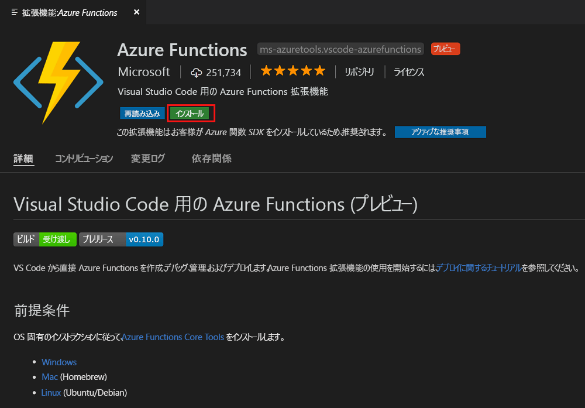
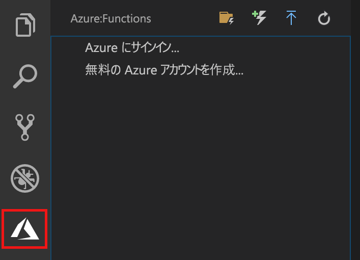
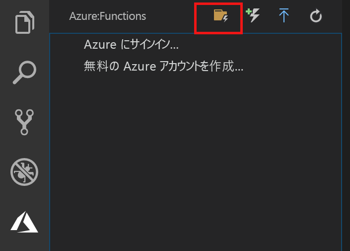
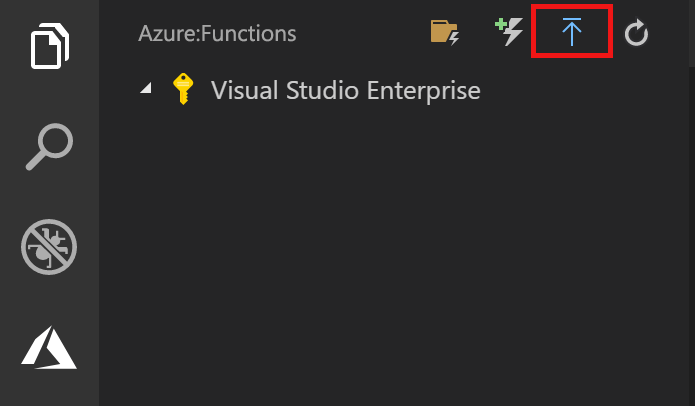
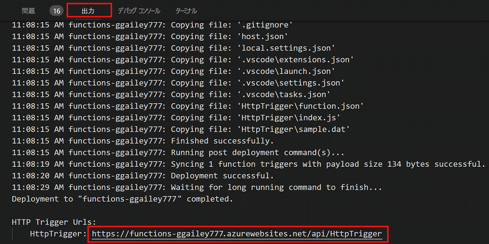

# Visual Studio Code を使用した初めての関数の作成

Azure Functions を使用すると、最初に VM を作成したり Web アプリケーションを発行したりしなくても、[サーバーレス](https://azure.microsoft.com/solutions/serverless/)環境でコードを実行できます。

この記事では、Microsoft Visual Studio Code で [Visual Studio Code 用 Azure Functions 拡張機能]を使用して、ローカル コンピューター上で "hello world" 関数を作成し、テストする方法について説明します。 その後、Visual Studio Code から関数コードを Azure に発行します。

現在、この拡張機能では、C#、JavaScript、Java 関数がサポートされています。 この記事の手順は、Azure Functions プロジェクト用に選択した言語によって異なる場合があります。 この拡張機能は現在プレビュー段階にあります。 詳細については、[Visual Studio Code 用 Azure Functions 拡張機能]のページをご覧ください。

## 前提条件

このクイック スタートを完了するには、以下が必要です。

* [サポートされているプラットフォーム](https://code.visualstudio.com/docs/supporting/requirements#_platforms)のいずれかに [Visual Studio Code](https://code.visualstudio.com/) をインストールします。 この記事は、macOS (High Sierra) を実行するデバイスに基づいて作成され、テストされました。

* [Azure Functions Core Tools](functions-run-local.md#v2) のバージョン 2.x (現在プレビュー段階) をインストールします。

* 選択した言語に固有の要件をインストールします。

    | 言語 | 拡張機能 |
    | -------- | --------- |
    | **C#** | [C# for Visual Studio Code](https://marketplace.visualstudio.com/items?itemName=ms-vscode.csharp) [.NET Core CLI ツール](https://docs.microsoft.com/dotnet/core/tools/?tabs=netcore2x)*   |
    | **Java** | [Debugger for Java](https://marketplace.visualstudio.com/items?itemName=vscjava.vscode-java-debug) [Java 8](https://aka.ms/azure-jdks) [Maven 3+](https://maven.apache.org/) |
    | **JavaScript** | [Node 8.0+](https://nodejs.org/)  |

    \* Core Tools でも必要です。

[!INCLUDE [quickstarts-free-trial-note](../../includes/quickstarts-free-trial-note.md)]

## Azure Functions 拡張機能をインストールする

関数を作成してテストし、Azure にデプロイするには、Azure Functions 拡張機能を使用します。

1. Visual Studio Code で **[拡張機能]** を開き、`azure functions` を検索するか、[Visual Studio Code でこのリンクを開きます](vscode:extension/ms-azuretools.vscode-azurefunctions)。

1. **[インストール]** を選択して、Visual Studio Code に拡張機能をインストールします。 

    

1. Visual Studio Code を再起動し、アクティビティ バーの Azure アイコンを選択します。 サイド バーに Azure Functions 領域が表示されます。

    

## Azure Functions プロジェクトを作成する

Visual Studio Code の Azure Functions プロジェクト テンプレートでは、Azure の関数アプリに発行できるプロジェクトを作成します。 関数アプリを使用すると、リソースを管理、デプロイ、および共有するための論理ユニットとして関数をグループ化できます。

1. Visual Studio Code で、Azure ロゴを選択して **[Azure: Functions]** 領域を表示し、[新しいプロジェクトの作成] アイコンを選択します。

    

1. プロジェクト ワークスペースの場所を選択し、**[選択]** をクリックします。

    > [!NOTE]
    > この記事は、ワークスペースの外部で実行するように設計されています。 ここでは、ワークスペースに含まれるプロジェクト フォルダーは選択しないでください。

1. 関数アプリ プロジェクトの言語を選択します。 この記事では、JavaScript を使用しています。
    

1. メッセージが表示されたら、**[Add to workspace]\(ワークスペースに追加\)** を選択します。

Visual Studio Code によって、新しいワークスペースに関数アプリ プロジェクトが作成されます。 このプロジェクトには、[host.json](functions-host-json.md) および [local.settings.json](functions-run-local.md#local-settings-file) 構成ファイルと、言語固有のプロジェクト ファイルが含まれています。 プロジェクト フォルダーに新しい Git リポジトリも取得します。

## HTTP によってトリガーされる関数の作成

1. **[Azure: Functions]** で [関数の作成] アイコンを選択します。

    

1. 関数アプリ プロジェクトが含まれたフォルダーを選択し、**[HTTP トリガー]** 関数テンプレートを選択します。

    

1. 関数名として「`HTTPTrigger`」と入力して Enter キーを押し、**[匿名]** 認証を選択します。

    

    HTTP によってトリガーされる関数のテンプレートを使用して、選択した言語で関数が作成されます。

    

function.json ファイルを変更することで、入力および出力バインディングを関数に追加できます。 詳細については、「[Azure Functions でのトリガーとバインドの概念](functions-triggers-bindings.md)」をご覧ください。

関数プロジェクトと、HTTP によってトリガーされる関数を作成できたので、この関数をローカル コンピューターでテストすることができます。

## 関数をローカルでテストする

Azure Functions Core Tools を使用すると、ローカルの開発用コンピューター上で Azure Functions プロジェクトを実行できます。 Visual Studio Code から初めて関数を起動すると、これらのツールをインストールするよう求めるメッセージが表示されます。  

1. 関数をテストするには、関数コードにブレークポイントを設定し、F5 キーを押して関数アプリ プロジェクトを開始します。 Core Tools からの出力が**ターミナル** パネルに表示されます。

1. **ターミナル** パネルで、HTTP によってトリガーされる関数の URL エンドポイントをコピーします。

    

1. HTTP 要求の URL をブラウザーのアドレス バーに貼り付けます。 この URL にクエリ文字列 `?name=<yourname>` を追加して、要求を実行します。 ブレークポイントに到達すると、実行が一時停止されます。

    

1. 実行を続行したときの、GET 要求に対するブラウザーの応答を次に示します。

    

1. デバッグを停止するには、Shift キーを押しながら F1 キーを押します。

関数がローカル コンピューター上で正常に動作することを確認したら、プロジェクトを Azure に発行します。

## Azure へのサインイン

アプリを発行するには、Azure にサインインしておく必要があります。

1. **[Azure: Functions]** 領域で、**[Sign in to Azure...]\(Azure にサインインする...\)** を選択します。アカウントがない場合は、**無料の Azure アカウントを作成する**ことができます。

    

1. メッセージが表示されたら、**[Copy & Open]\(コピー & 開く\)** を選択するか、表示されたコードをコピーし、ブラウザーで <https://aka.ms/devicelogin> を開きます。

1. **[デバイスのログイン]** ページにコピーしたコードを貼り付け、Visual Studio Code のサインインを確認して、**[続行]** を選択します。  

1. Azure アカウントの資格情報を使用してサインインを完了します。 正常にサインインしたら、ブラウザーを閉じてかまいません。

## Azure にプロジェクトを発行する

Visual Studio Code を使用すると、関数プロジェクトを Azure に直接発行できます。 このプロセスでは、Azure サブスクリプションに関数アプリと関連リソースを作成します。 関数アプリは、関数の実行コンテキストを提供します。 プロジェクトがパッケージ化され、Azure サブスクリプション内の新しい関数アプリにデプロイされます。 

この記事では、新しい関数アプリを作成することを想定しています。 既存の関数アプリに発行すると、Azure のそのアプリのコンテンツが上書きされます。

1. **[Azure: Functions]** 領域で、[Deploy to Function App]\(関数アプリにデプロイ\) アイコンを選択します。

    

1. 現在のワークスペースであるプロジェクト フォルダーを選択します。

1. 複数のサブスクリプションがある場合は、関数アプリをホストするサブスクリプションを選択し、**[+ Create New Function App]\(+ 新しい関数アプリの作成\)** を選択します。

1. 関数アプリを識別するグローバルに一意の名前を入力し、Enter キーを押します。 関数アプリ名の有効な文字は、`a-z`、`0-9`、`-` です。

1. **[+ 新しいリソース グループの作成]** を選択し、`myResourceGroup` のようなリソース グループ名を入力して、Enter キーを押します。 既存のリソース グループを使用することもできます。

1. **[+ 新しいストレージ アカウントの作成]** を選択し、関数アプリで使用する新しいストレージ アカウントのグローバルに一意の名前を入力して、Enter キーを押します。 ストレージ アカウント名の長さは 3 ～ 24 文字で、数字と小文字のみを使用できます。 既存のアカウントを使用することもできます。

1. 最寄りの[リージョン](https://azure.microsoft.com/regions/)または関数がアクセスする他のサービスの近くのリージョン内の場所を選択します。

    場所を選択したら、関数アプリの作成が開始されます。 関数アプリが作成され、展開パッケージが適用されると、通知が表示されます。

1. 通知の **[View Output]\(出力の表示\)** を選択すると、作成済みの Azure リソースなど、作成とデプロイの結果が表示されます。

    

1. Azure の新しい関数アプリの URL を書き留めます。 プロジェクトが Azure に発行されたら、この URL を使用して関数をテストします。

    

1. **[Azure: Functions]** 領域に戻ると、サブスクリプションの下に新しい関数アプリが表示されています。 このノードを展開すると、関数アプリ内の関数、およびアプリケーション設定と関数プロキシが表示されます。

    

    関数アプリ ノードで、Ctrl キーを押しながらクリック (右クリック) して、Azure の関数アプリに対してさまざまな管理/構成タスクを実行します。 また、Azure portal で関数アプリを表示することもできます。

## Azure で関数をテストする

1. **出力**パネルから HTTP トリガーの URL をコピーします。 前と同様に、この URL の末尾にクエリ文字列 `?name=<yourname>` を追加してから、要求を実行します。

    HTTP によってトリガーされる関数を呼び出す URL は、次の形式である必要があります。

        http://<functionappname>.azurewebsites.net/api/<functionname>?name=<yourname> 

1. HTTP 要求のこの新しい URL をブラウザーのアドレス バーに貼り付けます。 関数によって返されたリモート GET 要求に対するブラウザーでの応答を次に示します。 

    

## 次の手順

Visual Studio Code を使用して、HTTP によってトリガーされる単純な関数を含む関数アプリを作成しました。 特定の言語での関数の開発の詳細については、[JavaScript](functions-reference-node.md)、[.NET](functions-dotnet-class-library.md)、または [Java](functions-reference-java.md) の言語リファレンス ガイドをご覧ください。

次に、Azure Functions Core Tools を使用した、ターミナルまたはコマンド プロンプトからのローカルでの テストとデバッグの詳細を確認します。

> [!div class="nextstepaction"]
> [ローカルでコーディングしてテストする](functions-run-local.md)

[Azure Functions Core Tools]: functions-run-local.md
[Visual Studio Code 用 Azure Functions 拡張機能]: https://marketplace.visualstudio.com/items?itemName=ms-azuretools.vscode-azurefunctions
