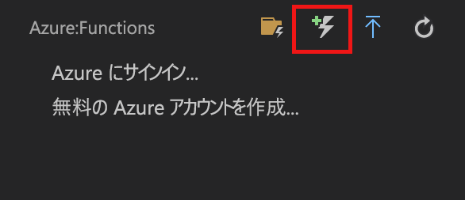
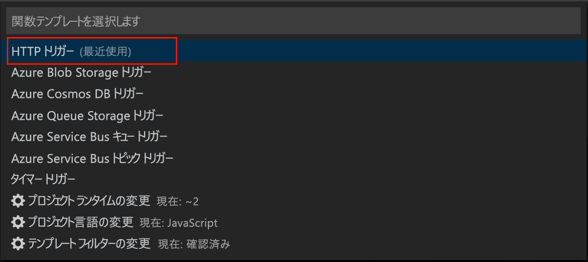

# Visual Studio Code を使用した初めての関数の作成

Azure Functions を使用すると、最初に VM を作成したり Web アプリケーションを発行したりしなくても、[サーバーレス](https://azure.microsoft.com/solutions/serverless/)環境でコードを実行できます。

この記事では、Microsoft Visual Studio Code で [Visual Studio Code 用 Azure Functions 拡張機能]を使用して、ローカル コンピューター上で "hello world" 関数を作成し、テストする方法について説明します。 その後、Visual Studio Code から関数コードを Azure に発行します。

現在、この拡張機能では、C#、JavaScript、Java 関数が完全にサポートされており、Python のサポートはプレビュー段階です。 この記事の手順は、Azure Functions プロジェクト用に選択した言語によって異なる場合があります。 この拡張機能は現在プレビュー段階にあります。 詳細については、[Visual Studio Code 用 Azure Functions 拡張機能]のページをご覧ください。

## 前提条件

このクイック スタートを完了するには、以下が必要です。

* [サポートされているプラットフォーム](https://code.visualstudio.com/docs/supporting/requirements#_platforms)のいずれかに [Visual Studio Code](https://code.visualstudio.com/) をインストールします。 この記事は、macOS (High Sierra) を実行するデバイスに基づいて作成され、テストされました。

* [Azure Functions Core Tools](functions-run-local.md#v2) のバージョン 2.x (現在プレビュー段階) をインストールします。

* 選択した言語に固有の要件をインストールします。

    | 言語 | 拡張機能 |
    | -------- | --------- |
    | **C#** | [C# for Visual Studio Code](https://marketplace.visualstudio.com/items?itemName=ms-vscode.csharp) [.NET Core CLI ツール](https://docs.microsoft.com/dotnet/core/tools/?tabs=netcore2x)*   |
    | **Java** | [Debugger for Java](https://marketplace.visualstudio.com/items?itemName=vscjava.vscode-java-debug) [Java 8](https://aka.ms/azure-jdks) [Maven 3 以降](https://maven.apache.org/) |
    | **JavaScript** | [Node 8.0 以降](https://nodejs.org/)  |

    \* Core Tools でも必要です。

[!INCLUDE [quickstarts-free-trial-note](../../includes/quickstarts-free-trial-note.md)]

[!INCLUDE [functions-install-vs-code-extension](../../includes/functions-install-vs-code-extension.md)]

[!INCLUDE [functions-create-function-app-vs-code](../../includes/functions-create-function-app-vs-code.md)]

## HTTP によってトリガーされる関数の作成

1. **[Azure:Functions]** で [関数の作成] アイコンを選択します。

    

1. 関数アプリ プロジェクトが含まれたフォルダーを選択し、**[HTTP トリガー]** 関数テンプレートを選択します。

    

1. 関数名として「`HTTPTrigger`」と入力して Enter キーを押し、**[匿名]** 認証を選択します。

    

    HTTP によってトリガーされる関数のテンプレートを使用して、選択した言語で関数が作成されます。

    

function.json ファイルを変更することで、入力および出力バインディングを関数に追加できます。 詳細については、「[Azure Functions でのトリガーとバインドの概念](functions-triggers-bindings.md)」をご覧ください。

関数プロジェクトと、HTTP によってトリガーされる関数を作成できたので、この関数をローカル コンピューターでテストすることができます。

## 関数をローカルでテストする

Azure Functions Core Tools を使用すると、ローカルの開発用コンピューター上で Azure Functions プロジェクトを実行できます。 Visual Studio Code から初めて関数を起動すると、これらのツールをインストールするよう求めるメッセージが表示されます。  

1. 関数をテストするには、関数コードにブレークポイントを設定し、F5 キーを押して関数アプリ プロジェクトを開始します。 Core Tools からの出力が**ターミナル** パネルに表示されます。

1. **ターミナル** パネルで、HTTP によってトリガーされる関数の URL エンドポイントをコピーします。

    

1. HTTP 要求の URL をブラウザーのアドレス バーに貼り付けます。 この URL にクエリ文字列 `?name=<yourname>` を追加して、要求を実行します。 ブレークポイントに到達すると、実行が一時停止されます。

    

1. 実行を続行したときの、GET 要求に対するブラウザーの応答を次に示します。

    

1. デバッグを停止するには、Shift キーを押しながら F5 キーを押します。

関数がローカル コンピューター上で正常に動作することを確認したら、プロジェクトを Azure に発行します。

[!INCLUDE [functions-sign-in-vs-code](../../includes/functions-sign-in-vs-code.md)]

[!INCLUDE [functions-publish-project-vscode](../../includes/functions-publish-project-vscode.md)]

## Azure で関数をテストする

1. **出力**パネルから HTTP トリガーの URL をコピーします。 前と同様に、この URL の末尾にクエリ文字列 `?name=<yourname>` を追加してから、要求を実行します。

    HTTP によってトリガーされる関数を呼び出す URL は、次の形式である必要があります。

        http://<functionappname>.azurewebsites.net/api/<functionname>?name=<yourname> 

1. HTTP 要求のこの新しい URL をブラウザーのアドレス バーに貼り付けます。 関数によって返されたリモート GET 要求に対するブラウザーでの応答を次に示します。 

    

## 次の手順

Visual Studio Code を使用して、HTTP によってトリガーされる単純な関数を含む関数アプリを作成しました。 Azure Functions Core Tools を使用した、[ターミナルまたはコマンド プロンプトからのローカルでの テストとデバッグ](functions-run-local.md)の詳細を確認することもできます。

> [!div class="nextstepaction"]
> [Application Insights との統合を有効にする](functions-monitoring.md#manually-connect-an-app-insights-resource)

[Azure Functions Core Tools]: functions-run-local.md
[Visual Studio Code 用 Azure Functions 拡張機能]: https://marketplace.visualstudio.com/items?itemName=ms-azuretools.vscode-azurefunctions
