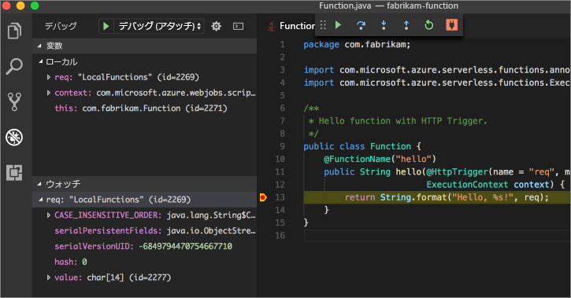

# <a name="create-your-first-function-with-java-and-maven-preview"></a>Java と Maven を使用して初めての関数を作成する (プレビュー)

[!INCLUDE [functions-java-preview-note](../../includes/functions-java-preview-note.md)]

このクイックスタートでは、Maven で[サーバーレス](https://azure.microsoft.com/overview/serverless-computing/)関数プロジェクトを作成し、ローカルでテストして、Azure Functions にデプロイする手順について説明します。 完了すると、HTTP によってトリガーされる関数アプリが Azure で実行されるようになります。


[!INCLUDE [quickstarts-free-trial-note](../../includes/quickstarts-free-trial-note.md)]

## <a name="prerequisites"></a>前提条件
Java で関数アプリを開発するには、以下のものがインストールされている必要があります。

-  [Java Developer Kit](https://www.azul.com/downloads/zulu/) バージョン 8。
-  [Apache Maven](https://maven.apache.org) バージョン 3.0 以降。
-  [Azure CLI](https://docs.microsoft.com/cli/azure)

> [!IMPORTANT] 
> このクイックスタートを行うには、JAVA_HOME 環境変数を JDK のインストール場所に設定する必要があります。

## <a name="install-the-azure-functions-core-tools"></a>Azure Functions Core Tools のインストール

Azure Functions Core Tools では、ターミナルまたはコマンド プロンプトから Azure Functions を記述、実行、デバッグするためのローカル開発環境が提供されます。 

続行する前に、[バージョン 2 の Core Tools](functions-run-local.md#v2) をローカル コンピューターにインストールします。

## <a name="generate-a-new-functions-project"></a>新しい Functions プロジェクトを生成する

空のフォルダーで次のコマンドを実行して、[Maven アーキタイプ](https://maven.apache.org/guides/introduction/introduction-to-archetypes.html)から Functions プロジェクトを生成します。

### <a name="linuxmacos"></a>Linux/MacOS

```bash
mvn archetype:generate \
    -DarchetypeGroupId=com.microsoft.azure \
    -DarchetypeArtifactId=azure-functions-archetype 
```

### <a name="windows-cmd"></a>Windows (CMD)
```cmd
mvn archetype:generate ^
    -DarchetypeGroupId=com.microsoft.azure ^
    -DarchetypeArtifactId=azure-functions-archetype
```

Maven によって、プロジェクトの生成を終了するために必要な値の入力を求めるメッセージが表示されます。 _groupId_、_artifactId_、_version_ の値については、[Maven の名前付け規則](https://maven.apache.org/guides/mini/guide-naming-conventions.html)をご覧ください。 _appName_ の値は Azure 全体で一意である必要があるため、Maven は既定値として前に入力された _artifactId_ を基にしてアプリ名を生成します。 _packageName_ の値により、生成される関数コードの Java パッケージが決まります。

以下の `com.fabrikam.functions` および `fabrikam-functions` 識別子は例として使用されており、このクイック スタートの後の方の手順を読みやすくしています。 この手順では、Maven に独自の値を指定することをお勧めします。

```Output
Define value for property 'groupId': com.fabrikam.functions
Define value for property 'artifactId' : fabrikam-functions
Define value for property 'version' 1.0-SNAPSHOT : 
Define value for property 'package': com.fabrikam.functions
Define value for property 'appName' fabrikam-functions-20170927220323382:
Confirm properties configuration: Y
```

Maven は、この例 `fabrikam-functions` の場合、_artifactId_ という名前の新しいフォルダーにプロジェクト ファイルを作成します。 プロジェクトで生成される、すぐに実行できるコードは、[HTTP によってトリガーされる](/azure/azure-functions/functions-bindings-http-webhook)、要求の本文をエコーする簡単な関数です。

```java
public class Function {
    /**
     * This function listens at endpoint "/api/hello". Two ways to invoke it using "curl" command in bash:
     * 1. curl -d "HTTP Body" {your host}/api/hello
     * 2. curl {your host}/api/hello?name=HTTP%20Query
     */
    @FunctionName("hello")
    public HttpResponseMessage<String> hello(
            @HttpTrigger(name = "req", methods = {"get", "post"}, authLevel = AuthorizationLevel.ANONYMOUS) HttpRequestMessage<Optional<String>> request,
            final ExecutionContext context) {
        context.getLogger().info("Java HTTP trigger processed a request.");

        // Parse query parameter
        String query = request.getQueryParameters().get("name");
        String name = request.getBody().orElse(query);

        if (name == null) {
            return request.createResponse(400, "Please pass a name on the query string or in the request body");
        } else {
            return request.createResponse(200, "Hello, " + name);
        }
    }
}

```

## <a name="run-the-function-locally"></a>関数をローカルで実行する

新しく作成されたプロジェクト フォルダーにディレクトリを変更し、Maven で関数をビルドして実行します。

```
cd fabrikam-functions
mvn clean package 
mvn azure-functions:run
```

> [!NOTE]
> Java 9 でこの例外、`javax.xml.bind.JAXBException` が発生している場合は、[GitHub](https://github.com/jOOQ/jOOQ/issues/6477) で回避策を参照してください。

関数がシステム上でローカルに実行されていて、HTTP 要求に応答する準備ができている場合に、次の出力が表示されます。

```Output
Listening on http://localhost:7071
Hit CTRL-C to exit...

Http Functions:

   hello: http://localhost:7071/api/hello
```

新しいターミナル ウィンドウで curl を使用して、コマンド ラインから関数をトリガーします。

```
curl -w '\n' -d LocalFunction http://localhost:7071/api/hello
```

```Output
Hello LocalFunction!
```

関数のコードを停止するには、ターミナルで `Ctrl-C` を使います。

## <a name="deploy-the-function-to-azure"></a>関数を Azure にデプロイする

Azure Functions へのデプロイ プロセスでは、Azure CLI からアカウントの資格情報を使います。 続行する前に、[Azure CLI にログイン](/cli/azure/authenticate-azure-cli?view=azure-cli-latest)します。

```azurecli
az login
```

`azure-functions:deploy` Maven ターゲットを使用して、新しい関数アプリにコードをデプロイします。

```
mvn azure-functions:deploy
```

デプロイが完了すると、Azure 関数アプリへのアクセスに使うことができる URL が表示されます。

```output
[INFO] Successfully deployed Function App with package.
[INFO] Deleting deployment package from Azure Storage...
[INFO] Successfully deleted deployment package fabrikam-function-20170920120101928.20170920143621915.zip
[INFO] Successfully deployed Function App at https://fabrikam-function-20170920120101928.azurewebsites.net
[INFO] ------------------------------------------------------------------------
```

`cURL` を使用して、Azure で実行している関数アプリをテストします。 前の手順でデプロイされた独自の関数アプリの URL と一致するように、下のサンプルの URL を変更する必要があります。

```
curl -w '\n' https://fabrikam-functions-20170920120101928.azurewebsites.net/api/hello -d AzureFunctions
```

```Output
Hello AzureFunctions!
```

## <a name="next-steps"></a>次の手順

簡単な HTTP トリガーを使って Java 関数アプリを作成し、Azure Functions にデプロイしました。

- 「[Azure Functions Java developer guide](functions-reference-java.md)」(Azure Functions Java 開発者ガイド) で、Java 関数の開発の詳細について確認します。
- `azure-functions:add` Maven ターゲットを使って、異なるトリガーの新しい関数をプロジェクトに追加します。
- Visual Studio Code でローカルに関数をデバッグします。 [Java 拡張パック](https://marketplace.visualstudio.com/items?itemName=vscjava.vscode-java-pack)をインストールし、Visual Studio Code で Functions プロジェクトを開いて、ポート 5005 に[デバッガーをアタッチ](https://code.visualstudio.com/Docs/editor/debugging#_launch-configurations)します。 その後、エディターでブレークポイントを設定し、ローカルに実行しながら関数をトリガーします。
- Visual Studio Code でリモートから関数をデバッグします。 その手順については、[サーバーレス Java アプリケーション](https://code.visualstudio.com/docs/java/java-serverless#_remote-debug-functions-running-in-the-cloud)に関するドキュメントを参照してください。
