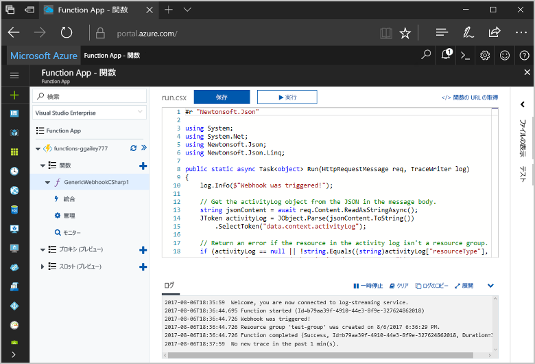
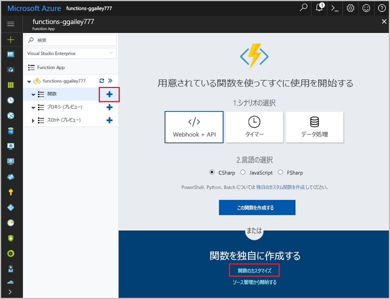
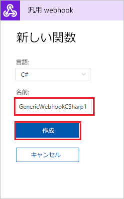
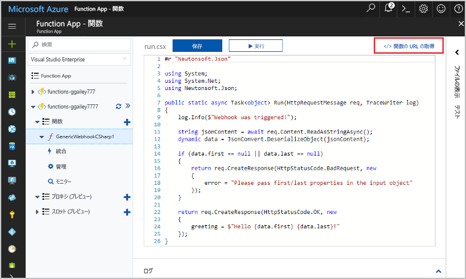
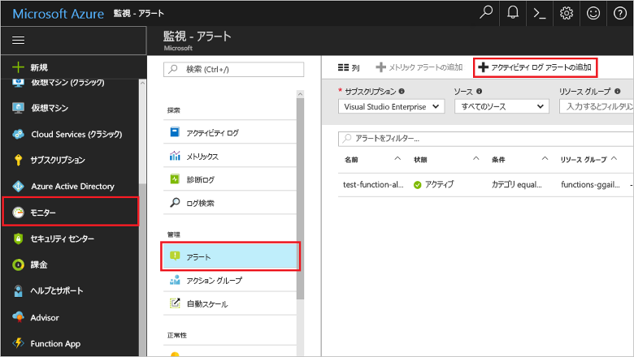
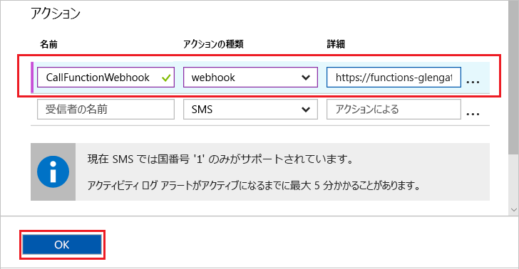
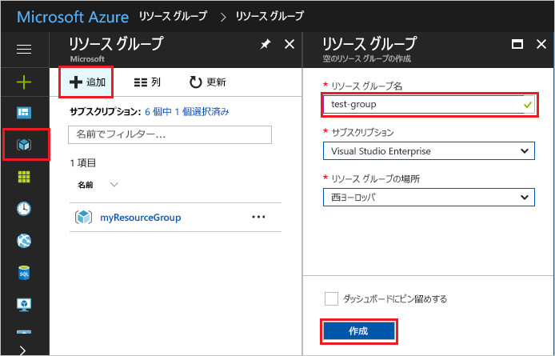
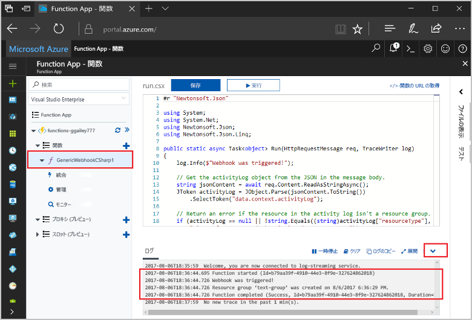

# <a name="create-a-function-triggered-by-a-generic-webhook"></a>ジェネリック webhook でトリガーされる関数の作成

Azure Functions を使用すると、最初に VM を作成したり Web アプリケーションを発行したりしなくても、サーバーレス環境でコードを実行できます。 たとえば、Azure Monitor によって生成されたアラートにトリガーされる関数を構成することができます。 このトピックでは、リソース グループがサブスクリプションに追加されたときに C# コードを実行する方法を示します。   



## <a name="prerequisites"></a>前提条件 

このチュートリアルを完了するには、以下が必要です。

+ Azure サブスクリプションをお持ちでない場合は、開始する前に [無料アカウント](https://azure.microsoft.com/free/?WT.mc_id=A261C142F) を作成してください。

## <a name="create-an-azure-function-app"></a>Azure Function App の作成

[!INCLUDE [Create function app Azure portal](../../includes/functions-create-function-app-portal.md)]

次に、新しい Function App で関数を作成します。

## <a name="create-function"></a>ジェネリック webhook でトリガーされる関数の作成

1. Function App を展開し、**[関数]** の横にある **[+]** ボタンをクリックします。 この関数が関数アプリで初めての関数の場合は、**[カスタム関数]** を選択します。 関数テンプレートの完全なセットが表示されます。

    

2. 検索フィールドに、「`generic`」と入力し、汎用 webhook トリガー テンプレート用の目的の言語を選択します。 このトピックでは、c# 関数を使用します。

     

2. 関数の**名前**を入力し、**[作成]** を選択します。 

      

2. 新しい関数で、**[</> 関数の URL の取得]** をクリックし、値をコピーして保存します。 この値を使用して、webhook を構成します。 

    
         
次に、Azure Monitor のアクティビティ ログ アラートに webhook エンドポイントを作成します。 

## <a name="create-an-activity-log-alert"></a>アクティビティ ログ アラートの作成

1. Azure Portal で **[Monitor]\(監視\)** サービスに移動し、**[アラート]** を選択し、**[アクティビティ ログ アラートの追加]** をクリックします。   

    

2. 次の表で指定されている設定を使用してください。

    

    | Setting      |  推奨値   | 説明                              |
    | ------------ |  ------- | -------------------------------------------------- |
    | **アクティビティ ログ アラート名** | resource-group-create-alert | アクティビティ ログ アラートの名前。 |
    | **サブスクリプション** | 該当するサブスクリプション | このチュートリアルで使用しているサブスクリプション。 | 
    |  **リソース グループ** | myResourceGroup | アラート リソースのデプロイ先のリソース グループ。 関数アプリと同じリソース グループを使用すると、チュートリアルの完了後に簡単にクリーンアップできます。 |
    | **イベント カテゴリ** | 管理 | このカテゴリには、Azure リソースに対する変更が含まれています。  |
    | **リソースの種類** | リソース グループ | アラートを、リソース グループのアクティビティを対象にしてフィルター処理します。 |
    | **リソース グループ**<br/>および**リソース** | すべて | すべてのリソースを監視します。 |
    | **操作名** | リソース グループの作成 | アラートを、作成操作を対象にしてフィルター処理します。 |
    | **Level** | 情報 | 情報レベルのアラートを含めます。 | 
    | **状態** | 成功 | アラートを、正常に完了したアクションを対象にしてフィルター処理します。 |
    | **アクション グループ** | 新規 | アラートが発生したときに実行するアクションを定義する、新しいアクション グループを作成します。 |
    | **アクション グループ名** | function-webhook | アクション グループを識別する名前。  | 
    | **短い名前** | funcwebhook | アクション グループの短い名前。 |  

3. **[アクション]** で、次の表で指定されている設定を使用してアクションを追加します。 

    

    | Setting      |  推奨値   | Description                              |
    | ------------ |  ------- | -------------------------------------------------- |
    | **名前** | CallFunctionWebhook | アクションの名前。 |
    | **アクションの種類** | Webhook | アラートへの対応は、webhook の URL を呼び出すことです。 |
    | **詳細** | 関数の URL | 前にコピーしておいた、関数の webhook URL を貼り付けます。 |v

4. **[OK]** をクリックして、アラートとアクション グループを作成します。  

webhook は、サブスクリプションでリソース グループが作成されるときに呼び出されるようになりました。 次に、要求の本文内の JSON ログ データを処理するように、関数のコードを更新します。   

## <a name="update-the-function-code"></a>関数コードを更新する

1. ポータルで関数アプリに戻り、関数を展開します。 

2. ポータルで関数内の C# スクリプト コードを次のコードに置き換えます。

    ```csharp
    #r "Newtonsoft.Json"
    
    using System;
    using System.Net;
    using Newtonsoft.Json;
    using Newtonsoft.Json.Linq;
    
    public static async Task<object> Run(HttpRequestMessage req, TraceWriter log)
    {
        log.Info($"Webhook was triggered!");
    
        // Get the activityLog object from the JSON in the message body.
        string jsonContent = await req.Content.ReadAsStringAsync();
        JToken activityLog = JObject.Parse(jsonContent.ToString())
            .SelectToken("data.context.activityLog");
    
        // Return an error if the resource in the activity log isn't a resource group. 
        if (activityLog == null || !string.Equals((string)activityLog["resourceType"], 
            "Microsoft.Resources/subscriptions/resourcegroups"))
        {
            log.Error("An error occurred");
            return req.CreateResponse(HttpStatusCode.BadRequest, new
            {
                error = "Unexpected message payload or wrong alert received."
            });
        }
    
        // Write information about the created resource group to the streaming log.
        log.Info(string.Format("Resource group '{0}' was {1} on {2}.",
            (string)activityLog["resourceGroupName"],
            ((string)activityLog["subStatus"]).ToLower(), 
            (DateTime)activityLog["submissionTimestamp"]));
    
        return req.CreateResponse(HttpStatusCode.OK);    
    }
    ```

これで、サブスクリプションに新しいリソース グループを作成して、関数をテストできます。

## <a name="test-the-function"></a>関数をテストする

1. Azure Portal の左側にあるリソース グループのアイコンをクリックし、**[+ 追加]** を選択して、**リソース グループ名**を入力します。**[作成]** を選択して、空のリソース グループを作成します。
    
    

2. 関数に戻り、**[ログ]** ウィンドウを展開します。 リソース グループが作成されると、アクティビティ ログ アラートによって webhook がトリガーされ、関数が実行されます。 新しいリソース グループの名前がログに書き込まれたのがわかります。  

    

3. (省略可能) 前に戻って、作成したリソース グループを削除します。 このアクティビティは関数をトリガーしないことに注意してください。 これは、削除操作がアラートのフィルターによって除外されるためです。 

## <a name="clean-up-resources"></a>リソースのクリーンアップ

[!INCLUDE [Next steps note](../../includes/functions-quickstart-cleanup.md)]

## <a name="next-steps"></a>次の手順

ジェネリック webhook からの要求が受信されたときに実行される関数を作成しました。 

[!INCLUDE [Next steps note](../../includes/functions-quickstart-next-steps.md)]

webhook トリガーの詳細については、「[Azure Functions における HTTP と Webhook のバインド](functions-bindings-http-webhook.md)」を参照してください。 C# での関数開発の詳細については、「[Azure Functions C# スクリプト開発者向けリファレンス](functions-reference-csharp.md)」を参照してください。

