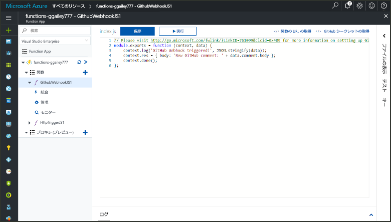
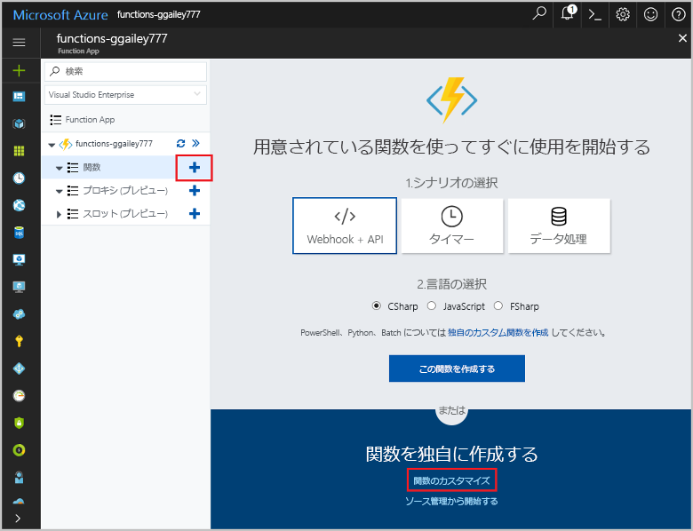
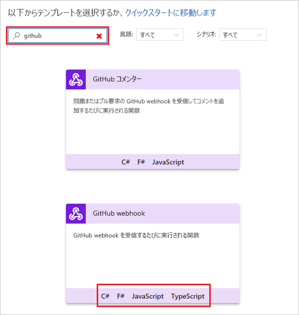
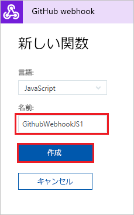
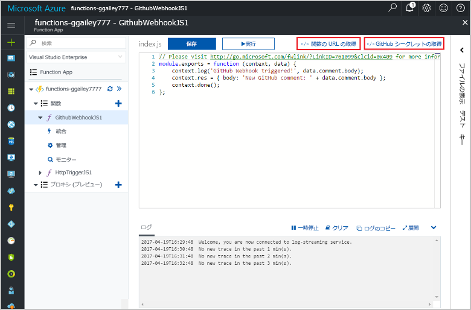
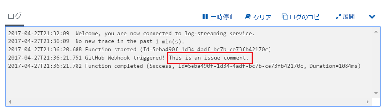

# GitHub webhook でトリガーされる関数の作成

GitHub 固有のペイロードを含む HTTP webhook 要求によってトリガーされる関数を作成する方法について説明します。

## 前提条件

+ 1 つ以上のプロジェクトを含む GitHub アカウント。
+ Azure サブスクリプション。 お持ちでない場合は、開始する前に[無料アカウント](https://azure.microsoft.com/free/?WT.mc_id=A261C142F)を作成してください。

[!INCLUDE [functions-portal-favorite-function-apps](../../includes/functions-portal-favorite-function-apps.md)]

## Azure Function App の作成

[!INCLUDE [Create function app Azure portal](../../includes/functions-create-function-app-portal.md)]

次に、新しい Function App で関数を作成します。

## GitHub webhook でトリガーされる関数の作成

1. Function App を展開し、**[関数]** の横にある **[+]** ボタンをクリックします。 これが Function App で初めての関数の場合、**[カスタム関数]** を選びます。 関数テンプレートの完全なセットが表示されます。

    

2. 検索フィールドに、「`github`」と入力し、GitHub webhook トリガー テンプレート用の目的の言語を選択します。 

      

2. 関数の**名前**を入力し、**[作成]**を選択します。 

      

3. 新しい関数で、**[</> 関数の URL の取得]** をクリックし、値をコピーして保存します。 **[</> GitHub シークレットの取得]** で同じ操作を行います。 これらの値は GitHub で webhook を構成するために使用します。

    

次に、GitHub リポジトリで webhook を作成します。

## webhook を構成する

1. GitHub で、自分が所有するリポジトリに移動します。 フォークした任意のリポジトリを使用することもできます。 リポジトリをフォークする必要がある場合は、<https://github.com/Azure-Samples/functions-quickstart> を使用してください。

1. **[Settings (設定)]**、**[Webhooks (webhook)]**、**[Add webhook (webhook の追加)]** の順にクリックします。

    

1. テーブルに指定されている設定を使用し、**[Add webhook (webhook の追加)]** をクリックします。

    

| Setting | 推奨値 | [説明] |
|---|---|---|
| **Payload URL (ペイロード URL)** | コピーされた値 | **[</> 関数の URL の取得]** によって返された値を使用します。 |
| **コンテンツの種類** | application/json | この関数は、JSON ペイロードを予測します。 |
| **シークレット**   | コピーされた値 | **[</> GitHub シークレットの取得]** によって返された値を使用します。 |
| Event triggers (イベント トリガー) | Let me select individual events (個々のイベントを選択させてください) | 問題コメント イベントに対してのみトリガーします。  |
| | Issue comment (問題コメント) |  |

これで、新しい問題のコメントが追加された場合に関数をトリガーするよう webhook が構成されました。

## 関数をテストする

1. GitHub リポジトリの新しいブラウザー ウィンドウで、**[Issues (問題)]** タブを開きます。

1. 新しいウィンドウで、**[New Issue (新しい問題)]** をクリックし、タイトルを入力して、**[Submit new issue (新しい問題の送信)]** をクリックします。

1. 問題にコメントを入力し、 **[コメント]**をクリックします。

    

1. ポータルに戻り、ログを表示します。 新しいコメント テキストを含むトレース エントリが表示されます。

     

## リソースのクリーンアップ

[!INCLUDE [Next steps note](../../includes/functions-quickstart-cleanup.md)]

## 次の手順

GitHub webhook から要求が受信されときにトリガーされる関数を作成しました。

[!INCLUDE [Next steps note](../../includes/functions-quickstart-next-steps.md)]

webhook トリガーの詳細については、「[Azure Functions における HTTP と Webhook のバインド](functions-bindings-http-webhook.md)」を参照してください。
