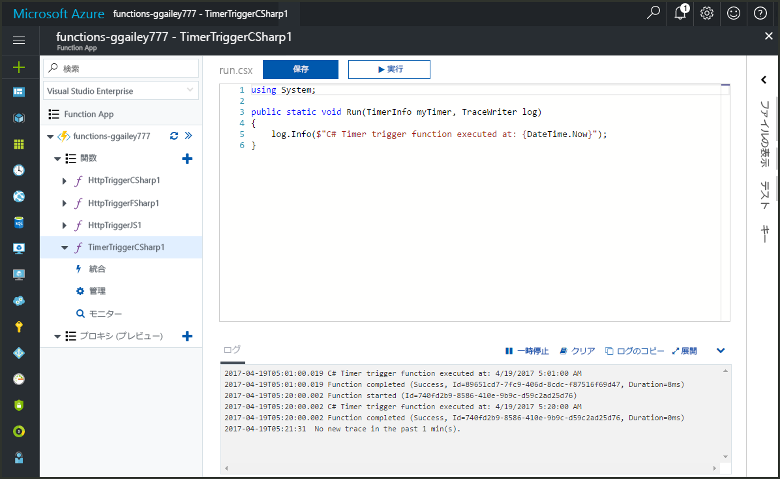
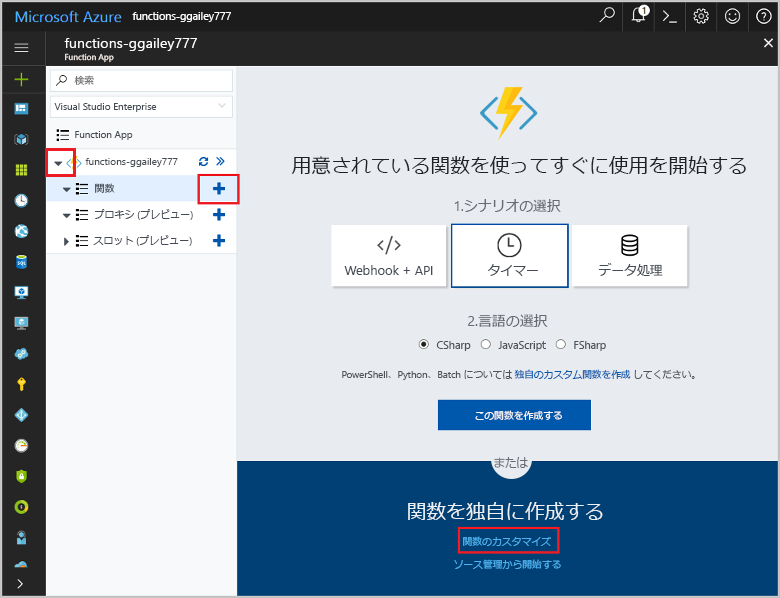
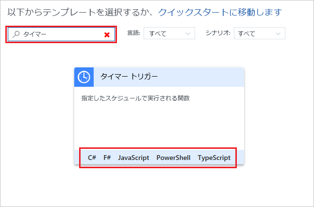
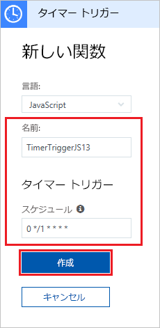
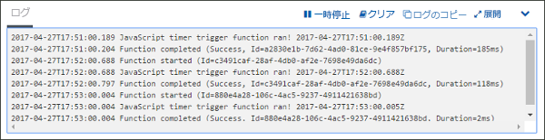
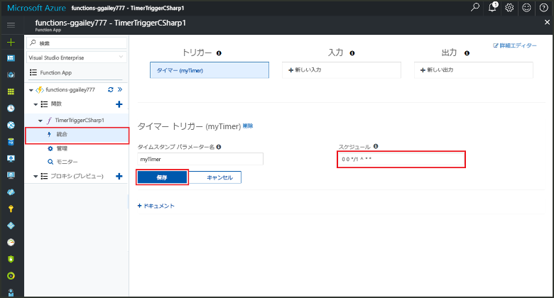

# Azure でタイマーによってトリガーされる関数を作成する

Azure Functions を使用して、定義したスケジュールに基づいて実行する[サーバーレス](https://azure.microsoft.com/overview/serverless-computing/)関数を作成する方法について説明します。

## 前提条件

このチュートリアルを完了するには、以下が必要です。

+ Azure サブスクリプションをお持ちでない場合は、開始する前に [無料アカウント](https://azure.microsoft.com/free/?WT.mc_id=A261C142F) を作成してください。

## Azure Function App の作成

[!INCLUDE [Create function app Azure portal](../../includes/functions-create-function-app-portal.md)]

次に、新しい Function App で関数を作成します。

## タイマーによってトリガーされる関数の作成

1. Function App を展開し、**[関数]** の横にある **[+]** ボタンをクリックします。 これが Function App で初めての関数の場合、**[カスタム関数]** を選びます。 関数テンプレートの完全なセットが表示されます。

    

2. 検索フィールドに、「`timer`」と入力し、タイマー トリガー テンプレート用の目的の言語を選択します。 

    

3. 新しいトリガーは、次の画像の下の表に示したように設定します。

    

    | Setting | 推奨値 | Description |
    |---|---|---|
    | **名前** | 既定値 | タイマーによってトリガーされる関数の名前を定義します。 |
    | **スケジュール** | 0 \*/1 \* \* \* \* | 関数を毎分実行するようにスケジュールする 6 つのフィールドの [CRON 式](functions-bindings-timer.md#cron-expressions)。 |

2. **Create** をクリックしてください。 選択した言語で、毎分実行する関数が作成されます。

3. ログに書き込まれたトレース情報を表示して、実行を確認します。

    

ここで、1 分ごとではなく 1 時間ごとに実行するように、関数のスケジュールを変更します。 

## タイマー スケジュールの更新

1. 関数を展開し、**[統合]** をクリックします。 ここでは、関数の入力および出力バインドを定義し、スケジュールも設定します。 

2. `0 0 */1 * * *` の新しい 1 時間ごとの **[スケジュール]** 値を入力し、**[保存]** をクリックします。  

関数が 1 時間ごとに実行されるようになりました。 

## リソースのクリーンアップ

[!INCLUDE [Next steps note](../../includes/functions-quickstart-cleanup.md)]

## 次の手順

スケジュールに基づいて実行する関数を作成しました。

[!INCLUDE [Next steps note](../../includes/functions-quickstart-next-steps.md)]

タイマー トリガーの詳細については、「[Azure Functions を使用したコード実行のスケジュール設定](functions-bindings-timer.md)」を参照してください。
