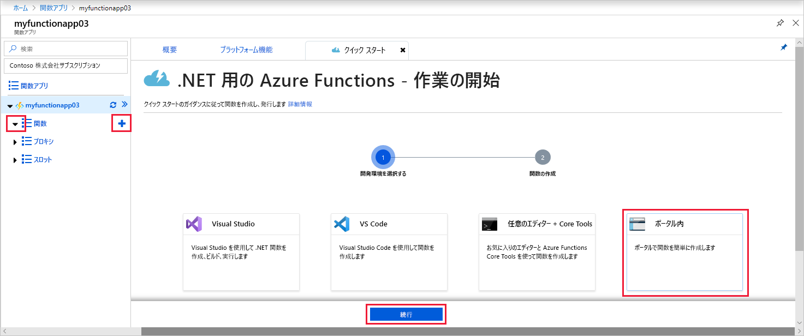

# Azure でタイマーによってトリガーされる関数を作成する

Azure Functions を使用して、定義したスケジュールに基づいて、実行する[サーバーレス](https://azure.microsoft.com/solutions/serverless/)関数を作成する方法について説明します。

## 前提条件

このチュートリアルを完了するには、以下が必要です。

+ Azure サブスクリプションをお持ちでない場合は、開始する前に [無料アカウント](https://azure.microsoft.com/free/?WT.mc_id=A261C142F) を作成してください。

## Azure Function App の作成

[!INCLUDE [Create function app Azure portal](../../includes/functions-create-function-app-portal.md)]

次に、新しい Function App で関数を作成します。

## タイマーによってトリガーされる関数の作成

1. Function App を展開し、 **[関数]** の横にある **[+]** ボタンをクリックします。 これが関数アプリの初めての関数の場合は、 **[ポータル内]** 、 **[続行]** の順に選択します。 それ以外の場合は、手順 3 に進みます。

   

2. **[その他のテンプレート]** 、 **[Finish and view templates]\(終了してテンプレートを表示\)** の順に選択します。

    ![Functions のクイック スタート: [その他のテンプレート] を選択する](./media/functions-create-scheduled-function/add-first-function.png)

3. 検索フィールドに「`timer`」と入力し、次の画像の下の表に示されている設定で新しいトリガーを構成します。

    

    | 設定 | 推奨値 | 説明 |
    |---|---|---|
    | **Name** | Default | タイマーによってトリガーされる関数の名前を定義します。 |
    | **[スケジュール]** | 0 \*/1 \* \* \* \* | 関数を毎分実行するようにスケジュールする 6 つのフィールドの [CRON 式](functions-bindings-timer.md#ncrontab-expressions)。 |

4. **Create** をクリックしてください。 選択した言語で、毎分 (00 秒) に実行する関数が作成されます。

5. ログに書き込まれたトレース情報を表示して、実行を確認します。

    

ここで、1 分ごとではなく 1 時間ごとに実行するように、関数のスケジュールを変更します。

## タイマー スケジュールの更新

1. 関数を展開し、 **[統合]** をクリックします。 ここでは、関数の入力および出力バインドを定義し、スケジュールも設定します。 

2. `0 0 */1 * * *` の新しい 1 時間ごとの **[スケジュール]** 値を入力し、 **[保存]** をクリックします。  

関数が 1 時間ごと (正時) に実行されるようになりました。

## リソースをクリーンアップする

[!INCLUDE [Next steps note](../../includes/functions-quickstart-cleanup.md)]

## 次のステップ

スケジュールに基づいて実行する関数を作成しました。 タイマー トリガーの詳細については、[Azure Functions を使用したコード実行のスケジュール設定](functions-bindings-timer.md)に関するページを参照してください。

[!INCLUDE [Next steps note](../../includes/functions-quickstart-next-steps.md)]
