# Azure Blob Storage によってトリガーされる関数の作成

Azure Blob Storage でファイルをアップロードしたり、更新したりするときにトリガーされる関数の作成方法について説明します。

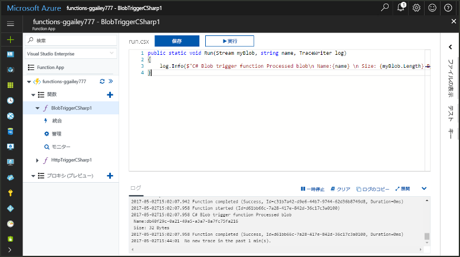

## 前提条件

+ [Microsoft Azure ストレージ エクスプローラーをダウンロードしてインストールする](http://storageexplorer.com/)。
+ Azure サブスクリプション。 お持ちでない場合は、開始する前に[無料アカウント](https://azure.microsoft.com/free/?WT.mc_id=A261C142F)を作成してください。

## Azure Function App の作成

[!INCLUDE [Create function app Azure portal](../../includes/functions-create-function-app-portal.md)]

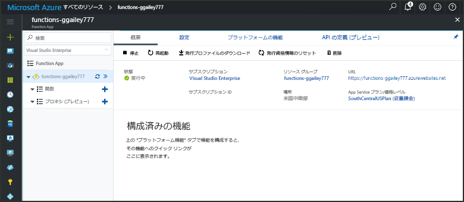

次に、新しい Function App で関数を作成します。

## Blob Storage でトリガーされる関数の作成

1. Function App を展開し、**[関数]** の横にある **[+]** ボタンをクリックします。 これが Function App で初めての関数の場合、**[カスタム関数]** を選びます。 関数テンプレートの完全なセットが表示されます。

    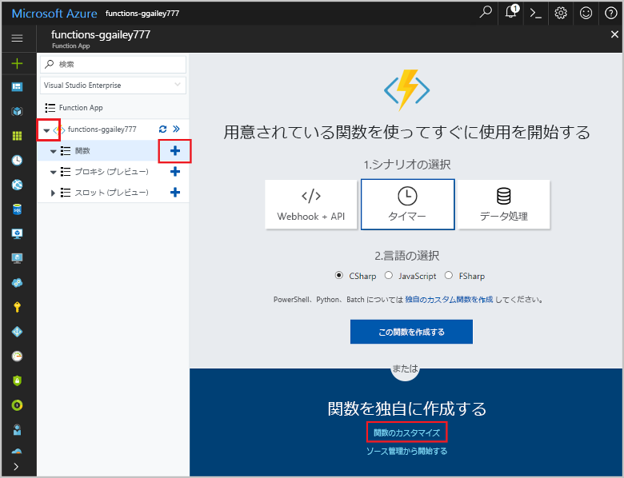

2. 検索フィールドに、「`blob`」と入力し、Blob Storage トリガー テンプレート用の目的の言語を選択します。

    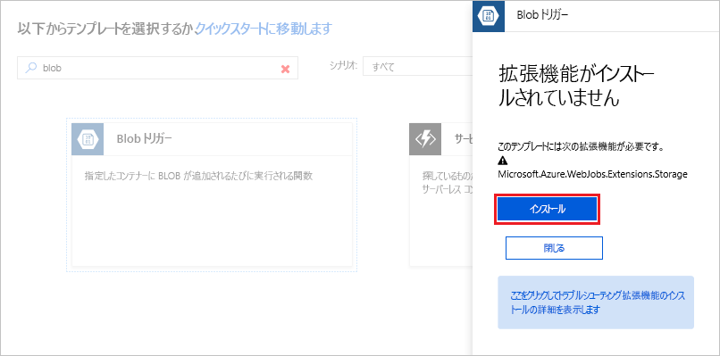
 
3. 画像の下の表に指定した設定を使用してください。

    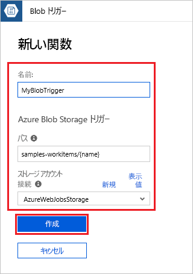

    | Setting | 推奨値 | Description |
    |---|---|---|
    | **名前** | Function App 内で一意 | この BLOB によってトリガーされる関数の名前。 |
    | **パス**   | samples-workitems/{name}    | 監視されている Blob Storage ストレージ内の位置。 Blob のファイル名は、_name_ パラメーターとしてバインディングで渡されます。  |
    | **ストレージ アカウント接続** | AzureWebJobsStorage | Function App によって既に使用されているストレージ アカウント接続を使用するか、新しく作成できます。  |

3. **[作成]** をクリックして関数を作成します。

次に、Azure Storage アカウントに接続し、**samples-workitems** コンテナーを作成します。

## コンテナーの作成

1. 関数で、**[統合]** をクリックし、**[ドキュメント]** を展開して、**[アカウント名]** と **[アカウント キー]** の両方をコピーします。 これらの資格情報を使用して、ストレージ アカウントに接続します。 ストレージ アカウントに既に接続している場合は、手順 4 に進みます。

    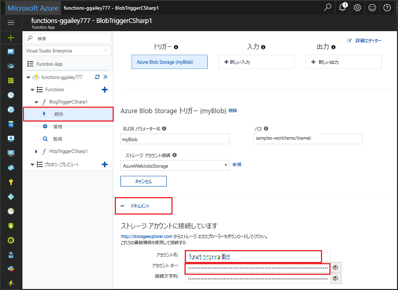

1. [Microsoft Azure Storage Explorer](http://storageexplorer.com/) ツールを実行し、左側の接続アイコンをクリックして、**[Use a storage account name and key] \(ストレージ アカウント名とキーを使用)** を選択し、**[次へ]** をクリックします。

    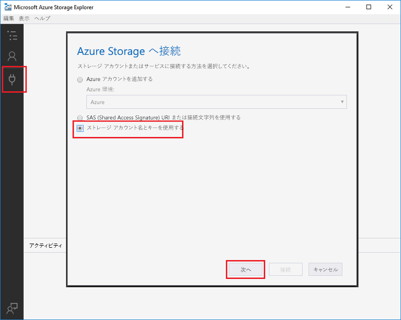

1. 手順 1 の **[アカウント名]** と **[アカウント キー]** を入力し、**[次へ]** をクリックし、**[接続]** をクリックします。 

    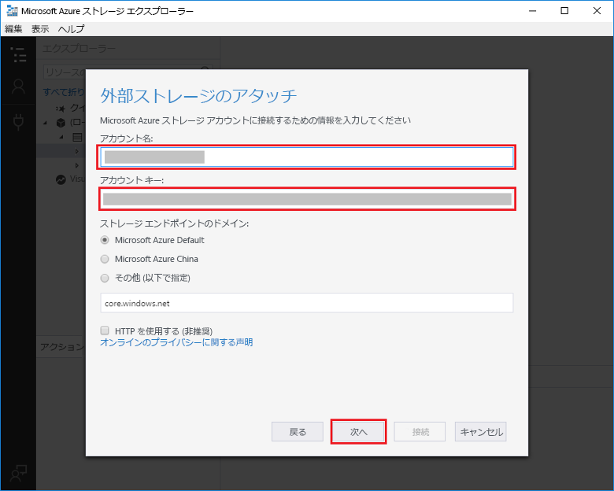

1. 接続されたストレージ アカウントを展開し、**[Blob containers] \(Blob コンテナー)** を右クリックして、**[Create blob container] \(Blob コンテナーの作成)** をクリックし、「`samples-workitems`」と入力して、Enter キーを押します。

    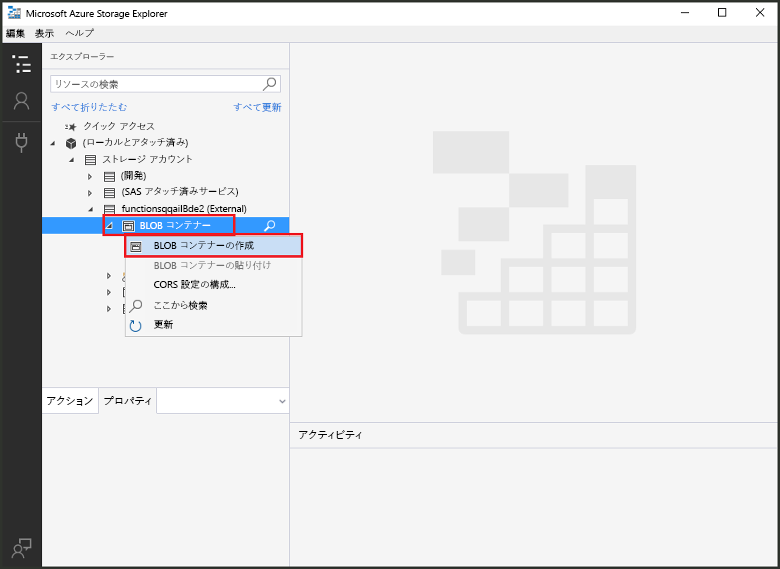

Blob コンテナーが用意されているので、このコンテナーにファイルをアップロードすることによって、関数をテストできます。

## 関数をテストする

1. Azure Portal に戻り、関数を参照して、ページ下部の **[ログ]** を展開して、ログ ストリーミングが一時停止していないことを確認します。

1. Storage Explorer で、ストレージ アカウント、**[Blob containers]** \(BLOB コンテナー\)、**[samples-workitems]** の順に展開します。 **[アップロード]**、**[Upload files...] \(ファイルをアップロードしています...)** の順にクリックします。

    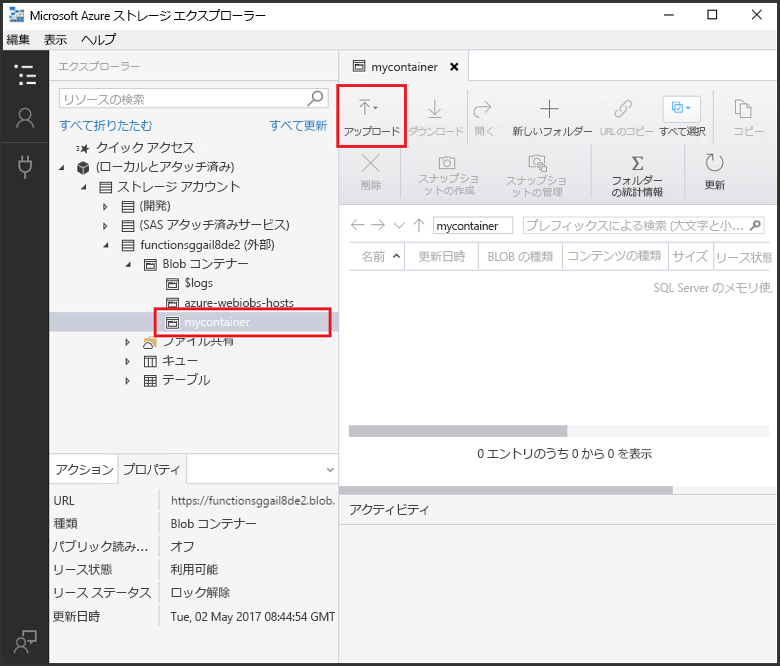

1. **[Upload files] \(ファイルのアップロード)** ダイアログ ボックスで、**[ファイル]** フィールドをクリックします。 画像ファイルなど、ローカル コンピューター上のファイルを参照して選択し、**[開く]**、**[アップロード]** の順にクリックします。

1. 関数ログに戻り、Blob が読み取られたことを確認します。

   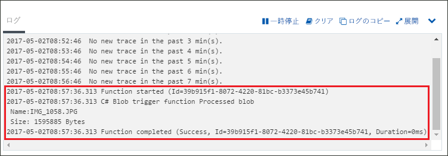

    >[!NOTE]
    > 既定の従量課金プランで Function App を実行する場合、Blob が追加されたり更新されてから関数がトリガーされるまで、最高数分間の遅延が生じることがあります。 Blob でトリガーされた関数で待機時間を短くする必要がある場合は、App Service プランで Function App を実行することを検討してください。

## リソースのクリーンアップ

[!INCLUDE [Next steps note](../../includes/functions-quickstart-cleanup.md)]

## 次の手順

Blob Storage で Blob が追加または更新されたときに実行する関数を作成しました。 

[!INCLUDE [Next steps note](../../includes/functions-quickstart-next-steps.md)]

Blob Storage トリガーの詳細については、「[Azure Functions における Blob Storage バインディング](functions-bindings-storage-blob.md)」を参照してください。
