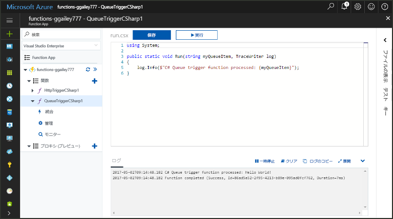
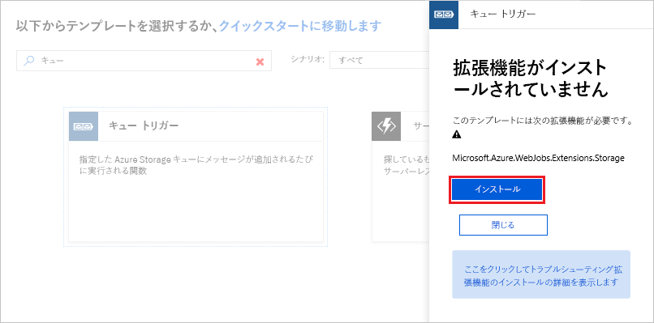
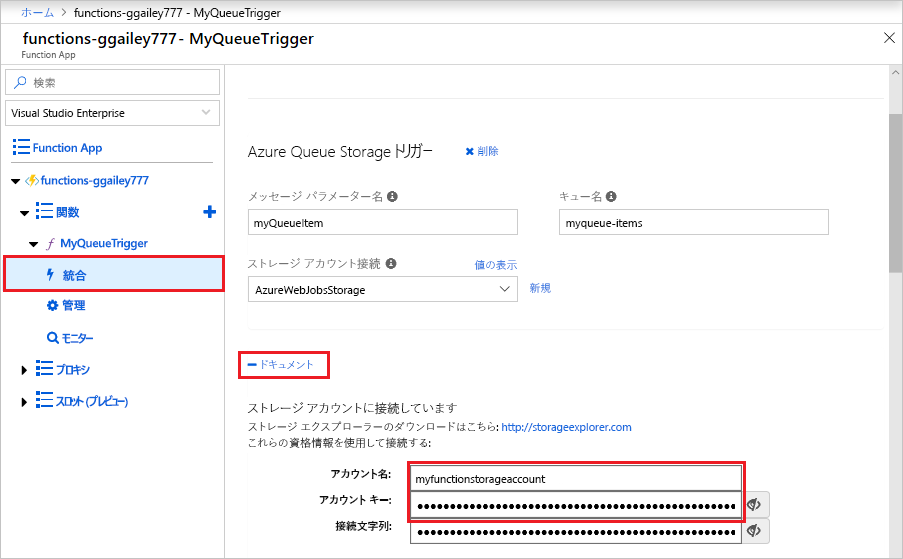
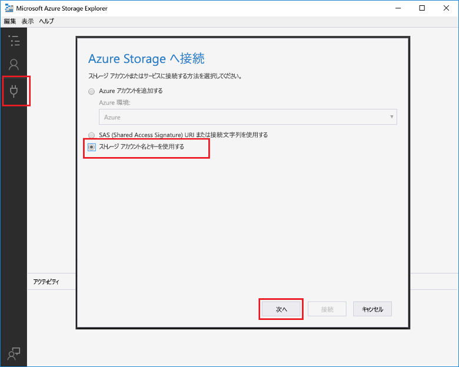
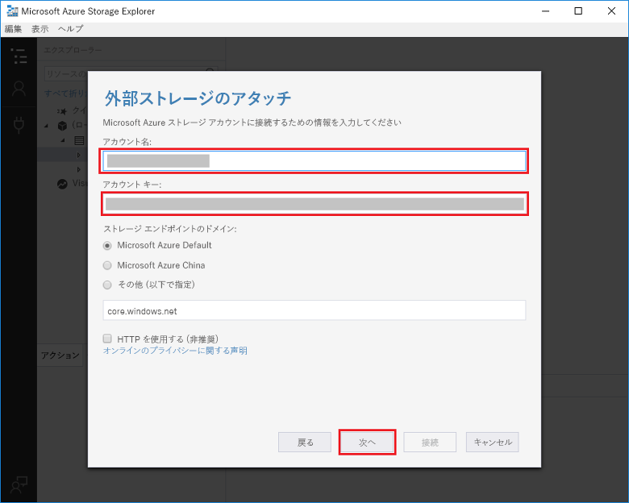
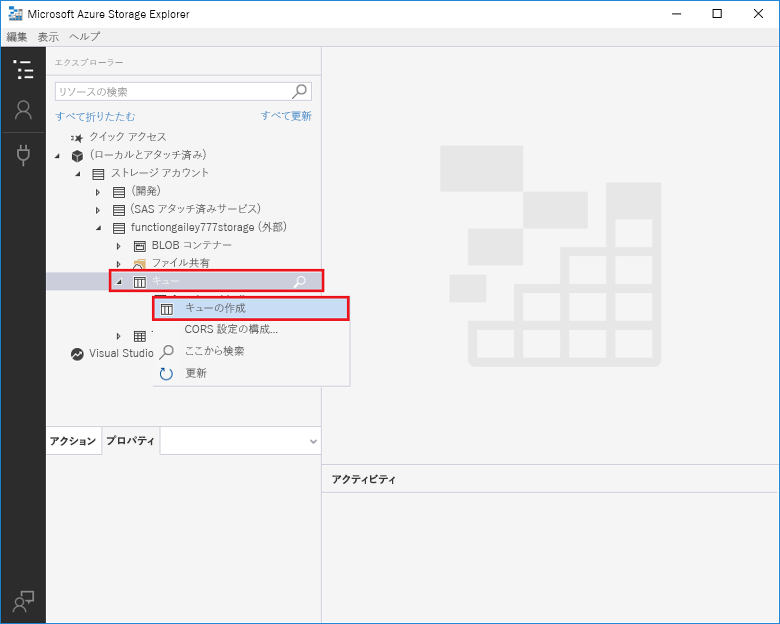
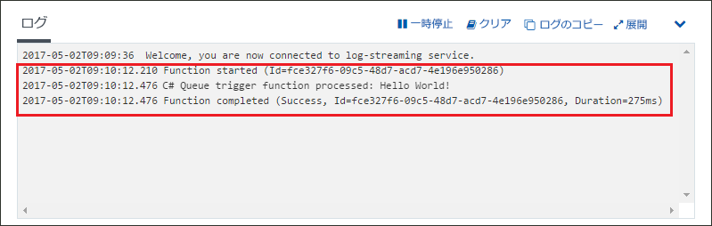

# Azure Queue Storage によってトリガーされる関数の作成

Azure Storage キューにメッセージが送信されたときにトリガーされる関数を作成する方法について説明します。

## 前提条件

- [Microsoft Azure ストレージ エクスプローラーをダウンロードしてインストールする](http://storageexplorer.com/)。

- Azure サブスクリプションが必要です。 お持ちでない場合は、開始する前に[無料アカウント](https://azure.microsoft.com/free/?WT.mc_id=A261C142F)を作成してください。

[!INCLUDE [functions-portal-favorite-function-apps](../../includes/functions-portal-favorite-function-apps.md)]

## Azure Function App の作成

[!INCLUDE [Create function app Azure portal](../../includes/functions-create-function-app-portal.md)]

次に、新しい Function App で関数を作成します。

## キューによってトリガーされる関数の作成

Function App で、**[関数]** の横にある **[+]** ボタンをクリックし、使用する言語の **QueueTrigger** テンプレートをクリックします。 次に、テーブルに指定されている設定を使用し、**[作成]** をクリックします。

| Setting | 推奨値 | Description |
|---|---|---|
| **キュー名**   | myqueue-items    | ストレージ アカウント内の接続先のキューの名前。 |
| **ストレージ アカウント接続** | AzureWebJobStorage | Function App によって既に使用されているストレージ アカウント接続を使用するか、新しく作成できます。  |
| **関数名の指定** | Function App 内で一意 | このキューによってトリガーされる関数の名前。 |

次に、Azure Storage アカウントに接続し、**myqueue-items** ストレージ キューを作成します。

## キューを作成する

1. 関数で、**[統合]** をクリックし、**[ドキュメント]** を展開して、**[アカウント名]** と **[アカウント キー]** の両方をコピーします。 これらの資格情報を使用して、ストレージ アカウントに接続します。 ストレージ アカウントに既に接続している場合は、手順 4 に進みます。

    v

1. [Microsoft Azure Storage Explorer](http://storageexplorer.com/) ツールを実行し、左側の接続アイコンをクリックして、**[Use a storage account name and key] (ストレージ アカウント名とキーを使用)** を選択し、**[次へ]** をクリックします。

    

1. 手順 1 の **[アカウント名]** と **[アカウント キー]** を入力し、**[次へ]** をクリックし、**[接続]** をクリックします。

    

1. 接続されたストレージ アカウントを展開し、**[キュー]** を右クリックして、**[キューの作成]** をクリックし、「`myqueue-items`」と入力して、Enter を押します。

    

これでストレージ キューが作成されたので、キューにメッセージを追加して、関数をテストできます。

## 関数をテストする

1. Azure Portal に戻り、関数を参照して、ページ下部の **[ログ]** を展開して、ログ ストリーミングが一時停止していないことを確認します。

1. Storage Explorer で、ストレージ アカウント、**[キュー]**、**[myqueue-items]** の順に展開し、**[メッセージの追加]** をクリックします。

    

1. "Hello World!" メッセージを **[メッセージ テキスト]** に入力し、**[OK]** をクリックします。

1. 数秒間待ってから、関数ログに戻り、新しいメッセージがキューから読み取られていることを確認します。

    

1. Storage Explorer に戻り、**[更新]** をクリックし、メッセージが処理され、キュー内になくなったことを確認します。

## リソースのクリーンアップ

[!INCLUDE [Next steps note](../../includes/functions-quickstart-cleanup.md)]

## 次のステップ

メッセージがストレージ キューに追加されたときに実行される関数を作成しました。

[!INCLUDE [Next steps note](../../includes/functions-quickstart-next-steps.md)]

Queue Storage トリガーの詳細については、「[Azure Functions における Storage キュー バインド](functions-bindings-storage-queue.md)」を参照してください。
