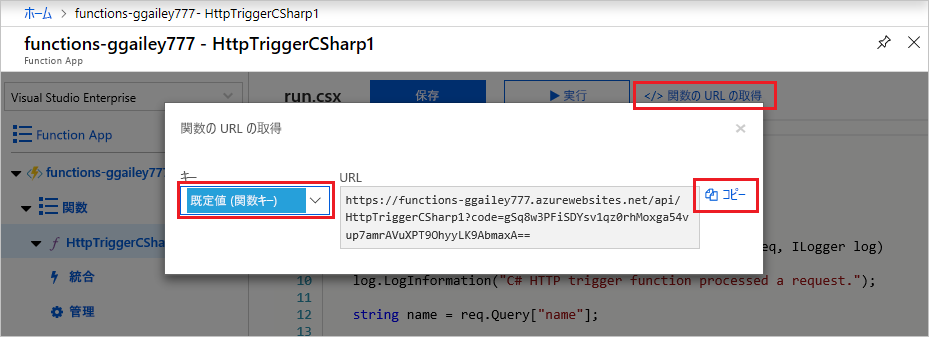
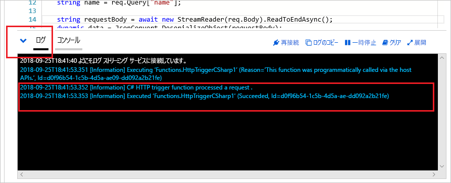

# Azure for Students Starter を使用して関数を作成する

このチュートリアルでは、Azure for Students Starter サブスクリプションで "hello world" HTTP 関数を作成します。 このサブスクリプションの種類の Azure Functions で使用できるものについても説明します。

Microsoft *Azure for Students Starter* では、開発に必要な Azure 製品のクラウドでの使用を、無料で開始できます。 [このオファーの詳細についてはこちらを参照してください。](https://azure.microsoft.com/offers/ms-azr-0144p/)

Azure Functions を使用すると、最初に VM を作成したり Web アプリケーションを発行したりしなくても、[サーバーレス](https://azure.microsoft.com/solutions/serverless/)環境でコードを実行できます。 [Functions の詳細についてはこちらを参照してください。](./functions-overview.md)

[!INCLUDE [quickstarts-free-trial-note](../../includes/quickstarts-free-trial-note.md)]

## 関数を作成する

 この記事では、Azure Functions を使用して Azure portal で "hello world" の HTTP トリガー関数を作成する方法について説明します。

## Azure へのサインイン

Azure アカウントで [Azure Portal](https://portal.azure.com) にサインインします。

## Function App を作成する

関数の実行をホストするための Function App が存在する必要があります。 関数アプリを使用すると、リソースの管理、デプロイ、スケーリング、および共有を容易にするための論理ユニットとして関数をグループ化できます。

[!INCLUDE [Create function app Azure portal](../../includes/functions-create-function-app-portal.md)]

次に、新しい Function App で関数を作成します。

## HTTP トリガー関数の作成

1. **[関数]** ウィンドウの左側のメニューで、 **[関数]** を選択し、上部のメニューから **[追加]** を選択します。 
 
1. **[新規関数]** ウィンドウで **[Http トリガー]** を選択します。

    

1. **[新規関数]** ウィンドウで、 **[新規関数]** の既定の名前を受け入れるか、新しい名前を入力します。 

1. **[承認レベル]** ドロップダウン リストから **[匿名]** を選択し、 **[関数の作成]** を選択します。

    Azure によって HTTP トリガー関数が作成されます。 ここで、HTTP 要求を送信することで、新しい関数を実行できます。

## 関数をテストする

1. 新しい HTTP トリガー関数で、左側のメニューから **[Code + Test]\(コード + テスト\)** を選択し、上部のメニューから **[関数の URL の取得]** を選択します。

    ![[関数の URL の取得] の選択](./media/functions-create-student-starter/function-app-select-get-function-url.png)

1. **[関数の URL の取得]** ダイアログ ボックスで、ドロップダウン リストから **[既定]** を選択し、 **[クリップボードにコピー]** アイコンを選択します。 

    

1. 関数 URL をブラウザーのアドレス バーに貼り付けます。 この URL の末尾にクエリ文字列の値 `?name=<your_name>` を追加し、Enter キーを押して要求を実行します。 

    次の例は、ブラウザーでの応答を示しています。

    

    要求 URL には、既定では HTTP 経由で関数にアクセスするために必要なキーが含まれています。

1. 関数が実行されると、ログにトレース情報が書き込まれます。 トレース出力を表示するには、ポータルの **[Code + Test]\(コード + テスト\)** ページに戻り、ページの下部にある **[ログ]** 矢印を展開します。

   

## リソースをクリーンアップする

[!INCLUDE [Clean-up resources](../../includes/functions-quickstart-cleanup.md)]

## Azure for Students Starter でサポートされる機能

Azure for Students Starter では、Azure Functions ランタイムのほとんどの機能にアクセスできますが、主に以下のような制限がいくつかあります。

* HTTP トリガーは、サポートされている唯一のトリガーの種類です。
    * すべての入力バインディングとすべての出力バインディングがサポートされています。 [詳細な一覧についてはこちらを参照してください。](functions-triggers-bindings.md)
* サポートされている言語: 
    * C# (.NET Core 2)
    * JavaScript (Node.js 8 および 10)
    * F# (.NET Core 2)
    * [上位プランでサポートされている言語については、こちらを参照してください](supported-languages.md)
* サポートされているオペレーティング システムは Windows のみです。
* スケールは、1 日に最大 60 分間実行される [1 つの無料レベル インスタンス](https://azure.microsoft.com/pricing/details/app-service/windows/)に制限されています。 HTTP トラフィックが受信されると、サーバーレスでインスタンスが 0 から 1 に自動的にスケールされますが、さらにスケールされることはありません。
* サポートされるのは、Functions ランタイムの[バージョン 2.x 以降](functions-versions.md)のみです。
* すべての開発者ツールは編集および公開関数に対してサポートされています。 これには、VS Code、Visual Studio、Azure CLI、および Azure portal が含まれます。 ポータル以外のものを使用する場合は、まずポータルでアプリを作成してから、そのアプリを好みのツールのデプロイ対象として選択する必要があります。

## 次のステップ

これで、単純な HTTP トリガー関数を含む関数アプリの作成が完了しました。 次は、ローカル ツール、その他の言語、監視、統合を探索できます。

 * [Visual Studio での初めての関数の作成](./functions-create-your-first-function-visual-studio.md)
 * [Visual Studio Code を使用した初めての関数の作成](./functions-create-first-function-vs-code.md)
 * [Azure Functions の JavaScript 開発者向けガイド](./functions-reference-node.md)
 * [Azure Functions を使用して Azure SQL Database に接続する](./functions-scenario-database-table-cleanup.md)
 * [Azure Functions HTTP バインディングについて学習します](./functions-bindings-http-webhook.md)。
 * [Azure Functions を監視する](./functions-monitoring.md)
