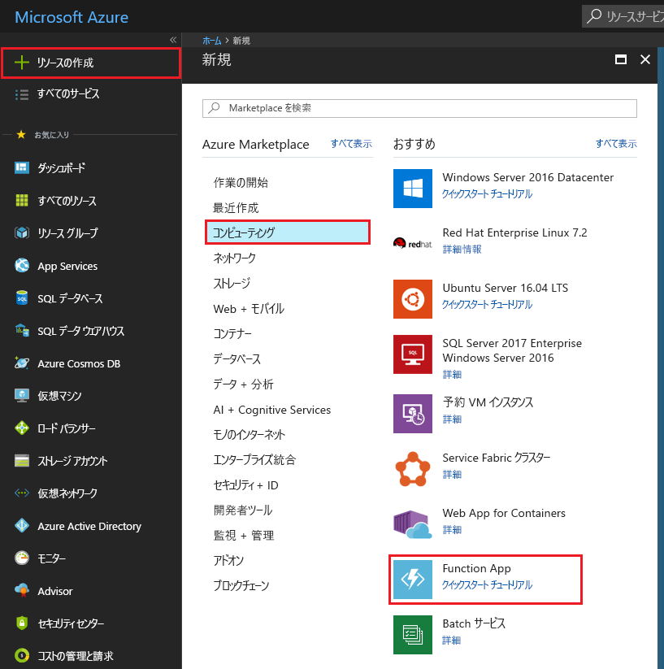
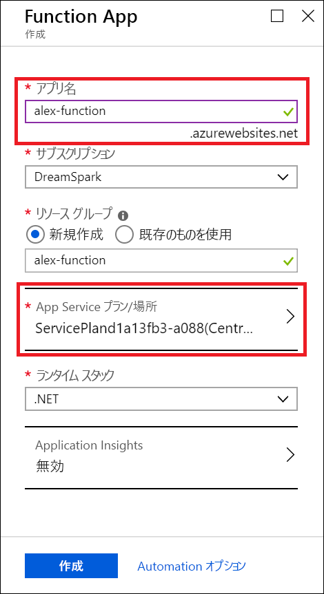
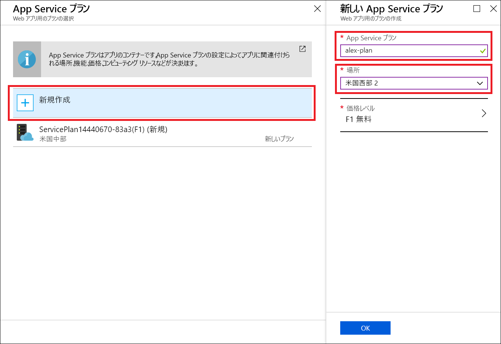
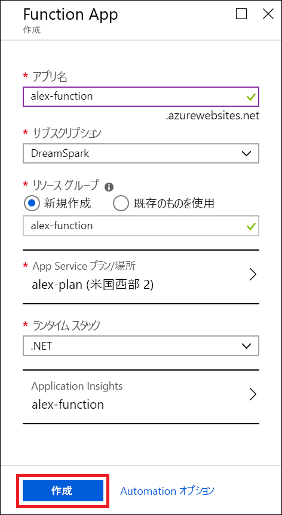
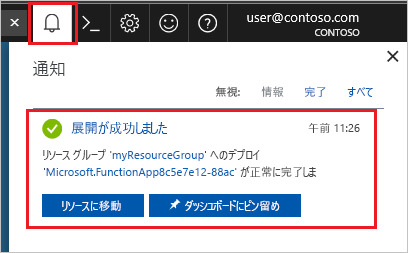
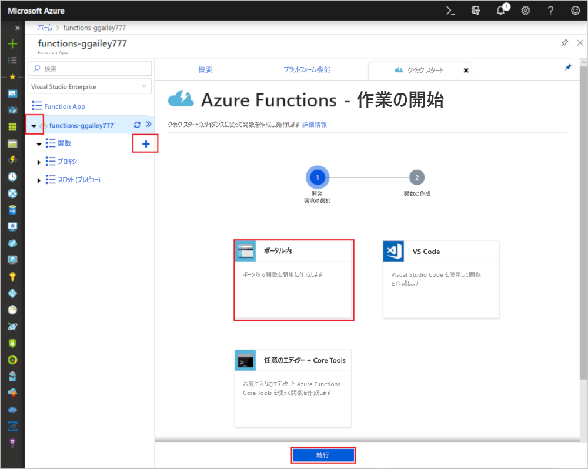
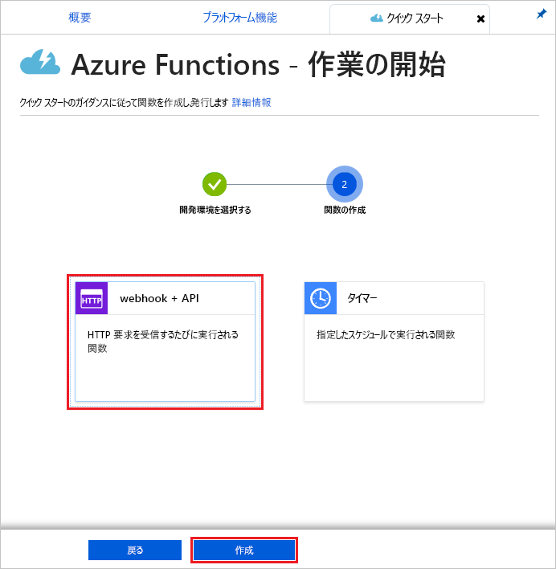

# Azure for Students Starter を使用して関数を作成する

このチュートリアルでは、Azure for Students Starter サブスクリプションに "hello world" HTTP 関数を作成します。 このサブスクリプションの種類の Azure Functions で使用できるものについても説明します。

Microsoft *Azure for Students Starter* では、開発に必要な Azure 製品のクラウドでの使用を、無料で開始できます。 [このオファーの詳細についてはこちらを参照してください。](https://azure.microsoft.com/offers/ms-azr-0144p/)

Azure Functions を使用すると、最初に VM を作成したり Web アプリケーションを発行したりしなくても、[サーバーレス](https://azure.microsoft.com/solutions/serverless/)環境でコードを実行できます。 [Functions の詳細についてはこちらを参照してください。](./functions-overview.md)

## 関数を作成する

 このトピックでは、Functions を使用して Azure portal で HTTP でトリガーされる "hello world" 関数を作成する方法について説明します。

## Azure へのサインイン

Azure アカウントで Azure Portal (<https://portal.azure.com>) にサインインします。

## Function App を作成する

関数の実行をホストするための Function App が存在する必要があります。 関数アプリを使用すると、リソースの管理、デプロイ、スケーリング、および共有を容易にするための論理ユニットとして関数をグループ化できます。

1. Azure portal の左上隅にある **[リソースの作成]** ボタンを選択します。 次に、 **[Compute]**  >  **[Function App]** を選択します。

    

2. 図の下にある表に指定されている関数アプリの設定を使用します。

    

    | 設定      | 推奨値  | 説明                                        |
    | ------------ |  ------- | -------------------------------------------------- |
    | **アプリ名** | グローバルに一意の名前 | 新しい Function App を識別する名前。 有効な文字は、`a-z`、`0-9`、および `-` です。  | 
    | **サブスクリプション** | 該当するサブスクリプション | この新しい Function App が作成されるサブスクリプション。 | 
    | **[リソース グループ](../azure-resource-manager/management/overview.md)** |  myResourceGroup | Function App を作成するための新しいリソース グループの名前。 |
   | **[App Service プラン/場所](./functions-scale.md)** | 新規 | 関数アプリのデプロイ先リージョン、リソースの密度を制御するホスティング プラン。 同じプランにデプロイされた複数の関数アプリは、すべて同じ単一の無料インスタンスを共有します。 これは Student Starter プランの制限です。 ホスティング オプションの詳細については、[こちら](./functions-scale.md)を参照してください。|
    | **ランタイム スタック** | 優先言語 | お気に入りの関数プログラミング言語をサポートするランタイムを選択します。 C# および F# 関数用の **[.NET]** を選択します。 |
    |**[Application Insights](./functions-monitoring.md)**| 有効 | Application Insights は、関数アプリのログを保存および分析するために使用されます。 Application Insights をサポートする場所を選択した場合は、既定で有効になります。 手動で近くのリージョンを選択して Application Insights をデプロイすることで、Application Insights を任意の関数に対して有効にすることができます。 Application Insights を使用しない場合、ライブ ストリーミング ログを確認できません。

3. 別の場所を選択するには、上の **[App Service プラン/場所]** を選択します。

4. **[新規作成]** を選択してから、プランに固有の名前を付けます。

5. ユーザーに最も近い場所を選択します。 [Azure リージョンの完全なマップについてはこちらを参照してください。](https://azure.microsoft.com/global-infrastructure/regions/) 

    

6. **[作成]** を選択して、Function App をプロビジョニングし、デプロイします。

    

7. ポータルの右上隅の通知アイコンを選択し、"**デプロイメントに成功しました**" というメッセージが表示されるまで待ちます。

    

8. **[リソースに移動]** を選択して、新しい関数アプリを確認します。

次に、新しい Function App で関数を作成します。

## HTTP によってトリガーされる関数の作成

1. 新しい関数アプリを展開し、 **[関数]+ の横にある** [ **]** ボタン、 **[ポータル内]** 、 **[続行]** の順に選択します。

    

1. **[webhook + API]** を選択し、 **[作成]** を選択します。

    

HTTP によってトリガーされる関数の言語固有のテンプレートを使用して、関数が作成されます。

ここで、HTTP 要求を送信することで、新しい関数を実行できます。

## 関数をテストする

1. 新しい関数で、右上の **[</> 関数の URL の取得]** をクリックし、 **[既定値 (関数キー)]** を選択して、 **[コピー]** をクリックします。 

    

2. 関数 URL をブラウザーのアドレス バーに貼り付けます。 この URL の末尾にクエリ文字列 `&name=<yourname>` を追加し、キーボードで`Enter` キーを押して要求を実行します。 ブラウザーに表示される関数によって返される応答が表示されます。  

    次の例は、ブラウザーでの応答を示しています。

    

    要求 URL には、既定では HTTP 経由で関数にアクセスするために必要なキーが含まれています。

3. 関数が実行されると、ログにトレース情報が書き込まれます。 前の実行からのトレース出力を表示するには、ポータルで関数に戻り、画面の下部にある矢印をクリックして **[ログ]** を展開します。

   

## リソースをクリーンアップする

[!INCLUDE [Clean-up resources](../../includes/functions-quickstart-cleanup.md)]

## Azure for Students Starter でサポートされる機能

Azure for Students Starter では、Azure Functions ランタイムのほとんどの機能にアクセスできますが、主に以下のような制限がいくつかあります。

* HTTP トリガーは、サポートされている唯一のトリガーの種類です。
    * すべての入力バインディングとすべての出力バインディングがサポートされています。 [詳細な一覧についてはこちらを参照してください。](functions-triggers-bindings.md)
* サポートされている言語: 
    * C# (.NET Core 2)
    * JavaScript (Node.js 8 および 10)
    * F# (.NET Core 2)
    * [上位プランでサポートされている言語については、こちらを参照してください](supported-languages.md)
* サポートされているオペレーティング システムは Windows のみです。
* スケールは、1 日に最大 60 分間実行される [1 つの無料レベル インスタンス](https://azure.microsoft.com/pricing/details/app-service/windows/)に制限されています。 HTTP トラフィックが受信されると、サーバーレスでインスタンスが 0 から 1 に自動的にスケールされますが、さらにスケールされることはありません。
* サポートされるのは、Functions ランタイムの[バージョン 2.x 以降](functions-versions.md)のみです。
* すべての開発者ツールは編集および公開関数に対してサポートされています。 これには、VS Code、Visual Studio、Azure CLI、および Azure portal が含まれます。 ポータル以外のものを使用する場合は、まずポータルでアプリを作成してから、そのアプリを好みのツールのデプロイ対象として選択する必要があります。

## 次のステップ

HTTP によってトリガーされる単純な関数を含む Function App を作成しました。 これで、ローカル ツール、その他の言語、監視、統合を探索できるようになりました。

 * [Visual Studio での初めての関数の作成](./functions-create-your-first-function-visual-studio.md)
 * [Visual Studio Code を使用した初めての関数の作成](./functions-create-first-function-vs-code.md)
 * [Azure Functions の JavaScript 開発者向けガイド](./functions-reference-node.md)
 * [Azure Functions を使用して Azure SQL Database に接続する](./functions-scenario-database-table-cleanup.md)
 * [Azure Functions HTTP バインディングについて学習します](./functions-bindings-http-webhook.md)。
 * [Azure Functions を監視する](./functions-monitoring.md)
