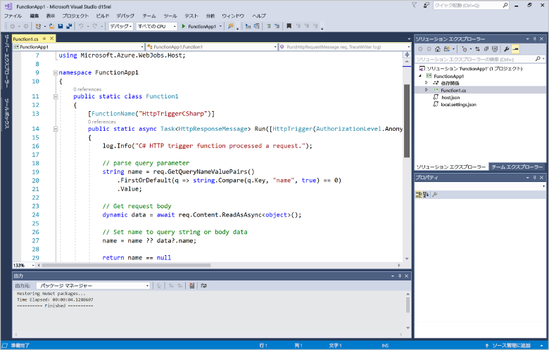
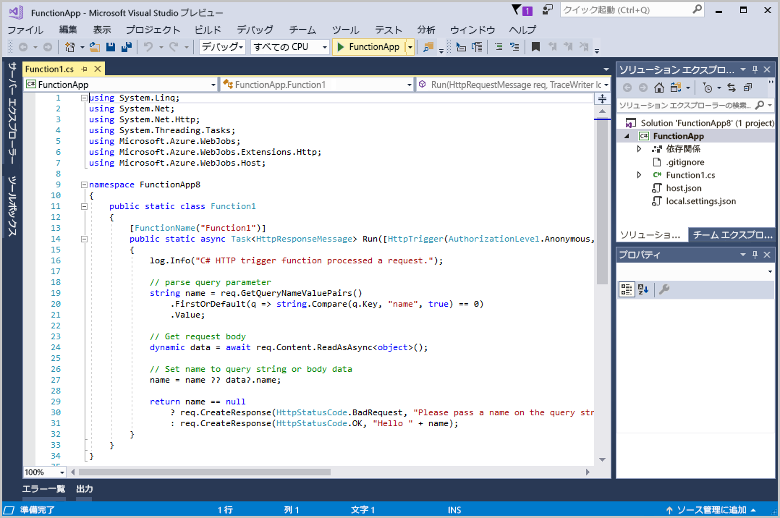

# Visual Studio を使用して初めての関数を作成する

Azure Functions を使用すると、最初に VM を作成したり Web アプリケーションを発行したりしなくても、[サーバーレス](https://azure.microsoft.com/overview/serverless-computing/)環境でコードを実行できます。

この記事では、Visual Studio 2017 Tools for Azure Functions を使用して、"hello world" 関数をローカルで作成してテストする方法を学習します。 その後、関数コードを Azure に発行します。 これらのツールは、Visual Studio 2017 の Azure 開発ワークロードの一部として利用できます。

このトピックには、同じ基本的な手順を示す[動画](#watch-the-video)が含まれています。

## 前提条件

このチュートリアルを完了するには、以下が必要です。

* [Visual Studio 2017 バージョン 15.5](https://www.visualstudio.com/vs/) 以降のバージョン (**Azure 開発**ワークロードを含む) をインストールします。

    

    Visual Studio がインストール済みである場合、保留中の更新プログラムがあれば、忘れずにインストールしておいてください。 

* Visual Studio 2017 のバージョン 15.4 以前を使って Azure 開発ワークロードをインストールした場合は、さらに[Azure Functions ツール](functions-develop-vs.md#check-your-tools-version)も更新する必要があります。 

## 関数アプリ プロジェクトを作成する

[!INCLUDE [Create a project using the Azure Functions template](../../includes/functions-vstools-create.md)]

Visual Studio によってプロジェクトが作成されます。その中には、選択した関数の種類のスケルトン コードが含まれているクラスがあります。 メソッドの **FunctionName** 属性は、関数の名前を設定します。 **HttpTrigger** 属性は、関数が HTTP 要求によってトリガーされることを指定します。 スケルトン コードは、要求本文またはクエリ文字列の値を含む HTTP 応答を送信します。 メソッドに適切な属性を適用することによって、関数に入力および出力バインディングを追加することができます。 詳細については、[Azure Functions C# 開発者向けリファレンス](functions-dotnet-class-library.md)の「[トリガーとバインド](functions-dotnet-class-library.md#triggers-and-bindings)」のセクションを参照してください。

関数プロジェクトと、HTTP によってトリガーされる関数を作成できたので、この関数をローカル コンピューターでテストすることができます。

## 関数をローカルでテストする

Azure Functions Core Tools を使用すると、ローカルの開発用コンピューター上で Azure Functions プロジェクトを実行できます。 Visual Studio から初めて関数を開始すると、これらのツールをインストールするよう求めるメッセージが表示されます。  

1. 関数をテストするには、F5 キーを押します。 メッセージが表示されたら、Visual Studio からの要求に同意し、Azure Functions Core (CLI) ツールをダウンロードしてインストールします。 また、ツールで HTTP 要求を処理できるようにファイアウォールの例外を有効にすることが必要になる場合もあります。

2. Azure Functions のランタイムの出力から、関数の URL をコピーします。  

    

3. HTTP 要求の URL をブラウザーのアドレス バーに貼り付けます。 この URL にクエリ文字列 `?name=<yourname>` を追加して、要求を実行します。 関数によって返されたローカルの GET 要求に対するブラウザーでの応答を次に示します。 

    

4. デバッグを停止するには、Shift キーを押しながら F5 キーを押します。

関数がローカル コンピューター上で正常に動作することを確認した後、プロジェクトを Azure に発行します。

## Azure にプロジェクトを発行する

Azure サブスクリプションをお持ちでない場合は、続行する前に[無料アカウント](https://azure.microsoft.com/free/?ref=microsoft.com&utm_source=microsoft.com&utm_medium=docs&utm_campaign=visualstudio)を作成してください。

プロジェクトを発行するには、Azure サブスクリプションに関数アプリがあることが必要です。 関数アプリは、サブスクリプション内に、Visual Studio から直接作成できます。

[!INCLUDE [Publish the project to Azure](../../includes/functions-vstools-publish.md)]

## Azure で関数をテストする

1. [発行プロファイル] ページから関数アプリのベース URL をコピーします。 関数をローカルでテストしたときに使用した URL の `localhost:port` 部分を新しいベース URL に置き換えます。 前と同様に、この URL にクエリ文字列 `?name=<yourname>` を追加してから、要求を実行します。

    HTTP によってトリガーされる関数を呼び出す URL は、次の形式である必要があります。

        http://<functionappname>.azurewebsites.net/api/<functionname>?name=<yourname> 

2. HTTP 要求のこの新しい URL をブラウザーのアドレス バーに貼り付けます。 関数によって返されたリモート GET 要求に対するブラウザーでの応答を次に示します。 

    

## ビデオを見る

> [!VIDEO https://www.youtube-nocookie.com/embed/DrhG-Rdm80k]

## 次の手順

Visual Studio を使用して、HTTP によってトリガーされる単純な関数を含む C# 関数アプリを作成して発行しました。 

+ .NET クラス ライブラリとしての関数の開発の詳細については、「[Azure Functions での .NET クラス ライブラリの使用](functions-dotnet-class-library.md)」を参照してください。 
+ 他の種類のトリガーとバインディングをサポートするようにプロジェクトを構成する方法については、「[Azure Functions Tools for Visual Studio](functions-develop-vs.md)」の「[ローカル開発用のプロジェクトを構成する](functions-develop-vs.md#configure-the-project-for-local-development)」セクションを参照してください。
+ Azure Functions Core Tools を使用したローカル テストとデバッグの詳細については、「[Azure 関数をローカルでコーディングしてテストする方法](functions-run-local.md)」を参照してください。 
