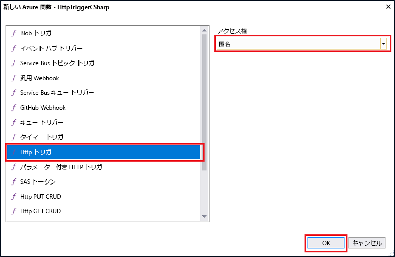

# Visual Studio を使用して初めての関数を作成する

Azure Functions を使用すると、最初に VM を作成したり Web アプリケーションを発行したりしなくても、[サーバーレス](https://azure.microsoft.com/overview/serverless-computing/)環境でコードを実行できます。

> [!VIDEO https://www.youtube-nocookie.com/embed/DrhG-Rdm80k]

このトピックでは、Visual Studio 2017 Tools for Azure Functions を使用して、"hello world" 関数を作成してローカルでテストする方法を学習します。 その後、関数コードを Azure に発行します。 これらのツールは、Visual Studio 2017 バージョン 15.3 以降の Azure 開発ワークロードの一部として利用できます。

## 前提条件

このチュートリアルを完了するには、以下をインストールしてください。

* [Visual Studio 2017 バージョン 15.4](https://www.visualstudio.com/vs/) 以降のバージョン (**Azure 開発**ワークロードを含む)。

    
    
[!INCLUDE [quickstarts-free-trial-note](../../includes/quickstarts-free-trial-note.md)] 

## Visual Studio で Azure Functions プロジェクトを作成する

[!INCLUDE [Create a project using the Azure Functions template](../../includes/functions-vstools-create.md)]

プロジェクトが作成されたので、初めての関数を作成できます。

## 関数を作成する

1. **ソリューション エクスプローラー**で、プロジェクト ノードを右クリックし、**[追加]** > **[新しいアイテム]** の順に選択します。 **[Azure 関数]** を選択し、**[名前]** には「`HttpTriggerCSharp.cs`」と入力して **[追加]** をクリックします。

2. **[HttpTrigger]** を選択し、**[アクセス権]** として **[匿名]** を選択して **[OK]** をクリックします。 作成された関数は、任意のクライアントからの HTTP 要求によってアクセスされます。 

    

    コード ファイルが、関数コードを実装するクラスを含むプロジェクトに追加されます。 このコードは、値を受け取ってエコー バックするテンプレートに基づいています。 **FunctionName** 属性は関数の名前を設定し、 **HttpTrigger** 属性は、関数をトリガーするメッセージを示します。 

    

HTTP によってトリガーされる関数を作成できたので、この関数をローカル コンピューターでテストすることができます。

## 関数をローカルでテストする

Azure Functions Core Tools を使用すると、ローカルの開発用コンピューター上で Azure Functions プロジェクトを実行できます。 Visual Studio から初めて関数を開始すると、これらのツールをインストールするよう求めるメッセージが表示されます。  

1. 関数をテストするには、F5 キーを押します。 メッセージが表示されたら、Visual Studio からの要求に同意し、Azure Functions Core (CLI) ツールをダウンロードしてインストールします。  また、ツールで HTTP 要求を処理できるようにファイアウォールの例外を有効にすることが必要になる場合もあります。

2. Azure Functions のランタイムの出力から、関数の URL をコピーします。  

    

3. HTTP 要求の URL をブラウザーのアドレス バーに貼り付けます。 この URL にクエリ文字列 `?name=<yourname>` を追加して、要求を実行します。 関数によって返されたローカルの GET 要求に対するブラウザーでの応答を次に示します。 

    

4. デバッグを停止するには、Visual Studio ツール バーの **[停止]** ボタンをクリックします。

関数がローカル コンピューター上で正常に動作することを確認した後、プロジェクトを Azure に発行します。

## Azure にプロジェクトを発行する

プロジェクトを発行するには、Azure サブスクリプションに関数アプリがあることが必要です。 関数アプリは、Visual Studio から直接作成できます。

[!INCLUDE [Publish the project to Azure](../../includes/functions-vstools-publish.md)]

## Azure で関数をテストする

1. [発行プロファイル] ページから関数アプリのベース URL をコピーします。 関数をローカルでテストしたときに使用した URL の `localhost:port` 部分を新しいベース URL に置き換えます。 前と同様に、この URL にクエリ文字列 `?name=<yourname>` を追加してから、要求を実行します。

    HTTP によってトリガーされる関数を呼び出す URL は、次のようになります。

        http://<functionappname>.azurewebsites.net/api/<functionname>?name=<yourname> 

2. HTTP 要求のこの新しい URL をブラウザーのアドレス バーに貼り付けます。 関数によって返されたリモート GET 要求に対するブラウザーでの応答を次に示します。 

    
 
## 次のステップ

Visual Studio を使用して、HTTP によってトリガーされる単純な関数を含む C# 関数アプリを作成しました。 

+ 他の種類のトリガーとバインディングをサポートするようにプロジェクトを構成する方法については、「[Azure Functions Tools for Visual Studio](functions-develop-vs.md)」の「[ローカル開発用のプロジェクトを構成する](functions-develop-vs.md#configure-the-project-for-local-development)」セクションを参照してください。
+ Azure Functions Core Tools を使用したローカル テストとデバッグの詳細については、「[Azure 関数をローカルでコーディングしてテストする方法](functions-run-local.md)」を参照してください。 
+ .NET クラス ライブラリとしての関数の開発の詳細については、「[Azure Functions での .NET クラス ライブラリの使用](functions-dotnet-class-library.md)」を参照してください。 

